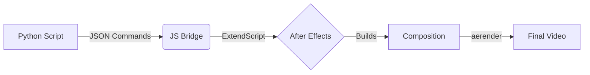

# 🎬 After Effects Automation

[](https://badge.fury.io/py/after-effects-automation)
[](https://opensource.org/licenses/MIT)
[](https://www.python.org/downloads/)
[](https://pepy.tech/project/after-effects-automation)


**Automate Adobe After Effects with Python** - Create, modify, and render AE compositions programmatically.

Perfect for batch video production, template-based workflows, and automated content creation.

> [!TIP]
> Starring this repo helps more developers discover after-effects-automation ✨
>
>
>
>  🔥 Also check out my other project [RepoGif](https://github.com/jhd3197/RepoGif) – the tool I used to generate the GIF above!

---

## 📑 Table of Contents
- [⚡ Quick Start](#-quick-start)
- [✨ Features](#-what-can-it-do)
- [📚 Documentation](#-documentation)
- [🎯 Examples](#-examples)
- [⚙️ How It Works](#-how-it-works)
- [🛠️ CLI & Web Editor](#-cli-tools)
- [🐛 Troubleshooting](#-troubleshooting)

---

## ⚡ Quick Start

```bash
# 1. Install
pip install after-effects-automation

# 2. Setup After Effects integration
python install_ae_runner.py

# 3. Run an example
cd examples/basic_composition
python run.py

```

**That's it!** A 10-second video will be created automatically.

**📖 Need more help?** See the [Quick Start Guide](QUICK_START.md)

---

## ✨ What Can It Do?

* **🎨 Template Creation** - Build AE templates programmatically
* **📝 Text Automation** - Update text layers with dynamic content
* **⚡ Batch Processing** - Render hundreds of variations automatically
* **🎬 Scene Management** - Assemble complex timelines from templates
* **🔧 Full AE Control** - Access all After Effects features via Python
* **🚀 Fast Workflow** - Batch system speeds up multi-scene projects

---

## 📚 Documentation

| Guide | Description |
| --- | --- |
| [Installation](INSTALLATION.md) | Complete installation and setup |
| [Quick Start](QUICK_START.md) | Get started in 5 minutes |
| [Examples](examples/README.md) | Practical working examples |
| [CLI Guide](CLI_GUIDE.md) | Command-line usage |
| [Troubleshooting](TROUBLESHOOTING.md) | Common issues and fixes |
| [Process Management](PROCESS_MANAGEMENT.md) | Understanding the automation flow |

---

## 🎯 Examples

### Basic Composition

Create a video with intro and outro in ~2 minutes:

```bash
cd examples/basic_composition
python run.py

```

### Text Animation

Multi-layer text with dynamic content:

```bash
cd examples/text_animation
python run.py

```

### Render Only

Quickly render existing .aep files:

```bash
cd examples/render_only
python render.py

```

**📖 More Examples:** See [examples/README.md](examples/README.md)

---

## 🖥️ Compatibility

| Software | Versions |
| --- | --- |
| **After Effects** | 2024, 2025, 2025 Beta (CC versions should work) |
| **Python** | 3.7+ |
| **OS** | Windows, macOS, Linux (experimental) |

---

## ⚙️ How It Works



1. **Python** defines what you want to create
2. **JavaScript bridge** sends commands to After Effects
3. **After Effects** builds the composition
4. **aerender** renders the final video

**📖 Technical Details:** See [Process Management Guide](PROCESS_MANAGEMENT.md)

---

## 🚀 Features Detail

### Core Features

* ✅ Automated composition creation & Timeline manipulation
* ✅ Text layer updates & Property keyframing
* ✅ Resource management & Batch rendering

### Advanced Features

* ✅ **Batch Script Execution** - Multiple commands in single operation
* ✅ **Smart Defaults** - Intelligent composition detection
* ✅ **Process Management** - Efficient AE instance handling
* ✅ **Real-time Communication** - File-based command queue

### Recent Improvements (v0.0.4+)

* 🆕 **Fixed Batch System** - Black video bug resolved
* 🆕 **Render-Only Mode** - Quick .aep file rendering
* 🆕 **UTF-8 Support** - Proper Unicode handling on Windows
* 🆕 **Smart Composition Defaults** - Auto-detects correct composition

---

## 🛠️ CLI Tools

### Automation

Run automation from a config file using the command line:

```bash
ae-automation config.json

```

### Web Editor (Visual Interface)

Prefer a GUI? Launch the visual editor to modify your configs without touching JSON.

```bash
ae-editor config.json

```

*(Note: Replace this link with your actual screenshot link)*

---

## 🐛 Troubleshooting

### Common Issues

**After Effects won't start?**

* Check `.env` has correct AE path
* Verify AE version matches path (2024 vs 2025)

**Scripts not executing?**

* Enable scripting: `Edit > Preferences > Scripting & Expressions`
* Install startup script: `python install_ae_runner.py`

**Empty/black video?**

* Update to latest version: `pip install --upgrade after-effects-automation`
* This was a bug in the batch system (now fixed)

**📖 More Solutions:** See [Troubleshooting Guide](TROUBLESHOOTING.md)

---

## 🤝 Contributing

Contributions welcome! Here's how:

1. **Report bugs** - [GitHub Issues](https://github.com/jhd3197/after-effects-automation/issues)
2. **Share examples** - Add to `examples/` folder
3. **Improve docs** - All `.md` files in repo
4. **Submit PRs** - Bug fixes and features

---

## 📄 License

MIT License - See [LICENSE](LICENSE) file for details.

---

## 📞 Get Help

* **📖 Documentation** - Read the guides in `/docs` folder
* **💡 Examples** - Working code in `examples/` folder
* **🐛 Issues** - [GitHub Issues](https://github.com/jhd3197/after-effects-automation/issues)
* **💬 Discussions** - [GitHub Discussions](https://github.com/jhd3197/after-effects-automation/discussions)

---

**Made with ❤️ by the After Effects Automation community**
