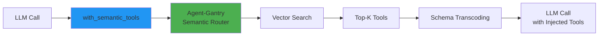

# Agent-Gantry

**Universal Tool Orchestration Platform for LLM-Based Agent Systems**

*Context is precious. Execution is sacred. Trust is earned.*

---

## Overview

Agent-Gantry is a Python library and service for intelligent, secure tool orchestration in LLM-based agent systems. It solves three tightly coupled problems:

1. **Context Window Tax**: Reduces token costs by ~90% through semantic routing and dynamic tool surfacing instead of dumping 100+ tools into every prompt.

2. **Tool/Protocol Fragmentation**: Write Once, Run Anywhere - register tools once, use with OpenAI, Claude, Gemini, A2A agents, and MCP clients.

3. **Operational Blindness**: Zero-Trust security with tools guarded by policies, capabilities, and circuit breakers.

## Installation

```bash
pip install agent-gantry
```

For development:

```bash
pip install agent-gantry[dev]
```

### LLM Provider SDKs

Install with specific LLM provider support:

```bash
# All LLM providers
pip install agent-gantry[llm-providers]

# Individual providers
pip install agent-gantry[openai]        # OpenAI, Azure OpenAI, OpenRouter
pip install agent-gantry[anthropic]     # Anthropic (Claude)
pip install agent-gantry[google-genai]  # Google GenAI
pip install agent-gantry[google-vertexai]  # Google Vertex AI
pip install agent-gantry[mistral]       # Mistral AI
pip install agent-gantry[groq]          # Groq

# Everything
pip install agent-gantry[all]
```

See [docs/llm_sdk_compatibility.md](docs/llm_sdk_compatibility.md) for detailed provider documentation.

### Optional components

- **Vector stores**: `pip install agent-gantry[vector-stores]` (Qdrant/Chroma stubs)
- **Local persistence (LanceDB)**: `pip install agent-gantry[lancedb]`
- **Local embeddings (Nomic Matryoshka)**: `pip install agent-gantry[nomic]`
- **Agent framework integrations**: `pip install agent-gantry[agent-frameworks]` (LangChain, AutoGen, CrewAI, LlamaIndex, Semantic Kernel, etc.)
- **Example extras**: `pip install agent-gantry[example-tools]` for optional libraries used by the example scripts
- **Protocols**: `pip install agent-gantry[mcp]` and `pip install agent-gantry[a2a]`

Combine as needed, e.g.:

```bash
pip install agent-gantry[lancedb,nomic,mcp,a2a]
```

## Quick Start: The "Plug and Play" Experience

Transform your existing LLM code into a semantically-aware agent system with just a decorator:

```python
from openai import AsyncOpenAI
from agent_gantry import AgentGantry, with_semantic_tools, set_default_gantry

# Initialize
client = AsyncOpenAI()
gantry = AgentGantry()
set_default_gantry(gantry)

# Register tools with a simple decorator
@gantry.register(tags=["weather"])
def get_weather(city: str) -> str:
    """Get the current weather for a city."""
    return f"The weather in {city} is 72°F and sunny."

# Apply decorator to your existing LLM function - tools are automatically injected!
@with_semantic_tools(limit=3)
async def ask_llm(prompt: str, *, tools=None):
    return await client.chat.completions.create(
        model="gpt-4o",
        messages=[{"role": "user", "content": prompt}],
        tools=tools  # Agent-Gantry injects relevant tools here
    )

# Just call it - semantic routing happens automatically
await ask_llm("What's the weather in San Francisco?")
```

**That's it!** Agent-Gantry automatically:
- 🎯 Selects only relevant tools based on the query (reducing token costs by ~79%)
- 🔄 Converts tool schemas to any LLM provider format (OpenAI, Anthropic, Google, etc.)
- 🛡️ Executes tools with circuit breakers, retries, and security policies

### Architecture Flow



### Manual Control (Power Users)

For fine-grained control over tool retrieval and execution:

```python
from agent_gantry import AgentGantry
from agent_gantry.schema.execution import ToolCall

# Initialize
gantry = AgentGantry()

# Register a tool
@gantry.register(tags=["finance"])
def calculate_tax(amount: float) -> float:
    """Calculates US sales tax for a given amount."""
    return amount * 0.08

# Sync tools to enable semantic search
await gantry.sync()

# Retrieve relevant tools (returns OpenAI-compatible schemas)
tools = await gantry.retrieve_tools("What is the tax on $100?", limit=5)

# Execute a tool directly
result = await gantry.execute(ToolCall(
    tool_name="calculate_tax",
    arguments={"amount": 100.0},
))
```

See [docs/configuration.md](docs/configuration.md) for full config options and
[docs/local_persistence_and_skills.md](docs/local_persistence_and_skills.md) for LanceDB/Nomic setup
plus skill storage.

### Factory Function for Easy Setup

For quick setup with sensible defaults, use the `create_default_gantry()` factory function:

```python
from agent_gantry import create_default_gantry

# Creates an AgentGantry instance with automatic embedder selection
# (NomicEmbedder if available, falls back to SimpleEmbedder)
tools = create_default_gantry()

@tools.register(tags=["math"])
def add(a: int, b: int) -> int:
    """Add two numbers."""
    return a + b
```

This is ideal for:
- Rapid prototyping and testing
- Projects that need multiple independent AgentGantry instances
- Avoiding module-level instantiation issues

### Framework Ready: Works with Any LLM Provider

Agent-Gantry seamlessly integrates with all major LLM providers. Just use the `dialect` parameter:

**OpenAI / Azure OpenAI / OpenRouter / Groq:**
```python
from openai import AsyncOpenAI
from agent_gantry import with_semantic_tools

client = AsyncOpenAI()

@with_semantic_tools(limit=3)  # Default dialect is "openai"
async def chat(messages, *, tools=None):
    return await client.chat.completions.create(
        model="gpt-4o",
        messages=messages,
        tools=tools
    )
```

**Anthropic (Claude):**
```python
from anthropic import AsyncAnthropic
from agent_gantry import with_semantic_tools

client = AsyncAnthropic()

@with_semantic_tools(dialect="anthropic", limit=3)
async def chat(messages, *, tools=None):
    return await client.messages.create(
        model="claude-sonnet-4-20250514",
        messages=messages,
        tools=tools,  # Automatically converted to Anthropic format
        max_tokens=1024
    )
```

**Google Gemini:**
```python
from google import genai
from agent_gantry import with_semantic_tools

client = genai.Client()

@with_semantic_tools(dialect="gemini", limit=3)
async def chat(prompt, *, tools=None):
    return client.models.generate_content(
        model="gemini-2.0-flash",
        contents=prompt,
        tools=tools  # Automatically converted to Gemini format
    )
```

**Mistral:**
```python
from mistralai import Mistral
from agent_gantry import with_semantic_tools

client = Mistral()

@with_semantic_tools(limit=3)  # Mistral uses OpenAI-compatible format
async def chat(messages, *, tools=None):
    return await client.chat.complete_async(
        model="mistral-large-latest",
        messages=messages,
        tools=tools
    )
```

See [docs/llm_sdk_compatibility.md](docs/llm_sdk_compatibility.md) for detailed integration guides.

### Load tools from multiple modules

Organize tools in a `tools/` directory with separate files for each category, then import them into your main file:

```python
# tools/web_tools.py
from agent_gantry import AgentGantry

tools = AgentGantry()

@tools.register
def search_web(query: str) -> str:
    """Search the web for information."""
    return f"Results for: {query}"

@tools.register
def fetch_url(url: str) -> str:
    """Fetch content from a URL."""
    return f"Content from {url}"

# tools/math_tools.py
from agent_gantry import AgentGantry

tools = AgentGantry()

@tools.register
def calculate(expression: str) -> float:
    """Evaluate a mathematical expression safely."""
    # Use ast.literal_eval for safe evaluation of simple expressions
    import ast
    import operator
    
    # Define safe operators
    ops = {ast.Add: operator.add, ast.Sub: operator.sub,
           ast.Mult: operator.mul, ast.Div: operator.truediv}
    
    def safe_eval(node):
        if isinstance(node, ast.Num):
            return node.n
        elif isinstance(node, ast.BinOp):
            return ops[type(node.op)](safe_eval(node.left), safe_eval(node.right))
        raise ValueError(f"Unsupported expression")
    
    return safe_eval(ast.parse(expression, mode='eval').body)

@tools.register
def convert_units(value: float, from_unit: str, to_unit: str) -> float:
    """Convert between units."""
    return value  # simplified

# main.py
import asyncio
from openai import AsyncOpenAI
from agent_gantry import AgentGantry, set_default_gantry, with_semantic_tools

client = AsyncOpenAI()

async def main():
    # Import tools from multiple module files
    gantry = await AgentGantry.from_modules([
        "tools.web_tools",
        "tools.math_tools",
    ], attr="tools")
    
    await gantry.sync()
    set_default_gantry(gantry)
    
    # Now all tools are available for semantic selection
    @with_semantic_tools(limit=3)
    async def generate(prompt: str, *, tools=None):
        return await client.chat.completions.create(
            model="gpt-4",
            messages=[{"role": "user", "content": prompt}],
            tools=tools,
        )
    
    # Tools are automatically selected based on query
    response = await generate("Search for Python tutorials")  # selects web_tools
    response = await generate("Calculate 15% of 200")  # selects math_tools

asyncio.run(main())
```

You can also pass `modules=[...]` to `AgentGantry(...)` for deferred loading or call
`collect_tools_from_modules([...])` to import into an existing instance. Duplicate tools are skipped
with a warning so shared modules can be safely combined.

## Architecture

```
┌─────────────────────────────────────────────────────────────────┐
│                        AGENT LAYER                              │
│  (LangChain / AutoGen / LlamaIndex / CrewAI / Custom Agents)    │
└─────────────────────────┬───────────────────────────────────────┘
                          │
                          ▼
┌─────────────────────────────────────────────────────────────────┐
│                       AGENT-GANTRY                              │
│  ┌─────────────┐  ┌─────────────┐  ┌─────────────┐  ┌────────┐ │
│  │  Semantic   │  │  Execution  │  │ Observability│ │ Policy │ │
│  │   Router    │  │   Engine    │  │  / Telemetry │ │ Engine │ │
│  └─────────────┘  └─────────────┘  └─────────────┘  └────────┘ │
└─────────────────────────┬───────────────────────────────────────┘
                          │
          ┌───────────────┼───────────────┬───────────────┐
          ▼               ▼               ▼               ▼
    ┌──────────┐   ┌──────────┐   ┌──────────┐   ┌──────────┐
    │  Python  │   │   MCP    │   │   REST   │   │   A2A    │
    │Functions │   │ Servers  │   │   APIs   │   │  Agents  │
    └──────────┘   └──────────┘   └──────────┘   └──────────┘
```

## Features

- **Semantic Routing**: Intelligent tool selection using vector similarity, intent classification, and conversation context
- **Multi-Protocol Support**: Native support for MCP (Model Context Protocol) and A2A (Agent-to-Agent)
- **Schema Transcoding**: Automatic conversion between OpenAI, Anthropic, and Gemini tool formats
- **LLM Provider Compatibility**: Works with OpenAI, Azure OpenAI, Anthropic, Google GenAI, Vertex AI, Mistral, Groq, and OpenRouter
- **Circuit Breakers**: Automatic failure detection and recovery
- **Observability**: Built-in structured logging and telemetry for tracing and metrics
- **Zero-Trust Security**: Capability-based permissions and policy enforcement
- **Modular tool loading**: Import and deduplicate tool registries from other modules or packages
- **Local persistence & skills**: LanceDB-backed tool/skill storage, Matryoshka embeddings, and skill schemas for prompt guidance
- **Argument Validation**: Defensive validation against tool schemas
- **Async-Native**: Full async support for tools and execution
- **Retries & Timeouts**: Automatic retries with exponential backoff and configurable timeouts
- **Health Tracking**: Per-tool health metrics including success rate, latency, and circuit breaker state

## Context Window Savings

Agent-Gantry significantly reduces token usage by dynamically surfacing only the most relevant tools.

**Benchmark Results (15 Tools Registered, provider-reported usage):**

| Scenario | Tools Passed | Prompt Tokens | Cost Reduction |
|----------|--------------|---------------|----------------|
| **Standard** (All Tools) | 15 | 366 | - |
| **Agent-Gantry** (Top 2) | 2 | 78 | **~79%** |

*Measured using provider `usage` fields from `gpt-3.5-turbo` responses (no token estimators). See `examples/llm_integration/token_savings_demo.py` for the full benchmark.*

### Semantic Routing Accuracy

Agent-Gantry maintains high accuracy even with large toolsets by leveraging semantic embeddings.

**Stress Test Results (100 Tools Registered):**

| Metric | Value |
|--------|-------|
| **Total Tools** | 100 |
| **Retrieval Limit** | Top 2 |
| **Accuracy** | **100%** (10/10 queries) |
| **Embedder** | Nomic (`nomic-embed-text-v1.5`) |

*See `examples/testing_limits/stress_test_100_tools.py` for the full stress test.*

### Real-World End-to-End Verification

Agent-Gantry has been verified in end-to-end scenarios with real LLMs and tangible tools.

**Real-World Test (30 Tangible Tools + GPT-4o):**

| Metric | Result |
|--------|--------|
| **Scenario** | 30 functional tools (Math, File System, Network, etc.) |
| **Retrieval Accuracy** | **100%** (Correct tool always in Top 3) |
| **LLM Selection** | **100%** (GPT-4o correctly selected the tool) |
| **Execution** | **100%** (Tools executed and returned correct results) |

*See `examples/testing_limits/real_world_30_tools_test.py` for the complete end-to-end verification script.*

## Project Structure

```
agent_gantry/
├── core/                 # Main facade, registry, router, executor
├── schema/               # Data models (tools, queries, events, config)
├── adapters/             # Protocol adapters
│   ├── vector_stores/    # Qdrant, Chroma, In-Memory, etc.
│   ├── embedders/        # OpenAI, SentenceTransformers, etc.
│   ├── rerankers/        # Cohere, CrossEncoder, etc.
│   └── executors/        # Direct, Sandbox, MCP, HTTP, A2A
├── providers/            # Tool import from various sources
├── servers/              # MCP and A2A server implementations
├── integrations/         # LangChain, AutoGen, LlamaIndex, CrewAI
├── observability/        # Telemetry, metrics, logging
└── cli/                  # Command-line interface
```

## Development

### Setup

```bash
# Clone the repository
git clone https://github.com/CodeHalwell/Agent-Gantry.git
cd Agent-Gantry

# Preferred: uv for reproducible environments
# We use `pip install uv` here for convenience in Python-first environments.
# You can also install uv via curl, pipx, or system packages; see:
# https://docs.astral.sh/uv/getting-started/installation/
pip install uv
uv sync --extra dev
uv run pytest

# Or use pip directly
pip install -e ".[dev]"
pytest
```

### Running Tests

```bash
# Run all tests
pytest

# Run with coverage
pytest --cov=agent_gantry

# Run specific test file
pytest tests/test_tool.py
```

## MCP Integration

Agent-Gantry provides first-class support for the Model Context Protocol (MCP), enabling seamless integration with Claude Desktop and other MCP clients.

### Serve as MCP Server

```python
from agent_gantry import AgentGantry

gantry = AgentGantry()

@gantry.register
def calculate_sum(a: int, b: int) -> int:
    """Calculate the sum of two numbers."""
    return a + b

await gantry.sync()

# Serve as MCP server (dynamic mode for context window minimization)
await gantry.serve_mcp(transport="stdio", mode="dynamic")
```

**Dynamic Mode Benefits:**
- Exposes only 2 meta-tools: `find_relevant_tools` and `execute_tool`
- Reduces context window usage by ~90%
- Tools discovered on-demand through semantic search
- Perfect for Claude Desktop integration

### Connect to MCP Servers

```python
from agent_gantry.schema.config import MCPServerConfig

config = MCPServerConfig(
    name="filesystem",
    command=["npx", "-y", "@modelcontextprotocol/server-filesystem"],
    args=["--path", "/tmp"],
    namespace="fs",
)

# Discover and register tools from external MCP server
count = await gantry.add_mcp_server(config)
print(f"Added {count} tools from MCP server")
```

See `examples/mcp_integration_demo.py` for a complete demonstration.

## A2A Integration

Agent-Gantry implements the Agent-to-Agent (A2A) protocol, enabling interoperability between agents.

### Serve as A2A Agent

```python
from agent_gantry import AgentGantry

gantry = AgentGantry()

@gantry.register
def analyze_data(data: str) -> str:
    """Analyze data and provide insights."""
    return f"Analysis: {data}"

await gantry.sync()

# Serve as A2A agent (requires FastAPI and uvicorn)
# Agent Card will be available at: http://localhost:8080/.well-known/agent.json
gantry.serve_a2a(host="0.0.0.0", port=8080)
```

**Skills Exposed:**
- **tool_discovery**: Find relevant tools using semantic search
- **tool_execution**: Execute tools with retries and circuit breakers

### Consume External A2A Agents

```python
from agent_gantry.schema.config import A2AAgentConfig

config = A2AAgentConfig(
    name="external-agent",
    url="https://external-agent.example.com",
    namespace="external",
)

# Discover and register external agent's skills as tools
count = await gantry.add_a2a_agent(config)
print(f"Added {count} skills from external agent")

# External agent skills are now available as tools
tools = await gantry.retrieve_tools("translate text")
```

### Agent Card

Agent-Gantry automatically generates an Agent Card following the A2A protocol:

```json
{
  "name": "AgentGantry",
  "description": "Intelligent tool routing and execution service",
  "url": "http://localhost:8080",
  "version": "1.0.0",
  "skills": [
    {
      "id": "tool_discovery",
      "name": "Tool Discovery",
      "description": "Find relevant tools for a given task using semantic search"
    },
    {
      "id": "tool_execution",
      "name": "Tool Execution",
      "description": "Execute registered tools with retries and timeouts"
    }
  ]
}
```

See `examples/a2a_integration_demo.py` for a complete demonstration.

## CLI

A lightweight CLI ships with the package for quick inspection:

```bash
agent-gantry list
agent-gantry search "refund an order" --limit 3
```

It boots with demo tools and an in-memory embedder. For details and customization options, see
[docs/cli.md](docs/cli.md).

## Roadmap

See [plan.md](plan.md) for the detailed development roadmap.

- **Phase 1**: ✅ Core Foundation - Data models, in-memory vector store, basic routing
- **Phase 2**: ✅ Robustness - Execution engine, retries, circuit breakers, security (see [docs/phase2.md](docs/phase2.md))
- **Phase 3**: ✅ Context-Aware Routing - Intent classification, MMR diversity
- **Phase 4**: ✅ Production Adapters - Qdrant, Chroma, OpenAI embeddings
- **Phase 5**: ✅ MCP Integration - MCP client and server, dynamic tool discovery
- **Phase 6**: ✅ A2A Integration - Agent-to-Agent protocol, Agent Card, skill mapping
- **Phase 7**: 📋 Framework Integrations - LangChain, AutoGen, etc.

## License

MIT

## Contributing

Contributions are welcome! Please read the contributing guidelines before submitting a pull request.
