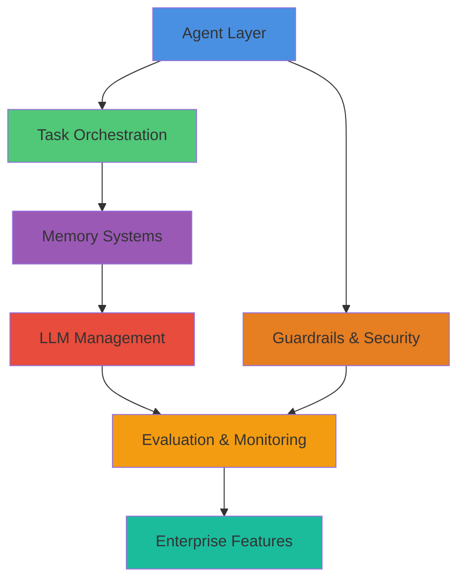

<div align="center">

<!-- Logo will be available once agenticaiframework.png is added to docs/assets/ -->
<!--  -->

# 🤖 AgenticAI Framework
### *Enterprise-Grade Multi-Agent Orchestration Platform*

[](https://www.python.org/downloads/)
[](https://opensource.org/licenses/MIT)
[](https://isathish.github.io/agenticaiframework/)
[](https://badge.fury.io/py/agenticaiframework)
[](https://github.com/isathish/agenticaiframework)
[](https://github.com/isathish/agenticaiframework)

**Production-ready Python SDK for building sophisticated AI agent systems with advanced orchestration, intelligent task management, comprehensive evaluation, and enterprise-grade monitoring.**

[📚 Documentation](https://isathish.github.io/agenticaiframework/) • [🚀 Quick Start](#-quick-start-examples) • [💡 Examples](https://isathish.github.io/agenticaiframework/EXAMPLES/) • [🤝 Contributing](#-community--support)

</div>


## 🎯 What Makes AgenticAI Framework Different?

<table>
<tr>
<td width="50%">

### 🚀 **Production-First Design**
Built for real-world workloads with comprehensive error handling, monitoring, resilience patterns, and a **73% test coverage** across **451 tests**.

### 🧩 **Truly Modular**
Every component is independently composable, extensible, and replaceable without affecting other parts of the system.

### 🧠 **Intelligence Built-In**
Sophisticated memory management, semantic search, learning capabilities, and **12-tier evaluation framework** out of the box.

</td>
<td width="50%">

### 📊 **Enterprise-Ready**
**21 enterprise features** including distributed tracing, multi-region support, compliance monitoring, and tenant isolation.

### 🎓 **Developer Experience**
Intuitive APIs, comprehensive documentation, extensive examples, and powerful debugging tools make development enjoyable.

### 🌐 **Scale Effortlessly**
From single-agent prototypes to distributed multi-agent systems with built-in coordination and monitoring.

</td>
</tr>
</table>


## 🚀 Why Choose AgenticAI Framework?

### **Production-Ready from Day One**
Unlike experimental frameworks, AgenticAI Framework is built for **production workloads** with comprehensive error handling, monitoring, and resilience patterns built-in.

### **Truly Modular Architecture**
Every component is designed as an independent, composable module that can be extended, replaced, or customized without affecting the rest of the system.

### **Intelligent by Design**
Features sophisticated memory management, semantic search, learning capabilities, and context-aware decision making out of the box.

### **Scale from Prototype to Enterprise**
Start with a single agent and seamlessly scale to distributed multi-agent systems with built-in coordination, communication, and monitoring.

### **Developer Experience First**
Comprehensive documentation, extensive examples, intuitive APIs, and powerful debugging tools make development fast and enjoyable.


## 🏗️ Architecture Overview

<div align="center">



</div>

### 🔧 13 Core Modules Working in Harmony

### 🤖 **Agents** - Intelligent Autonomous Entities
- **Context engineering** with token tracking and automatic compression
- **Multi-role agents** with configurable capabilities and behaviors
- **Lifecycle management** with start, pause, resume, and stop controls
- **Performance monitoring** with comprehensive metrics and error tracking
- **Custom agent types** for specialized domains (customer service, research, code generation)
- **Advanced coordination** patterns for multi-agent collaboration

### 📋 **Tasks** - Sophisticated Workflow Management
- **Intelligent scheduling** with time-based, conditional, and dependency-driven execution
- **Priority queues** with advanced retry mechanisms and circuit breaker patterns
- **Workflow orchestration** supporting sequential, parallel, and conditional flows
- **Performance monitoring** with comprehensive metrics and resource tracking

### 🧠 **Memory** - Advanced Memory Systems
- **Multi-tier memory** architecture (short-term, long-term, external memory)
- **TTL (Time-To-Live)** support for automatic memory expiration
- **Priority-based eviction** with LRU algorithm
- **Memory consolidation** for frequently accessed data
- **Semantic search** capabilities with intelligent information retrieval
### 🔗 **LLMs** - Language Model Management
- **Circuit breaker pattern** to prevent cascading failures
- **Automatic retry** with exponential backoff
- **Response caching** for improved performance
- **Fallback chains** for high availability
- **Multi-provider support** with unified interface for different LLM providers
### 🛡️ **Guardrails** - Safety and Compliance
- **Priority-based enforcement** with circuit breakers
- **Severity levels** (low, medium, high, critical)
- **Remediation actions** for automatic issue resolution
- **Content filtering** with customizable validation rules
- **Policy enforcement** for ethical AI behavior
- **Security validation** to prevent prompt injection and data leakage
- **Compliance monitoring** with audit trails and reporting
- **Violation tracking** with comprehensive analytics

### 🔐 **Security** - Enterprise-Grade Security
- **Prompt injection detection** with 15+ attack patterns
- **Input validation** and sanitization
- **Rate limiting** per user/session
- **Content filtering** with customizable rules
- **Audit logging** with comprehensive event tracking
- **Security metrics** and reporting

### 🛡️ **Guardrails** - Safety and Compliance
- **Content filtering** with customizable validation rules
- **Policy enforcement** for ethical AI behavior
- **Security validation** to prevent prompt injection and data leakage
- **Compliance monitoring** with audit trails and reporting
- **Violation tracking** with comprehensive analytics

### 📊 **Evaluation** - Comprehensive 12-Tier Assessment (NEW)
- **Model Quality**: Hallucination detection, reasoning assessment, token efficiency
- **Task Success**: Success rates, retry tracking, completion monitoring
- **Tool Performance**: API call tracking, parameter validation, latency monitoring
- **Workflow Orchestration**: Multi-agent coordination, handoff tracking, deadlock detection
- **Memory Quality**: Context precision/recall, stale data detection
- **RAG Evaluation**: Retrieval quality, faithfulness, groundedness, citations
- **Safety Scoring**: Security risk assessment, PII detection, policy compliance
- **Autonomy Assessment**: Plan optimality, replanning, human intervention tracking
- **Performance Monitoring**: Latency percentiles (P50/P95/P99), throughput, stability
- **Cost Tracking**: Token usage, cost per request, budget optimization
- **HITL Metrics**: Acceptance rates, review time, trust scoring
- **Business Outcomes**: ROI calculation, impact metrics, value assessment

### 📊 **Monitoring** - Comprehensive Observability
- **Real-time metrics** collection and analysis
### 🎯 **Prompts** - Intelligent Prompt Management
- **Defensive prompting** with automatic protection
- **Injection detection** and prevention
- **Safe rendering mode** for untrusted inputs
- **Template system** with variable substitution and inheritance
- **A/B testing** for prompt optimization
- **Version control** for prompt evolution tracking with rollback
- **Vulnerability scanning** across all prompts
- **Performance analytics** for prompt effectiveness
- **Multiple protocols** (HTTP, WebSocket, gRPC, Message Queues)
- **Pub/sub messaging** for decoupled agent communication
- **Event-driven architecture** with comprehensive event handling
- **Communication security** with authentication and encryption

### ⚙️ **Processes** - Advanced Orchestration
- **Process definition** with complex workflow patterns
- **Dynamic process adaptation** based on runtime conditions
- **Resource management** with automatic scaling and optimization
- **Process monitoring** with detailed execution tracking

### 🎯 **Prompts** - Intelligent Prompt Management
-  Framework Comparison

<div align="center">

| Feature | AgenticAI Framework | LangChain | CrewAI | AutoGen |
|:--------|:-------------------:|:---------:|:------:|:-------:|
| **Production Ready** | ✅ Enterprise | ⚠️ Experimental | ⚠️ Limited | ⚠️ Research |
| **Test Coverage** | ✅ 73% (451 tests) | ⚠️ Variable | ❌ Limited | ⚠️ Basic |
| **Modular Architecture** | ✅ Fully composable | ⚠️ Monolithic | ❌ Fixed | ⚠️ Rigid |
| **Memory Management** | ✅ Multi-tier + Semantic | ✅ Basic | ❌ None | ⚠️ Simple |
| **12-Tier Evaluation** | ✅ Built-in | ❌ None | ❌ None | ❌ None |
| **Task Orchestration** | ✅ Advanced workflows | ⚠️ Linear chains | ✅ Role-based | ⚠️ Conversation |
| **Monitoring & Tracing** | ✅ Distributed tracing | ❌ None | ❌ None | ❌ None |
| **Error Handling** | ✅ Circuit breakers | ⚠️ Basic | ⚠️ Limited | ⚠️ Basic |
| **Multi-Agent Coordination** | ✅ Advanced patterns | ⚠️ Simple | ✅ Team-based | ✅ Group chat |
| **Guardrails & Safety** | ✅ Built-in + PII | ❌ Add-on | ❌ None | ❌ None |
| **Enterprise Features** | ✅ 21 features | ⚠️ Limited | ❌ None | ❌ None |
| **Performance Optimization** | ✅ Caching + Circuit breakers | ⚠️ Manual | ❌ None | ❌ None |
| **Extensibility** | ✅ Plugin architecture | ✅ Custom tools | ⚠️ Limited | ⚠️ Limited |

</div>
- Tool composition for building complex capabilities
- Performance optimization with intelligent caching

### ⚙️ **Configurations** - Centralized Management
- **Environment-specific** configurations with inheritance
- **Dynamic configuration** updates without restarts
- **Validation and defaults** with comprehensive error checking
- **Configuration versioning** and rollback capabilities


## 🔄 Framework Comparison

| Feature | AgenticAI Framework | LangChain | CrewAI | AutoGen |
|---------|-------------------|-----------|--------|---------|
| **Production Ready** | ✅ Enterprise-grade | ⚠️ Experimental | ⚠️ Limited | ⚠️ Research |
| **Modular Architecture** | ✅ Fully composable | ⚠️ Monolithic | ❌ Fixed structure | ⚠️ Rigid |
| **Memory Management** | ✅ Multi-tier + Semantic | ✅ Basic | ❌ None | ⚠️ Simple |
| **Task Orchestration** | ✅ Advanced workflows | ⚠️ Linear chains | ✅ Role-based | ⚠️ Conversation-based |
| **Monitoring & Observability** | ✅ Comprehensive | ❌ None | ❌ None | ❌ None |
| **Error Handling** | ✅ Robust + Recovery | ⚠️ Basic | ⚠️ Limited | ⚠️ Basic |
| **Multi-Agent Coordination** | ✅ Advanced patterns | ⚠️ Simple | ✅ Team-based | ✅ Group chat |
| **Guardrails & Safety** | ✅ Built-in | ❌ Add-on | ❌ None | ❌ None |
| **Performance Optimization** | ✅ Intelligent caching | ⚠️ Manual | ❌ None | ❌ None |
| **Extensibility** | ✅ Plugin architecture | ✅ Custom tools | ⚠️ Limited | ⚠️ Limited |


## ✨ Key Features & Capabilities

### 🎯 **Intelligent Agent Management**
- Create specialized agents with domain-specific knowledge and capabilities
- Implement sophisticated coordination patterns for multi-agent collaboration
- Dynamic agent scaling and load balancing
- Agent health monitoring and automatic recovery

### 🔄 **Advanced Task Orchestration**
- Complex workflow patterns with conditional branching and parallel execution
- Intelligent task scheduling with dependency resolution
- Retry mechanisms with exponential backoff and circuit breakers
- Resource-aware task distribution and optimization

### 🧠 **Sophisticated Memory Systems**
- Hierarchical memory with automatic promotion and consolidation
- Semantic search with embedding-based retrieval
- Memory compression and optimization for large-scale deployments
- Cross-agent memory sharing and synchronization

### 📊 **Enterprise Monitoring & Analytics**
- Real-time performance metrics and health monitoring
- Comprehensive audit trails and compliance reporting
- Custom alerting and notification systems
- Performance optimization recommendations

### 🛡️ **Production-Grade Security**
- Content validation and filtering with customizable rules
- Prompt injection detection and prevention
- Data privacy and PII protection
- Security audit trails and compliance reporting

### 🔌 **Flexible Integration**
- REST APIs, GraphQL, and gRPC support
- Database integrations (SQL, NoSQL, Vector databases)
- Cloud platform integrations (AWS, Azure, GCP)
- Third-party service connectors


## 🏢 Enterprise Features 

AgenticAI Framework now includes **21 enterprise-grade features** for production deployments:

### 📊 **Observability & Metrics**
| Feature | Description |
|---------|-------------|
| **Agent Step Tracing** | Distributed tracing with span hierarchy and context propagation |
| **Latency Metrics** | Percentile-based latency tracking (P50, P95, P99) |

### 🔍 **Evaluation & Testing**
| Feature | Description |
|---------|-------------|
| **Model Quality Evaluation** | Hallucination detection, reasoning assessment, token efficiency |
| **Task & Skill Evaluation** | Success rates, retry tracking, completion percentages |
| **Tool & API Evaluation** | Tool invocation tracking, parameter validation, latency monitoring |
| **Workflow Evaluation** | Multi-agent orchestration, handoff tracking, deadlock detection |
| **Memory & Context Evaluation** | Context precision/recall, stale data detection, quality scoring |
| **RAG Evaluation** | Retrieval quality, faithfulness, groundedness, citation accuracy |
| **Autonomy & Planning** | Plan optimality, replanning tracking, human intervention |
| **Performance & Scalability** | Latency percentiles (P50/P95/P99), throughput, stability |
| **Cost & FinOps** | Token usage tracking, cost per request, budget optimization |
| **Human-in-the-Loop** | Acceptance rates, override tracking, trust scoring |
| **Business Outcomes** | ROI calculation, baseline comparison, impact metrics |
| **Security Risk Scoring** | Input/output risk assessment, PII detection, policy compliance |
| **A/B Testing Framework** | Experiment management with statistical significance |
| **Canary Deployments** | Gradual rollouts with automatic rollback |

### 📝 **Prompt Management**
| Feature | Description |
|---------|-------------|
| **Prompt Versioning** | Semantic versioning with draft→active→deprecated workflow |
| **Prompt Library** | Reusable components with template inheritance |

### 🚀 **CI/CD & Deployment**
| Feature | Description |
|---------|-------------|
| **Agent CI Pipelines** | Build, test, evaluate, and deploy stages |
| **Canary Deployments** | Gradual rollouts with automatic rollback |

### 🎨 **Visual Tools APIs**
| Feature | Description |
|---------|-------------|
| **Agent Builder** | Component library and blueprint management |
| **Workflow Designer** | Visual workflow design with node/edge management |
| **Admin Console** | User management, configuration, and dashboards |

### 🔗 **Integrations**
| Feature | Description |
|---------|-------------|
| **ITSM (ServiceNow)** | Incident management and change requests |
| **Dev Tools (GitHub, ADO)** | Issues, PRs, pipelines integration |
| **Data Platforms** | Snowflake and Databricks connectors |
| **Webhooks** | Incoming/outgoing webhook management |

### 🏗️ **Infrastructure**
| Feature | Description |
|---------|-------------|
| **Serverless Execution** | Function deployment with auto-scaling |
| **Multi-Region Support** | Geographic load balancing and failover |
| **Tenant Isolation** | Multi-tenant resource isolation and quotas |

### 🔐 **Compliance & Governance**
| Feature | Description |
|---------|-------------|
| **Audit Trails** | Tamper-evident logging with hash chain integrity |
| **Policy Enforcement** | Rule-based policies with pattern matching |
| **Data Masking** | PII detection with multiple masking strategies |

```python
# Example: Enterprise Features
from agenticaiframework import (
    tracer, latency_metrics,  # Tracing
    OfflineEvaluator, ABTestingFramework,  # Evaluation
    prompt_version_manager, prompt_library,  # Versioning
    audit_trail, policy_engine, data_masking,  # Compliance
    multi_region_manager, tenant_manager,  # Infrastructure
)

# Distributed tracing
with tracer.trace("agent_execution") as span:
    span.set_attribute("agent_id", "agent_001")
    latency_metrics.record("llm_call", 0.45)

# Audit trail with integrity
audit_trail.log_event(
    event_type="data_access",
    actor="user_123",
    resource="customer_data",
    action="query"
)

# Data masking
text = "Contact john@example.com"
<div align="center">

### Quick Start

```bash
pip install agenticaiframework
```

</div>

<details>
<summary><b>📥 Installation Options</b></summary>

### Development Installation
```bash
git clone https://github.com/isathish/agenticaiframework.git
cd agenticaiframework
pip install -e .
```

### With Optional Dependencies
```bash
# Enhanced monitoring capabilities
pip install "agenticaiframework[monitoring]"

# Advanced memory features  
pip install "agenticaiframework[memory]"

# Documentation building
pip install "agenticaiframework[docs]"

# All optional dependencies
pip install "agenticaiframework[all]"
```

### Documentation Dependencies
```bash
pip install -r requirements-docs.txt
```

</details> install "agenticaiframework[all]"
```

### Documentation Dependencies
```bash
# Install only documentation dependencies
pip install -r requirements-docs.txt
```


## ⚡ Quick Start Examples

### Simple Agent Creation
```python
from agenticaiframework import Agent

# Create a specialized agent
agent = Agent(
    name="DataAnalyst",
    role="Data Analysis Specialist", 
    capabilities=["data_processing", "visualization", "reporting"],
    config={
        "processing_timeout": 300,
        "output_format": "json",
        "enable_caching": True
    }
)

# Start the agent
agent.start()
print(f"Agent {agent.name} is ready and {agent.status}")
```

### Multi-Agent Collaboration
```python
from agenticaiframework import Agent, AgentManager

# Create specialized agents
data_collector = Agent(
    name="DataCollector",
    role="Data Collection Specialist",
    capabilities=["api_integration", "data_extraction"]
)

data_processor = Agent(
    name="DataProcessor", 
    role="Data Processing Specialist",
    capabilities=["data_cleaning", "transformation"]
)

report_generator = Agent(
    name="ReportGenerator",
    role="Report Generation Specialist", 
    capabilities=["analysis", "visualization", "reporting"]
)

# Manage agents
manager = AgentManager()
agents = [data_collector, data_processor, report_generator]

for agent in agents:
    manager.register_agent(agent)
    agent.start()

# Coordinate workflow
manager.coordinate_workflow(["collect_data", "process_data", "generate_report"])
```

### Advanced Task Management
```python
from agenticaiframework import Task, TaskManager, TaskScheduler
from datetime import datetime, timedelta

# Create task manager
task_manager = TaskManager()

# Define complex task with dependencies
data_validation = task_manager.create_task(
    name="data_validation",
    description="Validate incoming data sources",
    priority=1,
    config={"validation_rules": ["not_null", "type_check", "range_check"]}
)

data_processing = task_manager.create_task(
    name="data_processing", 
    description="Process validated data",
    priority=2,
    dependencies=["data_validation"],
    config={"batch_size": 1000, "parallel_workers": 4}
)

# Schedule recurring task
scheduler = TaskScheduler()
scheduler.schedule_recurring(
    task=data_validation,
    interval=timedelta(hours=1)  # Run every hour
)

# Execute workflow
result = task_manager.execute_workflow([data_validation, data_processing])
```

### Intelligent Memory Management
```python
from agenticaiframework.memory import MemoryManager, SemanticMemory

# Create advanced memory system
memory_manager = MemoryManager()

# Set up semantic memory for intelligent retrieval
semantic_memory = SemanticMemory(capacity=10000)

# Store information with context
semantic_memory.store_with_embedding(
    "user_preferences",
    {
        "communication_style": "detailed_explanations",
        "preferred_format": "structured_json",
        "domain_expertise": ["data_science", "machine_learning"]
    }
)

semantic_memory.store_with_embedding(
    "successful_strategies", 
    {
        "data_processing": ["parallel_processing", "batch_optimization"],
        "error_handling": ["retry_with_backoff", "graceful_degradation"]
    }
)

# Intelligent retrieval
relevant_info = semantic_memory.semantic_search(
    "how to handle user communication preferences",
    limit=5,
    similarity_threshold=0.7
)
```

### Comprehensive Monitoring
```python
from agenticaiframework.monitoring import MonitoringSystem

# Initialize monitoring
monitoring = MonitoringSystem()

# Monitor agent performance
monitoring.track_agent_metrics(agent, {
    "response_time": 1.2,
    "success_rate": 0.95,
    "memory_usage": 128
})

# Monitor task execution
with monitoring.track_execution("data_processing_pipeline"):
    result = task_manager.execute_task("complex_data_analysis")

# Get comprehensive insights
metrics = monitoring.get_performance_summary(time_range="last_24h")
print(f"System performance: {metrics}")
```


## 🎯 Use Cases & Applications

### 🏢 **Enterprise Automation**
- **Document Processing**: Intelligent document analysis and extraction
- **Workflow Automation**: Complex business process automation
- **Compliance Monitoring**: Automated compliance checking and reporting
- **Resource Optimization**: Intelligent resource allocation and scaling

### 🔬 **Research & Development**
- **Literature Review**: Automated research paper analysis and summarization
- **Hypothesis Generation**: AI-driven hypothesis formulation and testing
- **Data Analysis**: Comprehensive data analysis and insight generation
- **Experiment Design**: Intelligent experimental design and optimization

### 💬 **Customer Experience**
- **Intelligent Support**: Multi-modal customer support with context awareness
- **Personalization**: Dynamic content and experience personalization
- **Sentiment Analysis**: Real-time customer sentiment monitoring and response
- **Predictive Support**: Proactive issue identification and resolution

### 🎓 **Education & Training**
- **Adaptive Learning**: Personalized learning path optimization
- **Content Generation**: Intelligent educational content creation
- **Assessment**: Automated assessment and feedback systems
- **Tutoring**: AI-powered tutoring and mentorship

### 🏥 **Healthcare & Life Sciences**
- **Clinical Decision Support**: Evidence-based clinical recommendations
- **Drug Discovery**: AI-assisted drug discovery and development
- **Patient Monitoring**: Continuous patient health monitoring and alerts
- **Medical Documentation**: Automated medical record processing and analysis


## 🔧 Development & Deployment

### Development Workflow
```bash
# Clone and setup development environment
git clone https://github.com/isathish/agenticaiframework.git
cd agenticaiframework

# Create virtual environment
python -m venv .venv
source .venv/bin/activate  # On Windows: .venv\Scripts\activate

# Install development dependencies
pip install -e ".[dev]"

# Install documentation dependencies
pip install -r requirements-docs.txt

# Run tests
pytest

# Build documentation locally
mkdocs build

# Serve documentation for development
mkdocs serve

# View documentation at http://127.0.0.1:8000
```

### Production Deployment
```python
# Production configuration example
from agenticaiframework import AgentManager, MonitoringSystem
from agenticaiframework.memory import DatabaseMemory

# Production-ready setup
memory = DatabaseMemory(
    db_path="/data/production/agent_memory.db",
    backup_interval=3600,  # Hourly backups
    max_connections=100
)

monitoring = MonitoringSystem(
    metrics_backend="prometheus",
    alerting_enabled=True,
    log_level="INFO"
)

manager = AgentManager(
    memory=memory,
    monitoring=monitoring,
    max_agents=50,
    auto_scaling=True
)
```

### Docker Deployment
```dockerfile
# Dockerfile example
FROM python:3.11-slim

WORKDIR /app
COPY requirements.txt .
RUN pip install -r requirements.txt

COPY . .
RUN pip install -e .

EXPOSE 8000
CMD ["python", "-m", "agenticaiframework.server"]
```


## 📚 Documentation & Resources

### 📖 **Comprehensive Documentation**
- **[Complete Documentation](https://isathish.github.io/agenticaiframework/)** - Full framework documentation
- **[API Reference](https://isathish.github.io/agenticaiframework/API_REFERENCE/)** - Detailed API documentation
- **[Quick Start Guide](https://isathish.github.io/agenticaiframework/quick-start/)** - Get started in minutes
- **[Best Practices](https://isathish.github.io/agenticaiframework/best-practices/)** - Production-ready patterns

### 🎯 **Module-Specific Guides**
- **[Agents](https://isathish.github.io/agenticaiframework/agents/)** - Creating and managing intelligent agents
- **[Tasks](https://isathish.github.io/agenticaiframework/tasks/)** - Advanced task orchestration and workflow management
- **[Memory](https://isathish.github.io/agenticaiframework/memory/)** - Sophisticated memory systems and persistence
- **[Monitoring](https://isathish.github.io/agenticaiframework/monitoring/)** - Comprehensive system observability
- **[Guardrails](https://isathish.github.io/agenticaiframework/guardrails/)** - Safety and compliance systems

### � **Examples & Tutorials**
- **[Basic Examples](https://isathish.github.io/agenticaiframework/EXAMPLES/)** - Simple usage patterns
- **[Advanced Examples](https://isathish.github.io/agenticaiframework/examples/)** - Complex real-world scenarios
- **[Integration Examples](https://isathish.github.io/agenticaiframework/integration/)** - Third-party integrations

<div align="center">

### 📊 Test Coverage Summary


</div>

<details>
<summary><b>🧪 Running Tests</b></summary>

```bash
# Run all tests
pytest tests/

# Run with coverage report
pytest tests/ --cov=agenticaiframework --cov-report=html

# Run specific test modules
pytest tests/test_agenticai.py -v              # Core framework tests
pytest tests/test_all_evaluation_types.py -v   # 12-tier evaluation tests
pytest tests/test_convenience_methods.py -v    # New convenience methods
pytest tests/test_memory_coverage.py -v        # Memory system tests
pytest tests/test_agents_coverage.py -v        # Agent & context tests
<details>
<summary><b>📊 Module Coverage Details</b></summary>

| Module | Coverage | Status | Key Features |
|--------|----------|--------|--------------|
| **Evaluation (Advanced)** | 93% | 🟢 | 12-tier evaluation framework |
| **Communication** | 92% | 🟢 | Multi-protocol support |
| **Processes** | 97% | 🟢 | Workflow orchestration |
| **Knowledge** | 87% | 🟢 | Semantic search & retrieval |
| **Configurations** | 100% | 🟢 | Environment management |
| **Evaluation (Basic)** | 87% | 🟢 | Core evaluation system |
| **Hub** | 86% | 🟢 | Agent coordination |
| **Memory** | 83% | 🟡 | Multi-tier memory systems |
| **Security** | 82% | 🟡 | Prompt injection protection |
| **Agents** | 81% | 🟡 | Context engineering |
| **MCP Tools** | 80% | 🟡 | Model Context Protocol |
| **Tasks** | 75% | 🟡 | Task orchestration |
| **Guardrails** | 72% | 🟡 | Safety enforcement |
| **Prompts** | 69% | 🟡 | Template & security |

</details>

<details>
<summary><b>🎯 Test Categories</b></summary>

| Category | Tests | Coverage |
|----------|-------|----------|
| **Evaluation Framework** | 127 | 12-tier evaluation system |
| **Core Functionality** | 93 | Basic operations |
| **Enterprise Features** | 80 | Compliance, integrations |
| **Security & Safety** | 85 | Injection protection |
| **Advanced Features** | 45 | Context engineering |
| **Convenience Methods** | 21 | New API wrappers |
| **Edge Cases** | 10 | Error handling |

</details>

### ✅ Quality Metrics

<div align="center">

| Metric | Status | Details |
|:-------|:------:|:--------|
| **Test Coverage** | ✅ 73% | 451 passing tests across 14+ modules |
| **Code Quality** | ✅ Production | Comprehensive testing & validation |
| **Evaluation** | ✅ 12-Tier | Industry-leading evaluation framework |
<div align="center">

### 💬 Get Help & Connect

[](https://github.com/isathish/agenticaiframework/issues)
[](https://github.com/isathish/agenticaiframework/discussions)
[](https://isathish.github.io/agenticaiframework/)

</div>

<table>
<tr>
<td width="33%" align="center">

### 📞 **Getting Help**
- 🐛 [Report Bugs](https://github.com/isathish/agenticaiframework/issues)
- 💬 [Ask Questions](https://github.com/isathish/agenticaiframework/discussions)
- 📖 [Read Docs](https://isathish.github.io/agenticaiframework/)

</td>
<td width="33%" align="center">

### 🤝 **Contributing**
- 💻 [Code Contributions](https://github.com/isathish/agenticaiframework/pulls)
- ✨ [Feature Requests](https://github.com/isathish/agenticaiframework/issues/new)
- 📝 [Improve Docs](https://github.com/isathish/agenticaiframework)

</td>
<td width="33%" align="center">

### 🌟 **Support Project**
- ⭐ [Star on GitHub](https://github.com/isathish/agenticaiframework)
- 🔗 [Share Project](https://github.com/isathish/agenticaiframework)
- 📢 [Spread Word](https://twitter.com/intent/tweet?text=Check%20out%20AgenticAI%20Framework)

</td>
</tr>
</table>
- **Core Functionality**: 93 tests covering basic operations
- **Advanced Features**: 45 tests for context engineering, memory, and workflows
- **Evaluation Framework**: 127 tests for all 12 evaluation types
- **Enterprise Features**: 80 tests for compliance, integrations, visual tools
- **Security & Safety**: 85 tests for injection protection and guardrails
- **Edge Cases**: 10 tests for error handling and exceptions

### Quality Metrics
- **Test Coverage**: 72% across 14+ modules (430 passing tests) ✅
- **Code Quality**: Production-ready with comprehensive testing
- **Evaluation**: Industry-leading 12-tier evaluation framework
- **Security**: Prompt injection detection, content filtering, and rate limiting
- **Performance**: Circuit breakers, caching, and retry mechanisms
- **Reliability**: Robust error handling and recovery


## 🤝 Community & Support

### 📞 **Getting Help**
- **[GitHub Issues](https://github.com/isathish/agenticaiframework/issues)** - Bug reports and feature requests
- **[Discussions](https://github.com/isathish/agenticaiframework/discussions)** - Community discussions and Q&A
- **[Documentation](https://isathish.github.io/agenticaiframework/)** - Comprehensive guides and tutorials

### 🤝 **Contributing**
We welcome contributions from the community! Ways to contribute:
- **Bug Reports**: Help us identify and fix issues
- **Feature Requests**: Suggest new capabilities and improvements
- **Code Contributions**: Submit pull requests for fixes and features
- **Documentation**: Improve guides, examples, and API docs
- **Testing**: Add test cases and improve coverage

### 📋 **Development Roadmap**
- **Q1 2025**: Enhanced multi-modal capabilities and advanced evaluation metrics
- **Q2 2025**: Distributed agent coordination and multi-region deployment
- **Q3 2025**: Advanced ML/AI integrations and self-healing capabilities
- **Q4 2025**: Enterprise security, compliance features, and plugin marketplace


<div align="center">

## 📄 License

**MIT License** - See [LICENSE](LICENSE) file for details


### 🌟 Star History

[](https://star-history.com/#isathish/agenticaiframework&Date)


## 🙏 Acknowledgments

<table>
<tr>
<td align="center">
<b>Built with ❤️ by the AgenticAI Framework Team</b><br>
<sub>Making AI agents accessible, reliable, and production-ready</sub><br><br>
<sub>Special thanks to all contributors who have helped make this framework better!</sub>
</td>
</tr>
</table>

**[⬆ Back to Top](#agenticai-framework)**


<sub>© 2025 AgenticAI Framework. All rights reserved. | [Documentation](https://isathish.github.io/agenticaiframework/) | [GitHub](https://github.com/isathish/agenticaiframework) | [PyPI](https://pypi.org/project/agenticaiframework/)</sub>

</div>

