# 🏗️ AI Council Architecture

**Deep Dive into the Multi-Agent Orchestration System**

---

## 📋 Table of Contents

1. [System Overview](#system-overview)
2. [Layer Architecture](#layer-architecture)
3. [Component Details](#component-details)
4. [Data Flow](#data-flow)
5. [Design Patterns](#design-patterns)
6. [Scalability & Performance](#scalability--performance)
7. [Security Considerations](#security-considerations)

---

## 🎯 System Overview

AI Council implements a **layered microservices architecture** designed for production-grade multi-agent AI orchestration. The system follows **Domain-Driven Design (DDD)** principles with clear bounded contexts and separation of concerns.

### **Core Principles**

1. **🔄 Intelligent Delegation**: Never blindly trust a single AI model
2. **⚖️ Quality Assurance**: Systematic validation and conflict resolution
3. **💰 Cost Optimization**: Balance cost, speed, and quality dynamically
4. **🛡️ Fault Tolerance**: Graceful degradation and error recovery
5. **📈 Extensibility**: Easy integration of new models and capabilities

### **Architecture Patterns**

- **Layered Architecture**: Clear separation of concerns across 5 layers
- **Strategy Pattern**: Pluggable execution modes and routing strategies
- **Factory Pattern**: Dynamic component creation and dependency injection
- **Observer Pattern**: Event-driven communication between components
- **Circuit Breaker**: Fault tolerance and resilience
- **Repository Pattern**: Abstracted data access and model management

---

## 🏗️ Layer Architecture

```mermaid
graph TB
    subgraph "🎯 Orchestration Layer"
        OL[Orchestration Layer]
        CO[Cost Optimizer]
        FH[Failure Handler]
    end
    
    subgraph "🔍 Analysis Layer"
        AE[Analysis Engine]
        TD[Task Decomposer]
    end
    
    subgraph "🛣️ Routing Layer"
        MR[Model Registry]
        MCP[Model Context Protocol]
    end
    
    subgraph "⚡ Execution Layer"
        EA[Execution Agents]
        MM[Mock Models]
    end
    
    subgraph "⚖️ Arbitration Layer"
        AL[Arbitration Layer]
        CD[Conflict Detector]
    end
    
    subgraph "🔄 Synthesis Layer"
        SL[Synthesis Layer]
        CC[Consistency Checker]
    end
    
    OL --> AE
    AE --> TD
    TD --> MCP
    MCP --> MR
    MCP --> EA
    EA --> MM
    EA --> AL
    AL --> CD
    AL --> SL
    SL --> CC
    CO --> MCP
    FH --> EA
```



### **Layer Responsibilities**

| Layer | Primary Function | Key Components | Interfaces |
|-------|------------------|----------------|------------|
| **Orchestration** | Pipeline coordination, cost management | `OrchestrationLayer`, `CostOptimizer` | `process_request()`, `estimate_cost()` |
| **Analysis** | Intent analysis, task decomposition | `AnalysisEngine`, `TaskDecomposer` | `analyze_intent()`, `decompose()` |
| **Routing** | Model selection, execution planning | `ModelRegistry`, `ModelContextProtocol` | `route_task()`, `select_fallback()` |
| **Execution** | Model interface, response collection | `ExecutionAgent`, `MockModels` | `execute()`, `generate_assessment()` |
| **Arbitration** | Conflict resolution, quality validation | `ArbitrationLayer`, `ConflictDetector` | `arbitrate()`, `detect_conflicts()` |
| **Synthesis** | Output generation, consistency checking | `SynthesisLayer`, `ConsistencyChecker` | `synthesize()`, `normalize_output()` |

---

## 🔧 Component Details

### **🎯 Orchestration Layer**

**Purpose**: Main entry point and pipeline coordinator

```python
class OrchestrationLayer:
    """Main orchestration component that coordinates the entire pipeline."""
    
    def __init__(self):
        self.analysis_engine = AnalysisEngine()
        self.task_decomposer = TaskDecomposer()
        self.model_context_protocol = ModelContextProtocol()
        self.execution_agent = ExecutionAgent()
        self.arbitration_layer = ArbitrationLayer()
        self.synthesis_layer = SynthesisLayer()
        self.cost_optimizer = CostOptimizer()
        self.failure_handler = FailureHandler()
    
    async def process_request(self, user_input: str, execution_mode: ExecutionMode) -> FinalResponse:
        """Process user request through the complete pipeline."""
        # Implementation details...
```

**Key Features**:
- Request lifecycle management
- Cost estimation and optimization
- Execution mode handling
- Failure recovery and graceful degradation
- Performance monitoring and logging

### **🔍 Analysis Layer**

**Purpose**: Understanding user intent and decomposing complex tasks

#### Analysis Engine
```python
class AnalysisEngine:
    """Analyzes user input to determine intent and complexity."""
    
    def analyze_intent(self, input: str) -> TaskIntent:
        """Determine the primary intent of the user request."""
        
    def determine_complexity(self, input: str) -> ComplexityLevel:
        """Assess the complexity level of the task."""
        
    def classify_task_type(self, input: str) -> List[TaskType]:
        """Classify the task into one or more types."""
```

#### Task Decomposer
```python
class TaskDecomposer:
    """Breaks complex tasks into manageable subtasks."""
    
    def decompose(self, task: Task) -> List[Subtask]:
        """Decompose a complex task into atomic subtasks."""
        
    def assign_metadata(self, subtask: Subtask) -> SubtaskMetadata:
        """Assign priority, risk level, and accuracy requirements."""
```

### **🛣️ Routing Layer**

**Purpose**: Intelligent model selection and execution planning

#### Model Registry
```python
class ModelRegistry:
    """Manages available AI models and their capabilities."""
    
    def register_model(self, model: AIModel, capabilities: ModelCapabilities) -> None:
        """Register a new AI model with its capabilities."""
        
    def get_models_for_task_type(self, task_type: TaskType) -> List[AIModel]:
        """Get suitable models for a specific task type."""
        
    def get_model_cost_profile(self, model_id: str) -> CostProfile:
        """Get cost and performance profile for a model."""
```

#### Model Context Protocol
```python
class ModelContextProtocol:
    """Intelligent routing logic for task-to-model mapping."""
    
    def route_task(self, subtask: Subtask) -> ModelSelection:
        """Route a subtask to the most appropriate model."""
        
    def select_fallback(self, failed_model: str, subtask: Subtask) -> ModelSelection:
        """Select fallback model when primary model fails."""
        
    def determine_parallelism(self, subtasks: List[Subtask]) -> ExecutionPlan:
        """Plan parallel execution of subtasks."""
```

### **⚡ Execution Layer**

**Purpose**: Interface with AI models and collect structured responses

```python
class ExecutionAgent:
    """Executes subtasks on AI models and collects responses."""
    
    def execute(self, subtask: Subtask, model: AIModel) -> AgentResponse:
        """Execute a subtask on a specific AI model."""
        
    def generate_self_assessment(self, response: str, subtask: Subtask) -> SelfAssessment:
        """Generate structured self-assessment metadata."""
        
    def handle_model_failure(self, error: ModelError) -> FailureResponse:
        """Handle model failures with appropriate recovery."""
```

### **⚖️ Arbitration Layer**

**Purpose**: Resolve conflicts and validate outputs

```python
class ArbitrationLayer:
    """Resolves conflicts between multiple agent responses."""
    
    def arbitrate(self, responses: List[AgentResponse]) -> ArbitrationResult:
        """Arbitrate between conflicting responses."""
        
    def detect_conflicts(self, responses: List[AgentResponse]) -> List[Conflict]:
        """Detect logical conflicts and contradictions."""
        
    def resolve_contradiction(self, conflict: Conflict) -> Resolution:
        """Resolve specific contradictions using evidence."""
```

### **🔄 Synthesis Layer**

**Purpose**: Generate final coherent output

```python
class SynthesisLayer:
    """Synthesizes final output from validated responses."""
    
    def synthesize(self, validated_responses: List[AgentResponse]) -> FinalResponse:
        """Create final coherent response from validated inputs."""
        
    def normalize_output(self, content: str) -> str:
        """Normalize tone, structure, and formatting."""
        
    def attach_metadata(self, response: FinalResponse, metadata: ExecutionMetadata) -> FinalResponse:
        """Attach execution metadata for transparency."""
```

---

## 🔄 Data Flow

### **Request Processing Pipeline**


### **Data Models**

#### Core Data Structures
```python
@dataclass
class Task:
    id: str
    content: str
    intent: TaskIntent
    complexity: ComplexityLevel
    execution_mode: ExecutionMode
    created_at: datetime

@dataclass
class Subtask:
    id: str
    parent_task_id: str
    content: str
    task_type: TaskType
    priority: Priority
    risk_level: RiskLevel
    accuracy_requirement: float

@dataclass
class AgentResponse:
    subtask_id: str
    model_used: str
    content: str
    self_assessment: SelfAssessment
    timestamp: datetime
    success: bool

@dataclass
class FinalResponse:
    content: str
    overall_confidence: float
    execution_metadata: ExecutionMetadata
    cost_breakdown: CostBreakdown
    models_used: List[str]
```

---

## 🎨 Design Patterns

### **1. Strategy Pattern - Execution Modes**

```python
class ExecutionStrategy(ABC):
    @abstractmethod
    def execute(self, task: Task) -> ExecutionPlan:
        pass

class FastExecutionStrategy(ExecutionStrategy):
    def execute(self, task: Task) -> ExecutionPlan:
        # Optimize for speed and cost
        pass

class BalancedExecutionStrategy(ExecutionStrategy):
    def execute(self, task: Task) -> ExecutionPlan:
        # Balance cost, speed, and quality
        pass

class BestQualityExecutionStrategy(ExecutionStrategy):
    def execute(self, task: Task) -> ExecutionPlan:
        # Optimize for maximum quality
        pass
```

### **2. Factory Pattern - Component Creation**

```python
class AICouncilFactory:
    """Factory for creating AI Council components with proper dependencies."""
    
    def create_ai_council(self, config: AICouncilConfig = None) -> AICouncil:
        """Create fully configured AI Council instance."""
        
    def create_orchestration_layer(self) -> OrchestrationLayer:
        """Create orchestration layer with all dependencies."""
        
    def create_analysis_engine(self) -> AnalysisEngine:
        """Create analysis engine with configuration."""
```

### **3. Observer Pattern - Event System**

```python
class EventBus:
    """Event bus for decoupled communication between components."""
    
    def subscribe(self, event_type: str, handler: Callable):
        """Subscribe to specific event types."""
        
    def publish(self, event: Event):
        """Publish event to all subscribers."""

# Usage
event_bus.subscribe("task_completed", self.handle_task_completion)
event_bus.publish(TaskCompletedEvent(task_id, result))
```

### **4. Circuit Breaker Pattern - Fault Tolerance**

```python
class CircuitBreaker:
    """Circuit breaker for handling model failures."""
    
    def __init__(self, failure_threshold: int = 5, timeout: int = 60):
        self.failure_threshold = failure_threshold
        self.timeout = timeout
        self.failure_count = 0
        self.state = CircuitState.CLOSED
        self.last_failure_time = None
    
    def call(self, func: Callable, *args, **kwargs):
        """Execute function with circuit breaker protection."""
        if self.state == CircuitState.OPEN:
            if self._should_attempt_reset():
                self.state = CircuitState.HALF_OPEN
            else:
                raise CircuitBreakerOpenError()
        
        try:
            result = func(*args, **kwargs)
            self._on_success()
            return result
        except Exception as e:
            self._on_failure()
            raise e
```

---

## 📈 Scalability & Performance

### **Horizontal Scaling**

AI Council is designed for horizontal scaling:

1. **Stateless Components**: All components are stateless and can be replicated
2. **Async Processing**: Full async/await support for concurrent operations
3. **Load Balancing**: Built-in load balancing for model selection
4. **Caching**: Intelligent caching of routing decisions and model responses

### **Performance Optimizations**

```python
class PerformanceOptimizer:
    """Performance optimization strategies."""
    
    def __init__(self):
        self.routing_cache = LRUCache(maxsize=1000)
        self.model_pool = ModelConnectionPool()
        self.batch_processor = BatchProcessor()
    
    async def optimize_execution(self, subtasks: List[Subtask]) -> ExecutionPlan:
        """Optimize execution plan for performance."""
        # Batch similar tasks
        # Parallel execution planning
        # Resource allocation optimization
```

### **Monitoring & Observability**

```python
class MetricsCollector:
    """Collect and export system metrics."""
    
    def record_request_latency(self, duration: float):
        """Record request processing latency."""
        
    def record_model_usage(self, model_id: str, tokens: int, cost: float):
        """Record model usage statistics."""
        
    def record_error_rate(self, component: str, error_type: str):
        """Record error rates by component."""
```

---

## 🔒 Security Considerations

### **API Security**

1. **Authentication**: JWT-based authentication for API access
2. **Authorization**: Role-based access control (RBAC)
3. **Rate Limiting**: Prevent abuse and ensure fair usage
4. **Input Validation**: Comprehensive input sanitization

### **Data Protection**

```python
class SecurityManager:
    """Handles security concerns across the system."""
    
    def sanitize_input(self, user_input: str) -> str:
        """Sanitize user input to prevent injection attacks."""
        
    def encrypt_sensitive_data(self, data: str) -> str:
        """Encrypt sensitive data before storage."""
        
    def audit_log(self, action: str, user_id: str, details: dict):
        """Log security-relevant actions for auditing."""
```

### **Model Security**

1. **API Key Management**: Secure storage and rotation of API keys
2. **Request Filtering**: Filter potentially harmful requests
3. **Response Validation**: Validate model responses for safety
4. **Audit Logging**: Comprehensive logging of all model interactions

---

## 🔧 Configuration Management

### **Hierarchical Configuration**

```yaml
# ai_council_config.yaml
system:
  environment: production
  debug: false
  log_level: INFO

execution:
  default_mode: balanced
  max_parallel_executions: 10
  timeout_seconds: 300

models:
  gpt-4:
    provider: openai
    api_key_env: OPENAI_API_KEY
    max_tokens: 4096
    temperature: 0.7
    capabilities:
      - reasoning
      - code_generation
      - creative_output

routing:
  rules:
    - name: high_accuracy_reasoning
      task_types: [reasoning]
      min_confidence: 0.9
      preferred_models: [gpt-4, claude-3]
      
cost:
  max_cost_per_request: 10.0
  enable_cost_tracking: true
  cost_alerts:
    - threshold: 5.0
      action: warn
    - threshold: 8.0
      action: require_approval
```

---

## 🚀 Deployment Architecture

### **Production Deployment**


### **Container Deployment**

```dockerfile
# Dockerfile
FROM python:3.11-slim

WORKDIR /app
COPY requirements.txt .
RUN pip install -r requirements.txt

COPY ai_council/ ./ai_council/
COPY config/ ./config/

EXPOSE 8000
CMD ["python", "-m", "ai_council.main"]
```

```yaml
# docker-compose.yml
version: '3.8'
services:
  ai-council:
    build: .
    ports:
      - "8000:8000"
    environment:
      - OPENAI_API_KEY=${OPENAI_API_KEY}
      - ANTHROPIC_API_KEY=${ANTHROPIC_API_KEY}
    depends_on:
      - redis
      - postgres
  
  redis:
    image: redis:7-alpine
    ports:
      - "6379:6379"
  
  postgres:
    image: postgres:15-alpine
    environment:
      POSTGRES_DB: ai_council
      POSTGRES_USER: ai_council
      POSTGRES_PASSWORD: ${DB_PASSWORD}
    ports:
      - "5432:5432"
```

---

This architecture documentation provides a comprehensive understanding of AI Council's design, implementation, and deployment considerations. The system is built for production use with enterprise-grade reliability, scalability, and security features.