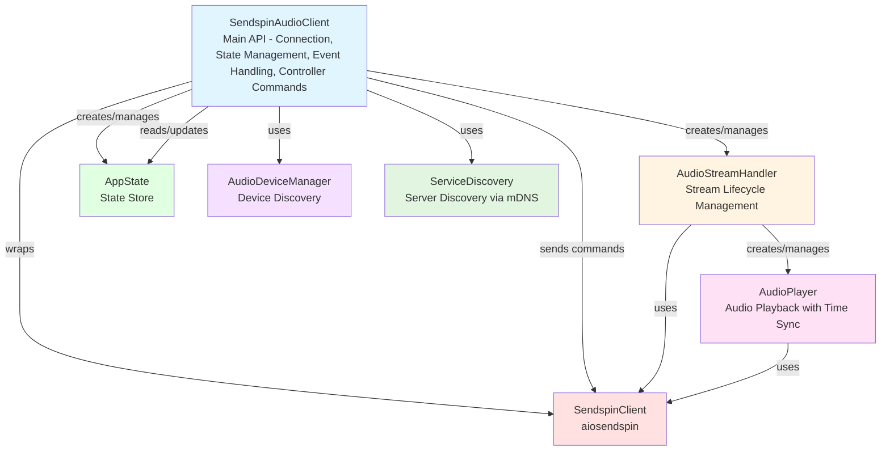

# aiosendspin-sounddevice

> **⚠️ Work in Progress**  
> This library is currently under active development and not yet available on PyPI. API might change heavily. It's also not versioned yet.

Python library for programmatic audio playback from Sendspin servers. Provides a clean API for connecting to Sendspin servers, receiving synchronized audio streams, and playing them through local audio devices with precise time synchronization, buffering, and drift correction.

## Installation

> **Note:** This package is not yet available on PyPI. Install from source:

```bash
git clone <repository-url>
cd aiosendspin-sounddevice
pip install .
```

For development with documentation support:

```bash
pip install -e ".[dev]"
```

## Documentation

API documentation is available in the `docs/` directory. To build the documentation:

```bash
cd docs
make html
```

The generated HTML documentation will be in `docs/build/html/`. See `docs/README.md` for more details.

## Quick Start

```python
import asyncio
from aiosendspin_sounddevice import SendspinAudioClient, SendspinAudioClientConfig

async def main():
    config = SendspinAudioClientConfig(
        url="ws://192.168.1.100:8080/sendspin",
        client_id="my-client",
        client_name="My Player",
    )
    
    client = SendspinAudioClient(config)
    
    try:
        await client.connect()
        print("Connected! Playing audio... Press Ctrl+C to stop")
        await client.wait_for_disconnect()
    except KeyboardInterrupt:
        print("\nStopping...")
    finally:
        await client.disconnect()

if __name__ == "__main__":
    asyncio.run(main())
```

See `examples/simple.py` for a minimal working example, `examples/comprehensive.py` for all features, `examples/discovery.py` for server discovery, `examples/controller.py` for controller commands, or `examples/tui.py` for a full terminal UI example.

## Architecture

### Component Diagram



### Component Responsibilities

#### SendspinAudioClient
- **Purpose**: Main public API for library users
- **Responsibilities**:
  - Connection management (connect, disconnect)
  - Configuration and initialization
  - Event listener setup and delegation
  - State query methods (get_metadata, get_playback_state, get_supported_commands, etc.)
  - Controller commands (play, pause, next_track, previous_track, switch_group, toggle_play_pause)
  - Volume control (set_volume)
  - Timing metrics access
- **Interactions**:
  - Creates and manages `AudioStreamHandler`
  - Creates and manages `AppState`
  - Uses `AudioDeviceManager` (via `resolve_audio_device()`)
  - Wraps `SendspinClient` from aiosendspin
  - Updates `AppState` based on server events
  - Delegates audio chunks to `AudioStreamHandler`
  - Sends media commands to server via `SendspinClient`

#### AudioStreamHandler
- **Purpose**: Manages audio stream lifecycle and format changes
- **Responsibilities**:
  - Handles stream start/end/clear events
  - Routes audio chunks to `AudioPlayer`
  - Manages `AudioPlayer` initialization and reconfiguration
  - Clears audio queue on stream events
- **Interactions**:
  - Creates and manages `AudioPlayer` instances
  - Receives audio chunks from `SendspinAudioClient`
  - Receives stream events from `SendspinAudioClient`
  - Calls `AudioPlayer.submit()` for audio chunks
  - Calls `AudioPlayer.clear()` on stream events

#### AudioPlayer
- **Purpose**: Low-level time-synchronized audio playback
- **Responsibilities**:
  - Accepts audio chunks with server timestamps
  - Time synchronization and drift correction
  - Buffering and underrun prevention
  - Playback speed adjustment for sync correction
  - Gap/overlap detection and handling
  - Volume and mute control
- **Interactions**:
  - Receives audio chunks from `AudioStreamHandler`
  - Uses `SendspinClient.compute_play_time()` and `compute_server_time()` for time sync
  - Outputs audio via `sounddevice`
  - Provides timing metrics to `SendspinAudioClient`

#### AppState
- **Purpose**: Mirrors server state for client presentation
- **Responsibilities**:
  - Stores playback state, metadata, volume, group info
  - Tracks progress with interpolation support
  - Provides `update_metadata()` and `describe()` methods
- **Interactions**:
  - Updated by `SendspinAudioClient` event handlers
  - Read by `SendspinAudioClient` query methods
  - Used for progress interpolation calculations

#### AudioDeviceManager
- **Purpose**: Audio device discovery and selection
- **Responsibilities**:
  - Discovers available audio output devices
  - Provides device lookup methods (by index, name)
  - Caches device list
- **Interactions**:
  - Used by `SendspinAudioClient` via `resolve_audio_device()` helper
  - Provides `AudioDevice` instances for device selection
  - Static method `list_audio_devices()` for public API

#### ServiceDiscovery
- **Purpose**: mDNS-based server discovery
- **Responsibilities**:
  - Discovers Sendspin servers on the local network via mDNS
  - Tracks multiple discovered servers
  - Provides continuous discovery or one-time discovery
- **Interactions**:
  - Used independently or with `SendspinAudioClient`
  - Provides `DiscoveredServer` instances with server information
  - Class method `discover_servers()` for one-time discovery

### Data Flow

#### Connection Flow
```
User → SendspinAudioClient.connect()
       ↓
       SendspinClient.connect() (aiosendspin)
       ↓
       Setup listeners → Event handlers update AppState
       ↓
       AudioStreamHandler ready to receive chunks
```

#### Audio Playback Flow
```
Server → SendspinClient → SendspinAudioClient._handle_audio_chunk()
                          ↓
                          AudioStreamHandler.on_audio_chunk()
                          ↓
                          AudioPlayer.submit()
                          ↓
                          sounddevice (audio output)
```

#### State Update Flow
```
Server → SendspinClient → SendspinAudioClient event handlers
                          ↓
                          AppState.update_*()
                          ↓
                          Optional user callbacks
                          ↓
                          User query methods (get_metadata, etc.)
```

#### Event Handler Flow
```
Server Event → SendspinClient listener
                ↓
                SendspinAudioClient._handle_*()
                ↓
                AppState.update()
                ↓
                Optional user callback (on_metadata_update, etc.)
                ↓
                _print_event() (logs + on_event callback)
```

#### Controller Command Flow
```
User → SendspinAudioClient.play() / pause() / next_track() / etc.
       ↓
       send_media_command() validates against supported_commands
       ↓
       SendspinClient.send_group_command()
       ↓
       Server processes command
       ↓
       Server sends state update → Event Handler Flow
```

#### Server Discovery Flow
```
User → ServiceDiscovery.start() or ServiceDiscovery.discover_servers()
       ↓
       mDNS service browser listens for _sendspin-server._tcp.local.
       ↓
       Servers discovered → DiscoveredServer instances
       ↓
       User selects server → SendspinAudioClient.connect(url)
```

### Key Design Patterns

1. **Delegation**: `SendspinAudioClient` delegates audio handling to `AudioStreamHandler`, which delegates playback to `AudioPlayer`
2. **State Management**: `AppState` centralizes all state, updated by event handlers, read by query methods
3. **Event-Driven**: Server events trigger handlers that update state and call user callbacks
4. **Reference Design**: All core audio playback and synchronization logic is based on the original [sendspin-cli](https://github.com/Sendspin/sendspin-cli) implementation.

### External Dependencies

- **aiosendspin.SendspinClient**: WebSocket connection and protocol handling
- **sounddevice**: Audio output device access and playback
- **numpy**: Audio data processing
- **zeroconf**: mDNS service discovery for server discovery

## Features

- ✅ **Audio Playback**: Time-synchronized audio playback with DAC-level precision
- ✅ **Server Discovery**: mDNS-based discovery of Sendspin servers on the network
- ✅ **Controller Commands**: Full support for media control (play, pause, next, previous, switch group)
- ✅ **State Management**: Real-time state tracking with metadata, progress, and volume
- ✅ **Event Listeners**: Optional callbacks for reactive programming
- ✅ **Audio Device Management**: Object-oriented audio device discovery and selection
- ✅ **Progress Interpolation**: Client-side progress calculation for smooth UI updates

## Limitations

See `FEATURE_COMPARISON.md` for detailed comparison with [sendspin-cli](https://github.com/Sendspin/sendspin-cli).
The library focuses on the player and controller roles. Server functionality and advanced features are not included.

## License

Apache-2.0

## Credits

Based on the [sendspin-cli](https://github.com/Sendspin/sendspin-cli) by the Sendspin Protocol authors.

