# Feature Branch Workflow

Rich CLI commands for managing feature branches and git worktrees.

**Added in:** v0.3.13

---


---

## Overview

The feature workflow commands provide:

- **Pipeline Visualization** - See your feature branches in a tree view
- **Worktree Integration** - Parallel development with git worktrees
- **Dependency Automation** - Auto-install deps when creating branches
- **Cleanup Tools** - Remove merged branches and worktrees

```bash
ait feature status    # Show pipeline
ait feature list      # List all features
ait feature start     # Create new feature
ait feature cleanup   # Remove merged
```

---

## Commands

### `ait feature status`

Show a rich pipeline visualization of your feature branches.

```bash
ait feature status
```

**Output:**
```
╭──────────────────────────────────────────────────────────────────────────────╮
│ my-project - Feature Pipeline                                                │
╰──────────────────────────────────────────────────────────────────────────────╯
main
└── dev
    ├── ● feature/auth +3
    ├── ○ feature/api-v2 +12 📁 ~/.git-worktrees/my-project/api-v2
    └── ○ feature/old-feature (merged)

Summary: 3 features (2 in progress, 1 merged)
Tip: Run 'ait feature cleanup' to remove merged branches
```

**Legend:**
- `●` - Current branch
- `○` - Other branch
- `+N` - Commits ahead of dev
- `(merged)` - Already merged into dev
- `📁` - Has a worktree

---

### `ait feature list`

List feature branches with detailed information.

```bash
# List active features only
ait feature list

# Include merged features
ait feature list --all
```

**Output:**
```
                                Feature Branches
┏━━━━┳━━━━━━━━━━━━━━━━━━━━━┳━━━━━━━━━┳━━━━━━━━┳━━━━━━━━━━━━━━━━━━━━━━━━━━━━━━━━┓
┃    ┃ Branch              ┃ Commits ┃ Status ┃ Worktree                       ┃
┡━━━━╇━━━━━━━━━━━━━━━━━━━━━╇━━━━━━━━━╇━━━━━━━━╇━━━━━━━━━━━━━━━━━━━━━━━━━━━━━━━━┩
│ ●  │ feature/auth        │       3 │ active │ -                              │
│ ○  │ feature/api-v2      │      12 │ active │ ~/.git-worktrees/project/api-v2│
└────┴─────────────────────┴─────────┴────────┴────────────────────────────────┘
```

---

### `ait feature start`

Create a new feature branch with optional worktree and dependency installation.

```bash
# Basic: create feature/my-feature from dev
ait feature start my-feature

# With worktree: parallel development
ait feature start my-feature --worktree

# Skip dependency installation
ait feature start my-feature --no-install

# Start from different base branch
ait feature start hotfix --base main
```

**Options:**

| Option | Short | Description |
|--------|-------|-------------|
| `--worktree` | `-w` | Create in a git worktree at `~/.git-worktrees/<project>/<name>` |
| `--no-install` | | Skip automatic dependency installation |
| `--base` | `-b` | Base branch (default: `dev`) |

**What it does:**

1. Fetches latest from origin
2. Creates `feature/<name>` branch from base
3. (Optional) Creates worktree at `~/.git-worktrees/<project>/<name>`
4. (Optional) Installs dependencies based on project type:
   - **Python**: `uv sync` or `pip install -r requirements.txt`
   - **Node**: `bun install`, `pnpm install`, or `npm install`
   - **R**: Detects `DESCRIPTION` file (deps via renv/pak)

---

### `ait feature cleanup`

Interactively clean up merged feature branches and their worktrees.

```bash
# Interactive cleanup
ait feature cleanup

# Preview what would be deleted
ait feature cleanup --dry-run

# Delete without confirmation
ait feature cleanup --force
```

**Options:**

| Option | Short | Description |
|--------|-------|-------------|
| `--dry-run` | `-n` | Show what would be deleted without making changes |
| `--force` | `-f` | Delete without confirmation prompt |

**Example output:**
```
Found 2 merged feature branches:

┏━━━━━━━━━━━━━━━━━━━━━━━━━━━┳━━━━━━━━━━━━━━━━━━━━━━━━━━━━━━━━━━━━━━━━━━━━━━━━┓
┃ Branch                    ┃ Worktree                                       ┃
┡━━━━━━━━━━━━━━━━━━━━━━━━━━━╇━━━━━━━━━━━━━━━━━━━━━━━━━━━━━━━━━━━━━━━━━━━━━━━━┩
│ feature/old-auth          │ ~/.git-worktrees/project/old-auth              │
│ feature/deprecated-api    │ -                                              │
└───────────────────────────┴────────────────────────────────────────────────┘

Delete these branches? [y/N]: y
Removing worktree: ~/.git-worktrees/project/old-auth
Deleting branch: feature/old-auth
Deleting branch: feature/deprecated-api

✓ Cleaned up 2 merged branches.
```

---

## Workflow Examples

### Starting a New Feature

```bash
# 1. Start feature with worktree
ait feature start auth-redesign --worktree

# 2. Navigate to worktree
cd ~/.git-worktrees/my-project/auth-redesign

# 3. Start Claude Code in worktree
claude

# 4. Work on feature...
```

### Checking Feature Status

```bash
# Quick pipeline view
ait feature status

# Detailed list with worktrees
ait feature list
```

### After Merging a PR

```bash
# Clean up merged branches
ait feature cleanup

# Or preview first
ait feature cleanup --dry-run
```

---

## The 3-Layer Architecture

Choose the right tool for the task:

```mermaid
graph LR
    subgraph LAYERS["Choose by Need"]
        L1["🚀 flow-cli<br/>Instant (sub-10ms)"]
        L2["📊 aiterm<br/>Rich visualization"]
        L3["🤖 craft<br/>AI-assisted"]
    end

    L1 -->|"Speed"| USE1["g feature start"]
    L2 -->|"Insight"| USE2["ait feature status"]
    L3 -->|"Automation"| USE3["/craft:git:worktree finish"]
```



### Quick Reference

| Action | flow-cli | aiterm | craft |
|--------|----------|--------|-------|
| Start feature | `g feature start NAME` | `ait feature start NAME` | `/craft:git:worktree create` |
| With worktree | `g feature start NAME -w` | `ait feature start NAME --worktree` | `/craft:git:worktree create` |
| Check status | `g status` | `ait feature status` | - |
| List features | `g feature list` | `ait feature list` | - |
| Finish & PR | `g feature finish` | - | `/craft:git:worktree finish` |
| Cleanup | `g feature prune` | `ait feature cleanup` | `/craft:git:worktree clean` |

### craft Integration

Use `/craft:git:worktree finish` for AI-assisted feature completion:

1. **Run Tests** - Auto-detects project type (npm/pytest/cargo/go/R)
2. **Generate Changelog** - Analyzes commits, writes CHANGELOG entry
3. **Create PR** - Generates description, test plan, links issues

```bash
# In Claude Code, within your worktree:
/craft:git:worktree finish
```

See the [Feature Workflow Tutorial](../guides/FEATURE-WORKFLOW-TUTORIAL.md) for the complete workflow.

---

## Git Worktrees

The feature workflow integrates with git worktrees for parallel development.

### Default Worktree Location

```
~/.git-worktrees/
└── <project-name>/
    ├── feature-auth/
    ├── feature-api-v2/
    └── hotfix-security/
```

### Benefits

- Work on multiple features simultaneously
- Each worktree has its own working directory
- No need to stash/switch branches
- Dependencies installed per-worktree

### Learn More

See the [Git Worktrees Guide](../guides/GIT-WORKTREES-GUIDE.md) for a comprehensive tutorial.

---

## Tips

!!! tip "Use worktrees for parallel work"
    When working on multiple features, use `--worktree` to avoid constant branch switching.

!!! tip "Clean up regularly"
    Run `ait feature cleanup` after merging PRs to keep your repo tidy.

!!! tip "Check status before starting"
    Run `ait feature status` to see the current state before creating new features.

---

## Related Commands

- [`ait ghost`](terminals.md#ghostty-support-v039) - Ghostty terminal shortcuts
- [`ait switch`](context-detection.md) - Terminal-aware context switching
- [`ait sessions`](sessions.md) - Session coordination
