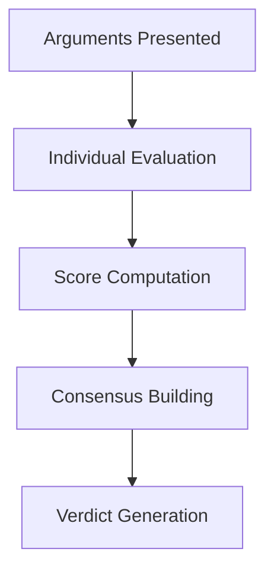

# Jury Mechanism

ARTEMIS uses a multi-perspective jury system instead of a single evaluator. This provides more balanced verdicts and transparent decision-making.

## Why a Jury?

Single-evaluator systems have limitations:

- **Bias**: One perspective dominates
- **Opacity**: Hard to understand decisions
- **Inconsistency**: Results vary unpredictably

A jury addresses these by:

- **Multiple Perspectives**: Different viewpoints considered
- **Deliberation**: Jurors evaluate arguments independently then aggregate
- **Transparency**: Each evaluation is explained

## JuryPanel

The `JuryPanel` class manages multiple jury members:

```python
from artemis.core.jury import JuryPanel

panel = JuryPanel(
    evaluators=5,              # Number of jury members
    model="gpt-4o",            # Model for jurors
    consensus_threshold=0.7,   # Required agreement (0-1)
)
```

### JuryPanel Options

| Option | Type | Default | Description |
|--------|------|---------|-------------|
| `evaluators` | int | 3 | Number of jury members |
| `model` | str | "gpt-4o" | Default model for jurors |
| `models` | list[str] | None | Per-juror model list |
| `jurors` | list[JurorConfig] | None | Full juror configuration |
| `consensus_threshold` | float | 0.7 | Required agreement |
| `criteria` | list[str] | default | Evaluation criteria |

### Per-Juror Model Configuration

You can assign different models to each juror for diverse evaluation perspectives:

**Option A: Model List**

A simple list of models distributed across jurors:

```python
jury = JuryPanel(
    evaluators=3,
    models=["gpt-4o", "claude-sonnet-4-20250514", "gemini-2.0-flash"],
)
```

If fewer models than evaluators, they cycle:

```python
# 5 jurors with 2 models = gpt-4o, claude, gpt-4o, claude, gpt-4o
jury = JuryPanel(
    evaluators=5,
    models=["gpt-4o", "claude-sonnet-4-20250514"],
)
```

**Option B: JurorConfig Objects**

Full control over each juror's perspective, model, and criteria:

```python
from artemis.core.types import JurorConfig, JuryPerspective

jury = JuryPanel(
    jurors=[
        JurorConfig(
            perspective=JuryPerspective.ANALYTICAL,
            model="gpt-4o",
            criteria=["logical_consistency", "evidence_strength"],
        ),
        JurorConfig(
            perspective=JuryPerspective.ETHICAL,
            model="claude-sonnet-4-20250514",
            criteria=["ethical_alignment", "fairness"],
        ),
        JurorConfig(
            perspective=JuryPerspective.PRACTICAL,
            model="gemini-2.0-flash",
            criteria=["feasibility", "real_world_impact"],
        ),
    ],
    consensus_threshold=0.7,
)
```

### JurorConfig Fields

| Field | Type | Required | Description |
|-------|------|----------|-------------|
| `perspective` | JuryPerspective | Yes | Juror's evaluation perspective |
| `model` | str | Yes | Model identifier |
| `criteria` | list[str] | No | Custom criteria for this juror |
| `api_key` | str | No | API key override for this juror |

## Jury Perspectives

ARTEMIS includes five built-in perspectives via the `JuryPerspective` enum:

```python
from artemis.core.types import JuryPerspective

# Available perspectives
JuryPerspective.ANALYTICAL   # Focus on logic and evidence
JuryPerspective.ETHICAL      # Focus on moral implications
JuryPerspective.PRACTICAL    # Focus on feasibility and impact
JuryPerspective.ADVERSARIAL  # Challenge all arguments
JuryPerspective.SYNTHESIZING # Find common ground
```

### Perspective Details

**Analytical Perspective**:
- Prioritizes valid reasoning
- Evaluates logical consistency
- Values strong evidence

**Ethical Perspective**:
- Considers moral implications
- Weighs stakeholder impact
- Values fairness and justice

**Practical Perspective**:
- Focuses on feasibility
- Considers implementation
- Values real-world evidence

**Adversarial Perspective**:
- Questions all claims
- Requires strong evidence
- Identifies weak points

**Synthesizing Perspective**:
- Seeks common ground
- Recognizes valid points from all sides
- Values constructive framing

### Automatic Perspective Assignment

When you create a `JuryPanel`, perspectives are automatically distributed among jurors:

```python
panel = JuryPanel(evaluators=5, model="gpt-4o")

# Check assigned perspectives
for juror in panel.jurors:
    print(f"{juror.juror_id}: {juror.perspective.value}")
# juror_0: analytical
# juror_1: ethical
# juror_2: practical
# juror_3: adversarial
# juror_4: synthesizing
```

## Deliberation Process

### Flow



### Stages

1. **Individual Evaluation**: Each juror evaluates arguments independently from their perspective
2. **Score Computation**: Jurors compute scores for each agent based on evaluation criteria
3. **Consensus Building**: Weighted voting determines the winner based on confidence
4. **Verdict Generation**: Final verdict with reasoning and dissenting opinions

## Verdict Structure

The `Verdict` returned by deliberation includes:

```python
from artemis.core.debate import Debate

# After running a debate
result = await debate.run()
verdict = result.verdict

print(f"Decision: {verdict.decision}")       # Winner name or "draw"
print(f"Confidence: {verdict.confidence}")   # 0.0 to 1.0
print(f"Reasoning: {verdict.reasoning}")     # Explanation
print(f"Unanimous: {verdict.unanimous}")     # Whether all jurors agreed

# Score breakdown by agent
if verdict.score_breakdown:
    for agent, score in verdict.score_breakdown.items():
        print(f"  {agent}: {score:.2f}")

# Dissenting opinions
for dissent in verdict.dissenting_opinions:
    print(f"Dissent from {dissent.juror_id} ({dissent.perspective.value}):")
    print(f"  Position: {dissent.position}")
    print(f"  Reasoning: {dissent.reasoning}")
```

### Verdict Fields

| Field | Type | Description |
|-------|------|-------------|
| `decision` | str | Winner name or "draw" |
| `confidence` | float | Confidence level (0-1) |
| `reasoning` | str | Explanation of verdict |
| `unanimous` | bool | Whether all jurors agreed |
| `score_breakdown` | dict | Scores by agent |
| `dissenting_opinions` | list | Dissenting juror opinions |

## Using the Jury

### In Debates

```python
from artemis.core.debate import Debate
from artemis.core.jury import JuryPanel
from artemis.core.agent import Agent

# Create agents
agents = [
    Agent(
        name="pro",
        role="Advocate supporting the proposition",
        model="gpt-4o",
    ),
    Agent(
        name="con",
        role="Advocate opposing the proposition",
        model="gpt-4o",
    ),
]

# Create jury panel
jury = JuryPanel(
    evaluators=5,
    model="gpt-4o",
    consensus_threshold=0.7,
)

# Create debate with jury
debate = Debate(
    topic="Should we adopt this policy?",
    agents=agents,
    jury=jury,
)

debate.assign_positions({
    "pro": "supports the policy",
    "con": "opposes the policy",
})

result = await debate.run()
print(f"Verdict: {result.verdict.decision}")
print(f"Confidence: {result.verdict.confidence:.0%}")
```

### Custom Criteria

```python
# Create jury with custom evaluation criteria
jury = JuryPanel(
    evaluators=3,
    model="gpt-4o",
    criteria=[
        "argument_quality",
        "evidence_strength",
        "logical_consistency",
        "persuasiveness",
        "ethical_alignment",
    ],
)
```

## JuryMember

Individual jurors can be accessed and examined:

```python
from artemis.core.jury import JuryPanel, JuryMember
from artemis.core.types import JuryPerspective

panel = JuryPanel(evaluators=3, model="gpt-4o")

# Access individual jurors
for juror in panel.jurors:
    print(f"ID: {juror.juror_id}")
    print(f"Perspective: {juror.perspective.value}")
    print(f"Criteria: {juror.criteria}")

# Get specific juror
juror = panel.get_juror("juror_0")
if juror:
    print(f"Found: {juror.juror_id}")
```

## Consensus Calculation

The jury uses weighted voting to reach consensus:

1. Each juror evaluates and determines their winner
2. Votes are weighted by juror confidence
3. Agreement score is calculated
4. If below threshold, may result in "draw"

```python
# Consensus threshold affects verdict
panel = JuryPanel(
    evaluators=5,
    consensus_threshold=0.6,  # Lower threshold = easier consensus
)

# Higher threshold requires stronger agreement
strict_panel = JuryPanel(
    evaluators=5,
    consensus_threshold=0.9,  # Requires near-unanimous agreement
)
```

## Benefits of Jury System

### 1. Reduced Bias

Multiple perspectives prevent single-viewpoint dominance.

### 2. Transparent Decisions

Each juror's evaluation and reasoning is recorded.

### 3. Robust Verdicts

Consensus-based approach improves decision quality.

### 4. Explainable Results

Dissenting opinions provide insight into alternative viewpoints.

## Next Steps

- Learn about [L-AE-CR Evaluation](l-ae-cr.md) that feeds jury scores
- Understand [H-L-DAG Arguments](h-l-dag.md) that juries evaluate
- Explore [Ethics Module](ethics.md) for ethical jury perspectives
