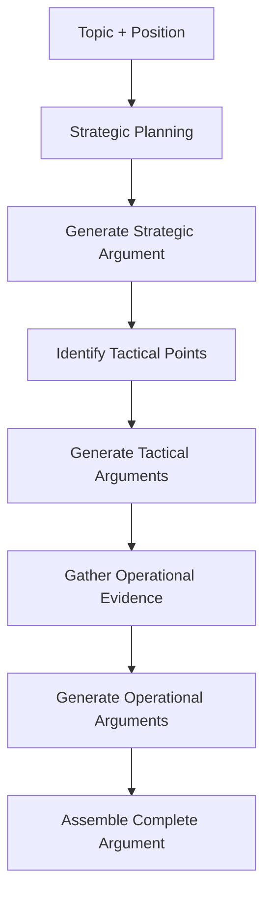

# H-L-DAG: Hierarchical Argument Generation

H-L-DAG (Hierarchical Leveled Directed Acyclic Graph) is ARTEMIS's approach to structured argument generation. Instead of generating flat text responses, agents construct arguments at multiple levels of abstraction.

## The Three Levels

### Strategic Level

The highest level of abstraction, focusing on:

- **Core thesis**: The fundamental position being argued
- **Strategic goals**: What the argument aims to achieve
- **Key differentiators**: What makes this position compelling

```python
# Example strategic-level argument
Argument(
    agent="Proponent",
    level=ArgumentLevel.STRATEGIC,
    content="""
    AI regulation is essential for societal protection. The core thesis
    is that unregulated AI development poses existential risks that
    outweigh the costs of oversight. This position prioritizes long-term
    safety over short-term innovation speed.
    """,
    evidence=[],  # Strategic level focuses on framing
)
```

### Tactical Level

The middle level, providing:

- **Supporting points**: Specific arguments backing the thesis
- **Evidence chains**: Logical connections between claims
- **Counter-argument awareness**: Acknowledgment of opposing views

```python
# Example tactical-level argument
Argument(
    agent="Proponent",
    level=ArgumentLevel.TACTICAL,
    content="""
    Three key factors support AI regulation:
    1. Historical precedent shows technology regulation benefits society
    2. Current AI capabilities already exceed human oversight capacity
    3. Industry self-regulation has proven insufficient
    """,
    evidence=[
        Evidence(
            type="example",
            content="FDA drug approval process demonstrates successful tech regulation",
            source="FDA History",
        ),
        Evidence(
            type="study",
            content="Analysis of 200+ AI incidents from 2020-2024",
            source="AI Incident Database",
        ),
    ],
)
```

### Operational Level

The ground level with:

- **Specific facts**: Concrete data points
- **Quotes and citations**: Authoritative sources
- **Examples**: Real-world cases

```python
# Example operational-level argument
Argument(
    agent="Proponent",
    level=ArgumentLevel.OPERATIONAL,
    content="""
    The EU AI Act, implemented in 2024, demonstrates successful regulation.
    According to the European Commission, compliance costs averaged only
    2.3% of development budgets while preventing an estimated 47 high-risk
    AI deployments. Microsoft's CEO stated, "Thoughtful regulation actually
    accelerates responsible innovation."
    """,
    evidence=[
        Evidence(
            type="quote",
            content="compliance costs averaged 2.3% of development budgets",
            source="European Commission AI Act Report 2024",
        ),
    ],
)
```

## How H-L-DAG Works

### Argument Generation Flow



### The DAG Structure

Arguments form a directed acyclic graph:

```
Strategic Thesis
├── Tactical Point 1
│   ├── Operational Fact 1.1
│   └── Operational Fact 1.2
├── Tactical Point 2
│   ├── Operational Fact 2.1
│   ├── Operational Fact 2.2
│   └── Operational Fact 2.3
└── Tactical Point 3
    └── Operational Fact 3.1
```

## Evidence Types

The `Evidence` class supports these types:

| Type | Description |
|------|-------------|
| `fact` | Verifiable factual statement |
| `statistic` | Numerical data or statistics |
| `quote` | Direct quotation from a source |
| `example` | Real-world case or example |
| `study` | Research study or analysis |
| `expert_opinion` | Opinion from domain expert |

## Causal Links

H-L-DAG tracks causal relationships between arguments:

```python
from artemis.core.types import CausalLink

link = CausalLink(
    cause="unregulated_ai",
    effect="societal_harm",
    mechanism="Lack of oversight allows harmful deployments",
    strength=0.8,  # 0.0 to 1.0
    bidirectional=False,
)
```

### CausalLink Fields

| Field | Type | Description |
|-------|------|-------------|
| `cause` | str | The cause in the relationship |
| `effect` | str | The effect in the relationship |
| `mechanism` | str | How cause leads to effect |
| `strength` | float | Relationship strength (0-1) |
| `bidirectional` | bool | Whether relationship works both ways |

## Using H-L-DAG

### Configuring Arguments

```python
from artemis.core.types import DebateConfig

config = DebateConfig(
    require_evidence=True,
    require_causal_links=True,
    min_evidence_per_argument=1,
    max_argument_tokens=1000,
)
```

### Accessing Argument Structure

```python
result = await debate.run()

for turn in result.transcript:
    arg = turn.argument

    print(f"Level: {arg.level}")
    print(f"Content: {arg.content}")

    for evidence in arg.evidence:
        print(f"  Evidence: {evidence.source}")

    for link in arg.causal_links:
        print(f"  Causal: {link.cause} -> {link.effect}")
```

## Benefits of H-L-DAG

### 1. Structured Reasoning

Arguments are systematically organized, making them easier to:

- Evaluate for logical coherence
- Compare across agents
- Identify gaps or weaknesses

### 2. Evidence Integration

The operational level ensures arguments are grounded in:

- Concrete facts
- Authoritative sources
- Real-world examples

### 3. Causal Transparency

Explicit causal links make reasoning transparent:

- Evaluators can verify logical connections
- Counter-arguments can target specific links
- Fallacies are easier to detect

### 4. Hierarchical Evaluation

Different levels can be weighted differently:

```python
evaluation_weights = {
    "strategic": 0.3,   # 30% weight
    "tactical": 0.4,    # 40% weight
    "operational": 0.3, # 30% weight
}
```

## Comparison to Flat Arguments

| Aspect | Flat Arguments | H-L-DAG |
|--------|---------------|---------|
| Structure | Unorganized text | Three-level hierarchy |
| Evidence | Mixed in text | Explicit evidence objects |
| Causality | Implicit | Explicit causal links |
| Evaluation | Holistic only | Level-by-level possible |
| Debugging | Difficult | Clear structure |

## Next Steps

- Learn how arguments are evaluated with [L-AE-CR](l-ae-cr.md)
- See how the [Jury Mechanism](jury.md) uses argument structure
- Explore [Safety Monitoring](../safety/overview.md) of arguments
