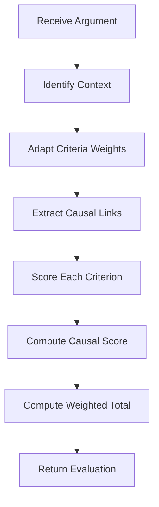

# L-AE-CR: Adaptive Evaluation with Causal Reasoning

L-AE-CR (Leveled Adaptive Evaluation with Causal Reasoning) is ARTEMIS's dynamic evaluation system. Unlike static scoring, it adapts evaluation criteria based on context and traces causal relationships in arguments.

## Core Principles

### 1. Adaptive Criteria Weighting

Evaluation criteria aren't fixed—they shift based on:

- **Topic Domain**: Technical vs. ethical vs. policy debates
- **Round Context**: Opening statements vs. rebuttals
- **Argument Type**: Evidence-based vs. logical vs. emotional appeals

### 2. Causal Chain Analysis

Arguments are evaluated not just on content but on the strength of causal reasoning:

- Does A actually cause B?
- Is the causal chain complete?
- Are there gaps or logical fallacies?

## Evaluation Criteria

### Standard Criteria

The `EvaluationCriteria` class defines the default weights:

```python
from artemis.core.types import EvaluationCriteria

criteria = EvaluationCriteria(
    logical_coherence=0.25,   # Internal consistency of argument
    evidence_quality=0.25,    # Strength and relevance of evidence
    causal_reasoning=0.20,    # Strength of causal reasoning
    ethical_alignment=0.15,   # Ethical soundness
    persuasiveness=0.15,      # Overall persuasiveness
)
```

| Criterion | Description | Default Weight |
|-----------|-------------|----------------|
| `logical_coherence` | Internal consistency of argument | 0.25 |
| `evidence_quality` | Strength and relevance of evidence | 0.25 |
| `causal_reasoning` | Strength of causal reasoning | 0.20 |
| `ethical_alignment` | Ethical soundness | 0.15 |
| `persuasiveness` | Overall persuasiveness | 0.15 |

### Custom Weights

You can customize evaluation weights in the debate configuration:

```python
from artemis.core.types import DebateConfig, EvaluationCriteria

# Technical domain: higher evidence weight
technical_criteria = EvaluationCriteria(
    logical_coherence=0.30,
    evidence_quality=0.35,
    causal_reasoning=0.15,
    ethical_alignment=0.10,
    persuasiveness=0.10,
)

# Ethical domain: higher ethics weight
ethical_criteria = EvaluationCriteria(
    logical_coherence=0.20,
    evidence_quality=0.15,
    causal_reasoning=0.15,
    ethical_alignment=0.35,
    persuasiveness=0.15,
)

config = DebateConfig(
    evaluation_criteria=technical_criteria,
    adaptation_enabled=True,
    adaptation_rate=0.1,
)
```

## Evaluation Modes

ARTEMIS supports three evaluation modes to balance accuracy and cost:

### EvaluationMode.QUALITY

Uses LLM (e.g., gpt-4o-mini) to evaluate all criteria:

- Highest accuracy for criterion scoring
- Provides detailed reasoning for each score
- Best for benchmarking and critical decisions
- Highest cost per evaluation

```python
from artemis.core.types import DebateConfig, EvaluationMode

config = DebateConfig(evaluation_mode=EvaluationMode.QUALITY)
```

### EvaluationMode.BALANCED (Default)

Selective LLM usage for optimal cost/accuracy:

- Uses LLM for jury verdicts and key decisions
- Heuristics for in-debate turn evaluation
- Good accuracy with moderate cost
- Recommended for production use

```python
config = DebateConfig(evaluation_mode=EvaluationMode.BALANCED)
```

### EvaluationMode.FAST

Pure heuristic evaluation:

- No LLM calls during evaluation
- Lowest cost, fastest execution
- Backwards compatible with original behavior
- Best for development, testing, or cost-sensitive deployments

```python
config = DebateConfig(evaluation_mode=EvaluationMode.FAST)
```

### LLMCriterionEvaluator

When using `QUALITY` mode, the `LLMCriterionEvaluator` class performs evaluation:

```python
from artemis.core.llm_evaluation import LLMCriterionEvaluator

evaluator = LLMCriterionEvaluator(
    model="gpt-4o-mini",   # Model for evaluation
    cache_enabled=True,     # Cache evaluations by content hash
)

# Evaluate a single argument
result = await evaluator.evaluate_argument(argument, context)

# Result contains scores and reasoning
print(f"Total score: {result.total_score}")
for detail in result.criterion_details:
    print(f"{detail.criterion}: {detail.score:.2f} - {detail.reasoning}")
```

### EvaluatorFactory

Create the appropriate evaluator based on mode:

```python
from artemis.core.llm_evaluation import EvaluatorFactory
from artemis.core.types import EvaluationMode

# Returns LLMCriterionEvaluator for QUALITY mode
evaluator = EvaluatorFactory.create(EvaluationMode.QUALITY, model="gpt-4o-mini")

# Returns AdaptiveEvaluator for BALANCED/FAST modes
evaluator = EvaluatorFactory.create(EvaluationMode.FAST)
```

## Argument Evaluation

Each argument receives an `ArgumentEvaluation` with detailed scores:

```python
# After running a debate
result = await debate.run()

for turn in result.transcript:
    if turn.evaluation:
        eval = turn.evaluation
        print(f"Agent: {turn.agent}")
        print(f"Total Score: {eval.total_score:.2f}")
        print("Criterion Scores:")
        for criterion, score in eval.scores.items():
            weight = eval.weights.get(criterion, 0)
            print(f"  {criterion}: {score:.2f} (weight: {weight:.2f})")
        print(f"Causal Score: {eval.causal_score:.2f}")
```

### ArgumentEvaluation Fields

| Field | Type | Description |
|-------|------|-------------|
| `argument_id` | str | ID of evaluated argument |
| `scores` | dict | Score for each criterion |
| `weights` | dict | Adapted weight for each criterion |
| `criterion_details` | list | Detailed per-criterion breakdown |
| `causal_score` | float | Score for causal reasoning |
| `total_score` | float | Weighted total score |

## Causal Reasoning Analysis

### CausalLink Structure

Arguments contain causal links that are evaluated:

```python
from artemis.core.types import CausalLink

# Causal links in arguments
link = CausalLink(
    cause="increased_regulation",
    effect="reduced_innovation_speed",
    mechanism="Compliance overhead diverts resources",
    strength=0.7,
    bidirectional=False,
)
```

### Causal Evaluation

The evaluation system assesses:

1. **Completeness**: Is the causal chain fully specified?
2. **Strength**: How strong is each link?
3. **Evidence**: Is there evidence supporting causation?
4. **Validity**: Are there logical fallacies?

### Common Causal Fallacies Detected

| Fallacy | Description |
|---------|-------------|
| **Post Hoc** | Assumes causation from sequence |
| **Correlation** | Treats correlation as causation |
| **Single Cause** | Ignores multiple factors |
| **Slippery Slope** | Assumes inevitable escalation |

## Evaluation Flow



## Adaptive Weight Adjustment

When `adaptation_enabled=True`, weights are dynamically adjusted:

```python
from artemis.core.types import DebateConfig

config = DebateConfig(
    adaptation_enabled=True,
    adaptation_rate=0.1,  # How fast weights adjust (0-0.5)
)
```

### Adaptation Factors

Weights adapt based on:

- **Topic sensitivity**: Higher ethical weight for sensitive topics
- **Topic complexity**: Higher causal weight for complex topics
- **Round progress**: Different expectations for opening vs. closing
- **Argument type**: Evidence-heavy arguments get higher evidence weight

## Using the Evaluator

The `AdaptiveEvaluator` is used internally but can be accessed:

```python
from artemis.core.evaluation import AdaptiveEvaluator
from artemis.core.types import DebateContext

evaluator = AdaptiveEvaluator()

# Evaluate a single argument
evaluation = await evaluator.evaluate_argument(
    argument=argument,
    context=debate_context,
)

print(f"Total Score: {evaluation.total_score:.2f}")
print(f"Breakdown: {evaluation.scores}")
```

## Integration with Jury

L-AE-CR provides scores to the jury mechanism:

```python
from artemis.core.jury import JuryPanel

# Jury members receive evaluation results
panel = JuryPanel(evaluators=5, model="gpt-4o")

# Each jury member considers:
# - Evaluation scores from L-AE-CR
# - Their perspective-specific weights
# - Argument content and structure
```

## Score Components

### Logical Coherence Score

Evaluates internal consistency:

- Premises support conclusion
- No contradictions
- Valid inference patterns

### Evidence Quality Score

Evaluates supporting evidence:

- Source credibility
- Relevance to claims
- Recency and accuracy
- Diversity of sources

### Causal Reasoning Score

Evaluates causal reasoning:

- Chain completeness
- Link strength
- Evidence for causation
- Fallacy absence

### Ethical Alignment Score

Evaluates ethical soundness:

- Fairness of reasoning
- Consideration of stakeholders
- Avoidance of harmful claims
- Respect for values

### Persuasiveness Score

Evaluates persuasiveness:

- Clarity of thesis
- Effectiveness of rhetoric
- Audience appropriateness
- Counter-argument handling

## Benefits of L-AE-CR

### 1. Context-Aware Evaluation

- Adapts to topic domain automatically
- Adjusts for round context
- Considers argument type

### 2. Transparent Scoring

- Clear criteria breakdown
- Weighted contributions visible
- Feedback explains scores

### 3. Causal Rigor

- Validates causal claims
- Detects logical fallacies
- Measures chain strength

### 4. Fair Assessment

- Multiple criteria considered
- Weights prevent single-focus bias
- Adaptation ensures relevance

## Next Steps

- See how evaluations feed into the [Jury Mechanism](jury.md)
- Learn about [H-L-DAG](h-l-dag.md) argument structure
- Explore [Safety Monitoring](../safety/overview.md) integration
