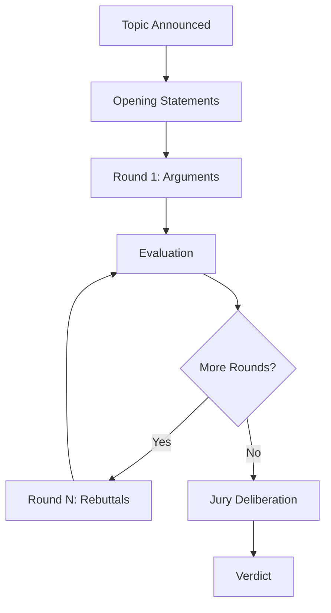

# Core Concepts Overview

ARTEMIS implements a structured approach to multi-agent debates based on three core innovations from the research paper.

## The ARTEMIS Architecture

```
┌────────────────────────────────────────────────────────────────┐
│                        ARTEMIS Core                            │
├────────────────────────────────────────────────────────────────┤
│  ┌─────────────┐  ┌─────────────┐  ┌─────────────┐             │
│  │   H-L-DAG   │  │   L-AE-CR   │  │    Jury     │             │
│  │  Argument   │──│  Adaptive   │──│   Scoring   │             │
│  │ Generation  │  │ Evaluation  │  │  Mechanism  │             │
│  └─────────────┘  └─────────────┘  └─────────────┘             │
│         │                │                │                    │
│         └────────────────┴────────────────┘                    │
│                          │                                     │
│  ┌─────────────────────────────────────────────────────────┐   │
│  │                   Safety Layer                          │   │
│  │  ┌───────────┐  ┌──────────┐  ┌──────────┐  ┌─────────┐ │   │
│  │  │Sandbagging│  │Deception │  │ Behavior │  │ Ethics  │ │   │
│  │  │ Detector  │  │ Monitor  │  │ Tracker  │  │ Guard   │ │   │
│  │  └───────────┘  └──────────┘  └──────────┘  └─────────┘ │   │
│  └─────────────────────────────────────────────────────────┘   │
└────────────────────────────────────────────────────────────────┘
```

## Key Innovations

### 1. H-L-DAG: Hierarchical Argument Generation

Unlike simple chat-based exchanges, ARTEMIS generates arguments at three levels:

- **Strategic Level**: High-level thesis and position
- **Tactical Level**: Supporting points and evidence chains
- **Operational Level**: Specific facts, quotes, and examples

This hierarchical approach ensures arguments are well-structured and comprehensive.

[Learn more about H-L-DAG →](h-l-dag.md)

### 2. L-AE-CR: Adaptive Evaluation with Causal Reasoning

Traditional evaluation uses fixed criteria. ARTEMIS dynamically adjusts evaluation based on:

- **Topic Domain**: Technical topics weight evidence differently than ethical ones
- **Round Context**: Opening arguments vs. rebuttals have different expectations
- **Causal Relationships**: Arguments with strong causal chains score higher

[Learn more about L-AE-CR →](l-ae-cr.md)

### 3. Jury Mechanism

Instead of a single evaluator, ARTEMIS uses a multi-perspective jury:

- Multiple jury members with different perspectives
- Deliberation process for consensus building
- Transparent verdict with confidence scores

[Learn more about the Jury →](jury.md)

## Debate Flow

A typical ARTEMIS debate follows this flow:



### Phases

1. **Initialization**
    - Topic is set
    - Agents are assigned positions
    - Jury is configured

2. **Opening Statements**
    - Each agent presents their initial position
    - No rebuttals yet

3. **Argumentation Rounds**
    - Agents take turns presenting arguments
    - Each argument can include rebuttals
    - Arguments are evaluated after each turn

4. **Jury Deliberation**
    - All arguments are considered
    - Jury members vote
    - Consensus is reached

5. **Verdict**
    - Winner is declared (or tie)
    - Confidence score provided
    - Reasoning explained

## Core Components

### Agent

The `Agent` class represents a debate participant:

```python
from artemis.core.agent import Agent

agent = Agent(
    name="analyst",
    role="Domain expert analyzing the topic",
    model="gpt-4o",
)
```

### Debate

The `Debate` class orchestrates the entire debate:

```python
from artemis.core.debate import Debate

debate = Debate(
    topic="Your debate topic",
    agents=[agent1, agent2],
    rounds=3,
)

result = await debate.run()
```

### Argument

Arguments are structured data with hierarchy:

```python
from artemis.core.types import Argument, ArgumentLevel

argument = Argument(
    agent="pro_agent",
    content="The main argument text...",
    level=ArgumentLevel.STRATEGIC,
    evidence=[...],
    causal_links=[...],
)
```

### Verdict

The final verdict includes:

```python
result.verdict.decision    # "pro", "con", or "tie"
result.verdict.confidence  # 0.0 to 1.0
result.verdict.reasoning   # Explanation
```

## Ethical Considerations

ARTEMIS includes built-in ethical considerations at every stage:

- **Generation**: Arguments are filtered for ethical content
- **Evaluation**: Ethical criteria are weighted appropriately
- **Monitoring**: Ethics guard detects boundary violations

[Learn more about Ethics →](ethics.md)

## Next Steps

Dive deeper into each core concept:

- [H-L-DAG Argument Generation](h-l-dag.md)
- [L-AE-CR Adaptive Evaluation](l-ae-cr.md)
- [Jury Mechanism](jury.md)
- [Ethics Module](ethics.md)

Or explore practical applications:

- [Safety Monitoring](../safety/overview.md)
- [Framework Integrations](../integrations/langchain.md)
- [Examples](../examples/basic-debate.md)
