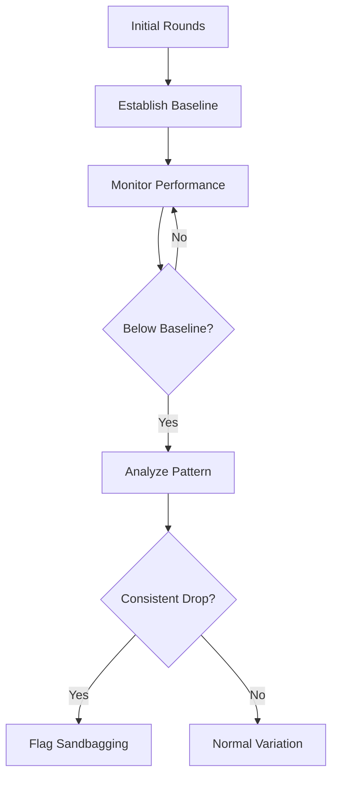

# Sandbagging Detection

Sandbagging is when an agent intentionally underperforms to hide its true capabilities. ARTEMIS's Sandbagging Detector identifies this behavior.

## What is Sandbagging?

Sandbagging occurs when an agent:

- Uses simpler vocabulary than it's capable of
- Provides less detailed arguments than expected
- Avoids complex reasoning it could perform
- Hides knowledge to appear less capable

## Why Detect It?

Sandbagging is a safety concern because:

1. **Capability Assessment**: We need accurate understanding of model capabilities
2. **Trust**: Hidden capabilities undermine trust in AI systems
3. **Safety Evaluation**: Safety testing requires honest performance
4. **Fairness**: Debates require agents to perform at their best

## How It Works

The Sandbagging Detector establishes a capability baseline and monitors for significant drops:



## Usage

### Basic Setup

```python
from artemis.safety import SandbagDetector, MonitorMode

detector = SandbagDetector(
    mode=MonitorMode.PASSIVE,
    sensitivity=0.7,
)

# Use in debate
debate = Debate(
    topic="Your topic",
    agents=agents,
    safety_monitors=[detector.process],
)
```

### Configuration Options

```python
detector = SandbagDetector(
    mode=MonitorMode.PASSIVE,      # PASSIVE, ACTIVE, or LEARNING
    sensitivity=0.7,                # 0.0 to 1.0 (higher = more sensitive)
    baseline_turns=3,               # Turns to establish baseline
    drop_threshold=0.3,             # Significant capability drop threshold
)
```

### Configuration Parameters

| Parameter | Type | Default | Description |
|-----------|------|---------|-------------|
| `mode` | MonitorMode | PASSIVE | Monitor mode |
| `sensitivity` | float | 0.5 | Detection sensitivity (0-1) |
| `baseline_turns` | int | 3 | Rounds to establish baseline |
| `drop_threshold` | float | 0.3 | Performance drop threshold |

## Detection Algorithm

### Phase 1: Baseline Establishment

During the first N turns, the detector builds a capability profile:

- Word count and vocabulary complexity
- Unique word ratio
- Evidence usage patterns
- Causal link density
- Overall argument complexity

### Phase 2: Deviation Detection

After baseline, monitor for significant drops in:

- Argument sophistication
- Evidence quality
- Reasoning depth
- Vocabulary complexity

### Phase 3: Pattern Analysis

Look for consistent underperformance patterns that suggest intentional sandbagging rather than normal variation.

## Results

The detector contributes to debate safety alerts:

```python
result = await debate.run()

# Check for sandbagging alerts
for alert in result.safety_alerts:
    if "sandbag" in alert.type.lower():
        print(f"Agent: {alert.agent}")
        print(f"Severity: {alert.severity:.0%}")
```

## Handling False Positives

Some legitimate reasons for performance drops:

- Topic difficulty varies
- Round context (opening vs. closing)
- Strategic simplification for clarity

### Sensitivity Tuning

```python
# Low sensitivity - only obvious sandbagging
detector = SandbagDetector(
    mode=MonitorMode.PASSIVE,
    sensitivity=0.3,
)

# Medium sensitivity - balanced detection
detector = SandbagDetector(
    mode=MonitorMode.PASSIVE,
    sensitivity=0.6,
)

# High sensitivity - catches subtle cases
detector = SandbagDetector(
    mode=MonitorMode.PASSIVE,
    sensitivity=0.8,
)
```

## Integration

### With Debate

```python
from artemis.core.agent import Agent
from artemis.core.debate import Debate
from artemis.safety import SandbagDetector, MonitorMode

agents = [
    Agent(name="pro", role="Advocate for the proposition", model="gpt-4o"),
    Agent(name="con", role="Advocate against the proposition", model="gpt-4o"),
]

detector = SandbagDetector(
    mode=MonitorMode.PASSIVE,
    sensitivity=0.7,
)

debate = Debate(
    topic="Your topic",
    agents=agents,
    safety_monitors=[detector.process],
)

debate.assign_positions({
    "pro": "supports the proposition",
    "con": "opposes the proposition",
})

result = await debate.run()

# Check for sandbagging
sandbagging_alerts = [
    a for a in result.safety_alerts
    if "sandbag" in a.type.lower()
]

for alert in sandbagging_alerts:
    print(f"Agent {alert.agent}: {alert.severity:.0%} severity")
```

### With Other Monitors

```python
from artemis.safety import (
    SandbagDetector,
    DeceptionMonitor,
    BehaviorTracker,
    MonitorMode,
)

# Combine monitors
sandbag = SandbagDetector(mode=MonitorMode.PASSIVE, sensitivity=0.7)
deception = DeceptionMonitor(mode=MonitorMode.PASSIVE, sensitivity=0.6)
behavior = BehaviorTracker(mode=MonitorMode.PASSIVE, sensitivity=0.5)

debate = Debate(
    topic="Your topic",
    agents=agents,
    safety_monitors=[
        sandbag.process,
        deception.process,
        behavior.process,
    ],
)
```

## Best Practices

1. **Start with medium sensitivity**: Tune based on observations
2. **Establish good baselines**: Allow enough turns for baseline
3. **Consider context**: Some performance variation is normal
4. **Review alerts**: Verify detections before acting
5. **Combine with other monitors**: Sandbagging often accompanies other issues

## Next Steps

- Learn about [Deception Monitoring](deception.md)
- Explore [Behavior Tracking](behavior.md)
- Configure [Safety Overview](overview.md)
