# BAZINGA Live Orchestration Dashboard

**Status:** ✨ Experimental Feature
**Version:** 1.0.0
**Last Updated:** 2025-01-11
**Author:** BAZINGA Development Team

---

## Overview

The BAZINGA Live Orchestration Dashboard is a real-time monitoring interface that provides comprehensive visibility into orchestration sessions. It features:

- **Real-time Updates** via WebSocket connections
- **Workflow Visualization** with Mermaid diagrams
- **AI-Powered Analysis** (optional, disabled by default)
- **Agent Status Tracking**
- **Communication History**
- **Quality Metrics** integration
- **Session Navigation** for historical sessions

## Architecture

### Technology Stack

**Backend:**
- Python 3.x with Flask (lightweight web server)
- flask-sock (WebSocket support)
- watchdog (file system monitoring)
- anthropic (AI diagram generation)

**Frontend:**
- Pure HTML5 + CSS3 + Vanilla JavaScript (no frameworks)
- Mermaid.js for diagram rendering
- Marked.js for markdown parsing
- WebSocket API for real-time updates

**Data Flow:**
```
Coordination Files (JSON)
    ↓
File Watcher (watchdog)
    ↓
WebSocket Broadcast
    ↓
Dashboard UI (real-time update)
```

### File Structure

```
dashboard/
├── server.py                  # WebSocket server with file watcher
├── index.html                 # Main dashboard page
├── requirements.txt           # Python dependencies
├── css/
│   └── dashboard.css         # Dark theme styles
└── js/
    ├── data-loader.js        # API client & data fetching
    ├── websocket-client.js   # WebSocket connection management
    ├── workflow-viz.js       # Mermaid diagram generation
    ├── agent-comms.js        # Communication log parser
    ├── agent-status.js       # Agent status display
    ├── session-nav.js        # Session navigation sidebar
    ├── quality-metrics.js    # Quality metrics display
    └── main.js               # Main controller
```

## Features

### 1. Real-Time Monitoring

The dashboard uses WebSocket connections to receive instant updates when coordination files change. No polling required!

**How it works:**
1. `watchdog` monitors `/bazinga/` folder
2. When a `.json` file changes, server parses the data
3. Server broadcasts update to all connected clients
4. Dashboard UI updates automatically

**Fallback:** Polling every 10 seconds if WebSocket disconnects

### 2. Workflow Visualization

#### Static Mermaid Diagrams (Always Enabled)

Automatically generated from `pm_state.json`:

```mermaid
graph TD
    PM[Project Manager]:::pm
    A["Group A: JWT Auth"]:::completed
    B["Group B: User Reg"]:::inprogress
    C["Group C: Password Reset"]:::pending

    PM --> A
    PM --> B
    PM --> C

    A --> A_DEV["🧑‍💻 Developer"]:::agent
    A_DEV --> A_QA["🧪 QA Expert"]:::agent
    A_QA --> A_TL["👔 Tech Lead"]:::agent
    A_TL --> A_DONE["✅ Completed"]:::completed

    B --> B_DEV["🧑‍💻 Developer"]:::agent

    classDef pm fill:#58a6ff
    classDef completed fill:#3fb950
    classDef inprogress fill:#d29922
    classDef pending fill:#6e7681
    classDef agent fill:#8b949e
```



**Features:**
- Color-coded by status (green=completed, orange=in-progress, gray=pending)
- Shows agent progression (Dev → QA → Tech Lead)
- Displays dependencies between groups
- Auto-updates when state changes

#### AI-Powered Diagrams (Optional)

**Status:** 🔒 Disabled by Default

When enabled, provides intelligent analysis and enhanced visualizations:
- Narrative explanation of current workflow state
- Key insights about orchestration progress
- Enhanced Mermaid diagrams with AI-generated annotations
- Bottleneck detection and recommendations

**How to enable:**

1. Edit `bazinga/skills_config.json`:
   ```json
   {
     "dashboard": {
       "dashboard_ai_diagram_enabled": true
     }
   }
   ```

2. Set environment variable:
   ```bash
   export ANTHROPIC_API_KEY="your-api-key"
   ```

3. Restart dashboard server

4. Click "🤖 Generate AI Diagram" button in dashboard

**Cost:** ~2000 tokens per generation (~$0.01 with Claude Sonnet)

### 3. Session Navigation

Left sidebar shows:
- Current session (marked with 🔴)
- Historical sessions from `bazinga/reports/`
- Session status (running/completed)
- Quick switching between sessions

**Current Limitation:** Historical session view not yet implemented (shows current session only)

### 4. Progress Overview

Real-time progress tracking:
- Animated progress bar
- Task group counts (total, completed, in-progress, pending)
- Current orchestration phase
- Session statistics (iterations, spawns, elapsed time)

### 5. Task Group Cards

Interactive cards for each task group showing:
- Group ID and name
- Current status with color coding
- Assigned files and branch name
- Agent pipeline progress (Dev → QA → TL)
- Revision count (with Opus escalation warning at ≥3)
- Duration and iteration counts

### 6. Agent Status

Live agent monitoring:
- Active agents highlighted with elapsed time
- Currently assigned group
- Idle agents shown grayed out
- Recent orchestrator decisions with reasoning

### 7. Communication History

Parsed from `docs/orchestration-log.md`:
- Last 10 agent interactions
- Iteration number and agent type
- Brief summary with full details on click
- Filterable by agent type (future enhancement)

### 8. Quality Metrics

When available from quality-dashboard skill:
- Overall health score (0-100 gauge)
- Individual metrics (security, coverage, lint, velocity)
- Trend indicators (improving/stable/declining)
- Anomaly alerts and recommendations

## Installation & Setup

### Prerequisites

- Python 3.8+
- pip3
- BAZINGA framework installed

### CLI Installation (Recommended)

When you install or update BAZINGA, the dashboard and its dependencies are automatically installed:

```bash
# Fresh install (automatically installs dashboard + dependencies)
bazinga init --here

# Update existing installation (automatically updates dashboard + dependencies)
bazinga update

# Manual dependency installation if needed
bazinga setup-dashboard

# Verify dashboard installed
ls -la dashboard/
```

**Note:** Version 1.0.5+ automatically installs dashboard dependencies during init/update. Earlier versions require manual installation.

### Automatic Setup

The dashboard is automatically initialized and started when you run orchestration:

```bash
cd /home/user/bazinga
./scripts/init-orchestration.sh
```

**Output:**
```
✅ Dashboard server started (PID: 12345)
🌐 Dashboard: http://localhost:8080
📋 View logs: tail -f bazinga/dashboard.log
```

### Manual Setup

Dashboard dependencies are automatically installed during `bazinga init` or `bazinga update`.

If you need to manually install or start the dashboard:

```bash
# Reinstall dependencies if needed (with confirmation)
bazinga setup-dashboard

# Or install directly with pip
cd dashboard
pip3 install -r requirements.txt

# Start server manually
python3 server.py

# Server will run on http://localhost:53124
```

### Configuration

**Environment Variables:**
- `DASHBOARD_PORT`: Port number (default: 8080)
- `ANTHROPIC_API_KEY`: Required for AI diagram feature

**Skills Configuration:**
Edit `bazinga/skills_config.json`:
```json
{
  "dashboard": {
    "dashboard_ai_diagram_enabled": false  // Set to true to enable AI
  }
}
```

## Usage

### Accessing the Dashboard

1. Start orchestration (dashboard auto-starts)
2. Open browser to `http://localhost:53124`
3. Dashboard automatically connects via WebSocket
4. Watch real-time updates as orchestration progresses

**Works with both orchestration commands:**
- `/bazinga.orchestrate <task>` - Ad-hoc task orchestration
- `/bazinga.orchestrate-from-spec` - Spec-kit integrated orchestration

Both commands use the same coordination folder, so the dashboard monitors them identically.

### Stopping the Dashboard

```bash
# Find PID
cat bazinga/dashboard.pid

# Kill process
kill $(cat bazinga/dashboard.pid)

# Or use pkill
pkill -f "python3 server.py"
```

### Troubleshooting

**Dashboard not loading:**
```bash
# Check if server is running
lsof -i :8080

# Check logs
tail -f bazinga/dashboard.log

# Restart server
cd dashboard && python3 server.py
```

**WebSocket not connecting:**
- Check browser console for errors
- Verify firewall not blocking port 8080
- Try refreshing the page
- Dashboard will fall back to polling

**AI diagram not working:**
- Verify `dashboard_ai_diagram_enabled: true` in skills_config.json
- Check `ANTHROPIC_API_KEY` is set
- Review server logs for API errors
- Ensure API key has sufficient credits

## API Reference

### REST Endpoints

#### `GET /api/data`
Returns all coordination data.

**Response:**
```json
{
  "timestamp": 1704988800,
  "orchestrator_state": { /* ... */ },
  "pm_state": { /* ... */ },
  "group_status": { /* ... */ },
  "quality_dashboard": { /* ... */ },
  "skills_config": { /* ... */ }
}
```

#### `GET /api/log`
Returns orchestration log with parsed entries.

**Response:**
```json
{
  "content": "# BAZINGA Orchestration Log\n...",
  "entries": [
    {
      "header": "## [2025-01-11T14:30:00Z] Iteration 5 - Developer (Group A)",
      "content": ["..."]
    }
  ],
  "count": 5
}
```

#### `GET /api/sessions`
Returns list of available sessions.

**Response:**
```json
[
  {
    "session_id": "bazinga_20250111_143000",
    "start_time": "2025-01-11T14:30:00Z",
    "status": "running",
    "is_current": true
  }
]
```

#### `POST /api/ai-diagram`
Generates AI-powered workflow diagram (requires feature enabled).

**Response:**
```json
{
  "mermaid": "graph TD\n...",
  "narrative": "The workflow is currently...",
  "insights": ["Insight 1", "Insight 2"]
}
```

**Error Response (feature disabled):**
```json
{
  "error": "AI diagram feature is disabled",
  "message": "Enable in bazinga/skills_config.json..."
}
```

### WebSocket Endpoint

#### `WS /ws`
Real-time data stream.

**Messages:**
- Client → Server: `{"type": "ping"}` (heartbeat)
- Server → Client: `{"type": "pong"}` (heartbeat response)
- Server → Client: Full coordination data (on file changes)

**Connection:**
```javascript
const ws = new WebSocket('ws://localhost:8080/ws');

ws.onmessage = (event) => {
  const data = JSON.parse(event.data);
  // Update dashboard with new data
};
```

## Performance

### Resource Usage

**Server:**
- Memory: ~50-100 MB
- CPU: <1% (idle), 2-5% (active updates)
- Network: <1 KB/s (minimal traffic)

**Client:**
- Memory: ~100-200 MB (browser)
- CPU: <5% (rendering updates)
- Network: <10 KB/s (WebSocket + initial load)

### Optimization

- WebSocket reduces bandwidth by 90% vs polling
- File watcher has 0.5s cooldown to prevent rapid-fire updates
- Mermaid diagrams cached until data changes
- Agent communications limited to last 10 entries
- Historical sessions not loaded until selected

## Security Considerations

⚠️ **Local Development Only**

The dashboard is designed for local development and should NOT be exposed to the internet:

- No authentication/authorization
- No HTTPS support (uses HTTP + WS)
- Runs on localhost by default
- Exposes internal orchestration state
- AI diagram feature requires API key in environment

**Recommendations:**
- Only run on trusted development machines
- Do not bind to 0.0.0.0 in production
- Use firewall to block external access to port 8080
- Keep API keys secure (never commit to git)
- Clear `bazinga/dashboard.log` periodically

## Future Enhancements

### Planned Features (Not Yet Implemented)

1. **Historical Session Viewer**
   - Load and display completed sessions
   - Compare sessions side-by-side
   - Export session reports as PDF

2. **Advanced Filtering**
   - Filter communications by agent type
   - Search orchestration log
   - Filter task groups by status

3. **Notifications**
   - Desktop notifications for key events
   - Browser alerts for anomalies
   - Email summaries (optional)

4. **Export & Reporting**
   - Export workflow diagrams as SVG/PNG
   - Generate PDF session reports
   - Export metrics to CSV

5. **Customization**
   - Theme selection (dark/light)
   - Layout preferences
   - Dashboard panels configuration

6. **Advanced Analytics**
   - Velocity trends over time
   - Cost analysis (token usage)
   - Bottleneck detection
   - Predictive completion time

### Known Limitations

1. **Single Session View**
   - Currently only shows active session
   - Historical sessions listed but not loadable

2. **No Persistence**
   - Dashboard state not saved
   - Must reload data on refresh

3. **Limited Mobile Support**
   - Responsive design works but not optimized
   - Some features require larger screen

4. **No Offline Mode**
   - Requires server connection
   - No cached data for offline viewing

5. **AI Diagram Latency**
   - Takes 2-5 seconds to generate
   - Requires external API call
   - Costs tokens per generation

## Contributing

This is an experimental feature in active development. Feedback welcome!

### Testing

To test the dashboard:

1. Start orchestration with a real task
2. Open dashboard in browser
3. Watch real-time updates as orchestration progresses
4. Try enabling AI diagram feature
5. Report any bugs or suggestions in GitHub issues

### Development

To modify the dashboard:

1. Make changes to files in `dashboard/`
2. Refresh browser to see HTML/CSS/JS changes
3. Restart server for Python changes
4. Test with live orchestration session

### Code Style

- Python: PEP 8
- JavaScript: ESLint recommended
- CSS: BEM naming convention
- Comments: Explain "why" not "what"

## Changelog

### Version 1.0.0 (2025-01-11)

Initial release with:
- ✅ Real-time WebSocket updates
- ✅ Workflow visualization (Mermaid)
- ✅ AI-powered diagrams (optional)
- ✅ Agent status tracking
- ✅ Communication history
- ✅ Quality metrics display
- ✅ Session navigation
- ✅ Auto-start on orchestration init
- ✅ Dark theme UI

## Support

For issues, questions, or feature requests:

1. Check logs: `tail -f bazinga/dashboard.log`
2. Review this documentation
3. Test with minimal orchestration session
4. Report issues with reproduction steps

## License

Part of the BAZINGA framework. See main repository for license details.

---

## Quick Reference Card

### Starting Dashboard
```bash
./scripts/init-orchestration.sh  # Auto-starts
# OR
cd dashboard && python3 server.py
```

### Accessing Dashboard
```
http://localhost:53124
```

### Enable AI Diagram
```json
// bazinga/skills_config.json
{
  "dashboard": {
    "dashboard_ai_diagram_enabled": true
  }
}
```

### Environment Variables
```bash
export DASHBOARD_PORT=53124             # Optional (default: 53124)
export ANTHROPIC_API_KEY="sk-..."      # For AI features
```

### Managing Dashboard

Use the management script:
```bash
cd dashboard

./dashboard.sh start    # Start server
./dashboard.sh stop     # Stop server
./dashboard.sh restart  # Restart server
./dashboard.sh status   # Check status
./dashboard.sh logs     # Tail logs
```

Or manually:
```bash
kill $(cat bazinga/dashboard.pid)
```

### Logs
```bash
tail -f bazinga/dashboard.log
```

### Troubleshooting
```bash
# Check if running
lsof -i :53124

# Check server process
ps aux | grep "python3 server.py"

# Check WebSocket
# Open browser console, look for WebSocket connection

# Restart server
pkill -f "python3 server.py" && cd dashboard && python3 server.py &
```

---

**Remember:** This is an experimental feature. Use in development only, not production!
