# BIMFabrikHH Core

[](https://pypi.org/project/bimfabrikhh-core/)
[](https://www.python.org/downloads/)
[](LICENSE)

## Quick Install

```bash
pip install bimfabrikhh-core
```

## Overview

This package is one of the main components of the BIMFabrikHH project, together with the following packages:

- **BIMFabrikHH_core**  
  - [GitHub](https://github.com/LGV-BIM-Leitstelle/BIMFabrikHH_core)  
  - [OpenCode](https://gitlab.opencode.de/LGV-BIM-Leitstelle/bimfabrikhh_core)
- **ifcfactory**  
  - [GitHub](https://github.com/LGV-BIM-Leitstelle/ifcfactory)  
  - [OpenCode](https://gitlab.opencode.de/LGV-BIM-Leitstelle/ifcfactory)
- **BIMFabrikHH_api**  
  - [GitHub](https://github.com/LGV-BIM-Leitstelle/BIMFabrikHH_api)  
  - [OpenCode](https://gitlab.opencode.de/LGV-BIM-Leitstelle/BIMFabrikHH_api)

These three packages make up the **BIMFabrikHH** Project, enabling automated BIM and IFC workflows as part of the Connected Urban Twins (CUT) project.

BIMFabrikHH is a development by the **Freie und Hansestadt Hamburg, Landesbetrieb Geoinformation und Vermessung,
BIM-Leitstelle** as part of the *Connected Urban Twins (CUT)* project. It provides automated conversion of geospatial
data from heterogeneous formats to IFC (Industry Foundation Classes) format, enabling BIM (Building Information
Modeling) methodology implementation.

Geospatial data such as DGM (Digital Terrain Models), city models, and other infrastructure data are crucial foundations
for construction planning. These data are often available as GIS data, but BIM methodology requires conversion to IFC
format. BIMFabrikHH aims to provide geospatial data in IFC format with relevant information from heterogeneous formats.

### Key Benefits

- **Automation**: Simplifies and standardizes repetitive processes through automation
- **Resource Efficiency**: Saves resources through streamlined workflows
- **BIM Adoption**: Promotes BIM usage within the City of Hamburg (FHH)
- **Usability**: Improves usability in the Master Portal
- **Universal Application**: One application for all geospatial data conversion needs
- **Modular Architecture**: Clean separation of concerns with reusable components

## Features
This project is under intensive development. Features are being added and improved rapidly; users should expect frequent updates, experimental components, and breaking changes as the platform evolves toward a stable and robust release. Feedback and contributions are highly welcome during this phase.

### Supported Data Types

1. **Tree Data (Baum)**
    - Street tree inventory from Hamburg OGC API
    - Automatic tree placement with realistic geometry
    - Support for different tree species and sizes
    - Multiple processing modes: basic, generic, optimized

2. **Digital Terrain Models (DGM)**
    - GeoTIFF processing and conversion
    - TIN (Triangulated Irregular Network) generation
    - Optimized mesh creation for large datasets
    - Multiple processing modes: basic, filtered, optimized

3. **City Models (Stadtmodell)**
    - CityGML file parsing and conversion
    - Support for LOD1 and LOD2 building geometries
    - Building information extraction and mapping
    - Refactored parser for better maintainability

4. **Basepoint Objects**
    - Georeferencing basepoints with directional indicators
    - North arrow integration
    - Configurable size and positioning

### Core Capabilities

- **IFC Model Generation**: Creates standardized IFC models with proper structure
- **Georeferencing**: Maintains spatial reference systems (ETRS89-UTM32N)
- **Property Sets**: Adds Hamburg-specific BIM property sets
- **Geometry Processing**: Handles complex 3D geometry creation and optimization
- **API Integration**: Connects to Hamburg's Open Data APIs
- **Utility Functions**: Comprehensive set of reusable geometry and spatial utilities

## Installation

### From PyPI (Recommended)

```bash
pip install bimfabrikhh-core
```

### From Source (Development)

```bash
git clone https://github.com/LGV-BIM-Leitstelle/BIMFabrikHH_core.git
cd BIMFabrikHH_core
poetry install
poetry shell
```

### Prerequisites

- Python 3.11
- pip or Poetry

## Architecture

The project follows a modular architecture:

```mermaid
graph TB
    %% External Libraries
    subgraph external ["External Libraries"]
        ifcopenshell["ifcopenshell<br/>(IFC API)"]
        ifcfactory["ifcfactory<br/>(IFC Geometry)"]
        numpy["numpy"]
        pandas["pandas"]
        pydantic["pydantic"]
        pyvista["pyvista"]
        rasterio["rasterio"]
        pyproj["pyproj"]
        lxml["lxml"]
    end
    
    %% Core Infrastructure
    subgraph core ["BIMFabrikHH Core"]
        ifc_modelbuilder["IfcModelBuilder<br/>(Model Creation)"]
        geometry["Geometry Objects<br/>(Box, Tree, etc.)"]
        data_models["Data Models<br/>(RequestParams, etc.)"]
        utils["Utilities<br/>(Math, Spatial, etc.)"]
        city_parser["CityGML Parser"]
        config["Configuration<br/>(Paths, Logging)"]
    end
    
    %% Applications
    subgraph city_apps ["City Model Applications"]
        city_app["City App<br/>(CityModularApp)"]
    end
    
    subgraph tree_apps ["Tree Model Applications"]
        trees_basic["Basic Trees<br/>(BaumModeller)"]
        trees_generic["Generic Trees"]
        trees_optimised["Optimized Trees"]
    end
    
    subgraph terrain_apps ["Terrain Model Applications"]
        terrain_basic["Basic Terrain"]
        terrain_filtered["Filtered Terrain"]
    end
    
    subgraph basepoint_apps ["Basepoint Applications"]
        basepoint_basic["Basic Basepoint"]
        basepoint_generic["Generic Basepoint"]
    end
    
    %% External to Core dependencies
    ifcopenshell --> ifc_modelbuilder
    ifcopenshell --> geometry
    ifcfactory --> geometry
    numpy --> geometry
    numpy --> utils
    pandas --> data_models
    pydantic --> data_models
    pyvista --> geometry
    rasterio --> utils
    pyproj --> utils
    lxml --> city_parser
    
    %% Core to Applications - Key relationships
    ifc_modelbuilder -.->|Key Dependency| city_app
    ifc_modelbuilder -.->|Key Dependency| trees_basic
    ifc_modelbuilder -.->|Key Dependency| terrain_basic
    ifc_modelbuilder -.->|Key Dependency| basepoint_basic
    ifc_modelbuilder -.->|Key Dependency| basepoint_generic
    
    %% Data model dependencies
    data_models -.->|Data Models| city_app
    data_models -.->|Data Models| trees_basic
    data_models -.->|Data Models| terrain_basic
    data_models -.->|Data Models| basepoint_basic
    data_models -.->|Data Models| basepoint_generic
    
    %% Geometry dependencies
    geometry --> trees_basic
    geometry --> basepoint_basic
    
    %% Utility dependencies
    utils -.->|Utilities| city_app
    utils -.->|Utilities| trees_basic
    utils -.->|Utilities| terrain_basic
    
    %% Configuration dependencies
    config --> city_app
    config --> trees_basic
    config --> terrain_basic
    config --> basepoint_basic
    config --> basepoint_generic
    
    %% Internal dependencies
    city_parser --> city_app
    
    %% Styling
    classDef externalStyle fill:#cccccc,stroke:#333,stroke-width:2px
    classDef coreStyle fill:#698cbb,stroke:#333,stroke-width:2px,color:#fff
    classDef appStyle fill:#b0c4de,stroke:#333,stroke-width:2px
    
    class ifcopenshell,ifcfactory,numpy,pandas,pydantic,pyvista,rasterio,pyproj,lxml externalStyle
    class ifc_modelbuilder,geometry,data_models,utils,city_parser,config coreStyle
    class city_app,trees_basic,trees_generic,trees_optimised,terrain_basic,terrain_filtered,basepoint_basic,basepoint_generic appStyle
```



### Dependencies

- **Red arrows**: Key dependencies (IfcModelBuilder to all applications)
- **Green arrows**: Data model dependencies
- **Blue arrows**: Geometry and utility dependencies

### Project Structure

```
BIMFabrikHH_core/
├── src/
│   └── BIMFabrikHH_core/
│       ├── apps/                    # Application modules
│       │   ├── city/               # City model processing (refactored)
│       │   │   ├── app.py          # Main city application
│       │   │   ├── parser.py       # CityGML parser (separated)
│       │   │   └── helpers.py      # City-specific helpers
│       │   ├── trees/              # Tree modeling application
│       │   │   ├── basic/          # Basic tree processing
│       │   │   ├── generic/        # Generic tree processing
│       │   │   └── optimised/      # Optimized tree processing
│       │   ├── terrain/            # Digital terrain modeling
│       │   │   ├── basic/          # Basic terrain processing
│       │   │   └── filtered/       # Filtered terrain processing
│       │   └── basepoint/          # Basepoint applications
│       │       ├── basic/          # Basic basepoint
│       │       └── generic/        # Generic basepoint
│       ├── core/                   # Core functionality
│       │   ├── model_creator/      # IFC model creation
│       │   │   ├── ifc_modelbuilder.py
│       │   │   ├── ifc_utils.py
│       │   │   ├── ifc_snippets.py
│       │   │   └── pset_utils.py
│       │   ├── geometry/           # Geometry creation (uses ifcfactory)
│       │   │   ├── advanced_objects.py  # Advanced geometry objects
│       │   │   ├── city_furniture.py    # City furniture objects
│       │   │   ├── standard_profiles.py # Standard profiles
│       │   │   ├── tree_objects.py      # Tree geometry objects
│       │   │   └── tree_objects_generic.py  # Generic tree objects
│       │   ├── utils/              # Utility functions
│       │   │   ├── geometry_utils.py    # Geometry utilities
│       │   │   ├── spatial_utils.py     # Spatial utilities
│       │   │   ├── data_utils.py        # Data processing utilities
│       │   │   └── math_operations.py   # Mathematical operations
│       │   ├── georeferencing/     # Georeferencing functionality
│       │   ├── data_processing/    # Data processing
│       │   └── ogc_extractor/      # OGC API integration
│       ├── data_models/            # Pydantic data models
│       └── config/                 # Configuration files
│       ├── data_models/            # Pydantic data models
│       └── config/                 # Configuration files
├── examples/                       # Usage examples
│   └── all_examples.py            # Run all examples
├── tests/                         # Test suite
│   └── examples/                  # Example tests
│       └── test_examples.py      # Automated example testing
├── output/                        # Generated output files
└── docs/                          # Documentation
```

## Usage

### Basic Usage

Each application module provides a simple interface for converting geospatial data to IFC format.

### Configuration

The project uses Pydantic models for configuration and data validation. Key configuration areas include:

- **Bounding Box Parameters**: Define the area of interest
- **Project Information**: Set project metadata
- **Georeferencing**: Configure coordinate systems
- **Property Sets**: Define Hamburg-specific BIM properties

## API Reference

### Core Classes

#### IfcModelBuilder

Handles IFC model creation and structure.

**Methods:**

- `build_project(project_name, site_name, building_name)`: Creates IFC project structure
- `reset_model()`: Resets the current model
- `get_model()`: Returns the current IFC model

#### CityGMLParser

Parses CityGML files and extracts building information.

**Methods:**

- `parse_gml_file(file_path)`: Parses a single CityGML file
- `extract_buildings()`: Extracts building data from parsed files
- `process_building_geometry()`: Processes building geometry data

### Data Models

#### RequestParams

Main configuration model for all applications.

**Fields:**

- `bbox`: BoundingBoxParams - Area of interest
- `containers`: List[Container] - Configuration containers

#### BoundingBoxParams

Defines the spatial extent for data processing.

**Fields:**

- `min_x, min_y, max_x, max_y`: float - Bounding box coordinates

## Development

### Testing

Run tests using pytest (requires dev dependencies):

```bash
# Install dev dependencies first (includes pytest)
poetry install --with dev

# Run tests
poetry run pytest
```

### Development Setup

```bash
# Install development dependencies
poetry install --with dev

# Run linting
poetry run black src/ tests/
poetry run isort src/ tests/
poetry run autoflake --in-place --remove-all-unused-imports src/ tests/

# Run tests
poetry run pytest
```

## Architecture

### Module Responsibilities

- **apps/**: Application-specific logic and workflows
- **core/**: Reusable core functionality
- **core/utils/**: Shared utility functions
- **data_models/**: Data validation and configuration
- **config/**: Configuration files

## License

This project is licensed under the GNU Lesser General Public License v2.1 (LGPL-2.1) - see the [LICENSE](LICENSE) file
for details.

**Copyright © 2026 Freie und Hansestadt Hamburg, Landesbetrieb Geoinformation und Vermessung**
**BIM-Leitstelle, Ahmed Salem <ahmed.salem@gv.hamburg.de>**

## Links

- **PyPI**: https://pypi.org/project/bimfabrikhh-core/
- **GitHub**: https://github.com/LGV-BIM-Leitstelle/BIMFabrikHH_core
- **OpenCode**: https://gitlab.opencode.de/LGV-BIM-Leitstelle/bimfabrikhh_core
- **Issues**: https://github.com/LGV-BIM-Leitstelle/BIMFabrikHH_core/issues
- **ifcfactory** (dependency): https://pypi.org/project/ifcfactory/

For support and questions:

- **Email**: ahmed.salem@gv.hamburg.de
- **Project**: Connected Urban Twins (CUT)
- **Organization**: Freie und Hansestadt Hamburg, Landesbetrieb Geoinformation und Vermessung, BIM-Leitstelle

## Acknowledgments

- Freie und Hansestadt Hamburg for project support
- Connected Urban Twins (CUT) project team
- Open source community for dependencies
- IfcOpenShell (Thomas Krijnen) for support

## Roadmap

### Planned Features

- [ ] Support for additional geospatial formats
- [ ] Enhanced geometry optimization
- [ ] Advanced property set management
- [ ] Support for different coordinate systems (CRS transformation)

### Version History

- **v0.1.0**: Initial release with basic functionality
