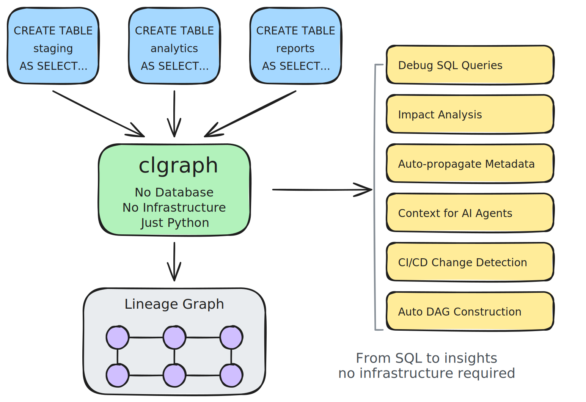

# clgraph

**clgraph** (Column-Lineage Graph) parses your SQL queries and automatically builds the column lineage graph, capturing all relationships across your pipeline to support SQL-related workflows—from impact analysis to AI context engineering.

No database required. No infrastructure to maintain. Just your queries and Python.



The column lineage graph captures how data flows through your SQL: every column is a node, every transformation is an edge. Once you have this graph, a lot of SQL-related tasks become simple traversals:

- **Impact analysis?** Forward trace through the graph.
- **Root cause debugging?** Backward trace through the graph.
- **PII compliance?** Mark nodes, propagate through edges.
- **DAG construction?** Project to table-level dependencies.
- **Documentation?** Describe nodes and their relationships.
- **AI applications?** Context engineering is graph traversal.

**One graph. Many applications.**

## Why We Built This

**Your SQL already contains everything.** Tables, columns, transformations, joins—it's all there in your code.

Traditional tools reverse-engineer lineage from query logs and database metadata, requiring expensive infrastructure. But when SQL is written with explicit column names and clear transformations (what we call "[lineage-friendly SQL](https://clgraph.dev/blog/writing-lineage-friendly-sql/)"), static analysis can build a *complete* lineage graph—without database access, without runtime integration, and without query logs.

**We parse it once. You get the complete graph.** It's a Python object you can traverse, query, and integrate however you want — powering tracing, impact analysis, metadata propagation, DAG construction, and more.

**Read more**:
- [Why We Built This (Full Story)](https://clgraph.dev/concepts/why-we-built-this/)
- [How to Write Lineage-Friendly SQL](https://clgraph.dev/blog/writing-lineage-friendly-sql/)

## Features

### Lineage Tracing
- **Trace column origins** — Find where any column comes from, through complex CTEs and subqueries
- **Impact analysis** — See what downstream columns are affected by changes
- **Cross-query lineage** — Track columns through entire pipelines, not just single queries

### Metadata & Governance
- **Auto-propagate metadata** — PII flags, ownership, and descriptions flow through lineage
- **Inline comment parsing** — Extract metadata from SQL comments (`-- description [pii: true]`)
- **LLM descriptions** — Generate natural language column descriptions with OpenAI, Ollama, etc.
- **Diff tracking** — Detect lineage changes between pipeline versions

### LLM-Powered Features
- **Lineage Agent** — Natural language interface to query lineage ("Where does revenue come from?")
- **Text-to-SQL** — Schema-aware SQL generation with column descriptions as context
- **Programmatic tools** — 11 built-in tools for lineage, schema, and governance queries

### Pipeline Execution
- **Run pipelines** — Execute queries in dependency order (async or sequential)
- **Airflow integration** — Generate Airflow DAGs from your pipeline
- **Template variables** — Handle parameterized SQL with `{{variable}}` syntax

### Export
- **JSON** — Machine-readable format with round-trip support
- **CSV** — Column and table metadata for spreadsheets
- **GraphViz** — DOT format for visualization

## Installation

```bash
pip install clgraph
```

Or with uv:
```bash
uv pip install clgraph
```

## Quick Start

### Single Query Column Lineage

```python
from clgraph import Pipeline

sql = """
WITH monthly_sales AS (
  SELECT
    user_id,
    DATE_TRUNC(order_date, MONTH) as month,
    SUM(amount) as total_amount
  FROM orders
  GROUP BY 1, 2
)
SELECT
  u.name,
  ms.month,
  ms.total_amount
FROM users u
JOIN monthly_sales ms ON u.id = ms.user_id
"""

# Pipeline works for single queries too
pipeline = Pipeline.from_sql_string(sql, dialect="bigquery")

# Get output columns from the query's lineage
query_lineage = pipeline.query_graphs["select"]
print(query_lineage)

# Get source tables
input_nodes = query_lineage.get_input_nodes()
source_tables = {node.table_name for node in input_nodes if node.table_name}
print("-"*60)
print(f"{len(source_tables)} source tables:")
for table in source_tables:
    print(f"  {table}")
```

**Output:**
```
ColumnLineageGraph(
  query_units=[cte:monthly_sales, main]
  nodes=[
  monthly_sales.month (layer=cte, type=expression)
  monthly_sales.total_amount (layer=cte, type=aggregate)
  monthly_sales.user_id (layer=cte, type=direct_column)
  orders.amount (layer=input, type=base_column)
  orders.order_date (layer=input, type=base_column)
  orders.user_id (layer=input, type=base_column)
  output.month (layer=output, type=direct_column)
  output.name (layer=output, type=direct_column)
  output.total_amount (layer=output, type=direct_column)
  users.name (layer=input, type=base_column)
  ]
  edges=[
  monthly_sales.month -> output.month (direct_column)
  monthly_sales.total_amount -> output.total_amount (direct_column)
  orders.amount -> monthly_sales.total_amount (aggregate)
  orders.order_date -> monthly_sales.month (expression)
  orders.user_id -> monthly_sales.user_id (direct_column)
  users.name -> output.name (direct_column)
  ]
)
------------------------------------------------------------
2 source tables:
  users
  orders
```

### Multi-Query Pipeline Lineage

```python
from clgraph import Pipeline

queries = [
    ("raw_events", """
        CREATE TABLE raw_events AS
        SELECT user_id, event_type, event_timestamp, session_id
        FROM source_events
        WHERE event_timestamp >= '2024-01-01'
    """),
    ("daily_active_users", """
        CREATE TABLE daily_active_users AS
        SELECT user_id, DATE(event_timestamp) as activity_date, COUNT(*) as event_count
        FROM raw_events
        GROUP BY user_id, DATE(event_timestamp)
    """),
    ("user_summary", """
        CREATE TABLE user_summary AS
        SELECT u.name, u.email, dau.activity_date, dau.event_count
        FROM users u
        JOIN daily_active_users dau ON u.id = dau.user_id
    """),
]

pipeline = Pipeline(queries, dialect="bigquery")

# Show pipeline structure with query units
print(pipeline)
print("-" * 60)

# Table execution order
execution_order = pipeline.table_graph.get_execution_order()
print(f"Execution order ({len(execution_order)} tables):")
for i, table in enumerate(execution_order, 1):
    print(f"  {i}. {table}")

print("-" * 60)

# Trace a column backward through the pipeline
sources = pipeline.trace_column_backward("user_summary", "event_count")
print(f"Backward lineage for user_summary.event_count ({len(sources)} sources):")
for source in sources:
    print(f"  {source}")

print("-" * 60)

# Forward lineage / Impact analysis
impacts = pipeline.trace_column_forward("source_events", "event_timestamp")
print(f"Forward lineage for source_events.event_timestamp ({len(impacts)} impacts):")
for impact in impacts:
    print(f"  {impact}")
```

**Output:**
```
Pipeline(
  raw_events: CREATE TABLE raw_events AS         SELECT user_id, event_...
    main
  daily_active_users: CREATE TABLE daily_active_users AS         SELECT user_id...
    main
  user_summary: CREATE TABLE user_summary AS         SELECT u.name, u.ema...
    main
)
------------------------------------------------------------
Execution order (5 tables):
  1. source_events
  2. users
  3. raw_events
  4. daily_active_users
  5. user_summary
------------------------------------------------------------
Backward lineage for user_summary.event_count (4 sources):
  ColumnNode('source_events.user_id')
  ColumnNode('source_events.event_type')
  ColumnNode('source_events.event_timestamp')
  ColumnNode('source_events.session_id')
------------------------------------------------------------
Forward lineage for source_events.event_timestamp (2 impacts):
  ColumnNode('user_summary.activity_date')
  ColumnNode('user_summary.event_count')
```

### Metadata from SQL Comments

```python
from clgraph import Pipeline

sql = """
SELECT
  user_id,  -- User identifier [pii: false]
  email,    -- Email address [pii: true, owner: data-team]
  COUNT(*) as login_count  -- Number of logins [tags: metric engagement]
FROM user_activity
GROUP BY user_id, email
"""

pipeline = Pipeline.from_sql_string(sql, dialect="bigquery")

# Metadata is automatically extracted from comments
print(f"Total columns: {len(pipeline.columns)}")
print("-" * 60)

pii_columns = [col for col in pipeline.columns.values() if col.pii]
print(f"PII columns ({len(pii_columns)}):")
for col in pii_columns:
    print(f"  {col.full_name}")
    if col.owner:
        print(f"    Owner: {col.owner}")
    if col.tags:
        print(f"    Tags: {', '.join(col.tags)}")

print("-" * 60)

# Show all column metadata
for col in pipeline.columns.values():
    if col.sql_metadata:
        print(f"{col.full_name}:")
        if col.sql_metadata.description:
            print(f"  Description: {col.sql_metadata.description}")
        if col.sql_metadata.pii is not None:
            print(f"  PII: {col.sql_metadata.pii}")
```

**Output:**
```
Total columns: 5
------------------------------------------------------------
PII columns (1):
  select_result.email
    Owner: data-team
------------------------------------------------------------
```

### Metadata Management and Export

```python
from clgraph import Pipeline, JSONExporter, CSVExporter, visualize_pipeline_lineage

# Build pipeline
queries = [
    ("raw.orders", """
        CREATE TABLE raw.orders AS
        SELECT order_id, user_email, amount, order_date
        FROM source.orders
    """),
    ("analytics.revenue", """
        CREATE TABLE analytics.revenue AS
        SELECT user_email, SUM(amount) as total_revenue
        FROM raw.orders
        GROUP BY user_email
    """),
]

pipeline = Pipeline(queries, dialect="bigquery")

# Set source metadata
for col in pipeline.columns.values():
    if col.table_name == "raw.orders" and col.column_name == "user_email":
        col.set_source_description("Customer email address")
        col.owner = "data-team"
        col.pii = True
        col.tags = {"contact", "sensitive"}

# Propagate metadata through lineage
pipeline.propagate_all_metadata()

# Find all PII columns
pii_columns = pipeline.get_pii_columns()
print(f"Found {len(pii_columns)} PII columns:")
for col in pii_columns:
    print(f"  {col}")
    if col.owner:
        print(f"    Owner: {col.owner}")
    if col.tags:
        print(f"    Tags: {', '.join(col.tags)}")

print("-" * 60)

# Export to different formats
print("Exporting to multiple formats...")
JSONExporter.export_to_file(pipeline, "lineage.json")
CSVExporter.export_columns_to_file(pipeline, "columns.csv")
# Visualize lineage graph (returns graphviz.Digraph)
dot = visualize_pipeline_lineage(pipeline.column_graph)
# Save DOT source to file (can be rendered with `dot -Tpng lineage.dot -o lineage.png`)
with open("lineage.dot", "w") as f:
    f.write(dot.source)
print("✓ Exported to lineage.json, columns.csv, lineage.dot")
```

**Output:**
```
📊 Propagating metadata for 6 columns...
✅ Done! Propagated metadata for 6 columns
Found 2 PII columns:
  ColumnNode('raw.orders.user_email')
    Owner: data-team
    Tags: contact, sensitive
  ColumnNode('analytics.revenue.user_email')
    Owner: data-team
    Tags: contact, sensitive
------------------------------------------------------------
Exporting to multiple formats...
✓ Exported to lineage.json, columns.csv, lineage.dot
```

### JSON Serialization (Save & Load Pipelines)

Save pipelines to JSON and reload them later - useful for caching, sharing, or storing analyzed results:

```python
from clgraph import Pipeline
from clgraph.export import JSONExporter
import json

# Build pipeline
queries = [
    ("staging", "CREATE TABLE staging.orders AS SELECT id, amount FROM raw.orders"),
    ("analytics", "CREATE TABLE analytics.totals AS SELECT SUM(amount) as total FROM staging.orders"),
]
pipeline = Pipeline.from_tuples(queries, dialect="bigquery")

# Add metadata
col = pipeline.get_column("raw.orders", "amount")
if col:
    col.description = "Order amount in USD"
    col.pii = False

# Export to JSON (includes queries for round-trip)
data = JSONExporter.export(pipeline, include_queries=True)

# Save to file
with open("pipeline.json", "w") as f:
    json.dump(data, f, indent=2)

# Later, reload the pipeline
with open("pipeline.json") as f:
    data = json.load(f)

restored = Pipeline.from_json(data)

# Or use the convenience method
restored = Pipeline.from_json_file("pipeline.json")

# Verify round-trip preserved structure and metadata
print(f"Columns: {len(restored.columns)}")
print(f"Edges: {len(restored.edges)}")
col = restored.get_column("raw.orders", "amount")
if col:
    print(f"Metadata preserved: {col.description}")
```

**Output:**
```
Columns: 5
Edges: 3
Metadata preserved: Order amount in USD
```

### LLM-Powered Description Generation

<!-- skip-test -->
```python
from clgraph import Pipeline
from langchain_ollama import ChatOllama

# Build pipeline
queries = [
    ("raw.orders", """
        CREATE TABLE raw.orders AS
        SELECT order_id, user_email, amount, order_date
        FROM source.orders
    """),
    ("analytics.revenue", """
        CREATE TABLE analytics.revenue AS
        SELECT user_email, SUM(amount) as total_revenue
        FROM raw.orders
        GROUP BY user_email
    """),
]

pipeline = Pipeline(queries, dialect="bigquery")

# Configure LLM (Ollama - free, local), or replace to any LangChain Chat models.
llm = ChatOllama(model="qwen3-coder:30b", temperature=0.3)
pipeline.llm = llm

# Generate descriptions for all columns
print(f"Generating descriptions for {len(pipeline.columns)} columns...")
pipeline.generate_all_descriptions(verbose=True)

print("-" * 60)

# View generated descriptions
columns_with_descriptions = [
    col for col in pipeline.columns.values() if col.description
]
print(f"Generated descriptions for {len(columns_with_descriptions)} columns:")
for col in columns_with_descriptions:
    print(f"  {col.full_name}:")
    print(f"    {col.description}")
```

**Output:**
```
Generating descriptions for 12 columns...
📊 Generating descriptions for 8 columns...
✅ Done! Generated 8 descriptions
------------------------------------------------------------
Generated descriptions for 8 columns:
  raw.orders:raw.orders.order_id:
    Unique identifier for each customer order placed in the system per order record.
  raw.orders:raw.orders.user_email:
    User email addresses from the orders table, one per order record.
  raw.orders:raw.orders.amount:
    Order total amount in USD per customer.
  raw.orders:raw.orders.order_date:
    Order date when customers placed their purchases per day.
  analytics.revenue:analytics.revenue.user_email:
    User email addresses from order records, one per order entry.
  analytics.revenue:raw.orders.user_email:
    User email addresses from order records, one per order entry.
  analytics.revenue:analytics.revenue.total_revenue:
    Total revenue aggregated per customer from order amounts in USD.
  analytics.revenue:raw.orders.amount:
    Order total amount in USD per customer from raw orders table.
```

### Lineage Agent (Natural Language Interface)

Query your lineage data using natural language. The agent automatically routes questions to appropriate tools. Most queries work without an LLM - only SQL generation requires one:

```python
from clgraph import Pipeline
from clgraph.agent import LineageAgent

# Build pipeline
queries = [
    ("staging.orders", """
        CREATE TABLE staging.orders AS
        SELECT order_id, customer_id, amount, order_date
        FROM raw.orders WHERE amount > 0
    """),
    ("analytics.revenue", """
        CREATE TABLE analytics.revenue AS
        SELECT customer_id, SUM(amount) as total_revenue, COUNT(*) as order_count
        FROM staging.orders
        GROUP BY customer_id
    """),
]
pipeline = Pipeline(queries, dialect="bigquery")

# Create agent (LLM is optional - most queries work without it)
agent = LineageAgent(pipeline)

# List tables
result = agent.query("What tables are available?")
print(f"Tool: {result.tool_used}")
print(f"Tables found: {len(result.data)}")

# Trace backward lineage
result = agent.query("Where does analytics.revenue.total_revenue come from?")
print(f"Tool: {result.tool_used}")
print(f"Sources: {len(result.data)} columns")

# Trace forward lineage (impact analysis)
result = agent.query("What depends on raw.orders.amount?")
print(f"Tool: {result.tool_used}")

# Search for columns
result = agent.query("Find columns named customer")
print(f"Tool: {result.tool_used}")
print(f"Found: {len(result.data)} matches")
```

**Output:**
```
Tool: list_tables
Tables found: 3
Tool: trace_backward
Sources: 1 columns
Tool: trace_forward
Tool: search_columns
Found: 2 matches
```

**Supported question types:**
- **Backward lineage**: "Where does X come from?", "What is the source of X?"
- **Forward lineage**: "What depends on X?", "What is the impact of changing X?"
- **Schema exploration**: "What tables exist?", "What columns does X have?"
- **Column search**: "Find columns named X", "Search for columns like X"
- **Governance**: "Which columns contain PII?", "Who owns this table?"
- **SQL generation**: "Write SQL to get monthly revenue" (requires LLM)

### Text-to-SQL with Schema Context

Generate SQL queries with full awareness of your pipeline schema and column descriptions. The `GenerateSQLTool` automatically includes table schemas, column descriptions, and lineage context in the LLM prompt:

```python
from clgraph import Pipeline

# Build pipeline with column descriptions (from SQL comments)
queries = [
    ("customers", """
        CREATE TABLE analytics.customers AS
        SELECT
            customer_id,       -- Unique customer identifier
            email,             -- Customer email address [pii: true]
            signup_date,       -- Date customer signed up
            lifetime_value     -- Total revenue from this customer in USD
        FROM raw.customers
    """),
    ("orders", """
        CREATE TABLE analytics.orders AS
        SELECT
            order_id,          -- Unique order identifier
            customer_id,       -- Reference to customer
            amount,            -- Order amount in USD
            order_date         -- Date of order
        FROM raw.orders
    """),
]
pipeline = Pipeline(queries, dialect="bigquery")

# View the schema context available for text-to-SQL
print(f"Pipeline has {len(pipeline.table_graph.tables)} tables")
print(f"Total columns: {len(pipeline.columns)}")

# Column descriptions are automatically extracted from SQL comments
cols_with_desc = [c for c in pipeline.columns.values() if c.description]
print(f"Columns with descriptions: {len(cols_with_desc)}")
for col in cols_with_desc[:3]:  # Show first 3
    print(f"  {col.column_name}: {col.description}")
```

**Output:**
```
Pipeline has 4 tables
Total columns: 12
Columns with descriptions: 8
  customer_id: Unique customer identifier
  email: Customer email address
  signup_date: Date customer signed up
```

With an LLM configured, `GenerateSQLTool` generates SQL queries:

<!-- skip-test -->
```python
from clgraph.tools import GenerateSQLTool
from langchain_ollama import ChatOllama

# Configure LLM and create tool
llm = ChatOllama(model="llama3.1:8b")
sql_tool = GenerateSQLTool(pipeline, llm=llm)

# Generate SQL with schema awareness
result = sql_tool.run(question="Find top 10 customers by lifetime value")
print(result.data["sql"])
# SELECT customer_id, email, lifetime_value
# FROM analytics.customers
# ORDER BY lifetime_value DESC
# LIMIT 10
```

### Lineage Tools (Programmatic Access)

Use tools directly without the agent for programmatic access:

```python
from clgraph import Pipeline
from clgraph.tools import (
    TraceBackwardTool,
    TraceForwardTool,
    ListTablesTool,
    GetTableSchemaTool,
    SearchColumnsTool,
    FindPIIColumnsTool,
)

# Build pipeline
queries = [
    ("staging.orders", """
        CREATE TABLE staging.orders AS
        SELECT order_id, customer_email, amount FROM raw.orders
    """),
    ("analytics.revenue", """
        CREATE TABLE analytics.revenue AS
        SELECT customer_email, SUM(amount) as total FROM staging.orders GROUP BY 1
    """),
]
pipeline = Pipeline(queries, dialect="bigquery")

# List all tables
tool = ListTablesTool(pipeline)
result = tool.run()
print(f"Tables: {[t['name'] for t in result.data]}")

# Get table schema
tool = GetTableSchemaTool(pipeline)
result = tool.run(table="analytics.revenue")
print(f"Columns: {result.data['columns']}")

# Trace backward lineage
tool = TraceBackwardTool(pipeline)
result = tool.run(table="analytics.revenue", column="total")
print(f"Sources: {result.message}")

# Trace forward lineage (impact analysis)
tool = TraceForwardTool(pipeline)
result = tool.run(table="raw.orders", column="amount")
print(f"Impacts: {result.message}")

# Search columns
tool = SearchColumnsTool(pipeline)
result = tool.run(pattern="email")
print(f"Matches: {result.message}")

# Find PII columns
tool = FindPIIColumnsTool(pipeline)
result = tool.run()
print(f"PII columns: {result.message}")
```

**Output:**
```
Tables: ['raw.orders', 'staging.orders', 'analytics.revenue']
Columns: ['customer_email', 'total']
Sources: Column analytics.revenue.total is derived from: raw.orders.amount
Impacts: Column raw.orders.amount impacts: analytics.revenue.total
Matches: Found 2 columns matching 'email'
PII columns: No PII columns found
```

**Available tools:**
| Tool | Description |
|------|-------------|
| `TraceBackwardTool` | Trace column to its ultimate sources |
| `TraceForwardTool` | Find all columns impacted by a source column |
| `GetLineagePathTool` | Find lineage path between two columns |
| `ListTablesTool` | List all tables in the pipeline |
| `GetTableSchemaTool` | Get columns and metadata for a table |
| `SearchColumnsTool` | Search columns by name pattern |
| `GetExecutionOrderTool` | Get topologically sorted execution order |
| `FindPIIColumnsTool` | Find columns marked as PII |
| `GetOwnersTool` | Get ownership information for tables/columns |
| `GenerateSQLTool` | Generate SQL from natural language (requires LLM) |
| `ExplainQueryTool` | Explain what a SQL query does (requires LLM) |

## Architecture

> 📊 **[View the complete architecture diagram](clgraph-simple-diagram.md)** - A visual overview of the 4-stage flow from SQL input to applications.

### Conceptual Structure

clgraph analyzes SQL through a hierarchical decomposition:

1. **Pipeline** - A collection of SQL statements that together form a data pipeline
   - Example: Multiple CREATE TABLE statements that depend on each other
   - Represents the entire data transformation workflow

2. **SQL Statement** - Each statement can break into multiple query units
   - Example: A CREATE TABLE statement with CTEs contains multiple query units
   - Typically mutates or creates a database object (table, view, etc.)

3. **Query Unit** - A SELECT statement representing a table-like object
   - Can be a main query, CTE (Common Table Expression), or subquery
   - Represents a temporary or real table in the dependency graph
   - Each query unit reads from tables and produces columns

4. **Column Expressions** - Within each query unit, individual column definitions
   - Example: `SUM(amount) as total_revenue` is a column expression
   - Represents the transformation logic for a single output column
   - Tracks dependencies on input columns

This hierarchy allows clgraph to trace column lineage at any level: from pipeline-wide dependencies down to individual expression transformations.

## Pipeline Graph Objects

A `Pipeline` contains two graph structures for lineage analysis:

```python
from clgraph import Pipeline

# Sample pipeline for examples
queries = [
    ("raw.orders", "CREATE TABLE raw.orders AS SELECT id, amount FROM source.orders"),
    ("analytics.metrics", "CREATE TABLE analytics.metrics AS SELECT SUM(amount) as total FROM raw.orders"),
]
pipeline = Pipeline(queries, dialect="bigquery")

# Two graph objects available:
print(f"Table graph: {type(pipeline.table_graph).__name__}")
print(f"Column graph: {type(pipeline.column_graph).__name__}")
```

### Table Graph (`pipeline.table_graph`)

The `TableDependencyGraph` tracks table-level dependencies:

```python
from clgraph import Pipeline

queries = [
    ("raw.orders", "CREATE TABLE raw.orders AS SELECT id, amount FROM source.orders"),
    ("staging.orders", "CREATE TABLE staging.orders AS SELECT id, amount FROM raw.orders WHERE amount > 0"),
    ("analytics.metrics", "CREATE TABLE analytics.metrics AS SELECT SUM(amount) as total FROM staging.orders"),
]
pipeline = Pipeline(queries, dialect="bigquery")

# Access tables and queries
print(f"Tables: {list(pipeline.table_graph.tables.keys())}")
print(f"Queries: {list(pipeline.table_graph.queries.keys())}")

# Get source tables (external inputs, not created by any query)
source_tables = pipeline.table_graph.get_source_tables()
print(f"Source tables: {source_tables}")

# Get final tables (not read by any downstream query)
final_tables = pipeline.table_graph.get_final_tables()
print(f"Final tables: {final_tables}")

# Get query execution order (topologically sorted)
query_order = pipeline.table_graph.topological_sort()
print(f"Execution order: {list(query_order)}")
```

### Column Graph (`pipeline.column_graph`)

The `PipelineLineageGraph` tracks column-level lineage:

```python
from clgraph import Pipeline

queries = [
    ("raw.orders", "CREATE TABLE raw.orders AS SELECT id, amount FROM source.orders"),
    ("analytics.metrics", "CREATE TABLE analytics.metrics AS SELECT SUM(amount) as total FROM raw.orders"),
]
pipeline = Pipeline(queries, dialect="bigquery")

# Access columns and edges
print(f"Columns: {len(pipeline.column_graph.columns)}")
print(f"Edges: {len(pipeline.column_graph.edges)}")

# Backward compatible access (property aliases)
print(f"pipeline.columns == pipeline.column_graph.columns: {pipeline.columns == pipeline.column_graph.columns}")

# Get source columns (no incoming edges)
source_cols = pipeline.column_graph.get_source_columns()
print(f"Source columns: {len(source_cols)}")

# Get final columns (no outgoing edges)
final_cols = pipeline.column_graph.get_final_columns()
print(f"Final columns: {len(final_cols)}")
```

### Full Lineage Tracing

For complete lineage (not just direct dependencies), use Pipeline methods:

```python
from clgraph import Pipeline

queries = [
    ("raw.orders", "CREATE TABLE raw.orders AS SELECT id, amount FROM source.orders"),
    ("staging.orders", "CREATE TABLE staging.orders AS SELECT id, amount FROM raw.orders"),
    ("analytics.metrics", "CREATE TABLE analytics.metrics AS SELECT SUM(amount) as total FROM staging.orders"),
]
pipeline = Pipeline(queries, dialect="bigquery")

# Trace backward to ultimate sources (recursive)
sources = pipeline.trace_column_backward("analytics.metrics", "total")
print(f"Sources of analytics.metrics.total: {[s.full_name for s in sources]}")

# Trace forward to all impacts (recursive)
impacts = pipeline.trace_column_forward("raw.orders", "amount")
print(f"Impacts of raw.orders.amount: {[i.full_name for i in impacts]}")

# Find specific lineage path between two columns (returns edges)
path = pipeline.get_lineage_path(
    "raw.orders", "amount",
    "analytics.metrics", "total"
)
if path:
    print(f"Path has {len(path)} edges")
    for edge in path:
        print(f"  {edge.from_node.full_name} -> {edge.to_node.full_name}")
```

## Supported SQL Dialects

Built on [sqlglot](https://github.com/tobymao/sqlglot), supporting:
- BigQuery
- PostgreSQL
- MySQL
- Snowflake
- Redshift
- DuckDB
- ClickHouse
- And many more

Specify dialect when creating a pipeline:

```python
from clgraph import Pipeline, SQLColumnTracer

# Single query with dialect
sql = "SELECT id, amount FROM orders"
tracer = SQLColumnTracer(sql, dialect="postgres")
print(f"Dialect: postgres, Columns: {tracer.get_column_names()}")

# Pipeline with dialect
queries = [("staging", "CREATE TABLE staging AS SELECT * FROM raw")]
pipeline = Pipeline(queries, dialect="snowflake")
print(f"Dialect: snowflake, Tables: {list(pipeline.table_graph.tables.keys())}")
```

## Use Cases

- **Data Governance**: Track data lineage for compliance and auditing
- **Impact Analysis**: Understand downstream effects of schema changes
- **PII Tracking**: Automatically identify and propagate PII flags through pipelines
- **Pipeline Optimization**: Identify unused columns and redundant transformations
- **Data Quality**: Trace data issues back to their source
- **Documentation**: Auto-generate data flow diagrams and column descriptions

## Development

```bash
# Clone the repository
git clone https://github.com/mingjerli/clgraph.git
cd clgraph

# Install dependencies with uv
uv pip install -e ".[dev]"

# Run tests
pytest

# Run linting
ruff check src/ tests/
ruff format src/ tests/
```

## License

MIT License - see LICENSE file for details.

## Contributing

Contributions welcome! Please read CONTRIBUTING.md for guidelines.

## Credits

Built with:
- [sqlglot](https://github.com/tobymao/sqlglot) - SQL parsing and transpilation
- [LangChain](https://github.com/langchain-ai/langchain) - LLM integration
- Python's `graphlib` - Topological sorting for dependency resolution
