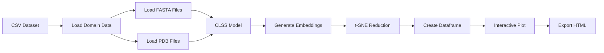

# CLSS Interactive Protein Domain Map

An interactive visualization tool for exploring protein domains through multi-modal embeddings using the CLSS (Contrastive Learning of Sequence and Structure) model.

## Overview

This application creates an interactive 2D visualization of protein domains by:

1. **Processing Multi-Modal Data**: Reading protein sequences (FASTA) and structures (PDB) 
2. **AI-Powered Embeddings**: Using the CLSS model to generate unified embeddings for both sequences and structures
3. **Dimensionality Reduction**: Applying t-SNE to project high-dimensional embeddings to 2D space
4. **Interactive Visualization**: Creating a Plotly/Dash scatter plot where users can explore domain relationships

## Features

- 📊 **Multi-modal visualization** - sequences and structures in the same embedding space
- 🎨 **Custom color mapping** - use hex colors with meaningful legend labels
- 🔍 **Custom marker shapes** - specify marker shapes per data point using a column (circle, square, diamond, star, etc.)
- 🖌️ **Advanced marker styling** - customize border width, border color, and transparency per marker
- 🔗 **Click-to-highlight pairings** - interactively highlight related points via CSV pairings
- 🖱️ **Interactive controls** - scrollwheel zoom, pan, hover tooltips
- 📱 **Full-screen experience** - visualization fills entire browser window
- 💾 **Smart caching** - avoids recomputing expensive operations
- 📄 **Standalone HTML export** - self-contained interactive visualizations

## Pipeline Overview



## Usage

### Example Commands

#### 1. Minimal Example (Required Arguments Only)

```bash
python app.py \
    --dataset-path domains.csv \
    --id-column domain_id \
    --label-column fold_class \
    --fasta-path-column fasta_file \
    --html-output-path output.html
```

This loads sequences from FASTA files and creates a basic visualization with default colors.

#### 2. With Custom Colors

```bash
python app.py \
    --dataset-path domains.csv \
    --id-column domain_id \
    --label-column fold_class \
    --fasta-path-column fasta_file \
    --html-output-path output.html \
    --hex-color-column custom_color
```

Uses hex color codes from the CSV to color points, while keeping label names in the legend.

#### 3. With Custom Shapes and Styling

```bash
python app.py \
    --dataset-path domains.csv \
    --id-column domain_id \
    --label-column fold_class \
    --fasta-path-column fasta_file \
    --html-output-path output.html \
    --hex-color-column custom_color \
    --marker-shape-column marker_shape \
    --line-width-column border_width \
    --line-color-column border_color \
    --alpha-column transparency
```

Fully customized markers with individual shapes, border styles, and transparency.

#### 4. Multi-Modal with All Features

```bash
python app.py \
    --dataset-path datasets/ecod_domains.csv \
    --id-column domain_id \
    --label-column architecture \
    --fasta-path-column sequence_path \
    --pdb-path-column structure_path \
    --html-output-path visualization.html \
    --hex-color-column custom_color \
    --marker-shape-column marker_shape \
    --line-width-column border_width \
    --line-color-column border_color \
    --alpha-column transparency \
    --hover-columns resolution b_factor method \
    --pairings-csv relationships.csv \
    --tsne-perplexity 50 \
    --tsne-max-iterations 1000 \
    --cache-path ./cache
```

Complete multi-modal analysis with sequences from FASTA, structures from PDB, custom styling, additional hover data, click-to-highlight pairings, and caching enabled.

### CLI Arguments

| Argument | Required | Default | Description |
|----------|----------|---------|-------------|
| `--dataset-path` | ✅ | - | Path to CSV file with domain data |
| `--id-column` | ✅ | - | Column name for domain IDs |
| `--label-column` | ✅ | - | Column name for labels (determines colors) |
| `--html-output-path` | ✅ | - | Path to output HTML file |
| `--fasta-path-column` | * | - | Column name for FASTA file paths |
| `--pdb-path-column` | * | - | Column name for PDB file paths |
| `--model-repo` | ❌ | `guyyanai/CLSS` | HuggingFace model repository |
| `--model-filename` | ❌ | `h32_r10.lckpt` | Model checkpoint filename |
| `--tsne-perplexity` | ❌ | 30 | t-SNE perplexity parameter |
| `--tsne-max-iterations` | ❌ | 1000 | Maximum t-SNE iterations |
| `--tsne-random-state` | ❌ | 0 | Random state for reproducibility |
| `--hex-color-column` | ❌ | - | Column with hex color codes for custom colors |
| `--line-width-column` | ❌ | - | Column with numeric values for marker border widths |
| `--line-color-column` | ❌ | - | Column with color values for marker border colors |
| `--alpha-column` | ❌ | - | Column with opacity values (0-1) for marker transparency |
| `--hover-columns` | ❌ | - | List of additional columns to include in hover tooltips |
| `--marker-shape-column` | ❌ | - | Column with marker shape values (see valid shapes below). If not provided, all points are circles |
| `--exclude-structures` | ❌ | False | Exclude structure data if PDB column is provided |
| `--use-pdb-sequences` | ❌ | False | Extract sequences from PDB files instead of FASTA |
| `--use-record-id` | ❌ | False | Use domain ID as FASTA record ID when loading |
| `--cache-path` | ❌ | - | Directory for caching intermediate results |
| `--pairings-csv` | ❌ | - | CSV file with ID pairings for click-to-highlight feature |

**Requirements:**
- At least one of `--fasta-path-column` or `--pdb-path-column` must be provided
- If `--use-pdb-sequences` is set, `--pdb-path-column` must be provided

## Input Data Format

### CSV Dataset Structure

Your input CSV must contain certain required columns and can optionally include additional columns for customization.

#### CSV Column Requirements

| Column Type | Requirement Status | CLI Argument | Purpose | Example Values | Notes |
|------------|-------------------|--------------|---------|----------------|-------|
| **ID Column** | Required | `--id-column` | Unique identifier for each domain | `d1a00a_`, `PF00001` | Any column name; must contain unique values |
| **Label Column** | Required | `--label-column` | Category/class for grouping and coloring | `alpha/beta`, `kinase`, `rossmann fold` | Used for default colors and legend labels |
| **FASTA Path Column** | Conditional* | `--fasta-path-column` | File paths to FASTA sequence files | `/path/to/seq.fasta`, `./data/d1a00a_.fa` | At least one of FASTA or PDB column required |
| **PDB Path Column** | Conditional* | `--pdb-path-column` | File paths to PDB structure files | `/path/to/struct.pdb`, `./pdbs/1a00.pdb` | At least one of FASTA or PDB column required |
| **Hex Color Column** | Optional | `--hex-color-column` | Custom hex color codes for points | `#FF5733`, `#33C3FF`, `#9B59B6` | Overrides default colors; legend still shows label names |
| **Line Width Column** | Optional | `--line-width-column` | Marker border widths (numeric) | `0`, `2`, `5.5` | Default is 0 (no border) if not specified |
| **Line Color Column** | Optional | `--line-color-column` | Marker border colors | `black`, `#000000`, `rgba(0,0,0,0.5)` | Only visible if line width > 0 |
| **Alpha Column** | Optional | `--alpha-column` | Marker opacity/transparency | `0.3`, `0.8`, `1.0` | Values should be 0-1; default is 1.0 (opaque) |
| **Marker Shape Column** | Optional | `--marker-shape-column` | Plotly marker shapes per point | `circle`, `square`, `diamond`, `star` | Must be valid Plotly shapes; default is circle for all |
| **Hover Columns** | Optional | `--hover-columns` | Additional data to show in tooltips | Any column(s) | Space-separated list of column names |

**\* Conditional Requirements:**
- At least one of `--fasta-path-column` OR `--pdb-path-column` must be provided
- If `--use-pdb-sequences` is set, then `--pdb-path-column` is required
- Both columns can be provided simultaneously for multi-modal analysis

**Important:** All columns specified via CLI arguments (including optional ones) must exist in the CSV, or a validation error will be raised.

#### Example CSV Formats

**Minimal CSV (sequences only):**
```csv
domain_id,fold_class,fasta_file
d1a00a_,alpha/beta,/path/to/d1a00a_.fasta
d1a01a_,alpha,/path/to/d1a01a_.fasta
d1a02a_,beta,/path/to/d1a02a_.fasta
```

**CSV with custom styling:**
```csv
domain_id,architecture,fasta_file,pdb_file,hex_color,shape,border_width,border_color,opacity
d1a00a_,TIM barrel,seq1.fasta,str1.pdb,#FF5733,circle,2,black,0.8
d1a01a_,Rossmann,seq2.fasta,str2.pdb,#33C3FF,square,1.5,#666666,1.0
d1a02a_,beta-propeller,seq3.fasta,str3.pdb,#FF33C3,diamond,3,red,0.6
```

### File Path Loading Modes

The tool supports multiple modes for loading sequence and structure data, depending on which file path columns you provide and which flags you set.

| Mode | Required Arguments | What Gets Loaded | When to Use |
|------|-------------------|------------------|-------------|
| **FASTA-only** | `--fasta-path-column` | Sequences from FASTA files | When you only have sequence data or want sequence embeddings only |
| **PDB-only (sequences)** | `--pdb-path-column` + `--use-pdb-sequences` | Sequences extracted from PDB files; structures loaded from same PDB files | When PDB files contain all needed sequence information |
| **Mixed/Dual-modal** | `--fasta-path-column` + `--pdb-path-column` | Sequences from FASTA files; structures from PDB files | Standard multi-modal analysis with separate sequence and structure files |
| **Hybrid (no structures)** | `--fasta-path-column` + `--pdb-path-column` + `--exclude-structures` | Sequences from both FASTA and PDB files; no structure embeddings | When you want to use PDB sequence data but skip structure processing |

**Notes:**
- Structure embeddings are only generated if `--pdb-path-column` is provided AND `--exclude-structures` is NOT set
- Each domain can have both sequence and structure embeddings (shown as separate points in the visualization)
- Missing file paths (empty cells) are handled gracefully - that domain will have only the available modality

### Valid Marker Shapes

When using `--marker-shape-column`, the column must contain valid Plotly marker shape strings. Here are the most common options:

**Basic Shapes:**
- `circle`, `square`, `diamond`, `cross`, `x`
- `triangle-up`, `triangle-down`, `triangle-left`, `triangle-right`
- `pentagon`, `hexagon`, `octagon`, `star`, `hexagram`

**Shape Variations:**
- Add `-open` suffix for hollow shapes: `circle-open`, `square-open`, `diamond-open`
- Add `-dot` suffix for shapes with center dots: `circle-dot`, `square-dot`
- Combine both: `circle-open-dot`, `square-open-dot`

**Advanced Shapes:**
- Star variations: `star-triangle-up`, `star-square`, `star-diamond`
- Diamond variations: `diamond-tall`, `diamond-wide`
- Special: `hourglass`, `bowtie`, `asterisk`, `hash`, `y-up`, `y-down`
- Lines: `line-ew` (east-west), `line-ns` (north-south), `line-ne`, `line-nw`

For a complete list of ~150 supported shapes, see the [Plotly symbol reference](https://plotly.com/python/marker-style/).

### Pairings CSV Format (Optional)

To enable the **click-to-highlight feature**, provide a CSV file with exactly 2 columns (no headers):

```csv
source_id_1,target_id_1
source_id_1,target_id_2
source_id_2,target_id_3
source_id_2,target_id_4
source_id_2,target_id_5
```

**Pairings Specification:**
- **Column 1**: Source ID - when a point with this ID is clicked, its targets will be highlighted
- **Column 2**: Target ID - these points will be highlighted when their source is clicked
- **Directionality**: Pairings are unidirectional (source → targets only)
- **Multi-modality**: If a domain has both sequence and structure points, clicking either one highlights all targets
- **Visual Effect**: Highlighted targets receive a bright cyan (#00FFFF) border with width 10.0 and increased marker size (12.0)

**Example Usage:**
```bash
python app.py \
    --dataset-path domains.csv \
    --id-column domain_id \
    --label-column architecture \
    --pdb-path-column pdb_file \
    --html-output-path output.html \
    --pairings-csv relationships.csv
```

### File Requirements

- **FASTA files**: Standard protein sequence format
  - Can contain single or multiple sequences
  - If `--use-record-id` is set, the tool looks for a specific record ID matching the domain ID
  - Otherwise, uses the first sequence in the file
- **PDB files**: Standard Protein Data Bank format
  - Used for both structure coordinates and sequence extraction (if `--use-pdb-sequences` is set)
- **Paths**: Can be relative or absolute paths to the files

### Sequence Loading Options

1. **FASTA-only mode**: Use `--fasta-path-column` to load sequences from FASTA files
2. **PDB-only mode**: Use `--pdb-path-column` with `--use-pdb-sequences` to extract sequences from PDB files
3. **Mixed mode**: Provide both `--fasta-path-column` and `--pdb-path-column` for dual-modality analysis

## Data Validation & Error Handling

The tool performs validation at multiple stages and handles errors gracefully to allow partial dataset processing.

### CSV Column Validation

**Strict Validation:**
- All columns specified via CLI arguments must exist in the CSV file
- Missing columns will raise a `ValueError` immediately
- This includes optional styling columns (e.g., if you specify `--hex-color-column custom_color`, the CSV must have a `custom_color` column)

**Example Error:**
```
ValueError: Column 'custom_color' not found in dataset
```

### Marker Shape Validation

**Strict Validation:**
- When `--marker-shape-column` is provided, all shape values are validated against 41+ valid Plotly marker shapes
- Invalid shapes will raise a `ValueError` with a list of invalid values found
- Valid shapes include: `circle`, `square`, `diamond`, `star`, `triangle-up`, etc. (see Valid Marker Shapes section)

**Other Style Columns (No Validation):**
- Hex color values (`--hex-color-column`): Not validated - invalid hex codes may cause Plotly rendering errors
- Line widths (`--line-width-column`): Expected to be numeric but not validated
- Alpha values (`--alpha-column`): Expected to be 0-1 but not validated
- Line colors (`--line-color-column`): Not validated

### File Path Error Handling

**Graceful Degradation:**
- Missing or invalid file paths in individual rows are handled gracefully
- The tool logs an error message and continues processing
- That domain will have `None` for the failed modality (e.g., no sequence embedding if FASTA file is missing)
- Allows partial datasets where some domains have incomplete data

**Example Behavior:**
```
Error loading /path/to/missing.fasta: File not found
Continuing with remaining domains...
```

### Pairings Validation

**Warning System:**
- Invalid source or target IDs (not found in dataset) trigger warnings
- Tool prints up to 10 invalid source IDs and 10 invalid target IDs
- Continues processing with only valid pairings
- Provides statistics on valid vs. invalid pairings

**CSV Format Validation:**
- Pairings CSV must have exactly 2 columns
- Raises `ValueError` if format is incorrect

### Hover Data

**Always-Present Tooltip Fields:**

Regardless of the `--hover-columns` argument, these fields are always included in hover tooltips:
- **ID column** (e.g., `domain_id`): The unique identifier
- **Label column** (e.g., `architecture`): The category/class label  
- **Modality**: Either "sequence" or "structure"

Additional columns specified via `--hover-columns` are appended to this base set.

## Output

The application generates a complete interactive visualization:

### Interactive HTML Visualization
- **Full-screen display**: Automatically fills the entire browser window
- **Scatter plot**: Each point represents a domain-modality pair in t-SNE space
- **Custom colors**: Points colored using hex values from your color column
- **Per-marker styling**: Individual customization of border width, border color, and transparency for each marker
- **Custom marker shapes**: Specify shapes per data point using the marker shape column
- **Meaningful legends**: Legend shows label names, not hex codes
- **Interactive controls**:
  - 🖱️ Scrollwheel to zoom in/out
  - 🖱️ Click and drag to pan
  - 🖱️ Double-click to reset view
  - 🖱️ Click on source points to highlight paired targets (if pairings CSV provided)
  - 📱 Hover for detailed domain information:
    - Always shown: domain ID, label, and modality (sequence/structure)
    - Additional fields from `--hover-columns` if specified
    - Marker shape column (if provided) is automatically included
- **Export options**: Download plot as high-resolution PNG

### Cached Data
Intermediate results stored for faster re-runs (if `--cache-path` specified):
- `sequences.pkl`: Parsed sequences from FASTA/PDB files
- `structures.pkl`: Loaded protein structure coordinates
- `sequence_embeddings.pkl`: CLSS model sequence embeddings
- `structure_embeddings.pkl`: CLSS model structure embeddings
- `reduced_embeddings.pkl`: t-SNE 2D coordinates

## Performance & Caching

### Caching Strategy

The tool implements multi-level caching to avoid expensive recomputation:

1. **Sequence Loading**: Cached parsed FASTA sequences
2. **Structure Loading**: Cached parsed PDB structures  
3. **Embeddings**: Cached CLSS model outputs
4. **Dimensionality Reduction**: Cached t-SNE results

## Architecture

### Component Overview

- **`args.py`**: CLI argument parsing with type safety
- **`dataset.py`**: Data loading and preprocessing functions
- **`embeddings.py`**: CLSS model loading and embedding generation
- **`dim_reducer.py`**: t-SNE dimensionality reduction
- **`mapper.py`**: Interactive Plotly visualization creation and HTML export
- **`utils.py`**: Utility functions and caching helpers
- **`app.py`**: Main application orchestrator

### Data Flow

1. **Dataset Loading**: Parse CSV and validate required columns exist
2. **Cache Setup**: Create cache paths for intermediate results (if specified)
3. **Sequence Loading**: Load sequences from FASTA files OR extract from PDB files
   - Supports FASTA record ID matching with domain IDs
   - Can extract sequences directly from PDB files
   - Handles missing files gracefully
4. **Structure Loading**: Load 3D coordinates from PDB files (if specified)
5. **Model Loading**: Initialize CLSS model from HuggingFace Hub and load ESM3 components
6. **Embedding Generation**: Process sequences and structures through CLSS model
   - Generates 32-dimensional embeddings for each modality
   - Handles missing sequences/structures gracefully
7. **Data Structuring**: Create unified dataframe with:
   - Domain IDs and labels
   - Modality information (sequence/structure)
   - High-dimensional embeddings
   - Optional custom colors
8. **Dimensionality Reduction**: Apply t-SNE to reduce embeddings to 2D coordinates
9. **Final Dataframe**: Create visualization-ready dataframe with x,y coordinates
10. **Interactive Visualization**: Generate full-screen Plotly scatter plot with:
    - Custom colors from hex color column (if provided)
    - Legend labels from label column
    - Shape coding for sequence vs structure modalities
    - Hover tooltips with domain information
    - Scrollwheel zoom and pan controls
11. **HTML Export**: Save as standalone, responsive HTML file


