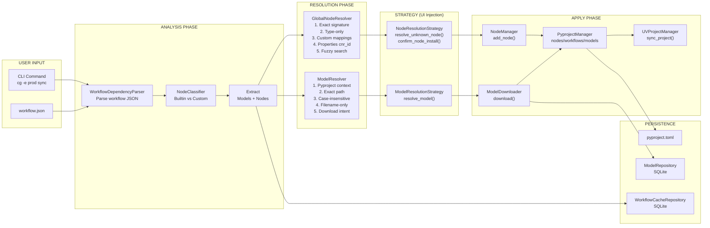

# ComfyGit Core Architecture - Deep Dive

> Comprehensive architectural analysis of the ComfyGit Core library, generated through extensive codebase exploration using pyast and deep file analysis.

## Table of Contents

- [High-Level Overview](#high-level-overview)
- [Layered Architecture Diagram](#layered-architecture-diagram)
- [Data Flow Diagram](#data-flow-diagram)
- [Module Hierarchy](#module-hierarchy)
- [Layer Details](#layer-details)
  - [Layer 1: Public API](#layer-1-public-api)
  - [Layer 2: Factories](#layer-2-factories)
  - [Layer 3: Managers](#layer-3-managers)
  - [Layer 4: Services](#layer-4-services)
  - [Layer 5: Analyzers & Resolvers](#layer-5-analyzers--resolvers)
  - [Layer 6: Repositories & Caching](#layer-6-repositories--caching)
  - [Layer 7: External Clients](#layer-7-external-clients)
  - [Layer 8: Infrastructure & Utils](#layer-8-infrastructure--utils)
  - [Layer 9: Type System](#layer-9-type-system)
- [Key Design Patterns](#key-design-patterns)
- [Resolution Pipeline](#resolution-pipeline)
- [Caching Strategy](#caching-strategy)

---

## High-Level Overview

ComfyGit Core is a **library-first Python package** providing environment management APIs for ComfyUI without UI coupling. All external interaction happens through callback protocols and strategy patterns.

**Key Capabilities:**
- Manage multiple isolated ComfyUI environments per workspace
- Automatically resolve workflow dependencies without user interaction
- Support interactive disambiguation through protocol injection
- Maintain reproducibility through pyproject.toml pinning
- Work across Windows, macOS, and Linux

---

## Layered Architecture Diagram

```mermaid
flowchart TB
    subgraph PublicAPI["PUBLIC API LAYER"]
        Workspace["Workspace<br/>• Multi-environment management<br/>• Shared models directory<br/>• Registry caching<br/>• Import/export framework"]
        Environment["Environment<br/>• Single ComfyUI instance<br/>• Git operations<br/>• Node/workflow/model ops<br/>• Dependency sync"]
    end

    subgraph Factories["FACTORIES (DI)"]
        WF["WorkspaceFactory<br/>@staticmethod find/create"]
        EF["EnvironmentFactory<br/>create/import_from_bundle/git"]
        UVF["UVFactory<br/>create_uv_for_environment"]
    end

    subgraph Orchestrators["ORCHESTRATOR MANAGERS"]
        EGO["EnvironmentGitOrchestrator<br/>Git ops + environment sync"]
        EMM["EnvironmentModelManager<br/>Model source coordination"]
        NM["NodeManager<br/>Install/remove/update nodes"]
        WM["WorkflowManager<br/>Analysis, resolution, sync"]
    end

    subgraph ConfigManagers["CONFIGURATION MANAGERS"]
        PM["PyprojectManager<br/>• DependencyHandler<br/>• NodeHandler<br/>• UVConfigHandler<br/>• WorkflowHandler<br/>• ModelHandler"]
        UVM["UVProjectManager<br/>UV commands + pyproject"]
        PBM["PyTorchBackendManager<br/>.pytorch-backend file"]
        GM["GitManager<br/>High-level git workflows"]
    end

    subgraph SymlinkManagers["SYMLINK MANAGERS"]
        MSM["ModelSymlinkManager<br/>ComfyUI/models → workspace"]
        UCSM["UserContentSymlinkManager<br/>input/output per-env"]
        SNSM["SystemNodeSymlinkManager<br/>Workspace nodes to env"]
    end

    subgraph Services["SERVICES LAYER"]
        NLS["NodeLookupService<br/>Registry + Git + cache"]
        RDM["RegistryDataManager<br/>Fetch + cache mappings"]
        MD["ModelDownloader<br/>Download + hash + index"]
        IA["ImportAnalyzer<br/>Preview imports"]
        RT["ResolutionTester<br/>Dependency conflict check"]
    end

    subgraph Analyzers["ANALYZERS"]
        WDP["WorkflowDependencyParser<br/>Extract models + nodes"]
        NC["NodeClassifier<br/>Builtin vs custom"]
        SS["StatusScanner<br/>Environment comparison"]
    end

    subgraph Resolvers["RESOLVERS"]
        GNR["GlobalNodeResolver<br/>Node → Package mapping<br/>Exact + Fuzzy + Scoring"]
        MR["ModelResolver<br/>Model ref → File/URL<br/>5-tier matching"]
    end

    subgraph Repositories["REPOSITORIES (Persistence)"]
        MRepo["ModelRepository<br/>SQLite model index"]
        NMRepo["NodeMappingsRepository<br/>Registry JSON facade"]
        WCRepo["WorkflowCacheRepository<br/>Smart cache + context hash"]
        WCfgRepo["WorkspaceConfigRepository<br/>Config storage"]
    end

    subgraph Caching["CACHING LAYER"]
        ACM["APICacheManager<br/>TTL-based JSON cache"]
        CNCM["CustomNodeCacheManager<br/>Node archives + metadata"]
        WC["WorkflowCache<br/>Dependencies + resolution"]
    end

    subgraph Clients["EXTERNAL CLIENTS"]
        CivitAI["CivitAIClient<br/>Model downloads/search"]
        Registry["ComfyRegistryClient<br/>Node registry API"]
        GitHub["GitHubClient<br/>Repo info/releases"]
    end

    subgraph Infrastructure["INFRASTRUCTURE"]
        SQLite["SQLiteManager<br/>Connection management"]
        UVCmd["UVCommand<br/>UV CLI wrapper"]
    end

    subgraph Utils["UTILITIES"]
        GitU["git.py - 45+ git functions"]
        FSU["filesystem.py - Cross-platform"]
        DLU["download.py - Archive handling"]
        RetryU["retry.py - Exponential backoff"]
        PyTorchU["pytorch.py - Backend detection"]
    end

    subgraph Strategies["STRATEGIES (Protocol Implementations)"]
        ANS["AutoNodeStrategy<br/>Non-interactive resolution"]
        AMS["AutoModelStrategy<br/>Auto-select first match"]
        ACS["AutoConfirmStrategy<br/>Always confirm"]
    end

    subgraph Models["DATA MODELS"]
        Protocols["Protocols<br/>NodeResolutionStrategy<br/>ModelResolutionStrategy<br/>SyncCallbacks<br/>ImportCallbacks"]
        DataClasses["Dataclasses<br/>NodeInfo, NodePackage<br/>ResolvedNodePackage<br/>ResolvedModel<br/>WorkflowDependencies<br/>ResolutionResult"]
        Exceptions["Exceptions<br/>CDNodeConflictError<br/>+NodeConflictContext<br/>CDDependencyConflictError<br/>+DownloadErrorContext"]
    end

    %% Connections - Public API to Factories
    WF --> Workspace
    EF --> Environment

    %% Workspace to its dependencies
    Workspace --> WCfgRepo
    Workspace --> RDM
    Workspace --> MRepo
    Workspace --> NMRepo
    Workspace --> MD
    Workspace --> IA

    %% Environment to Managers (cached_property)
    Environment --> EGO
    Environment --> EMM
    Environment --> NM
    Environment --> WM
    Environment --> PM
    Environment --> UVM
    Environment --> PBM
    Environment --> GM
    Environment --> MSM
    Environment --> UCSM
    Environment --> SNSM
    Environment --> NLS
    Environment --> RT
    Environment --> WCRepo

    %% Orchestrators to Config Managers
    EGO --> GM
    EGO --> NM
    EGO --> PM
    EGO --> UVM
    EGO --> WM
    EMM --> PM
    EMM --> MRepo
    EMM --> MD
    NM --> PM
    NM --> UVM
    NM --> NLS
    NM --> RT
    WM --> PM
    WM --> MRepo
    WM --> NMRepo
    WM --> MD
    WM --> WCRepo

    %% Services to lower layers
    NLS --> ACM
    NLS --> CNCM
    NLS --> Registry
    NLS --> GitHub
    RDM --> GitHub
    MD --> MRepo
    MD --> CivitAI

    %% Analyzers to Resolvers
    WDP --> NC
    WM --> WDP
    WM --> GNR
    WM --> MR

    %% Resolvers to Repositories
    GNR --> NMRepo
    MR --> MRepo

    %% Repositories to Infrastructure
    MRepo --> SQLite
    WCRepo --> SQLite

    %% Caching shared by clients
    ACM --> CivitAI
    ACM --> Registry
    ACM --> GitHub

    %% Config Managers to Infrastructure
    UVM --> UVCmd
    UVM --> PM

    %% Strategies implement Protocols
    Strategies --> Protocols

    %% All use Utils
    NM --> GitU
    GM --> GitU
    EF --> FSU
    MD --> DLU
    Clients --> RetryU
    EF --> PyTorchU
```



---

## Data Flow Diagram



---

## Module Hierarchy

```mermaid
flowchart TB
    subgraph L1["LAYER 1: Public API"]
        core_workspace["core/workspace.py"]
        core_environment["core/environment.py"]
    end

    subgraph L2["LAYER 2: Factories"]
        factories_workspace["factories/workspace_factory.py"]
        factories_env["factories/environment_factory.py"]
        factories_uv["factories/uv_factory.py"]
    end

    subgraph L3["LAYER 3: Managers (13 files)"]
        direction LR
        mgr_orchestrators["Orchestrators:<br/>environment_git_orchestrator<br/>environment_model_manager<br/>node_manager<br/>workflow_manager"]
        mgr_config["Config:<br/>pyproject_manager<br/>uv_project_manager<br/>pytorch_backend_manager<br/>git_manager"]
        mgr_symlink["Symlinks:<br/>model_symlink_manager<br/>user_content_symlink_manager<br/>system_node_symlink_manager"]
        mgr_other["Other:<br/>export_import_manager<br/>model_download_manager"]
    end

    subgraph L4["LAYER 4: Services"]
        svc["services/<br/>node_lookup_service<br/>registry_data_manager<br/>model_downloader<br/>import_analyzer"]
    end

    subgraph L5["LAYER 5: Analysis & Resolution"]
        analyzers["analyzers/<br/>workflow_dependency_parser<br/>node_classifier<br/>status_scanner<br/>+ 6 more"]
        resolvers["resolvers/<br/>global_node_resolver<br/>model_resolver"]
    end

    subgraph L6["LAYER 6: Data Access"]
        repos["repositories/<br/>model_repository<br/>node_mappings_repository<br/>workflow_cache_repository<br/>workspace_config_repository"]
        caching["caching/<br/>api_cache<br/>custom_node_cache<br/>workflow_cache<br/>base"]
    end

    subgraph L7["LAYER 7: External Integration"]
        clients["clients/<br/>civitai_client<br/>registry_client<br/>github_client"]
    end

    subgraph L8["LAYER 8: Infrastructure"]
        infra["infrastructure/<br/>sqlite_manager"]
        utils["utils/ (21 files)<br/>git, filesystem, download<br/>retry, version, pytorch<br/>symlink_utils, parsing..."]
    end

    subgraph L9["LAYER 9: Type System"]
        models["models/ (15 files)<br/>protocols, shared, exceptions<br/>workflow, environment, manifest<br/>node_mapping, ref_diff, sync..."]
        strategies["strategies/<br/>auto, confirmation"]
    end

    L1 --> L2
    L1 --> L3
    L2 --> L3
    L3 --> L4
    L3 --> L5
    L4 --> L5
    L4 --> L6
    L5 --> L6
    L6 --> L7
    L6 --> L8
    L7 --> L8
    L8 --> L9
    L3 --> L9
    L4 --> L9
    L5 --> L9
```



---

## Layer Details

### Layer 1: Public API

**Location:** `core/`

| Class | File | Responsibilities |
|-------|------|------------------|
| `Workspace` | workspace.py | Multi-environment management, shared models directory, registry caching, import/export framework |
| `Environment` | environment.py | Single ComfyUI instance management, git operations, node/workflow/model operations, dependency sync |

**Key Design:**
- Workspace owns multiple Environments
- All state managed through managers (no direct file manipulation)
- Callback protocols for UI interaction (no print/input)

---

### Layer 2: Factories

**Location:** `factories/`

| Factory | Purpose |
|---------|---------|
| `WorkspaceFactory` | Discover or create workspaces with all dependencies pre-configured |
| `EnvironmentFactory` | Create environments with multi-phase setup (PyTorch detection, ComfyUI install, git init) |
| `UVFactory` | Create UVProjectManager with workspace-level cache sharing |

**Pattern:** All methods are `@staticmethod` - functional factories with no mutable state.

---

### Layer 3: Managers

**Location:** `managers/` (13 files)

#### Orchestrator Managers
| Manager | Purpose |
|---------|---------|
| `EnvironmentGitOrchestrator` | Git operations + automatic environment sync (checkout, merge, reset) |
| `EnvironmentModelManager` | Model source coordination across pyproject and repository |
| `NodeManager` | Install/remove/update nodes with validation and conflict detection |
| `WorkflowManager` | Workflow analysis, resolution, file sync, caching |

#### Configuration Managers
| Manager | Purpose |
|---------|---------|
| `PyprojectManager` | All pyproject.toml operations via 5 handlers (deps, nodes, uv, workflows, models) |
| `UVProjectManager` | UV commands + pyproject coordination |
| `PyTorchBackendManager` | .pytorch-backend file management and config injection |
| `GitManager` | High-level git workflows (commit, pull, push, branch, merge) |

#### Symlink Managers
| Manager | Purpose |
|---------|---------|
| `ModelSymlinkManager` | ComfyUI/models → workspace/models symlink |
| `UserContentSymlinkManager` | Per-environment input/output directories |
| `SystemNodeSymlinkManager` | Workspace-level infrastructure nodes |

#### Other Managers
| Manager | Purpose |
|---------|---------|
| `ExportImportManager` | Environment bundling for portability |
| `ModelDownloadManager` | Model downloads from various sources |

---

### Layer 4: Services

**Location:** `services/`

| Service | Purpose |
|---------|---------|
| `NodeLookupService` | Registry + Git + cache lookups for node packages |
| `RegistryDataManager` | Fetch and cache global node mappings from GitHub |
| `ModelDownloader` | Download models with hashing and indexing |
| `ImportAnalyzer` | Preview import requirements without creating environment |

---

### Layer 5: Analyzers & Resolvers

**Location:** `analyzers/`, `resolvers/`

#### Analyzers
| Analyzer | Purpose |
|----------|---------|
| `WorkflowDependencyParser` | Extract model and node dependencies from workflow JSON |
| `NodeClassifier` | Classify nodes as builtin or custom |
| `StatusScanner` | Compare current vs expected environment state |

#### Resolvers
| Resolver | Purpose | Matching Strategy |
|----------|---------|-------------------|
| `GlobalNodeResolver` | Map unknown nodes to packages | 1. Exact signature → 2. Type-only → 3. Custom mappings → 4. Properties cnr_id → 5. Fuzzy search with scoring |
| `ModelResolver` | Map model references to files/URLs | 1. Pyproject context → 2. Exact path → 3. Case-insensitive → 4. Filename-only → 5. Download intent |

---

### Layer 6: Repositories & Caching

**Location:** `repositories/`, `caching/`

#### Repositories
| Repository | Storage | Purpose |
|------------|---------|---------|
| `ModelRepository` | SQLite | Model index with hash-based deduplication |
| `NodeMappingsRepository` | JSON | Registry mappings facade |
| `WorkflowCacheRepository` | SQLite | Smart workflow cache with context hashing |
| `WorkspaceConfigRepository` | JSON | Workspace configuration storage |

#### Caching
| Cache | Strategy | Purpose |
|-------|----------|---------|
| `APICacheManager` | TTL-based (24h) | API response caching |
| `CustomNodeCacheManager` | Content-hash | Node archive caching with integrity |
| `WorkflowCache` | Multi-phase | Dependencies + resolution caching |

---

### Layer 7: External Clients

**Location:** `clients/`

| Client | API | Features |
|--------|-----|----------|
| `CivitAIClient` | civitai.com/api/v1 | Model search/download, rate limiting (0.1s), retry with backoff |
| `ComfyRegistryClient` | ComfyUI registry | Node lookup/install, rate limiting (0.05s) |
| `GitHubClient` | api.github.com | Repo info, releases, version validation |

**Common Features:**
- Shared `APICacheManager` instance
- `@retry_on_rate_limit` decorator (3 retries, exponential backoff, jitter)
- Domain-specific exceptions with context

---

### Layer 8: Infrastructure & Utils

**Location:** `infrastructure/`, `utils/`

#### Infrastructure
| Module | Purpose |
|--------|---------|
| `SQLiteManager` | Connection management with row factory |
| `UVCommand` | UV CLI wrapper |

#### Key Utilities (21 files)
| Module | Purpose |
|--------|---------|
| `git.py` | 45+ git functions (clone, commit, branch, merge, etc.) |
| `filesystem.py` | Cross-platform file operations (Windows readonly handling) |
| `download.py` | Multi-format archive extraction |
| `retry.py` | Exponential backoff with jitter |
| `pytorch.py` | Backend detection and index URL resolution |
| `symlink_utils.py` | Unix symlinks vs Windows junctions |
| `version.py` | PEP 440 version parsing |

---

### Layer 9: Type System

**Location:** `models/`, `strategies/`

#### Protocols (UI Decoupling)
```python
class NodeResolutionStrategy(Protocol):
    def resolve_unknown_node(node_type, possible, context) -> ResolvedNodePackage | None
    def confirm_node_install(package) -> bool

class ModelResolutionStrategy(Protocol):
    def resolve_model(reference, candidates, context) -> ResolvedModel | None

class SyncCallbacks(Protocol):
    def on_dependency_group_start(group_name, is_optional) -> None
    def on_dependency_group_complete(group_name, success, error) -> None
```

#### Key Dataclasses
| Dataclass | Purpose |
|-----------|---------|
| `NodeInfo` | Complete node lifecycle representation |
| `NodePackage` | Node + requirements wrapper |
| `ResolvedNodePackage` | Potential match for unknown node with confidence |
| `ResolvedModel` | Potential match for model reference |
| `WorkflowDependencies` | Parsed workflow dependencies |
| `ResolutionResult` | Complete resolution check output |

#### Context-Rich Exceptions
```python
class CDNodeConflictError(ComfyDockError):
    context: NodeConflictContext  # Includes suggested_actions

class CDDependencyConflictError(ComfyDockError):
    context: DependencyConflictContext

class CDModelDownloadError(ComfyDockError):
    context: DownloadErrorContext
```

---

## Key Design Patterns

### 1. Protocol-First Design
All interactive behavior defined as `Protocol` classes. Core library has zero UI coupling.

```python
# Core defines the protocol
class NodeResolutionStrategy(Protocol):
    def resolve_unknown_node(...) -> ResolvedNodePackage | None

# CLI implements it
class InteractiveNodeStrategy(NodeResolutionStrategy):
    def resolve_unknown_node(...):
        # User prompts and selection logic
```

### 2. Cached Property DI Pattern
```python
class Environment:
    @cached_property
    def node_manager(self) -> NodeManager:
        return NodeManager(
            self.pyproject,      # From cached_property
            self.uv_manager,     # From cached_property
            self.node_lookup,    # From cached_property
            ...
        )
```

**Benefits:**
- Lazy initialization (dependencies created on first use)
- Automatic memoization
- Clean constructor (only essentials)
- Self-documenting (code shows dependencies)

### 3. Functional Factories
```python
class WorkspaceFactory:
    @staticmethod
    def find() -> Workspace:
        # Pure composition, no mutable state

    @staticmethod
    def create(path: Path) -> Workspace:
        # Returns fully configured instance
```

### 4. Error Context Pattern
```python
@dataclass
class NodeConflictContext:
    conflict_type: str
    node_name: str
    suggested_actions: list[NodeAction]

class CDNodeConflictError(ComfyDockError):
    def __init__(self, message: str, context: NodeConflictContext):
        self.context = context

    def get_actions(self) -> list[NodeAction]:
        return self.context.suggested_actions
```

### 5. Two-Tier Resolution
```
Priority 1: Exact match (signature, path, hash)
Priority 2: Fuzzy match (search, filename, case-insensitive)
```

Scoring considers: popularity, installed status, confidence, hints.

---

## Resolution Pipeline

### Complete Flow Example

When user runs `cg -e production sync workflow.json`:

```
1. CLI ROUTING
   EnvironmentCommands.sync_workflow(args)

2. WORKSPACE DISCOVERY
   get_workspace_or_exit() → finds .comfygit
   workspace.get_environment("production")

3. DEPENDENCY ANALYSIS
   WorkflowDependencyParser(workflow_path)
   ├─ WorkflowRepository.load(workflow.json)
   └─ analyze_dependencies() → WorkflowDependencies

4. NODE RESOLUTION
   GlobalNodeResolver.resolve_single_node_with_context()
   ├─ Try: Custom mappings (pyproject.toml)
   ├─ Try: node.properties.cnr_id
   ├─ Try: Exact signature match
   ├─ Try: Type-only match
   └─ Fallback: search_packages() (fuzzy + scoring)

5. MODEL RESOLUTION
   ModelResolver.resolve_reference()
   ├─ Try: Previous resolution from pyproject
   ├─ Try: Exact path match
   ├─ Try: Case-insensitive match
   ├─ Try: Filename-only match
   └─ Fallback: Download intent from property_url

6. INTERACTIVE RESOLUTION (if needed)
   Strategy.resolve_unknown_node() / resolve_model()
   User selects from scored candidates

7. APPLY & SYNC
   NodeManager.add_node(resolved_package)
   ModelDownloader.download(resolved_model)
   PyprojectManager.save()
   UVProjectManager.sync_project()

8. RETURN RESULTS
   List of installed nodes + downloaded models
```

---

## Caching Strategy

### Multi-Tier Cache Architecture

| Tier | Storage | Latency | Invalidation |
|------|---------|---------|--------------|
| Session cache | In-memory | ~1µs | mtime-keyed (auto) |
| Workflow cache | SQLite | ~7ms | Context hash + mtime |
| API cache | JSON | ~1ms | TTL (24h default) |
| Custom node cache | Directory | ~10ms | Content hash |

### Workflow Cache Context Hash

Includes only relevant context to minimize spurious invalidations:

1. Custom node mappings for nodes in THIS workflow
2. Declared packages version/repository/source
3. Model entries from pyproject for THIS workflow
4. Model index subset (only models workflow references)
5. Model sync timestamp (global invalidator)
6. Comfygit version (global invalidator)

### Cache Invalidation Triggers

| Trigger | Effect |
|---------|--------|
| Workflow file mtime/size change | Full re-analysis |
| Pyproject mtime change | Recompute context hash |
| Model index sync time change | Partial invalidation |
| Comfygit version mismatch | Re-resolution only |

---

## File Count Summary

| Directory | Files | Purpose |
|-----------|-------|---------|
| `core/` | 2 | Public API |
| `factories/` | 3 | Dependency injection |
| `managers/` | 13 | Business logic orchestration |
| `services/` | 4 | External service integration |
| `analyzers/` | 9 | Workflow/node/status analysis |
| `resolvers/` | 2 | Node and model resolution |
| `repositories/` | 5 | Data persistence |
| `caching/` | 6 | Performance optimization |
| `clients/` | 4 | External API clients |
| `infrastructure/` | 1 | Database infrastructure |
| `utils/` | 21 | Low-level utilities |
| `models/` | 15 | Type definitions |
| `strategies/` | 3 | Protocol implementations |
| **Total** | **~100** | |

---

*Generated: December 2024*
