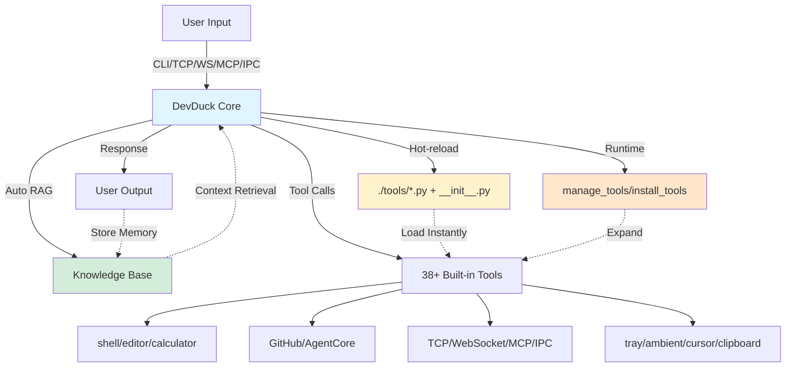

# 🦆 DevDuck

[](https://pypi.org/project/devduck/)

**Self-modifying AI agent that hot-reloads its own code—builds itself as it runs.**

One Python file that adapts to your environment, fixes itself, and expands capabilities at runtime.

Learn more: https://duck.nyc

## 🎬 See It In Action

| Feature | What You'll See | Demo |
|---------|----------------|-------|
| 🔥 **Hot-Reload** | Agent detects code changes and restarts instantly | [Watch](https://redduck.dev/videos/hot-reload.mp4) |
| 🌐 **Web UI** | Clean web interface with real-time streaming | [Watch](https://redduck.dev/videos/web-ui.mp4) |
| 🛠️ **Dynamic Tools** | Save `.py` file in `./tools/` → use instantly | [Watch](https://redduck.dev/videos/dynamic-tool-creation.mp4) |
| 🌊 **TCP Streaming** | Connect via netcat, apps, or other agents | [Watch](https://redduck.dev/videos/tcp.mp4) |
| 🔌 **IPC & Tray** | macOS menu bar + Unix socket IPC |  |
| 💬 **Ambient Overlay** | Floating AI input with glassmorphism UI | [Watch](https://redduck.dev/videos/floating-input.mp4) |

---

## Quick Start

```bash
# Install & run
pipx install devduck && devduck

# With speech-to-speech capabilities (optional)
pipx install "devduck[speech]" && devduck

# One-shot query
devduck "create a REST API with FastAPI"

# Python API
python -c "import devduck; devduck('analyze this code')"
```

**Requirements:** Python 3.10-3.13, AWS credentials (or Ollama/Anthropic/GitHub/MLX)

**Optional extras:**
- `devduck[speech]` - Real-time speech-to-speech conversations (Nova Sonic, OpenAI Realtime, Gemini Live)

---

## Core Capabilities

| Feature | What It Does | How to Use |
|---------|--------------|------------|
| 🔥 **Hot-Reload** | Auto-restarts on code changes | Edit `__init__.py` → saves → auto-restart |
| 🛠️ **Runtime Tools** | Add/remove tools without restart | `manage_tools(action="add", ...)` |
| 📦 **Dynamic Loading** | Install packages and load tools on-the-fly | `install_tools(action="install_and_load", package="...")` |
| 🧠 **Auto-RAG** | Remembers conversations via Knowledge Base | Set `DEVDUCK_KNOWLEDGE_BASE_ID` |
| 🌊 **Multi-Protocol** | TCP, WebSocket, MCP, IPC servers | Auto-starts on ports 9999, 8080, 8000 |
| 🔌 **MCP Client** | Connect to external MCP servers | Set `MCP_SERVERS` env var |
| 💾 **State Time-Travel** | Save/restore agent state | `state_manager(action="export")` |
| 📝 **Self-Improvement** | Updates own system prompt | `system_prompt(action="add_context", ...)` |
| ☁️ **AWS Deploy** | One-command serverless | `agentcore_config(auto_launch=True)` |
| 🎤 **Speech-to-Speech** | Real-time voice conversations | `pip install devduck[speech]` |

---

## Developer Setup

```bash
git clone git@github.com:cagataycali/devduck.git
cd devduck
python3.13 -m venv .venv
source .venv/bin/activate

# Basic install
.venv/bin/pip3.13 install -e .

# With speech capabilities
.venv/bin/pip3.13 install -e ".[speech]"

devduck
```

---

## Architecture



**Self-adapting loop:** Query → RAG → Tools → Response → Memory → Hot-reload/Runtime-load → Repeat

---

## Model Setup

DevDuck **auto-detects** providers based on credentials:

**Priority:** Bedrock → Anthropic → OpenAI → GitHub → Gemini → Cohere → Writer → Mistral → LiteLLM → LlamaAPI → MLX → Ollama

| Provider | API Key | Auto-Detected |
|----------|---------|---------------|
| **Bedrock** | AWS credentials | ✅ If `boto3` auth succeeds |
| **Anthropic** | `ANTHROPIC_API_KEY` | ✅ If key present |
| **OpenAI** | `OPENAI_API_KEY` | ✅ If key present |
| **GitHub** | `GITHUB_TOKEN` or `PAT_TOKEN` | ✅ If key present |
| **Gemini** | `GOOGLE_API_KEY` or `GEMINI_API_KEY` | ✅ If key present |
| **Cohere** | `COHERE_API_KEY` | ✅ If key present |
| **Writer** | `WRITER_API_KEY` | ✅ If key present |
| **Mistral** | `MISTRAL_API_KEY` | ✅ If key present |
| **LiteLLM** | `LITELLM_API_KEY` | ✅ If key present |
| **LlamaAPI** | `LLAMAAPI_API_KEY` | ✅ If key present |
| **MLX** | No key needed | ✅ On Apple Silicon (M1/M2/M3) |
| **Ollama** | No key needed | ✅ Fallback if nothing else found |

**Just set your API key - DevDuck handles the rest:**
```bash
export ANTHROPIC_API_KEY=sk-ant-...
devduck  # Auto-uses Anthropic

export OPENAI_API_KEY=sk-...
devduck  # Auto-uses OpenAI

export GOOGLE_API_KEY=...
devduck  # Auto-uses Gemini
```

**Manual override:**
```bash
export MODEL_PROVIDER=bedrock
export STRANDS_MODEL_ID=us.anthropic.claude-sonnet-4-20250514-v1:0
devduck
```

---

## Tool Management

### Runtime Tool Management

Add, remove, or reload tools while agent is running:

```python
# List all loaded tools
manage_tools(action="list")

# Add tools from a package at runtime
manage_tools(action="add", package="strands_fun_tools", tool_names="cursor,clipboard,bluetooth")

# Remove tools you don't need
manage_tools(action="remove", tool_names="cursor,clipboard")

# Reload specific tools after editing
manage_tools(action="reload", tool_names="shell,editor")

# Reload all tools (restarts agent)
manage_tools(action="reload")

# Load custom tool from file
manage_tools(action="add", tool_path="./my_custom_tool.py")
```

### Dynamic Package Installation

Install Python packages and load their tools at runtime:

```python
# Discover available tools before loading
install_tools(action="list_available", package="strands-fun-tools", module="strands_fun_tools")

# Install package and load all tools
install_tools(action="install_and_load", package="strands-agents-tools", module="strands_tools")

# Install and load specific tools only
install_tools(
    action="install_and_load",
    package="strands-fun-tools", 
    module="strands_fun_tools",
    tool_names=["clipboard", "cursor", "bluetooth"]
)

# Load tools from already installed package
install_tools(action="load", module="strands_tools", tool_names=["shell", "calculator"])

# List currently loaded tools
install_tools(action="list_loaded")
```

### Static Tool Configuration

**Format:** `package1:tool1,tool2;package2:tool3,tool4`

```bash
# Minimal (shell + editor only)
export DEVDUCK_TOOLS="strands_tools:shell,editor"

# Dev essentials
export DEVDUCK_TOOLS="strands_tools:shell,editor,file_read,file_write,calculator"

# Full stack + GitHub
export DEVDUCK_TOOLS="devduck.tools:tcp,websocket,mcp_server,use_github;strands_tools:shell,editor,file_read"

devduck
```

### Hot-Reload Tools from Directory

Create `./tools/weather.py`:
```python
from strands import tool
import requests

@tool
def weather(city: str) -> str:
    """Get weather for a city."""
    r = requests.get(f"https://wttr.in/{city}?format=%C+%t")
    return r.text
```

**Enable directory auto-loading:**
```bash
export DEVDUCK_LOAD_TOOLS_FROM_DIR=true
devduck
# Save weather.py → use instantly (no restart needed)
```

**Default:** Directory loading is OFF. Use `manage_tools()` or `install_tools()` for explicit control.

---

## Speech-to-Speech (Optional)

**Install speech capabilities:**
```bash
pip install "devduck[speech]"
```

**Real-time voice conversations** with multiple providers:

```python
# Start speech session with Nova Sonic (AWS Bedrock)
speech_to_speech(action="start", provider="novasonic")

# Start with OpenAI Realtime API
speech_to_speech(action="start", provider="openai")

# Start with Gemini Live
speech_to_speech(action="start", provider="gemini_live")

# Custom voice and settings
speech_to_speech(
    action="start",
    provider="novasonic",
    model_settings={
        "provider_config": {"audio": {"voice": "matthew"}},
        "client_config": {"region": "us-east-1"}
    }
)

# Stop session
speech_to_speech(action="stop", session_id="speech_20250126_140000")

# Check status
speech_to_speech(action="status")

# List conversation histories
speech_to_speech(action="list_history")

# List available audio devices
speech_to_speech(action="list_audio_devices")
```

**Supported Providers:**
- **Nova Sonic (AWS Bedrock):** 11 voices (English, French, Italian, German, Spanish)
- **OpenAI Realtime API:** GPT-4o Realtime models
- **Gemini Live:** Native audio streaming

**Environment Variables:**
- `OPENAI_API_KEY` - For OpenAI Realtime
- `GOOGLE_API_KEY` or `GEMINI_API_KEY` - For Gemini Live
- AWS credentials - For Nova Sonic (boto3 default credential chain)

**Features:**
- Background execution (parent agent stays responsive)
- Tool inheritance from parent agent
- Conversation history saved automatically
- Natural interruption with VAD
- Custom audio device selection

---

## MCP Integration

### As MCP Server (Expose DevDuck)

**Claude Desktop** (`~/Library/Application Support/Claude/claude_desktop_config.json`):
```json
{
  "mcpServers": {
    "devduck": {
      "command": "uvx",
      "args": ["devduck", "--mcp"]
    }
  }
}
```

**Or start HTTP MCP server:**
```python
mcp_server(action="start", port=8000, stateless=True)
# Connect at: http://localhost:8000/mcp
```

**Modes:** `--mcp` (stdio for Claude Desktop) | `http` (background server) | `stateless=True` (multi-node)

### As MCP Client (Load External Servers)

**Expand capabilities** by loading tools from external MCP servers:

```bash
export MCP_SERVERS='{
  "mcpServers": {
    "strands-docs": {"command": "uvx", "args": ["strands-agents-mcp-server"]},
    "remote": {"url": "https://api.example.com/mcp", "headers": {"Auth": "Bearer token"}},
    "custom": {"command": "python", "args": ["my_server.py"]}
  }
}'
devduck
```

**Supported transports:** stdio (`command`/`args`/`env`) | HTTP (`url`/`headers`) | SSE (`url` with `/sse` path)

**Tool prefixing:** Each server's tools get prefixed (e.g., `strands-docs_search_docs`)

---

## Advanced Features

### State Management (Time-Travel)

Save and restore agent state for reproducibility:

```python
# Export current state
state_manager(action="export", metadata={"note": "before refactor"})

# List saved states
state_manager(action="list")

# Load and display state
state_manager(action="load", state_file="~/.devduck/states/devduck_20250118_150000.pkl")

# Resume from state (ephemeral - doesn't mutate parent)
state_manager(
    action="resume", 
    state_file="~/.devduck/states/devduck_20250118_150000.pkl",
    query="continue the analysis from where we left off"
)

# Modify state metadata
state_manager(
    action="modify",
    state_file="path/to/state.pkl",
    metadata={"tags": ["important", "refactor"]}
)

# Delete state
state_manager(action="delete", state_file="path/to/state.pkl")
```

States saved to: `~/.devduck/states/`

### System Prompt Management

**Self-improvement** - agent updates its own system prompt:

```python
# View current system prompt
system_prompt(action="view")

# Add new context (appends to prompt)
system_prompt(action="add_context", context="New learning: Always use FastAPI for APIs")

# Update entire prompt
system_prompt(action="update", prompt="You are a specialized DevOps agent...")

# Sync to GitHub (persist across deployments)
system_prompt(
    action="update",
    prompt="Updated system prompt with new learnings...",
    repository="cagataycali/devduck"
)

# Reset to default
system_prompt(action="reset")
```

**Pattern:** Learn → Add context → Sync to GitHub → Persist forever

### Knowledge Base (Auto-RAG)

**Automatic memory** across sessions:

```bash
export DEVDUCK_KNOWLEDGE_BASE_ID=your_kb_id
devduck
```

**How it works:**
1. Before each query: Retrieves relevant context from KB
2. After each response: Stores conversation for future reference
3. No manual tool calls needed - fully automatic

**Manual storage:**
```python
store_in_kb(
    content="Important information to remember...",
    title="Project Context",
    knowledge_base_id="optional-kb-id"
)
```

### Sub-Agent Creation

**Delegate tasks** to specialized agents via GitHub Actions:

```python
# Create sub-agent with specific model and tools
create_subagent(
    repository="owner/repo",
    workflow_id="agent.yml",
    task="Analyze this dataset and provide insights",
    model="us.anthropic.claude-sonnet-4-20250514-v1:0",
    provider="bedrock",
    max_tokens=60000,
    tools="file_read,python_repl,calculator,http_request"
)

# Custom system prompt for specialized behavior
create_subagent(
    repository="owner/repo",
    workflow_id="agent.yml",
    task="Review code and suggest improvements",
    tools="file_read,editor,shell",
    system_prompt="You are a senior code reviewer focused on best practices"
)

# Check sub-agent status
create_subagent(action="status", repository="owner/repo", workflow_id="agent.yml", run_id="12345")

# List recent runs
create_subagent(action="list", repository="owner/repo", workflow_id="agent.yml")
```

---

<details>
<summary><strong>📋 All Built-in Tools (39 total)</strong></summary>

### DevDuck Core (18 tools)
- `system_prompt` - Update agent's system prompt (GitHub sync support)
- `store_in_kb` - Store content in Bedrock Knowledge Base
- `state_manager` - Save/restore agent state (time-travel)
- `tcp` - TCP server with real-time streaming
- `websocket` - WebSocket server with concurrent messaging
- `ipc` - Unix socket IPC server for local processes
- `mcp_server` - Expose as MCP server (HTTP/stdio)
- `install_tools` - Install packages and load tools at runtime
- `create_subagent` - Spawn sub-agents via GitHub Actions
- `use_github` - GitHub GraphQL API operations
- `tray` - System tray app control (macOS)
- `ambient` - Ambient AI input overlay (macOS)
- `agentcore_config` - Configure & launch on Bedrock AgentCore
- `agentcore_invoke` - Invoke deployed AgentCore agents
- `agentcore_logs` - View CloudWatch logs from agents
- `agentcore_agents` - List/manage agent runtimes
- `manage_tools` - Runtime tool add/remove/reload
- `view_logs` - View/search/clear DevDuck logs
- `speech_to_speech` - Real-time speech-to-speech conversations (optional - install with `pip install devduck[speech]`)

### Strands Tools (13 tools)
- `shell` - Interactive shell with PTY support
- `editor` - File editing (view/create/replace/insert/undo)
- `file_read` - Multi-file reading with search modes
- `file_write` - Write content to files
- `file_read` - Read files with document mode for PDFs/CSVs
- `calculator` - SymPy-powered math (solve/derive/integrate)
- `image_reader` - Read images for Converse API
- `use_agent` - Nested agent with different model
- `load_tool` - Load custom tools from Python files
- `environment` - Environment variable management
- `mcp_client` - Connect to external MCP servers autonomously
- `retrieve` - Bedrock Knowledge Base retrieval
- `speak` - Text-to-speech (macOS `say` or AWS Polly)
- `slack` - Slack messaging and event handling

### Strands Fun Tools (6 tools - macOS)
- `listen` - Background speech transcription (Whisper)
- `cursor` - Mouse & keyboard control
- `clipboard` - Clipboard monitoring & control
- `screen_reader` - OCR & UI element detection
- `bluetooth` - BLE scanning and GATT operations
- `yolo_vision` - Object detection with YOLO

### Community Tools (./tools/)
- `fetch_github_tool` - Fetch and load tools from GitHub repos
- `gist` - Comprehensive GitHub Gist management (create/update/fork/star/comment)
- `scraper` - HTML/XML parsing with BeautifulSoup4
- `add_comment` - Add comments to GitHub issues/PRs
- `list_issues` - List GitHub repository issues
- `list_pull_requests` - List GitHub repository PRs

**Plus:** Hot-reload tools from `./tools/` directory when `DEVDUCK_LOAD_TOOLS_FROM_DIR=true`

</details>

---

## Hot-Reload Example

```python
# ./tools/weather.py
from strands import tool
import requests

@tool
def weather(city: str) -> str:
    """Get weather for a city."""
    r = requests.get(f"https://wttr.in/{city}?format=%C+%t")
    return r.text
```

**Save → use instantly:**
```bash
🦆 weather(city="Tokyo")
# Clear sky +15°C
```

No restart. No configuration. Just works.

---

## Access Methods

| Protocol | Endpoint | Test Command | Use Case |
|----------|----------|--------------|----------|
| **CLI** | Terminal | `devduck "query"` | Interactive/one-shot |
| **Python** | Import | `import devduck; devduck("query")` | Script integration |
| **TCP** | `localhost:9999` | `nc localhost 9999` | Network clients |
| **WebSocket** | `localhost:8080` | `wscat -c ws://localhost:8080` | Browser/async apps |
| **MCP** | `localhost:8000/mcp` | Add to Claude Desktop | MCP clients |
| **IPC** | `/tmp/devduck_main.sock` | `nc -U /tmp/devduck_main.sock` | Local processes |

**Custom ports:**
```bash
export DEVDUCK_TCP_PORT=9000 DEVDUCK_WS_PORT=8001 DEVDUCK_MCP_PORT=8002
devduck
```

**Disable servers:**
```bash
export DEVDUCK_ENABLE_TCP=false DEVDUCK_ENABLE_MCP=false
devduck
```

---

## Configuration

| Variable | Default | Description |
|----------|---------|-------------|
| **Model** | | |
| `MODEL_PROVIDER` | Auto | Manual override: `bedrock`, `anthropic`, `openai`, `github`, `gemini`, `cohere`, `writer`, `mistral`, `litellm`, `llamaapi`, `mlx`, `ollama` |
| `STRANDS_MODEL_ID` | Auto | Model name (e.g., `claude-sonnet-4`, `gpt-4o`, `qwen3:1.7b`) |
| **Provider API Keys** | | |
| `ANTHROPIC_API_KEY` | - | Anthropic API key (auto-detected) |
| `OPENAI_API_KEY` | - | OpenAI API key (auto-detected) |
| `GOOGLE_API_KEY` / `GEMINI_API_KEY` | - | Google Gemini API key (auto-detected) |
| `GITHUB_TOKEN` / `PAT_TOKEN` | - | GitHub token for GitHub Models (auto-detected) |
| `COHERE_API_KEY` | - | Cohere API key (auto-detected) |
| `WRITER_API_KEY` | - | Writer API key (auto-detected) |
| `MISTRAL_API_KEY` | - | Mistral API key (auto-detected) |
| `LITELLM_API_KEY` | - | LiteLLM API key (auto-detected) |
| `LLAMAAPI_API_KEY` | - | LlamaAPI key (auto-detected) |
| **Tools** | | |
| `DEVDUCK_TOOLS` | 39 tools | Format: `package1:tool1,tool2;package2:tool3` |
| `DEVDUCK_LOAD_TOOLS_FROM_DIR` | `false` | Auto-load from `./tools/` directory |
| **Memory** | | |
| `DEVDUCK_KNOWLEDGE_BASE_ID` | - | Bedrock KB ID for auto-RAG |
| `SYSTEM_PROMPT` | - | Additional system prompt content |
| **MCP** | | |
| `MCP_SERVERS` | - | JSON config for external MCP servers |
| **Servers** | | |
| `DEVDUCK_TCP_PORT` | `9999` | TCP server port |
| `DEVDUCK_WS_PORT` | `8080` | WebSocket server port |
| `DEVDUCK_MCP_PORT` | `8000` | MCP server port |
| `DEVDUCK_IPC_SOCKET` | `/tmp/devduck_main.sock` | IPC socket path |
| `DEVDUCK_ENABLE_TCP` | `true` | Enable TCP server |
| `DEVDUCK_ENABLE_WS` | `true` | Enable WebSocket server |
| `DEVDUCK_ENABLE_MCP` | `true` | Enable MCP server |
| `DEVDUCK_ENABLE_IPC` | `true` | Enable IPC server |
| **Speech** | | |
| `BIDI_MODEL_ID` | Provider default | Override bidi model (e.g., `amazon.nova-2-sonic-v1:0`) |
| **Context** | | |
| `DEVDUCK_LOG_LINE_COUNT` | `50` | Recent log lines in context |
| `DEVDUCK_LAST_MESSAGE_COUNT` | `200` | Recent messages in context |

---

## Troubleshooting

**Ollama model not found:**
```bash
# DevDuck auto-pulls models, but if it fails:
ollama pull qwen3:1.7b
```

**Port already in use:**
```bash
# Change ports
export DEVDUCK_TCP_PORT=9000
export DEVDUCK_WS_PORT=8001
devduck
```

**Hot-reload not working:**
```bash
# Ensure tools directory exists
mkdir -p ./tools

# Check file watcher logs
devduck
🦆 view_logs(action="search", pattern="watcher")
```

**Memory/performance issues:**
```bash
# Use lighter model
export STRANDS_MODEL_ID="qwen3:0.5b"

# Reduce context
export DEVDUCK_LOG_LINE_COUNT=20
export DEVDUCK_LAST_MESSAGE_COUNT=50
```

**Speech dependencies not found:**
```bash
# Install speech extras
pip install "devduck[speech]"

# Or with pipx
pipx install "devduck[speech]"
```

**Ambient overlay not starting:**
```bash
# Make sure tkinter is installed
python3 -c "import tkinter"

# Install tkinter if missing
brew install python-tk@3.13  # macOS
sudo apt-get install python3-tk  # Ubuntu/Debian
sudo dnf install python3-tkinter  # Fedora
```

**Tray app not starting (macOS):**
```bash
# Install rumps
pip install rumps

# Or reinstall devduck
pip install -e .
```

**View logs:** `devduck` → `🦆 view_logs()`

---

## GitHub Actions

**Run DevDuck in CI/CD pipelines:**

```yaml
name: AI Code Assistant
on: 
  issues:
    types: [opened, edited]
  pull_request:
    types: [opened, edited, synchronize]

jobs:
  devduck:
    runs-on: ubuntu-latest
    permissions:
      contents: read
      issues: write
      pull-requests: write
    steps:
      - uses: cagataycali/devduck@main
        with:
          task: "Analyze and help with this issue or PR"
          provider: "github"
          model: "gpt-4o"
          tools: "shell,file_read,file_write,use_github,calculator"
        env:
          GITHUB_TOKEN: ${{ secrets.GITHUB_TOKEN }}
```

**Sub-agent workflows:**
```python
devduck("Create a sub-agent to analyze test coverage")
```

---

## Resources

- **Strands SDK:** [github.com/strands-agents/sdk-python](https://github.com/strands-agents/sdk-python)
- **Documentation:** [strandsagents.com](https://strandsagents.com)
- **Web UI:** [cagataycali.github.io/devduck](http://cagataycali.github.io/devduck)

---

## Citation

```bibtex
@software{devduck2025,
  author = {Cagatay Cali},
  title = {DevDuck: Self-Modifying AI Agent with Hot-Reload and Multi-Protocol Servers},
  year = {2025},
  url = {https://github.com/cagataycali/devduck}
}
```

---

**Apache 2.0** | Built with [Strands Agents](https://strandsagents.com) | [@cagataycali](https://github.com/cagataycali)
