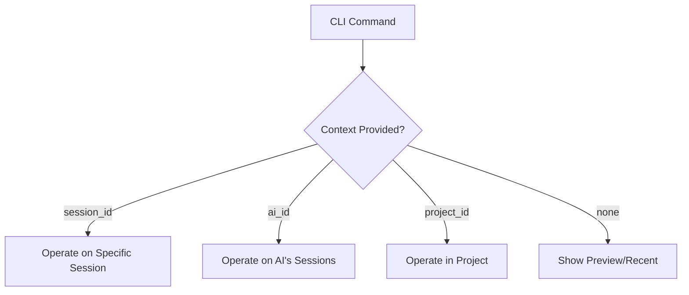

# CLI Design Philosophy: Context-Aware Architecture

**Status:** Active   
**Last Updated:** 2025-12-28   
**Applies To:** All CLI commands in Empirica v1.2.2+

---

## Overview

Empirica's CLI follows a **Context-Aware Design Philosophy** that enables flexible workflows while maintaining explicit context management. This philosophy is intentionally designed to support both interactive and automated usage patterns.

---

## Context-Aware Design (Option C)

The CLI implements **Option C** from the design alternatives, which provides:

### 1. Optional Context Parameters

All commands accept optional context parameters:
- `--session-id`: Operate on a specific session
- `--ai-id`: Operate on all sessions for a specific AI
- `--project-id`: Operate within a specific project context

### 2. Context Resolution Logic

```
IF session_id provided:
    → Operate on that specific session only
ELIF ai_id provided:
    → Operate on all sessions for that AI
ELIF project_id provided:
    → Operate within that project context
ELSE:
    → Show global preview or recent items
```

### 3. Benefits of This Approach

**✅ Flexibility:** Supports both targeted operations and discovery workflows
**✅ Explicit Context:** Clear which context commands operate in
**✅ Safety:** Prevents accidental operations on wrong contexts
**✅ Automation-Friendly:** Works well in scripts and CI/CD pipelines

---

## Implementation Examples

### Example 1: Session-Specific Operation

```bash
# Operate on a specific session
empirica finding-log --session-id abc123 --finding "Discovered X"
```

**Result:** Finding is logged to session `abc123` only.

### Example 2: AI-Level Operation

```bash
# Get all sessions for a specific AI
empirica sessions-list --ai-id "claude-code"
```

**Result:** Lists all sessions created by `claude-code`.

### Example 3: Global Preview (No Context)

```bash
# Show recent activity across all sessions
empirica sessions-list
```

**Result:** Shows preview of recent sessions (limited scope for safety).

---

## Impact on Test Design

### Tests Requiring Context

The following tests need explicit session/ai/project context:

1. **`test_goals_list_execution`** - Needs `--session-id` or `--ai-id`
2. **`test_goals_discover_execution`** - Needs `--session-id` or `--ai-id`  
3. **`test_handoff_query_execution`** - Needs `--session-id` or `--ai-id`
4. **`test_ask_help`** - Works without context (help system)

### Test Failure Patterns

**❌ Missing Context Errors:**
```
Error: "session_id or ai_id required for this operation"
```

**✅ Fix:** Provide explicit context parameters.

---

## Comparison with Alternatives

### Option A: Implicit Global Context (REJECTED)

**Problem:** Unsafe - commands operate on all data by default
**Example:** `empirica finding-log` would log to ALL sessions

### Option B: Required Context Always (REJECTED)

**Problem:** Inflexible - prevents discovery workflows
**Example:** Can't list sessions without knowing session IDs first

### Option C: Context-Aware (SELECTED) ✅

**Solution:** Safe + Flexible - context optional but explicit
**Example:** Works for both targeted ops and discovery

---

## Best Practices for CLI Usage

### 1. Always Capture Session ID

```bash
# Create session and capture ID
SESSION_ID=$(empirica session-create --ai-id "myai" --output json | jq -r '.session_id')

# Use it in subsequent commands
empirica preflight-submit --session-id $SESSION_ID -
```

### 2. Use AI-ID for Cross-Session Operations

```bash
# Find all unknowns for an AI
empirica unknown-log --ai-id "claude-research" --unresolved
```

### 3. Preview Before Targeted Operations

```bash
# Preview recent sessions
empirica sessions-list

# Then operate on specific one
empirica session-snapshot --session-id abc123
```

---

## Architecture Diagram



---

## Related Documentation

- **[CLI Commands Reference](CLI_COMMANDS_UNIFIED.md)** - Complete command list
- **[Getting Started](../01_START_HERE.md)** - Session workflows
- **[Troubleshooting](../03_TROUBLESHOOTING.md)** - Test patterns

---

## Version History

- **v1.1.0:** Documented Context-Aware philosophy
- **v1.0.0:** Implemented Option C architecture
- **v0.9.0:** Evaluated design alternatives

---

## Tags for Semantic Index

```yaml
tags: [cli, architecture, design-philosophy, context-management]
concepts:
  - context-aware-cli
  - optional-parameters
  - explicit-context
  - cli-design-patterns
questions:
  - "How does Empirica CLI handle context?"
  - "What is Context-Aware Design?"
  - "Why do some commands need session_id?"
  - "How to fix missing context errors?"
use_cases:
  - cli-usage
  - testing
  - automation
  - context-management
related: ["CLI_COMMANDS_UNIFIED", "01_START_HERE", "SYSTEM_OVERVIEW"]
```