<div align="center">

# 🖥️ EnkaliPrime CLI

<p align="center">
  <strong>Beautiful Command-Line Interface for AI Chat</strong>
</p>

<p align="center">
  <em>Chat with AI directly from your terminal with rich formatting and beautiful animations</em>
</p>

<p align="center">
  <a href="https://www.python.org/downloads/">
    
  </a>
  <a href="https://pypi.org/project/enkaliprime-cli/">
    
  </a>
  <a href="LICENSE">
    
  </a>
</p>

<p align="center">
  
  
  
</p>

---

**[Installation](#-installation) • [Quick Start](#-quick-start) • [Commands](#-commands) • [Examples](#-examples)**

</div>

---

## ✨ Features

<table>
<tr>
<td width="50%">

### 💬 Interactive AI Chat
- **Real-time conversation** with AI assistants
- **Rich markdown formatting** for responses
- **Beautiful Unicode animations** while thinking
- **Session persistence** across chats

</td>
<td width="50%">

### 🔐 Secure Configuration
- **Encrypted API key storage** using system keyring
- **Automatic validation** of API keys
- **Connection testing** to verify setup
- **Secure credential management**

</td>
</tr>
<tr>
<td width="50%">

### 🎨 Beautiful Terminal UI
- **Rich console output** with colors and formatting
- **Loading animations** with brain emoji sequences
- **Interactive prompts** with validation
- **Progress indicators** and status displays

</td>
<td width="50%">

### 📝 Session Management
- **Create named sessions** for different contexts
- **Session history** and conversation tracking
- **Multiple agents** support
- **Clean session lifecycle** management

</td>
</tr>
</table>

---

## 🏗️ Architecture

```mermaid
graph TD
    A[🖥️ Terminal] --> B[enkaliprime CLI]
    B --> C{Commands}
    C --> D[💬 chat]
    C --> E[⚙️ config]
    C --> F[📝 session]

    D --> G[Interactive Chat]
    D --> H[Single Message]
    D --> I[History View]

    E --> J[Set API Key]
    E --> K[Test Connection]
    E --> L[Show Config]

    F --> M[Create Session]
    F --> N[End Session]
    F --> O[Session Info]

    B --> P[🔐 Keyring]
    B --> Q[📦 SDK]
    Q --> R[🤖 EnkaliPrime API]
```



---

## 📦 Installation

### From PyPI (Recommended)

```bash
pip install enkaliprime-cli
```

### From Source

```bash
git clone https://github.com/enkaliprime/enkaliprime-cli.git
cd enkaliprime-cli
pip install -e .
```

### Requirements

- Python 3.8+
- `enkaliprime` SDK (automatically installed)
- System keyring support (built-in on most systems)

---

## 🚀 Quick Start

### 1. Configure API Key

```bash
enkaliprime config set-api-key
# Follow the secure prompt to enter your API key
```

### 2. Test Connection

```bash
enkaliprime config test-connection
# Verify everything is working
```

### 3. Start Chatting

```bash
enkaliprime chat interactive
# Begin your AI conversation!
```

---

## 📖 Commands

### Main Commands

| Command | Description |
|---------|-------------|
| `enkaliprime --help` | Show help and available commands |
| `enkaliprime info` | Show CLI information and features |
| `enkaliprime --version` | Show version information |

### 💬 Chat Commands

| Command | Description |
|---------|-------------|
| `enkaliprime chat interactive` | Start interactive chat session |
| `enkaliprime chat ask "message"` | Send single message and get response |
| `enkaliprime chat history` | Show conversation history |

### ⚙️ Configuration Commands

| Command | Description |
|---------|-------------|
| `enkaliprime config set-api-key` | Set your API key securely |
| `enkaliprime config get-api-key` | Show masked API key |
| `enkaliprime config remove-api-key` | Remove stored API key |
| `enkaliprime config test-connection` | Test API connection |
| `enkaliprime config show` | Show current configuration |

### 📝 Session Commands

| Command | Description |
|---------|-------------|
| `enkaliprime session create` | Create new chat session |
| `enkaliprime session current` | Show current session info |
| `enkaliprime session end` | End current session |
| `enkaliprime session list` | List all sessions |
| `enkaliprime session clear-history` | Clear conversation history |

---

## 💡 Examples

### Interactive Chat Session

```bash
# Start a conversation with a custom agent
enkaliprime chat interactive --agent "Code Assistant"

# Chat with default assistant, no loading animations
enkaliprime chat interactive --no-loading
```

### Single Message Queries

```bash
# Ask a quick question
enkaliprime chat ask "What is the capital of France?"

# Ask with custom agent
enkaliprime chat ask "Explain recursion" --agent "Programming Tutor"
```

### Configuration Management

```bash
# Set API key interactively
enkaliprime config set-api-key

# Set API key directly (not recommended for security)
enkaliprime config set-api-key --key ek_bridge_your_key_here

# Test your setup
enkaliprime config test-connection

# View current configuration
enkaliprime config show
```

### Session Management

```bash
# Create a new session with custom agent
enkaliprime session create --name "Math Tutor" --avatar "🎓"

# Check current session
enkaliprime session current

# End the current session
enkaliprime session end

# Clear conversation history
enkaliprime session clear-history
```

---

## 🔧 Troubleshooting

### Command Not Found Error

If you get `"enkaliprime" command not found` after installation:

#### Windows (PowerShell/Command Prompt)

**Check if Python Scripts directory is in PATH:**
```cmd
where python
# This should show your Python installation directory
```

**Add Python Scripts to PATH (run as Administrator):**
```cmd
setx PATH "%PATH%;C:\Python313\Scripts"  # Replace with your Python version
```

**Or use full path:**
```cmd
& "C:\Users\%USERNAME%\AppData\Roaming\Python\Python313\Scripts\enkaliprime.exe" --help
```

#### Linux/macOS

**Check PATH:**
```bash
echo $PATH
which python3
```

**Add to PATH in ~/.bashrc or ~/.zshrc:**
```bash
export PATH="$HOME/.local/bin:$PATH"  # For user installations
# OR
export PATH="/usr/local/bin:$PATH"     # For system installations
```

#### Alternative Usage

**Use Python module directly (recommended for PowerShell):**
```bash
python -m enkaliprime_cli info
python -c "from enkaliprime_cli.main import app; import sys; sys.argv = ['enkaliprime', 'chat', 'interactive']; app()"
```

**Use pipx for isolated installation:**
```bash
pip install pipx
pipx install enkaliprime-cli
# Now enkaliprime command works globally
```

### PowerShell Compatibility

If you experience glitches with loading animations in PowerShell:

1. **Disable progress display:**
   ```powershell
   $ProgressPreference = "SilentlyContinue"
   enkaliprime chat ask "Hello"
   ```

2. **Use Python directly:**
   ```powershell
   python -c "from enkaliprime_cli.main import app; import sys; sys.argv = ['enkaliprime', 'chat', 'ask', 'Hello']; app()"
   ```

3. **Loading animations are disabled by default** in CLI commands to avoid PowerShell conflicts. The SDK still shows its internal brain animation.

### API Key Issues

**"No API key configured" error:**
```bash
enkaliprime config set-api-key
# Enter your API key when prompted
```

**Test connection:**
```bash
enkaliprime config test-connection
```

---

## 🔐 Security

- **Encrypted Storage**: API keys are stored securely using your system's keyring
- **No Plain Text**: Keys are never displayed in full, only masked
- **Secure Prompts**: Password-style input for sensitive information
- **Validation**: Automatic format checking for API keys

### Best Practices

```bash
# ✅ Good: Use interactive setup
enkaliprime config set-api-key

# ❌ Bad: Expose key in command history
enkaliprime config set-api-key --key ek_bridge_secret_key
```

---

## 🎨 Terminal Features

### Rich Formatting
- **Markdown rendering** for AI responses
- **Syntax highlighting** for code blocks
- **Colored output** for better readability
- **Unicode emojis** for visual appeal

### Loading Animations
```
🧠 Thinking... 1.2s
🧠 Thinking... 2.8s
💭 Thinking... 3.1s
💡 Thinking... 3.7s
✨ Thinking... 4.2s
```

### Interactive Prompts
- **Auto-completion** for commands and options
- **Input validation** with helpful error messages
- **Confirmation prompts** for destructive operations

---

## 🛠️ Development

### Setup for Development

```bash
git clone https://github.com/enkaliprime/enkaliprime-cli.git
cd enkaliprime-cli
pip install -e ".[dev]"
```

### Running Tests

```bash
pytest
```

### Code Quality

```bash
# Format code
black enkaliprime_cli

# Sort imports
isort enkaliprime_cli

# Type checking
mypy enkaliprime_cli

# Linting
ruff enkaliprime_cli
```

---

## 📄 License

This project is licensed under the **MIT License** — see the [LICENSE](LICENSE) file for details.

---

## 🤝 Contributing

We welcome contributions! Please see our [Contributing Guide](CONTRIBUTING.md) for details.

---

## 🔗 Links

<div align="center">

| Resource | Link |
|----------|------|
| 📖 **Documentation** | [api.enkaliprime.com/docs](https://api.enkaliprime.com/docs) |
| 🏠 **Website** | [api.enkaliprime.com](https://api.enkaliprime.com) |
| 📦 **PyPI** | [pypi.org/project/enkaliprime-cli](https://pypi.org/project/enkaliprime-cli/) |
| 🐙 **GitHub** | [github.com/enkaliprime/enkaliprime-cli](https://github.com/enkaliprime/enkaliprime-cli) |

</div>

---

<div align="center">

### Built with ❤️ by the EnkaliPrime Team

<sub>© 2024 EnkaliPrime. All rights reserved.</sub>

</div>
