<div align="center">

# 🖥️ EnkaliPrime CLI

<p align="center">
  <strong>Beautiful Command-Line Interface for AI Chat</strong>
</p>

<p align="center">
  <em>Chat with AI directly from your terminal with rich formatting and beautiful animations</em>
</p>

<p align="center">
  <a href="https://www.python.org/downloads/">
    
  </a>
  <a href="https://pypi.org/project/enkaliprime-cli/">
    
  </a>
  <a href="LICENSE">
    
  </a>
</p>

<p align="center">
  
  
  
  
  
  
  
</p>

---

**[Installation](#-installation) • [Quick Start](#-quick-start) • [Commands](#-commands) • [Examples](#-examples)**

</div>

---

## ✨ Features

<table>
<tr>
<td width="50%">

### 💬 Interactive AI Chat
- **Real-time conversation** with AI assistants
- **Rich markdown formatting** for responses
- **Beautiful Unicode animations** while thinking
- **Session persistence** across chats
- **Streaming responses** support

</td>
<td width="50%">

### 🏠 Local LLM Support (Ollama)
- **Full Ollama integration** for local AI models
- **Zero API costs** for local inference
- **Complete privacy** - conversations stay local
- **Any Ollama model** support (Llama, CodeLlama, Mistral, etc.)
- **Automatic model detection** and management

</td>
</tr>
<tr>
<td width="50%">

### ☁️ Cloud AI Support (Ollama Cloud)
- **Powerful cloud models** without local hardware requirements
- **Large language models** (GPT-OSS 120B, Llama 70B, etc.)
- **API key authentication** for secure access
- **No GPU requirements** - runs on Ollama's cloud infrastructure
- **Same interface** as local models

</td>
<td width="50%">

### 🎭 AI Behavior Customization
- **Custom system prompts** to define AI personality
- **AI name configuration** for personalized interactions
- **Personality traits** and behavioral instructions
- **Reset capabilities** to restore default behavior
- **Per-provider customization** (local vs cloud)

</td>
</tr>
<tr>
<td width="50%">

### 🎯 Global Default Model Selection
- **One-click model selection** from all available providers
- **Universal default** that works across all chat commands
- **Smart provider detection** with automatic fallback
- **No flags needed** - just run chat commands
- **Easy switching** between local, cloud, and remote AI

</td>
<td width="50%">

### 🎨 Beautiful Terminal UI
- **Rich console output** with colors and formatting
- **Loading animations** with brain emoji sequences
- **Interactive prompts** with validation
- **Progress indicators** and status displays
- **PowerShell compatible** with automatic fallbacks

</td>
</tr>
<tr>
<td width="50%">

### 🔐 Secure Configuration
- **Encrypted API key storage** using system keyring
- **Multiple key management** (EnkaliPrime, Ollama Cloud)
- **Automatic validation** of API keys
- **Connection testing** across all providers
- **Secure credential management**

</td>
<td width="50%">

### 📝 Advanced Session Management
- **Create named sessions** for different contexts
- **Session history** and conversation tracking
- **Multiple agents** support with custom avatars
- **Clean session lifecycle** management
- **Conversation persistence** across sessions

</td>
</tr>
</table>

---

## 🏗️ Architecture

```mermaid
graph TD
    A[🖥️ Terminal] --> B[enkaliprime CLI]
    B --> C{Commands}
    C --> D[💬 chat]
    C --> E[⚙️ config]
    C --> F[📝 session]

    D --> G[Interactive Chat]
    D --> H[Single Message]
    D --> I[Providers List]
    D --> J[History View]

    E --> K[API Keys]
    E --> L[Ollama Config]
    E --> M[Cloud Config]
    E --> N[AI Behavior]
    E --> O[Global Defaults]
    E --> P[Test Connections]
    E --> Q[Show Config]

    F --> R[Create Session]
    F --> S[End Session]
    F --> T[Session Info]

    B --> U[🔐 Keyring]
    B --> V[📦 SDK]
    V --> W{Provider Router}
    W --> X[🤖 EnkaliPrime API]
    W --> Y[🏠 Local Ollama]
    W --> Z[☁️ Ollama Cloud]

    U --> AA[(API Keys)]
    U --> BB[(Ollama Models)]
    U --> CC[(Cloud Models)]
    U --> DD[(AI Behavior)]
    U --> EE[(Global Defaults)]
```



---

## 📦 Installation

### From PyPI (Recommended)

```bash
pip install enkaliprime-cli
```

### From Source

```bash
git clone https://github.com/enkaliprime/enkaliprime-cli.git
cd enkaliprime-cli
pip install -e .
```

### Requirements

- Python 3.8+
- `enkaliprime` SDK (automatically installed)
- System keyring support (built-in on most systems)
- **Optional**: [Ollama](https://ollama.ai/) for local LLM support

---

## 🏠 Local LLM Support (Ollama)

EnkaliPrime CLI supports **local AI models** through Ollama integration, allowing you to run AI conversations **without API costs** and with **complete privacy**.

### Quick Local Setup

1. **Install Ollama:**
   ```bash
   # Download from https://ollama.ai/
   # Or use package manager:
   # Linux: curl -fsSL https://ollama.ai/install.sh | sh
   # macOS: brew install ollama
   # Windows: winget install Ollama.Ollama
   ```

2. **Start Ollama:**
   ```bash
   ollama serve
   ```

3. **Pull a model:**
   ```bash
   ollama pull llama2      # General purpose
   ollama pull codellama   # Code assistant
   ollama pull mistral     # Fast and capable
   ```

4. **Configure CLI:**
   ```bash
   enkaliprime config set-ollama-model
   # Interactive model selection
   ```

5. **Start using local AI:**
   ```bash
   enkaliprime chat interactive --local
   enkaliprime chat ask "Hello local AI!" --local
   ```

### Local vs Remote Comparison

| Feature | Remote (EnkaliPrime) | Local (Ollama) |
|---------|---------------------|----------------|
| **Cost** | API usage fees | Free (one-time setup) |
| **Privacy** | Cloud processing | Local processing |
| **Speed** | Network dependent | Local inference |
| **Models** | Curated selection | Any Ollama model |
| **Setup** | API key only | Ollama installation |
| **Offline** | ❌ Requires internet | ✅ Works offline |

---

## ☁️ Cloud AI Support (Ollama Cloud)

EnkaliPrime CLI supports **powerful cloud models** through Ollama Cloud integration, giving you access to large language models without requiring expensive local hardware.

### Quick Cloud Setup

1. **Get API Key:**
   Visit [ollama.com/settings/keys](https://ollama.com/settings/keys) to create an API key.

2. **Configure CLI:**
   ```bash
   enkaliprime config set-ollama-cloud-key
   # Enter your API key securely
   ```

3. **Set Default Cloud Model (Optional):**
   ```bash
   enkaliprime config set-default-cloud-model
   # Interactive selection from available cloud models
   ```

4. **Start Cloud Chat:**
   ```bash
   enkaliprime chat interactive --cloud
   # Access models like GPT-OSS 120B, Llama 70B, etc.
   ```

### Cloud vs Local vs Remote Comparison

| Feature | Remote (EnkaliPrime) | Local (Ollama) | Cloud (Ollama Cloud) |
|---------|---------------------|----------------|---------------------|
| **Cost** | API usage fees | Free (one-time setup) | API key required |
| **Privacy** | Cloud processing | Local processing | Cloud processing |
| **Model Size** | Curated selection | Limited by hardware | Very large models (100B+) |
| **Setup** | API key only | Ollama installation | API key + optional local Ollama |
| **Offline** | ❌ Requires internet | ✅ Works offline | ❌ Requires internet |
| **Hardware** | Any computer | GPU recommended | Any computer |

### Cloud Models Available

- **GPT-OSS 120B** - Large GPT-style model
- **Llama 3.1 70B** - Meta's latest large model
- **CodeLlama 34B** - Code-focused model
- **Mixtral 46.7B** - High-performance mixture model
- **And many more...**

---

## 🎭 AI Behavior Customization

Customize how your AI behaves, responds, and interacts with you. Define personality traits, system prompts, and behavioral instructions.

### Quick Behavior Setup

```bash
# Define AI behavior and personality
enkaliprime config set-system-prompt
# "You are a helpful coding assistant. Always provide clear, concise answers with code examples."

# Set AI name and traits
enkaliprime config set-ai-personality
# Name: CodeBuddy
# Personality: patient, detail-oriented, loves debugging

# Reset to defaults anytime
enkaliprime config reset-ai-behavior
```

### Behavior Features

- **System Prompts**: Define core AI behavior and response style
- **AI Personality**: Give your AI a name and personality traits
- **Per-Provider**: Customize behavior differently for local vs cloud AI
- **Reset Capability**: Easily restore default behavior
- **Rich Prompts**: Multi-line prompt input with validation

### Example Customizations

**Coding Assistant:**
```
System Prompt: "You are an expert programming assistant. Always provide working code examples and explain concepts clearly."

AI Name: "CodeMaster"
Personality: "patient, methodical, focuses on best practices"
```

**Creative Writing AI:**
```
System Prompt: "You are a creative writing assistant. Help with story development, character creation, and narrative techniques."

AI Name: "StoryWeaver"
Personality: "imaginative, encouraging, focuses on emotional depth"
```

---

## 🎯 Global Default Model Selection

Set your primary AI model once and use it effortlessly across all chat commands. No more remembering flags or provider specifications.

### Quick Default Setup

```bash
# Choose from ALL available models
enkaliprime config set-default-model
# Interactive selection from local, cloud, and remote models

# Now chat effortlessly
enkaliprime chat interactive   # Uses your default
enkaliprime chat ask "Hello"   # Uses your default
```

### How It Works

1. **Model Discovery**: Automatically detects all available models
2. **Unified Selection**: Choose from local Ollama, cloud models, and remote AI
3. **Smart Resolution**: Chat commands automatically use your configured default
4. **Override Available**: Still use specific providers when needed

### Default Model Benefits

- **Simplified Usage**: Just run chat commands, no flags needed
- **Consistent Experience**: Same AI personality across all conversations
- **Easy Switching**: Change your default anytime without breaking workflows
- **Provider Agnostic**: Works with local, cloud, and remote AI

---

## 🚀 Quick Start

### Option A: Remote AI (EnkaliPrime API)

#### 1. Configure API Key

```bash
enkaliprime config set-api-key
# Follow the secure prompt to enter your API key
```

#### 2. Test Connection

```bash
enkaliprime config test-connection
# Verify everything is working
```

#### 3. Start Chatting

```bash
enkaliprime chat interactive
# Begin your AI conversation!
```

### Option B: Local AI (Ollama)

#### 1. Install and Setup Ollama

```bash
# Install Ollama (visit https://ollama.ai/)
ollama serve
ollama pull llama2
```

#### 2. Configure Default Model

```bash
enkaliprime config set-ollama-model
# Interactive model selection from available Ollama models
```

#### 3. Start Local Chat

```bash
enkaliprime chat interactive --local
# Chat with your local AI model!
```

### Option C: Cloud AI (Ollama Cloud)

#### 1. Get Ollama Cloud API Key

Visit [ollama.com/settings/keys](https://ollama.com/settings/keys) to get your API key.

#### 2. Configure API Key

```bash
enkaliprime config set-ollama-cloud-key
# Enter your API key securely
```

#### 3. Start Cloud Chat

```bash
enkaliprime chat interactive --cloud
# Use powerful cloud models!

enkaliprime chat ask "Explain quantum computing" --cloud --model gpt-oss:120b
```

### Option D: Global Default Model (Recommended)

#### 1. Choose Your Default AI

```bash
enkaliprime config set-default-model
# Interactive selection from ALL available models
```

#### 2. Chat Effortlessly

```bash
# No flags needed - uses your default model!
enkaliprime chat interactive
enkaliprime chat ask "Hello AI!"
```

### Hybrid Usage

You can use all providers seamlessly:

```bash
# Global default (whatever you configured)
enkaliprime chat interactive

# Remote AI explicitly
enkaliprime chat interactive --provider remote

# Local AI explicitly
enkaliprime chat interactive --provider ollama

# Cloud AI explicitly
enkaliprime chat interactive --provider cloud

# Check all available providers
enkaliprime chat providers
```

---

## 📖 Commands

### Main Commands

| Command | Description |
|---------|-------------|
| `enkaliprime --help` | Show help and available commands |
| `enkaliprime info` | Show CLI information and features |
| `enkaliprime --version` | Show version information |

### 💬 Chat Commands

| Command | Description |
|---------|-------------|
| `enkaliprime chat interactive` | Start interactive chat (uses global default model) |
| `enkaliprime chat interactive --local` | Interactive chat with local Ollama model |
| `enkaliprime chat interactive --cloud` | Interactive chat with Ollama cloud models |
| `enkaliprime chat interactive --provider <name>` | Use specific provider (remote/ollama/cloud) |
| `enkaliprime chat ask "message"` | Send single message (uses global default) |
| `enkaliprime chat ask "message" --local` | Quick question to local Ollama model |
| `enkaliprime chat ask "message" --cloud` | Quick question to Ollama cloud |
| `enkaliprime chat providers` | List all available AI providers and models |
| `enkaliprime chat history` | Show conversation history |

### ⚙️ Configuration Commands

#### API Key Management
| Command | Description |
|---------|-------------|
| `enkaliprime config set-api-key` | Set your EnkaliPrime API key securely |
| `enkaliprime config get-api-key` | Show masked API key |
| `enkaliprime config remove-api-key` | Remove stored API key |
| `enkaliprime config test-connection` | Test EnkaliPrime API connection |

#### Local AI (Ollama) Configuration
| Command | Description |
|---------|-------------|
| `enkaliprime config set-ollama-model` | Set default local Ollama model |
| `enkaliprime config get-ollama-model` | Show current Ollama model |
| `enkaliprime config remove-ollama-model` | Remove Ollama model config |
| `enkaliprime config show-ollama` | Show Ollama status and models |

#### Cloud AI (Ollama Cloud) Configuration
| Command | Description |
|---------|-------------|
| `enkaliprime config set-ollama-cloud-key` | Set Ollama cloud API key |
| `enkaliprime config get-ollama-cloud-key` | Show masked cloud API key |
| `enkaliprime config remove-ollama-cloud-key` | Remove cloud API key |
| `enkaliprime config set-default-cloud-model` | Set default cloud model |
| `enkaliprime config get-default-cloud-model` | Show default cloud model |
| `enkaliprime config remove-default-cloud-model` | Remove cloud model default |
| `enkaliprime config show-cloud` | Show cloud status and models |

#### AI Behavior Customization
| Command | Description |
|---------|-------------|
| `enkaliprime config set-system-prompt` | Define AI behavior and personality |
| `enkaliprime config get-system-prompt` | Show current system prompt |
| `enkaliprime config remove-system-prompt` | Remove custom system prompt |
| `enkaliprime config set-ai-personality` | Set AI name and personality traits |
| `enkaliprime config get-ai-personality` | Show AI personality settings |
| `enkaliprime config remove-ai-personality` | Remove AI personality config |
| `enkaliprime config reset-ai-behavior` | Reset all AI behavior to defaults |

#### Global Default Model
| Command | Description |
|---------|-------------|
| `enkaliprime config set-default-model` | Choose from ALL available models |
| `enkaliprime config get-default-model` | Show current global default |
| `enkaliprime config remove-default-model` | Remove global default |

#### General Configuration
| Command | Description |
|---------|-------------|
| `enkaliprime config show-behavior` | Show all AI behavior settings |
| `enkaliprime config show` | Show current configuration |

### 📝 Session Commands

| Command | Description |
|---------|-------------|
| `enkaliprime session create` | Create new chat session |
| `enkaliprime session current` | Show current session info |
| `enkaliprime session end` | End current session |
| `enkaliprime session list` | List all sessions |
| `enkaliprime session clear-history` | Clear conversation history |

---

## 💡 Examples

### Interactive Chat Session

```bash
# Global default model (recommended - no flags needed!)
enkaliprime chat interactive

# Remote AI with custom agent
enkaliprime chat interactive --agent "Code Assistant" --provider remote

# Local AI with configured Ollama model
enkaliprime chat interactive --provider ollama

# Cloud AI with powerful models
enkaliprime chat interactive --provider cloud --model gpt-oss:120b

# Local AI with specific model override
enkaliprime chat interactive --local --model codellama

# Cloud AI with custom personality
enkaliprime chat interactive --cloud --agent "Tech Guru"
```

### Single Message Queries

```bash
# Global default model - quick question
enkaliprime chat ask "What is the capital of France?"

# Remote AI - explicit provider
enkaliprime chat ask "Explain quantum computing" --provider remote

# Local AI - private, no-cost query
enkaliprime chat ask "Explain quantum computing" --provider ollama

# Cloud AI - powerful model, no local hardware needed
enkaliprime chat ask "Explain quantum computing" --provider cloud --model gpt-oss:120b

# Local AI with specific model
enkaliprime chat ask "Write a Python function" --local --model codellama

# Remote AI with custom agent
enkaliprime chat ask "Explain recursion" --agent "Programming Tutor"
```

### Configuration Management

```bash
# Global Default Model (Recommended First Step)
enkaliprime config set-default-model     # Choose from ALL available models
enkaliprime config get-default-model     # Show current global default
enkaliprime config remove-default-model  # Remove global default

# EnkaliPrime API Configuration
enkaliprime config set-api-key
enkaliprime config test-connection
enkaliprime config show

# Ollama Local AI Configuration
enkaliprime config set-ollama-model     # Set default local model
enkaliprime config get-ollama-model     # Show current local model
enkaliprime config show-ollama          # Show Ollama status & models
enkaliprime config remove-ollama-model  # Remove local model config

# Ollama Cloud AI Configuration
enkaliprime config set-ollama-cloud-key     # Set cloud API key
enkaliprime config get-ollama-cloud-key     # Show masked cloud key
enkaliprime config set-default-cloud-model  # Set default cloud model
enkaliprime config show-cloud               # Show cloud status & models

# AI Behavior Customization
enkaliprime config set-system-prompt        # Define AI behavior
enkaliprime config set-ai-personality       # Set AI name & traits
enkaliprime config reset-ai-behavior        # Reset to defaults
enkaliprime config show-behavior            # Show all AI settings

# Provider Management
enkaliprime chat providers              # List all available AI providers
```

### Session Management

```bash
# Create a new session with custom agent
enkaliprime session create --name "Math Tutor" --avatar "🎓"

# Check current session
enkaliprime session current

# End the current session
enkaliprime session end

# Clear conversation history
enkaliprime session clear-history
```

---

## 🔧 Troubleshooting

### Command Not Found Error

If you get `"enkaliprime" command not found` after installation:

#### Windows (PowerShell/Command Prompt)

**Check if Python Scripts directory is in PATH:**
```cmd
where python
# This should show your Python installation directory
```

**Add Python Scripts to PATH (run as Administrator):**
```cmd
setx PATH "%PATH%;C:\Python313\Scripts"  # Replace with your Python version
```

**Or use full path:**
```cmd
& "C:\Users\%USERNAME%\AppData\Roaming\Python\Python313\Scripts\enkaliprime.exe" --help
```

#### Linux/macOS

**Check PATH:**
```bash
echo $PATH
which python3
```

**Add to PATH in ~/.bashrc or ~/.zshrc:**
```bash
export PATH="$HOME/.local/bin:$PATH"  # For user installations
# OR
export PATH="/usr/local/bin:$PATH"     # For system installations
```

#### Alternative Usage

**Use Python module directly (recommended for PowerShell):**
```bash
python -m enkaliprime_cli info
python -c "from enkaliprime_cli.main import app; import sys; sys.argv = ['enkaliprime', 'chat', 'interactive']; app()"
```

**Use pipx for isolated installation:**
```bash
pip install pipx
pipx install enkaliprime-cli
# Now enkaliprime command works globally
```

### PowerShell Compatibility

If you experience glitches with loading animations in PowerShell:

1. **Disable progress display:**
   ```powershell
   $ProgressPreference = "SilentlyContinue"
   enkaliprime chat ask "Hello"
   ```

2. **Use Python directly:**
   ```powershell
   python -c "from enkaliprime_cli.main import app; import sys; sys.argv = ['enkaliprime', 'chat', 'ask', 'Hello']; app()"
   ```

3. **Loading animations are disabled by default** in CLI commands to avoid PowerShell conflicts. The SDK still shows its internal brain animation.

### Ollama Setup Issues

**"Ollama not available" error:**

1. **Install Ollama:**
   ```bash
   # Visit https://ollama.ai/ for installation instructions
   # Windows: winget install Ollama.Ollama
   # macOS: brew install ollama
   # Linux: curl -fsSL https://ollama.ai/install.sh | sh
   ```

2. **Start Ollama service:**
   ```bash
   ollama serve
   # Keep this running in a separate terminal
   ```

3. **Pull a model:**
   ```bash
   ollama pull llama2  # General purpose model
   ollama pull codellama  # Code-focused model
   ```

4. **Configure CLI:**
   ```bash
   enkaliprime config set-ollama-model
   # Select your preferred model
   ```

**Test Ollama connection:**
```bash
enkaliprime config show-ollama
# Should show available models and ✅ status
```

**Common Ollama issues:**
- **Port conflict**: Default port 11434 may be in use
- **Memory**: Large models need sufficient RAM
- **Storage**: Models require disk space (2-7GB each)

### API Key Issues

#### EnkaliPrime API Key
**"No API key configured" error:**
```bash
enkaliprime config set-api-key
# Enter your API key when prompted
```

**Test connection:**
```bash
enkaliprime config test-connection
```

#### Ollama Cloud API Key
**"Cloud API key not configured" error:**
```bash
enkaliprime config set-ollama-cloud-key
# Get your key from https://ollama.com/settings/keys
```

**Test cloud connection:**
```bash
enkaliprime config show-cloud
# Should show ✅ status and available models
```

---

## 🔐 Security & Privacy

### API Key Security
- **Encrypted Storage**: All API keys stored securely using your system's keyring
- **No Plain Text**: Keys are never displayed in full, only masked for security
- **Secure Prompts**: Password-style input for all sensitive information
- **Validation**: Automatic format checking for API keys
- **Multiple Keys**: Separate secure storage for EnkaliPrime, Ollama Cloud, etc.

### Privacy by Provider

| Provider | Privacy Level | Data Handling |
|----------|---------------|---------------|
| **Remote (EnkaliPrime)** | 🔒 Cloud Processing | Conversations processed on EnkaliPrime servers |
| **Local (Ollama)** | 🛡️ Complete Privacy | 100% local processing, zero data transmission |
| **Cloud (Ollama Cloud)** | 🔒 Cloud Processing | Conversations processed on Ollama's cloud infrastructure |

### AI Behavior Privacy
- **Local Storage**: System prompts and AI personalities stored securely locally
- **No Transmission**: Custom behaviors never sent to external services
- **Provider Isolation**: Different behaviors can be configured per provider

### Best Practices

```bash
# ✅ Good: Use interactive setup
enkaliprime config set-api-key

# ❌ Bad: Expose key in command history
enkaliprime config set-api-key --key ek_bridge_secret_key
```

---

## 🎨 Terminal Features

### Rich Formatting
- **Markdown rendering** for AI responses
- **Syntax highlighting** for code blocks
- **Colored output** for better readability
- **Unicode emojis** for visual appeal

### Loading Animations
```
🧠 Thinking... 1.2s
🧠 Thinking... 2.8s
💭 Thinking... 3.1s
💡 Thinking... 3.7s
✨ Thinking... 4.2s
```

### Interactive Prompts
- **Auto-completion** for commands and options
- **Input validation** with helpful error messages
- **Confirmation prompts** for destructive operations

---

## 🛠️ Development

### Setup for Development

```bash
git clone https://github.com/enkaliprime/enkaliprime-cli.git
cd enkaliprime-cli
pip install -e ".[dev]"
```

### Running Tests

```bash
pytest
```

### Code Quality

```bash
# Format code
black enkaliprime_cli

# Sort imports
isort enkaliprime_cli

# Type checking
mypy enkaliprime_cli

# Linting
ruff enkaliprime_cli
```

---

## 📄 License

This project is licensed under the **MIT License** — see the [LICENSE](LICENSE) file for details.

---

## 🤝 Contributing

We welcome contributions! Please see our [Contributing Guide](CONTRIBUTING.md) for details.

---

## 🔗 Links

<div align="center">

| Resource | Link |
|----------|------|
| 📖 **Documentation** | [api.enkaliprime.com/docs](https://api.enkaliprime.com/docs) |
| 🏠 **Website** | [api.enkaliprime.com](https://api.enkaliprime.com) |
| 📦 **PyPI** | [pypi.org/project/enkaliprime-cli](https://pypi.org/project/enkaliprime-cli/) |
| 🐙 **GitHub** | [github.com/enkaliprime/enkaliprime-cli](https://github.com/enkaliprime/enkaliprime-cli) |

</div>

---

<div align="center">

### Built with ❤️ by the EnkaliPrime Team

<sub>© 2024 EnkaliPrime. All rights reserved.</sub>

</div>
