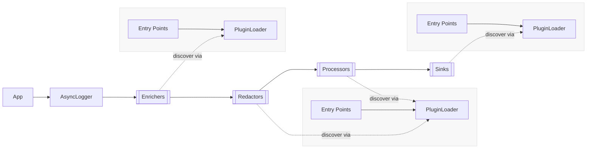
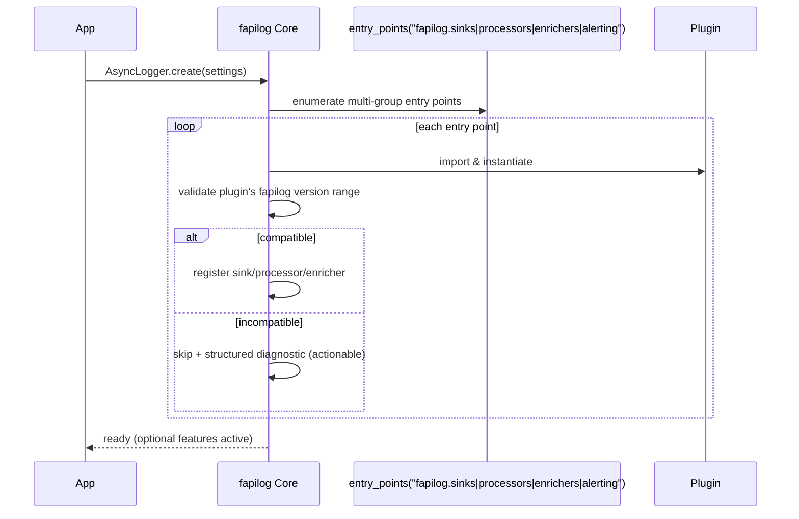

# High-Level Architecture

This document describes the runtime, extensibility, and packaging architecture for **fapilog**. It explains how the core logger operates, how plugins extend the system, and how distribution models (core, extras, and third-party wheels) fit together.

---

## 1) Architecture Goals

- **Async-first core** with predictable lifecycle and back-pressure handling.
- **Stable, minimal plugin contracts** for sinks, processors, and enrichers.
- **Zero hard deps** on frameworks in the core (FastAPI, etc. are optional).
- **Ecosystem-friendly packaging**: core via base install, first-party integrations via extras, community/enterprise via separate wheels.
- **Safe, diagnosable behavior** when plugins are missing or incompatible.

---

## 2) High-Level Overview

At a high level, applications use `AsyncLogger` to produce structured records. Records flow through an optional chain of **enrichers**, then **redactors**, then **processors**, then into one or more **sinks**. Plugins provide additional processors/enrichers/redactors/sinks and optional framework integrations. The **PluginLoader** discovers these via Python entry points, while **CompatibilityManager** enforces version constraints. **ExtrasResolver** produces actionable diagnostics when optional integrations aren’t installed.



---

## 3) Plugin Packaging & Distribution Architecture

- **Core only**: `pip install fapilog` → ships the core async logger, no framework/web deps.
- **First-party extras**: integrations are enabled via extras, e.g. `pip install fapilog[fastapi]`. Code paths are import-guarded; deps are declared in `[project.optional-dependencies]`.
- **Third-party/community**: plugins are separate PyPI wheels named `fapilog-*` (e.g., `fapilog-splunk`), discovered via Python entry points.
- **Discovery**: plugins register to entry point groups **`fapilog.sinks`**, **`fapilog.processors`**, **`fapilog.enrichers`**, and **`fapilog.alerting`** and are loaded via `importlib.metadata.entry_points`. Legacy compatibility with **`fapilog.plugins`** is preserved for heuristic discovery.
- **Version gating**: each plugin declares `Requires-Dist: fapilog>=X,<Y`; the core checks compatibility at load time and emits actionable diagnostics on mismatch.

### 3.1 Packaging & Install Flows

```mermaid
flowchart LR
  Dev[Developer] -->|pip install fapilog| Core[(fapilog core)]
  Dev -->|pip install fapilog[fastapi]| Core
  Core -->|pull optional-deps| FP[[FastAPI deps]]

  Dev -->|pip install fapilog-splunk| P1[(fapilog-splunk)]
  Dev -->|pip install fapilog-gcp-logging| P2[(fapilog-gcp-logging)]

  subgraph PyPI
    Core
    P1
    P2
  end

  note1:::note --> Core
  note2:::note --> P1
  note3:::note --> P2

  classDef note fill:#f5f5f5,stroke:#bbb,color:#333
  note1[First-party integrations are extras via optional-dependencies.
Core paths are import-guarded.]
  note2[3rd-party plugins are separate wheels named fapilog-*.
Discovered via entry points.]
  note3[Each plugin declares fapilog version constraints.]
```

### 3.2 Runtime Discovery & Version Gating



---

## 4) Core Components

### 4.1 AsyncLogger (Core)

- Accepts structured events (dict-like).
- Orchestrates lifecycle (`start/stop`) for all registered components.
- Applies enrichers → processors → sinks in an async pipeline.

### 4.2 Enricher / Processor / Sink (Plugin Contracts)

- **Enricher**: add/augment fields (request IDs, host metadata, etc.).
- **Processor**: transform/redact/route records.
- **Sink**: emit records (stdout, files, HTTP, SIEM, cloud backends).
- All contracts are **async** and have `start()` / `stop()` lifecycle hooks.

### 4.3 PluginLoader

- Discovers plugins via **entry points** (`group="fapilog.plugins"`).
- Imports and instantiates plugin classes with isolation and diagnostics.
- Registers components with `AsyncLogger` if compatible.

### 4.4 CompatibilityManager

- Enforces plugin `Requires-Dist` constraints for `fapilog` (e.g., `>=3,<4`).
- Optionally validates Python version constraints.
- Emits structured diagnostics on mismatch; skips incompatible plugins safely.

### 4.5 ExtrasResolver

- Detects missing optional dependencies for first-party integrations.
- Produces actionable hints (e.g., “Install with: `pip install fapilog[fastapi]`”).
- Ensures the core remains operational without optional deps.

---

## 5) Extension Points

- **Sinks**: output backends (stdout, file, Splunk, ELK, cloud logs, webhooks).
- **Processors**: redaction, formatting, sampling, routing.
- **Enrichers**: request/trace context, env/host metadata.
- **Framework Integrations** (first-party): middleware, lifecycle hooks, and request context for frameworks (e.g., FastAPI) delivered via extras.

---

## 6) Packaging & Discovery Contract

**Entry points (required)**

- Groups (v3):
  - `fapilog.sinks`
  - `fapilog.processors`
  - `fapilog.enrichers`
  - `fapilog.alerting`
- Value: `name = package.module:PluginClass`
- Legacy: `fapilog.plugins` may be used for back-compat; discovery will attempt to map entries to a type based on context.

**Naming (third-party)**

- PyPI distribution must be `fapilog-<name>`.

**Extras (first-party)**

- Declared under `[project.optional-dependencies]` of `fapilog` (e.g., `fastapi = [...]`).
- Code paths referencing optional deps MUST be import-guarded.

**Versioning**

- Plugins MUST set `Requires-Dist: fapilog>=X,<Y`.
- Core performs a load-time check and logs a structured diagnostic on mismatch.

**Load policy**

- Import failure or version mismatch → safe no-op (plugin skipped) + clear log message.
- Core continues operating with available/compatible plugins.

**Security & Supply Chain (enterprise)**

- Signed wheels (e.g., Sigstore), SBOM generation, and vulnerability scans in release CI.
- Documented support for private indexes and constraints files.

---

## 7) Minimal pyproject Examples

**Core package exposing an extra**

```toml
# pyproject.toml (fapilog)
[project]
name = "fapilog"
version = "3.0.0"

[project.optional-dependencies]
fastapi = ["fastapi>=0.115"]  # first-party integration deps
```

**Third-party plugin**

```toml
# pyproject.toml (fapilog-fastapi or any fapilog-* plugin)
[project]
name = "fapilog-fastapi"
version = "1.0.0"
dependencies = ["fapilog>=3.0,<4.0", "fastapi>=0.115"]

[project.entry-points."fapilog.plugins"]
fastapi = "fapilog_fastapi:FastAPIPlugin"
```

---

## 8) Minimal Plugin API Contracts (async)

```python
# fapilog/plugin_api.py
from typing import Protocol, Mapping, Any

class Processor(Protocol):
    async def start(self) -> None: ...
    async def stop(self) -> None: ...
    async def process(self, record: Mapping[str, Any]) -> Mapping[str, Any]: ...

class Sink(Protocol):
    async def start(self) -> None: ...
    async def stop(self) -> None: ...
    async def write(self, record: Mapping[str, Any]) -> None: ...
```

---

## 9) Optional Import Guards (for core-hosted extras)

When the integration code lives in the core repo but depends on optional packages:

```python
# fapilog/fastapi/__init__.py
from __future__ import annotations

AVAILABLE: bool
_IMPORT_ERROR: Exception | None

try:
    from .integration import get_router  # re-export primary API
    AVAILABLE = True
    _IMPORT_ERROR = None
except Exception as e:
    AVAILABLE = False
    _IMPORT_ERROR = e
```

If `AVAILABLE` is false, the loader emits a diagnostic suggesting:
`pip install fapilog[fastapi]`.

---

## 10) Source Tree Notes

```
src/
├── fapilog/
│   ├── __init__.py
│   ├── logger.py                  # AsyncLogger and core orchestration
│   ├── plugin_api.py              # Protocols: Sink, Processor, Enricher
│   ├── plugins/                   # Built-in minimal examples (optional)
│   ├── integrations/              # First-party integrations (optional, import-guarded)
│   │   └── fastapi/
│   │       ├── __init__.py        # sets AVAILABLE; message if deps missing
│   │       ├── middleware.py      # request context middleware
│   │       ├── lifecycle.py       # app startup/shutdown hooks
│   │       ├── exceptions.py      # exception logging integration
│   │       ├── di.py              # dependency injection helpers
│   │       └── testing.py         # fixtures/utilities
│   └── runtime/
│       ├── loader.py              # PluginLoader (entry points)
│       ├── compatibility.py       # CompatibilityManager
│       └── extras.py              # ExtrasResolver
└── plugins/                        # Example external plugins (separate wheels on PyPI)
    ├── fapilog-splunk/
    └── fapilog-compliance-pci/

Notes:
- The FastAPI integration is **not** active unless installed via **extras**: `[project.optional-dependencies].fastapi`.
- External plugins are **separate distributions** (`fapilog-*`) and are discovered via `entry_points(group="fapilog.plugins")`.
```

---

## 11) Diagnostics & Observability

- The core emits structured diagnostics for:
  - Plugin import failures (module not found, missing deps).
  - Version incompatibilities between plugin and core.
  - Optional integration not installed (with a suggested `pip install fapilog[extra]` command).
- (Optional) Provide a helper (e.g., `fapilog.debug_plugins()`) to list discovered entry points and compatibility status for troubleshooting.
