# FastAPI Casbin ACL

A robust, production-ready FastAPI infrastructure dependency for permissions management, providing RBAC and ABAC support via Casbin.

## Features

- **Zero Business Logic Intrusion**: Decoupled from your business logic.
- **Strong Constraints, Few Conventions**: Enforces a consistent permission model (RBAC + ABAC + Permission RBAC).
- **Pluggable Authentication**: Works with any authentication system (JWT, OAuth2, Session) via dependency injection.
- **Casbin Lifecycle Management**: Centralized management of the Casbin Enforcer.
- **Async Support**: Fully compatible with FastAPI's async nature.
- **Multiple Model Support**: Support for multiple permission models (RBAC, ABAC, Permission RBAC, custom) with per-route model selection.
- **Permission RBAC Model**: Advanced RBAC model with permission abstraction layer, supporting API-to-Permission mapping using route names (api_name).
- **Model Registry**: Built-in model registry with automatic registration of built-in models.
- **Multi-Worker Synchronization**: Redis-based policy synchronization for multi-process deployments (e.g., gunicorn), ensuring all workers have consistent policy state in real-time.
- **CLI Tools**: Command-line tools for policy management, API synchronization, and policy explanation.
- **Policy Management API**: Built-in REST API for managing policies, roles, permissions, and API mappings.
- **Frontend Integration**: Example frontend interface for dynamic policy management and visualization.

## Installation

```bash
pip install fastapi-casbin-acl
```

## Quick Start

### 1. Initialize

In your startup logic (e.g., `main.py`):

```python
from contextlib import asynccontextmanager
from fastapi import FastAPI
from fastapi_casbin_acl.enforcer import acl
from fastapi_casbin_acl.config import ACLConfig
from fastapi_casbin_acl.adapter import SQLModelAdapter
from sqlalchemy.ext.asyncio import AsyncSession

# Example: Using SQLModel adapter
@asynccontextmanager
async def lifespan(app: FastAPI):
    # Initialize database connection
    # ... your database setup ...
    
    # Initialize Casbin ACL
    adapter = SQLModelAdapter(AsyncSessionLocal)
    config = ACLConfig(
        policy_router_enable=True,  # Optional: Enable policy management API
        # redis_url="redis://localhost:6379/0",  # Optional: Enable multi-worker sync
    )
    await acl.init(adapter=adapter, config=config, app=app)
    
    # Note: When app is provided, the system automatically builds an api_name mapping table
    # This table maps route names to route paths for debugging and validation
    # If app is not provided, a warning will be issued and api_name-based matching won't be available
    
    # Initialize policies (example for Permission RBAC)
    # await init_policies()
    
    yield
    
    # Cleanup
    await acl.shutdown()  # Stop watcher if Redis is configured
    # ... your cleanup logic ...

app = FastAPI(lifespan=lifespan)
```

**Multiple Models Support**:

```python
# Initialize multiple models at once
await acl.init(
    adapter=adapter,
    models=["rbac", "abac"],  # Initialize both models
    config=config
)

# Or add models at runtime
await acl.init_model("custom_model", adapter=adapter)
```

> **⚠️ Important for Alembic Users**: If you're using Alembic for database migrations, you need to manually import `CasbinRule` in your `alembic/env.py` file to ensure Alembic can detect and generate migration scripts for the Casbin policy table:
>
> ```python
> # In alembic/env.py
> from fastapi_casbin_acl.adapter.orm import CasbinRule
> 
> # Make sure to import all your application models as well
> # from your_app.models import User, Order, ...
> 
> target_metadata = SQLModel.metadata
> ```
>
> This ensures that `CasbinRule` is registered in SQLModel's metadata, allowing Alembic to automatically generate migration scripts for the `t_casbin_rule` table.

### 2. Define Subject & Resource

Define how to get the current user (subject) and how to resolve resources (for ABAC).

```python
from fastapi import Request, Depends
from sqlmodel import select
from sqlalchemy.ext.asyncio import AsyncSession

# 1. Subject Provider (Authentication)
async def get_current_user(
    request: Request,
    session: AsyncSession = Depends(get_session)
):
    """Get current user from request (e.g., JWT token, session)"""
    user_id = request.headers.get("X-User-ID")
    if not user_id:
        return None
    
    # Query user from database
    # ... your user query logic ...
    return user

async def get_subject_from_user(user = Depends(get_current_user)) -> str | None:
    """Extract subject (user ID) for permission checking"""
    if user is None:
        return None
    return str(user.id)  # Return user ID as string

# 2. Resource Getter (Optional, for ABAC)
class Order:
    def __init__(self, id, owner_id):
        self.id = id
        self.owner_id = owner_id
    
    def get_owner_sub(self) -> str | None:
        """Return owner ID for ABAC ownership check"""
        return str(self.owner_id) if self.owner_id else None

async def get_order_resource(request: Request) -> Order | None:
    """Fetch resource from database based on path parameters"""
    order_id = request.path_params.get("id")
    if not order_id:
        return None
    
    # Query order from database
    # ... your order query logic ...
    return Order(id=order_id, owner_id="user_123")
```

### 3. Understanding API Names

In the Permission RBAC model, the system uses **API names** (route names) instead of API paths for permission mapping. This provides a more stable and maintainable approach.

**What is an API Name?**
- Each FastAPI route has a `name` attribute that uniquely identifies the route
- By default, FastAPI automatically sets the route name to the function name
- You can also explicitly set the route name using the `name` parameter

**Example**:
```python
# Route name is automatically set to "get_user" (function name)
@app.get("/users/{id}")
async def get_user(id: int):
    return {"user": id}

# Explicitly set route name
@app.get("/users/{id}", name="fetch_user_by_id")
async def get_user(id: int):
    return {"user": id}

# Route name is automatically set to "list_users"
@app.get("/users")
async def list_users():
    return {"users": [...]}
```

**Why use API Names?**
- **Stability**: Route names remain constant even when paths change
- **Clarity**: Function names are more meaningful than paths
- **Maintainability**: Easier to manage permissions when refactoring routes
- **Automatic**: No need to manually configure path patterns

**Important Notes**:
- Routes without a `name` attribute cannot be used for permission checking
- Route names must be unique within your application
- The system will raise an error during initialization if duplicate route names are found

### 4. Protect Routes

Use `permission_required` in your route dependencies. The function now uses the **Permission RBAC** model by default, which provides a cleaner abstraction layer.

#### Permission RBAC (Recommended)

The Permission RBAC model introduces a permission abstraction layer between roles and APIs:

- **g**: User -> Role mapping (e.g., `g, user_1, admin`)
- **g2**: `api_name` -> Permission mapping (e.g., `g2, get_user, user_management`)
- **p**: Role -> Permission -> Action policy (e.g., `p, admin, user_management, read`)

**API Name**: Each FastAPI route has a unique `name` attribute (automatically set to the function name if not explicitly provided). The system uses this `api_name` to map routes to permissions, providing a cleaner and more maintainable approach than path-based matching.

```python
from fastapi_casbin_acl.dependency import permission_required

@app.get("/users")
async def list_users(
    _: None = Depends(permission_required(
        get_subject=get_subject_from_user,
        action="read"
    ))
):
    return {"users": [...]}

@app.post("/orders")
async def create_order(
    _: None = Depends(permission_required(
        get_subject=get_subject_from_user,
        action="write"
    ))
):
    return {"order": "created"}
```

**How it works**:
1. The system extracts the route's `name` attribute (api_name) from the request
2. Looks up the corresponding permission via g2 mapping (e.g., `get_user` -> `user_management`)
3. Checks if the user's role has the required permission and action via p policy
4. Grants or denies access accordingly

**Benefits**:
- **Cleaner abstraction**: APIs are mapped to permissions via route names, not directly to roles
- **Route name based**: Uses FastAPI's route name attribute, which is more stable than paths
- **Easier management**: Change API paths without updating role policies (route names remain constant)
- **Better organization**: Group related APIs under the same permission
- **Automatic mapping**: Route names are automatically available from FastAPI, no manual path configuration needed

#### Legacy Models (RBAC & ABAC)

For backward compatibility, you can still use the legacy RBAC and ABAC models by specifying them explicitly. However, the Permission RBAC model is recommended for new projects.

**RBAC (Interface Level)**:

```python
from fastapi_casbin_acl.dependency import permission_required

@app.get(
    "/dashboard",
    dependencies=[
        Depends(permission_required(
            get_subject=get_subject_from_user,
            action="read",
            model="rbac"  # Use RBAC model
        ))
    ]
)
async def dashboard():
    return {"data": "..."}
```

**ABAC (Data Level)**:

Enforces that the user is the **owner** of the resource OR has the **admin** role.

```python
@app.get(
    "/orders/{id}",
    dependencies=[
        Depends(permission_required(
            get_subject=get_subject_from_user,
            resource=get_order_resource,  # Inject resource getter
            action="read",
            model="abac"  # Use ABAC model for ownership check
        ))
    ]
)
async def get_order(id: str):
    return {"order": id}
```

## Model Management

### Built-in Models

The package provides three built-in models that are automatically registered:

- **`permission_rbac`**: Permission-based RBAC (recommended) - Introduces permission abstraction layer
  - **g**: User -> Role mapping
  - **g2**: `api_name` -> Permission mapping (uses FastAPI route name)
  - **p**: Role -> Permission -> Action policy
- **`rbac`**: Role-Based Access Control (3 args: sub, obj, act)
- **`abac`**: Attribute-Based Access Control (4 args: sub, obj, act, owner)

### Model Registry

You can register custom models using the `ModelRegistry`:

```python
from fastapi_casbin_acl.registry import model_registry

# Register a custom model
model_registry.register("custom_model", "/path/to/custom.conf")

# List all registered models
models = model_registry.list_models()  # ['rbac', 'abac', 'custom_model']

# Get model path
path = model_registry.get_path("abac")
```

### Using Different Models per Route

You can use different permission models for different routes:

```python
# Route 1: Use RBAC model
@app.get("/public")
async def public_endpoint(
    _=Depends(permission_required(
        get_subject=get_subject_from_user,
        action="read",
        model="rbac"
    ))
):
    return {"message": "public"}

# Route 2: Use ABAC model
@app.get("/orders/{id}")
async def order_endpoint(
    _=Depends(permission_required(
        get_subject=get_subject_from_user,
        resource=get_order_resource,
        action="read",
        model="abac"
    ))
):
    return {"order": "..."}
```

## Configuration

You can customize the ACL behavior by passing a config object during initialization.

```python
from fastapi_casbin_acl.config import ACLConfig

config = ACLConfig(
    external_model_path="/path/to/custom.conf",  # Register external model
    admin_role="superuser",  # Change default admin role from 'admin'
    policy_router_enable=True,  # Enable policy management REST API
    policy_router_prefix="/api/policies",  # Custom prefix for policy router
    get_subject=get_subject_from_user,  # Required if policy_router_enable=True
    redis_url="redis://localhost:6379/0",  # Optional: Multi-worker sync
    policy_sync_channel="fastapi_casbin:policy_update",  # Optional: Custom channel
)

await acl.init(adapter=adapter, config=config)
```

If `external_model_path` is provided, it will be automatically registered with the name `"external"`.

### Redis Configuration (Multi-Worker Synchronization)

For multi-process deployments (e.g., gunicorn with multiple workers), you can enable Redis-based policy synchronization to ensure all workers have consistent policy state:

```python
config = ACLConfig(
    redis_url="redis://localhost:6379/0",  # Redis connection URL
    policy_sync_channel="fastapi_casbin:policy_update",  # Optional: Custom channel name
)

await acl.init(adapter=adapter, config=config, app=app)
```

**How it works**:
- When `redis_url` is provided, a background watcher automatically subscribes to a Redis Pub/Sub channel
- When any worker updates policies (via API or CLI), it publishes a notification to Redis
- All other workers receive the notification and automatically reload their policies from the database
- This ensures all workers have the latest policy state within milliseconds

**Benefits**:
- **Real-time synchronization**: Policy changes are propagated to all workers immediately
- **No manual reload**: Workers automatically reload policies when notified
- **Production-ready**: Essential for multi-worker deployments to avoid permission inconsistencies

**Note**: If you're running a single-process application (e.g., development with `uvicorn --reload`), Redis configuration is optional. However, it's recommended for production deployments with multiple workers.

## Command Line Interface

The package provides CLI tools for managing permissions, synchronizing APIs, and explaining policies.

### Initialize Permissions

Use the `init_permission` command to grant admin role to a user and add policy management permissions:

```bash
uv run fastapi-casbin-acl init_permission <subject_id> <app_path>
```

**Parameters**:
- `subject_id`: The subject ID (user ID) to grant admin role to
- `app_path`: FastAPI application path in the format `module:app`, e.g., `main:app` or `examples.main:app`

**Example**:

```bash
# Grant admin role to user with ID "1" in the examples app
uv run fastapi-casbin-acl init_permission 1 examples.main:app
```

**What it does**:
1. Loads the FastAPI application from the specified path
2. Executes the application's lifespan startup process to initialize ACL
3. Adds policy management permission for the admin role: `admin -> policy_management -> write`
4. Assigns the admin role to the specified user: `<subject_id> -> admin`
5. Saves the policies to the database
6. If Redis is configured, notifies all workers to reload policies (for multi-worker deployments)

**Requirements**:
- The FastAPI application must have a `lifespan` parameter configured
- The `lifespan` must call `await acl.init()` to initialize the ACL system
- The application must be importable from the specified module path

**Note**: The command will automatically handle the application lifecycle (startup and shutdown) to ensure proper initialization and cleanup.

### Sync APIs

Use the `sync_apis` command to automatically scan all registered routes and create API-to-Permission mappings:

```bash
uv run fastapi-casbin-acl sync_apis <app_path> [--permission-prefix PREFIX]
```

**Parameters**:
- `app_path`: FastAPI application path in the format `module:app`
- `--permission-prefix`: Optional prefix for permission names (default: "api")

**Example**:

```bash
# Sync all routes from the examples app
uv run fastapi-casbin-acl sync_apis examples.main:app --permission-prefix api
```

**What it does**:
1. Loads the FastAPI application and initializes ACL
2. Scans all registered routes (excluding docs and static files)
3. For each route, uses the route's `name` attribute (api_name) to create a g2 mapping: `api_name -> permission`
4. Generates permission names based on the api_name (e.g., `get_user` -> `api_get_user` if prefix is "api")
5. Only adds new mappings (does not update or delete existing ones)
6. Saves all mappings to the database

**Note**: Routes without a `name` attribute will be skipped. FastAPI automatically assigns route names based on the function name, but you can also explicitly set them using the `name` parameter in route decorators.

**Output example**:
```
🔍 正在扫描路由...
   找到 12 个路由
📝 正在添加 API-Permission 映射...
   ✅ get_user -> api_get_user
   ✅ create_user -> api_create_user
   ✅ list_orders -> api_list_orders
   ...
🎉 API 同步完成！
   新增: 12
   跳过: 0
```

### Explain Policies

Use the `explain` command to understand which policies match a specific URI and subject:

```bash
uv run fastapi-casbin-acl explain --uri <uri> --subject <subject_id> [--method METHOD] <app_path>
```

**Parameters**:
- `--uri`: API URI path to check (e.g., `/api/users/1`)
- `--subject`: Subject ID (user ID) to check permissions for
- `--method`: Optional HTTP method (e.g., GET, POST). If not provided, matches all methods
- `app_path`: FastAPI application path in the format `module:app`

**Example**:

```bash
# Explain permissions for user "1" accessing GET /api/users/1
uv run fastapi-casbin-acl explain --uri "/api/users/1" --subject "1" --method "GET" examples.main:app
```

**Output example**:
```
📋 策略解释结果
Subject: 1
Method: GET
URI: /api/users/1

Route Matching:
  URI: /api/users/1
  Method: GET
  Route Path: /api/users/{id}
  API Name: get_user

Permission Mapping:
  get_user -> user_management

Role Chain:
  1 -> admin

Matched Policies:
  p, admin, user_management, read  [ALLOW]
```

**What it shows**:
- The matched route and its api_name
- The permission mapped to the api_name (via g2)
- The role chain for the subject (via g)
- All matching policies that grant access (via p)

## Multi-Worker Policy Synchronization

When deploying FastAPI applications with multiple workers (e.g., using gunicorn), each worker process maintains its own in-memory policy cache. Without synchronization, when one worker updates permissions, other workers continue using stale policies, leading to inconsistent permission checks.

### The Problem

```mermaid
sequenceDiagram
    participant Client
    participant Worker1 as Worker-1
    participant Worker2 as Worker-2
    participant DB as Database

    Note over Worker1,Worker2: 启动时各自加载策略到内存
    
    Client->>Worker1: POST /policies (添加权限)
    Worker1->>DB: 写入新策略
    Worker1->>Worker1: 更新内存缓存
    Worker1-->>Client: 200 OK
    
    Note over Worker2: 内存中仍是旧策略
    
    Client->>Worker2: GET /orders/1 (请求资源)
    Worker2->>Worker2: 使用旧策略检查权限
    Worker2-->>Client: 403 Forbidden (权限拒绝)
```



### The Solution: Redis Pub/Sub

This package provides Redis-based policy synchronization using Pub/Sub messaging:

```mermaid
sequenceDiagram
    participant Client
    participant Worker1 as Worker-1
    participant Worker2 as Worker-2
    participant Redis
    participant DB as Database

    Note over Worker1,Worker2: 启动时订阅 Redis channel
    
    Client->>Worker1: POST /policies (添加权限)
    Worker1->>DB: 写入新策略
    Worker1->>Worker1: 更新内存缓存
    Worker1->>Redis: PUBLISH policy_update
    Worker1-->>Client: 200 OK
    
    Redis-->>Worker2: 收到更新通知
    Worker2->>DB: 重新加载策略
    Worker2->>Worker2: 更新内存缓存
    
    Client->>Worker2: GET /orders/1 (请求资源)
    Worker2->>Worker2: 使用新策略检查权限
    Worker2-->>Client: 200 OK
```



### How It Works

1. **Initialization**: When `redis_url` is configured, each worker automatically:
   - Connects to Redis
   - Subscribes to the policy update channel (default: `fastapi_casbin:policy_update`)
   - Starts a background listener task

2. **Policy Updates**: When any worker updates policies (via API or CLI):
   - The change is saved to the database
   - A notification is published to Redis
   - The worker's own cache is updated

3. **Synchronization**: All other workers:
   - Receive the notification via Redis Pub/Sub
   - Automatically reload policies from the database
   - Update their in-memory cache

4. **Shutdown**: When the application shuts down:
   - The watcher is stopped
   - Redis connections are closed
   - Background tasks are cancelled

### Configuration

Enable synchronization by providing a Redis URL in your configuration:

```python
from fastapi_casbin_acl.config import ACLConfig

config = ACLConfig(
    redis_url="redis://localhost:6379/0",  # Enable synchronization
    policy_sync_channel="fastapi_casbin:policy_update",  # Optional: Custom channel
)

await acl.init(adapter=adapter, config=config, app=app)
```

### Manual Notification

You can also manually notify workers to reload policies:

```python
# Notify all workers to reload all models
await acl.notify_policy_update()

# Notify all workers to reload a specific model
await acl.notify_policy_update(model_name="abac")
```

### Automatic Notification

Policy updates via the built-in policy router automatically trigger notifications. The CLI tool also sends notifications after policy changes when Redis is configured.

### Performance Considerations

- **Latency**: Policy synchronization typically completes within milliseconds
- **Overhead**: Minimal - only publishes a small notification message
- **Reliability**: Uses Redis Pub/Sub, which is highly reliable and widely used in production
- **Scalability**: Works with any number of workers

## Working with Enforcers

### Get Enforcer for Specific Model

```python
# Get enforcer for a specific model
enforcer = acl.get_enforcer("abac")

# Add policies
await enforcer.add_policy("admin", "/api/users/*", "read")
await enforcer.add_grouping_policy("user_1", "admin")

# Save policies
await acl.save_policy("abac")  # Save specific model
await acl.save_policy()        # Save all models
```

### Check Initialized Models

```python
# Check if a model is initialized
if acl.is_model_initialized("abac"):
    enforcer = acl.get_enforcer("abac")

# List all initialized models
models = acl.list_initialized_models()  # ['rbac', 'abac']
```

## Exception Handling

The dependency raises `Unauthorized` (401) or `Forbidden` (403) exceptions. You should handle them in your application.

```python
from fastapi.responses import JSONResponse
from fastapi_casbin_acl.exceptions import Unauthorized, Forbidden

@app.exception_handler(Unauthorized)
async def unauthorized_handler(request: Request, exc: Unauthorized):
    return JSONResponse(
        status_code=401,
        content={"detail": "Unauthorized: Please provide valid authentication"}
    )

@app.exception_handler(Forbidden)
async def forbidden_handler(request: Request, exc: Forbidden):
    return JSONResponse(
        status_code=403,
        content={"detail": "Permission Denied"}
    )
```

## Built-in Models

### ABAC Model (Default)

The package comes with a built-in Casbin model optimized for RBAC + ABAC:

```ini
[request_definition]
r = sub, obj, act, owner

[policy_definition]
p = sub, obj, act

[role_definition]
g = _, _

[policy_effect]
e = some(where (p.eft == allow))

[matchers]
m = (p.sub == "" || p.sub == "*" || g(r.sub, p.sub)) && keyMatch2(r.obj, p.obj) && r.act == p.act && (r.owner == "" || r.sub == r.owner || g(r.sub, "admin"))
```

- **RBAC**: When `owner` is empty (`""`), matches `sub`, `obj`, `act` against policy `p`. Supports wildcard policies (`p, *, /path/*, action`).
- **ABAC**: When `owner` is provided, checks if `r.sub == r.owner` (Resource Ownership). Requires a matching policy for the resource path.
- **Admin Override**: If `sub` has role `admin` (via `g, sub, admin`), access is allowed regardless of ownership.

### Permission RBAC Model (Recommended)

The Permission RBAC model introduces a permission abstraction layer, providing better organization and HTTP method awareness:

```ini
[request_definition]
r = sub, obj, act

[policy_definition]
p = sub, obj, act

[role_definition]
g = _, _        # user -> role
g2 = _, _       # api_name -> permission

[policy_effect]
e = some(where (p.eft == allow))

[matchers]
m = g(r.sub, p.sub) && g2(r.obj, p.obj) && r.act == p.act
```

**How it works**:
1. **g (User-Role mapping)**: `g, user_1, admin` - User 1 has admin role
2. **g2 (API-Permission mapping)**: `g2, get_user, user_management` - Route named `get_user` requires `user_management` permission
3. **p (Role-Permission-Action policy)**: `p, admin, user_management, read` - Admin role has read action on `user_management` permission

**API Name**: The system uses FastAPI's route `name` attribute (api_name) for permission mapping. Route names are automatically set to the function name, but you can also explicitly set them:

```python
@app.get("/users/{id}", name="get_user")
async def get_user(id: int):
    return {"user": id}
```

**Example policies**:
```python
# User-Role bindings
await enforcer.add_grouping_policy("1", "admin")
await enforcer.add_grouping_policy("2", "user")

# API-Permission mappings (using route names)
await enforcer.add_named_grouping_policy("g2", "get_user", "user_management")
await enforcer.add_named_grouping_policy("g2", "create_user", "user_management")
await enforcer.add_named_grouping_policy("g2", "list_orders", "order_management")
await enforcer.add_named_grouping_policy("g2", "delete_order", "order_management")

# Role-Permission-Action policies
await enforcer.add_policy("admin", "user_management", "read")
await enforcer.add_policy("admin", "user_management", "write")
await enforcer.add_policy("user", "order_management", "read")
await enforcer.add_policy("user", "order_management", "write")
```

**Benefits**:
- **Permission abstraction**: APIs are grouped under permissions, making management easier
- **Route name based**: Uses stable route names instead of paths, making refactoring easier
- **Flexible organization**: Change API paths without updating role policies (route names remain constant)
- **Clear separation**: Roles, Permissions, and APIs are clearly separated
- **Automatic detection**: Route names are automatically available from FastAPI

**Initialization Example**:

```python
from fastapi_casbin_acl.enforcer import acl

# Get the Permission RBAC enforcer
enforcer = acl.get_enforcer("permission_rbac")

# 1. Define user-role bindings (g)
await enforcer.add_grouping_policy("1", "admin")  # User 1 is admin
await enforcer.add_grouping_policy("2", "user")   # User 2 is user

# 2. Define API-Permission mappings (g2) - using route names
await enforcer.add_named_grouping_policy("g2", "get_user", "user_management")
await enforcer.add_named_grouping_policy("g2", "create_user", "user_management")
await enforcer.add_named_grouping_policy("g2", "list_orders", "order_management")
await enforcer.add_named_grouping_policy("g2", "create_order", "order_management")
await enforcer.add_named_grouping_policy("g2", "delete_order", "order_management")

# 3. Define role-permission-action policies (p)
await enforcer.add_policy("admin", "user_management", "read")
await enforcer.add_policy("admin", "user_management", "write")
await enforcer.add_policy("admin", "order_management", "read")
await enforcer.add_policy("admin", "order_management", "write")
await enforcer.add_policy("admin", "order_management", "delete")
await enforcer.add_policy("user", "order_management", "read")
await enforcer.add_policy("user", "order_management", "write")

# Save all policies to database
await acl.save_policy()
```

### RBAC Model

The RBAC model is simpler and only supports role-based access control:

```ini
[request_definition]
r = sub, obj, act

[policy_definition]
p = sub, obj, act

[role_definition]
g = _, _

[policy_effect]
e = some(where (p.eft == allow))

[matchers]
m = (p.sub == "" || p.sub == "*" || g(r.sub, p.sub)) && keyMatch2(r.obj, p.obj) && r.act == p.act
```

## Policy Management API

The package provides a built-in REST API for managing policies, roles, permissions, and API mappings. Enable it by setting `policy_router_enable=True` in your config:

```python
config = ACLConfig(
    policy_router_enable=True,  # Enable policy management API
    policy_router_prefix="/api/policies",  # Optional: Custom prefix
    get_subject=get_subject_from_user,  # Required: Function to get current user
)
```

### Available Endpoints

**Policies**:
- `GET /api/policies` - List all policies
- `POST /api/policies` - Create a policy
- `DELETE /api/policies` - Delete a policy
- `GET /api/policies/list` - Paginated policy list with filters

**Role Bindings**:
- `GET /api/policies/role_bindings` - List all role bindings
- `GET /api/policies/roles/{user}` - Get roles for a user
- `POST /api/policies/roles` - Create a role binding
- `DELETE /api/policies/roles` - Delete a role binding

**Permissions**:
- `GET /api/policies/permissions` - List all permissions

**API Mappings**:
- `GET /api/policies/permission_mappings` - List all API-Permission mappings (based on route table)
- `GET /api/policies/routes` - List all registered route names (api_names)
- `GET /api/policies/permission_groups` - List permission groups (permission -> api_names mapping)
- `PUT /api/policies/permission_groups/{permission}` - Update a permission group (set api_names for a permission)
- `DELETE /api/policies/permission_groups/{permission}` - Delete a permission group (remove all mappings for a permission)

### Example Usage

```python
# Create a policy
POST /api/policies
{
    "sub": "admin",
    "obj": "user_management",
    "act": "read"
}

# Create a role binding
POST /api/policies/roles
{
    "user": "1",
    "role": "admin"
}

# Create an API-Permission mapping
POST /api/policies/permission_mappings
{
    "api_name": "get_user",
    "permission": "user_management"
}

# Update a permission group (set multiple api_names for a permission)
PUT /api/policies/permission_groups/user_management
{
    "api_names": ["get_user", "create_user", "update_user", "delete_user"]
}
```

## Complete Example

See the `examples/` directory for a complete working example with:

- User and Order management
- Permission RBAC permission checks
- Database integration with SQLModel
- Frontend interface with dynamic policy management
- Policy visualization and adjustment

To run the example:

```bash
cd examples
python run.py
# or
uvicorn main:app --reload
```

Then visit `http://localhost:8000` to access the frontend interface.

**Initialization**:

```bash
# 1. Grant admin role to user with ID "1"
uv run fastapi-casbin-acl init_permission 1 examples.main:app

# 2. Sync all API routes to create permission mappings
uv run fastapi-casbin-acl sync_apis examples.main:app --permission-prefix api

# 3. Explain permissions for debugging
uv run fastapi-casbin-acl explain --uri "/api/users/1" --subject "1" --method "GET" examples.main:app
```

**Frontend Features**:
- User and Order management with permission checks
- Dynamic policy management interface
- Real-time policy visualization
- Create/delete policies, role bindings, and API mappings
- Tabbed interface for different policy types

## API Reference

### `permission_required`

Factory function that creates a permission dependency. Uses the **Permission RBAC** model by default.

**Parameters**:
- `get_subject`: Callable that returns the subject (user ID/username) for permission checking
- `action`: The action being performed (e.g., "read", "write", "delete")

**Returns**: FastAPI dependency function

**How it works** (Permission RBAC model):
1. Extracts the route's `name` attribute (api_name) from the request
2. Looks up the permission via g2 mapping: `api_name -> permission`
3. Checks if the user's role (via g) has the required permission and action (via p)
4. Raises `Forbidden` if no mapping is found or permission is denied

**Note**: The route must have a `name` attribute. FastAPI automatically assigns route names based on the function name, but you can also explicitly set them using the `name` parameter in route decorators.

**Example**:
```python
@app.get("/users")
async def list_users(
    _: None = Depends(permission_required(
        get_subject=get_subject_from_user,
        action="read"
    ))
):
    return {"users": [...]}
```

**Note**: For legacy RBAC/ABAC models, you can still specify the `model` parameter, but Permission RBAC is recommended for new projects.

### `ACLConfig`

Configuration class for ACL system.

**Fields**:
- `external_model_path`: Optional path to external model file (registered as "external")
- `admin_role`: Role name that bypasses ownership checks (default: "admin")
- `policy_router_enable`: Enable built-in policy management REST API (default: False)
- `policy_router_prefix`: Custom prefix for policy router (default: "/casbin_policies")
- `get_subject`: Function to get current user subject (required if `policy_router_enable=True`)
- `redis_url`: Optional Redis connection URL for multi-worker policy synchronization (e.g., `"redis://localhost:6379/0"`)
- `policy_sync_channel`: Redis Pub/Sub channel name for policy updates (default: `"fastapi_casbin:policy_update"`)

### `ModelRegistry`

Registry for managing Casbin permission models.

**Methods**:
- `register(name, path)`: Register a new model
- `unregister(name)`: Unregister a model
- `get_path(name)`: Get path to model file
- `is_registered(name)`: Check if model is registered
- `list_models()`: List all registered model names

### `AsyncEnforcerManager`

Singleton manager for multiple Casbin AsyncEnforcer instances.

**Methods**:
- `init(adapter, models=None, config=None, app=None)`: Initialize enforcers
  - If `app` is provided, automatically builds an api_name mapping table from all registered routes
  - Validates route names for uniqueness (raises error if duplicates found)
  - If `app` is not provided, issues a warning (api_name-based matching requires app)
- `get_enforcer(model_name)`: Get enforcer for specific model
- `enforce(model_name, *args)`: Execute enforce with specific model
- `init_model(model_name, adapter=None)`: Initialize a model at runtime
- `is_model_initialized(model_name)`: Check if model is initialized
- `list_initialized_models()`: List all initialized models
- `load_policy(model_name=None)`: Reload policies from database
- `save_policy(model_name=None)`: Save policies to database
- `notify_policy_update(model_name=None)`: Notify all workers to reload policies (requires Redis)
- `get_api_name_map()`: Get the api_name to route_path mapping table (for debugging)
- `shutdown()`: Stop watcher and clean up resources

## License

MIT
