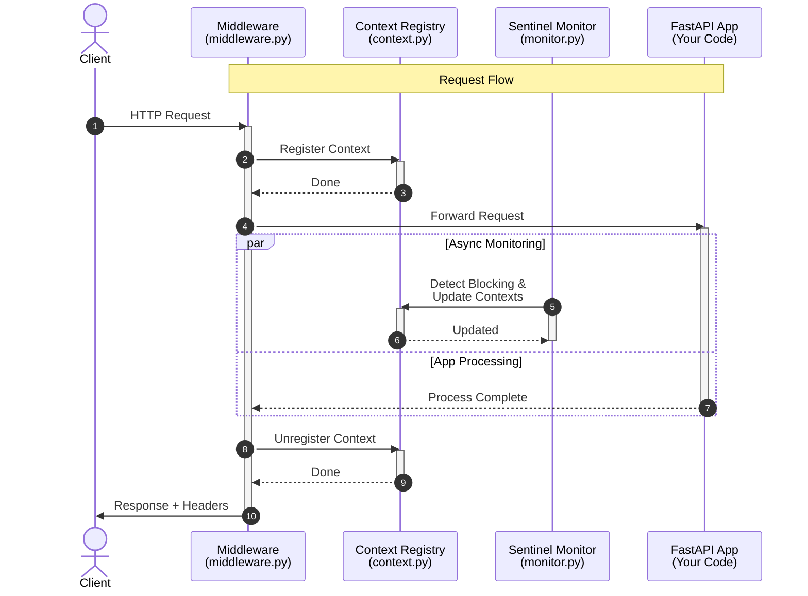

<p align="center">
  
</p>

<p align="center">
  Detect event-loop blocking in FastAPI/Starlette with <strong>per-request attribution</strong>.
</p>

---

[](https://badge.fury.io/py/fastapi-loopguard)
[](https://www.python.org/downloads/)
[](https://opensource.org/licenses/MIT)

`fastapi-loopguard` monitors your event loop and tells you exactly which request caused the blocking. It handles high-concurrency environments with adaptive thresholds and integrates seamlessly with Prometheus.

###

### Quick Start

```bash
pip install fastapi-loopguard
```

```python
from fastapi import FastAPI
from fastapi_loopguard import LoopGuardMiddleware

app = FastAPI()
app.add_middleware(LoopGuardMiddleware)
```

### Features

*   **Per-Request Attribution**: Pinpoint the exact endpoint causing latency.
*   **Cumulative Blocking Detection**: Catch "death by a thousand cuts" where frequent small blocks freeze the loop.
*   **Adaptive Thresholds**: Smart baselines that adjust to server load.
*   **Zero-Overhead Sentinel**: Cooperative monitoring with negligible CPU usage.
*   **Observability Ready**: Built-in support for Prometheus and structured logging.

### Configuration

LoopGuard is highly configurable to suit your environment:

```python
from fastapi import FastAPI
from fastapi_loopguard import LoopGuardMiddleware, LoopGuardConfig

config = LoopGuardConfig(
    # Basic settings
    monitor_interval_ms=10.0,
    fallback_threshold_ms=50.0,
    
    # Enable Cumulative Blocking Detection
    # Detects frequent small blocks (e.g., 20ms) that sum up to a large freeze
    cumulative_blocking_enabled=True,
    cumulative_blocking_threshold_ms=200.0, # Alert if total block > 200ms...
    cumulative_window_ms=1000.0,            # ...within any 1-second window
)

app = FastAPI()
app.add_middleware(LoopGuardMiddleware, config=config)
```

### Request/Response flows



