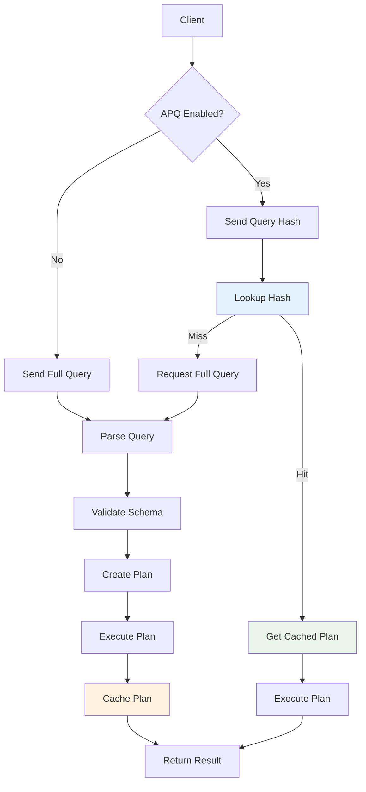

# APQ Cache Flow

## Overview
Automatic Persisted Queries (APQ) is a caching mechanism that optimizes GraphQL request performance by storing and reusing query execution plans. This diagram shows how APQ eliminates redundant query parsing and validation.

## ASCII Art Diagram

```
┌─────────────────────────────────────────────────────────────┐
│                    APQ CACHE FLOW                           │
├──────────────────┬──────────────────┬──────────────────────┤
│   First Request  │   Cache Miss     │   Cache Hit           │
├──────────────────┼──────────────────┼──────────────────────┤
│ • Full Query     │ • Parse Query    │ • Lookup Hash         │
│ • Compute Hash   │ • Validate       │ • Execute Plan        │
│ • Store Plan     │ • Execute        │ • Return Result       │
│ • Return Result  │ • Cache Plan     │ • Fast Path           │
└──────────────────┴──────────────────┴──────────────────────┘
                                                          │
                                                          ▼
┌─────────────────────────────────────────────────────────────┐
│                    CACHE STORAGE                            │
├──────────────────┬──────────────────┬──────────────────────┤
│   Memory         │   Redis          │   Database           │
│   Cache          │   Cache          │   Fallback           │
├──────────────────┼──────────────────┼──────────────────────┤
│ • Fastest        │ • Distributed    │ • Persistent         │
│ • LRU eviction   │ • High avail.    │ • Large capacity     │
│ • Process local  │ • Network cost   │ • Slower access      │
└──────────────────┴──────────────────┴──────────────────────┘
```

## Detailed APQ Flow

### First Request (Cache Population)
```
Client Query ──▶ Full GraphQL Query
                  │
                  ▼
            Hash Computation
            - SHA-256 of query string
            - Consistent across requests
            - Collision resistant
```

### Cache Miss Flow
```
Unknown Hash ──▶ Parse & Validate Query
                  │
                  ▼
            Execution Plan Creation
            - AST generation
            - Type validation
            - Resolver mapping
            - Optimization
```

### Cache Storage
```
Execution Plan ──▶ Cache Storage
                   │
                   ▼
             Plan Persistence
             - Hash → Plan mapping
             - TTL management
             - Size limits
             - Eviction policies
```

### Subsequent Requests (Cache Hit)
```
Query Hash ──▶ Cache Lookup
               │
               ▼
         Plan Retrieval
         - Direct plan execution
         - Skip parsing/validation
         - Fast path execution
```

## Mermaid Diagram



## APQ Protocol

### Client-Side Implementation
```javascript
// First request - send full query
const query = `
  query GetUser($id: ID!) {
    user(id: $id) {
      name
      email
    }
  }
`;

const hash = sha256(query);
const response = await fetch('/graphql', {
  method: 'POST',
  headers: { 'Content-Type': 'application/json' },
  body: JSON.stringify({
    query,
    extensions: {
      persistedQuery: {
        version: 1,
        sha256Hash: hash
      }
    }
  })
});

// Subsequent requests - send only hash
const response = await fetch('/graphql', {
  method: 'POST',
  headers: { 'Content-Type': 'application/json' },
  body: JSON.stringify({
    extensions: {
      persistedQuery: {
        version: 1,
        sha256Hash: hash
      }
    },
    variables: { id: "123" }
  })
});
```

### Server-Side Implementation
```python
class APQMiddleware:
    def __init__(self, cache_store):
        self.cache = cache_store

    async def __call__(self, request, call_next):
        body = await request.json()

        # Check for APQ request
        extensions = body.get('extensions', {})
        persisted_query = extensions.get('persistedQuery')

        if persisted_query:
            query_hash = persisted_query['sha256Hash']

            # Try to get cached query
            cached_query = await self.cache.get(f"apq:{query_hash}")

            if cached_query:
                # Use cached query
                body['query'] = cached_query
            else:
                # Query not cached, expect full query
                if 'query' not in body:
                    return JSONResponse({
                        'errors': [{
                            'message': 'PersistedQueryNotFound',
                            'extensions': {
                                'code': 'PERSISTED_QUERY_NOT_FOUND'
                            }
                        }]
                    }, status_code=200)

                # Cache the query for future use
                await self.cache.set(f"apq:{query_hash}", body['query'])

        return await call_next(request)
```

## Cache Storage Strategies

### In-Memory Cache
**Best for:** Single server deployments
```python
from cachetools import TTLCache

class MemoryAPQCache:
    def __init__(self, max_size=1000, ttl=3600):
        self.cache = TTLCache(maxsize=max_size, ttl=ttl)

    async def get(self, key):
        return self.cache.get(key)

    async def set(self, key, value):
        self.cache[key] = value
```

### Redis Cache
**Best for:** Distributed deployments
```python
import redis.asyncio as redis

class RedisAPQCache:
    def __init__(self, redis_url):
        self.redis = redis.from_url(redis_url)

    async def get(self, key):
        return await self.redis.get(key)

    async def set(self, key, value, ttl=3600):
        await self.redis.setex(key, ttl, value)
```

### Database Cache
**Best for:** Persistence and large scale
```sql
CREATE TABLE apq_cache (
    query_hash varchar(64) PRIMARY KEY,
    query_text text NOT NULL,
    created_at timestamptz DEFAULT now(),
    last_used timestamptz DEFAULT now(),
    use_count integer DEFAULT 0
);

CREATE INDEX idx_apq_last_used ON apq_cache(last_used);
```

```python
class DatabaseAPQCache:
    async def get(self, query_hash):
        async with db.connection() as conn:
            result = await conn.fetchrow(
                "SELECT query_text FROM apq_cache WHERE query_hash = $1",
                query_hash
            )
            if result:
                # Update usage statistics
                await conn.execute(
                    "UPDATE apq_cache SET last_used = now(), use_count = use_count + 1 WHERE query_hash = $1",
                    query_hash
                )
            return result['query_text'] if result else None

    async def set(self, query_hash, query_text):
        async with db.connection() as conn:
            await conn.execute(
                "INSERT INTO apq_cache (query_hash, query_text) VALUES ($1, $2) ON CONFLICT (query_hash) DO NOTHING",
                query_hash, query_text
            )
```

## Performance Benefits

### Latency Reduction
```
Without APQ: Parse (10ms) + Validate (5ms) + Plan (3ms) + Execute (2ms) = 20ms
With APQ:    Lookup (0.1ms) + Execute (2ms) = 2.1ms

Improvement: 90% faster for cached queries
```

### Bandwidth Savings
```
Without APQ: Send full query (2KB) each request
With APQ:    Send hash (64 bytes) + variables

Savings: 97% bandwidth reduction for large queries
```

### Server CPU Savings
- Eliminates redundant AST parsing
- Reduces garbage collection pressure
- Lowers memory allocation for query processing

## Cache Management

### TTL and Eviction
```python
# Time-based expiration
APQ_TTL = 24 * 60 * 60  # 24 hours

# Size-based eviction
MAX_CACHE_SIZE = 10000

# LRU eviction for memory cache
# Automatic expiration for Redis
```

### Cache Invalidation
```python
class APQCacheManager:
    async def invalidate_query(self, query_hash):
        """Remove specific query from cache"""
        await self.cache.delete(f"apq:{query_hash}")

    async def invalidate_all(self):
        """Clear entire APQ cache"""
        # Implementation depends on cache type
        pass

    async def cleanup_unused(self, days=30):
        """Remove queries not used recently"""
        cutoff = datetime.now() - timedelta(days=days)
        # Remove from database cache
        await db.execute(
            "DELETE FROM apq_cache WHERE last_used < $1",
            cutoff
        )
```

## Monitoring and Observability

### Cache Metrics
- Cache hit rate: `hits / (hits + misses)`
- Cache size: Current number of stored queries
- Query frequency: Most/least used queries
- Cache latency: Time to retrieve from cache

### Business Metrics
- Bandwidth savings: Bytes saved by APQ
- Response time improvement: Average latency reduction
- Server CPU reduction: Processing time saved

### Alerting
```python
# Alert if cache hit rate drops below threshold
if cache_hit_rate < 0.8:
    alert("APQ cache hit rate below 80%")

# Alert if cache is near capacity
if cache_size > MAX_CACHE_SIZE * 0.9:
    alert("APQ cache near capacity")
```

## Security Considerations

### Query Hash Validation
- Use cryptographically secure hash (SHA-256)
- Prevent hash collision attacks
- Validate query syntax before caching

### Cache Poisoning Prevention
- Only cache validated queries
- Implement query size limits
- Rate limit cache population

### Access Control
- APQ cache is query-specific, not user-specific
- Schema validation still applies
- Authentication/authorization unchanged

## Implementation Best Practices

### Cache Warming
```python
async def warmup_apq_cache():
    """Pre-populate cache with common queries"""
    common_queries = [
        "query GetUser($id: ID!) { user(id: $id) { name email } }",
        "query GetPosts { posts { title author { name } } }",
        # ... more common queries
    ]

    for query in common_queries:
        query_hash = sha256(query)
        await apq_cache.set(query_hash, query)
```

### Error Handling
```python
try:
    cached_query = await apq_cache.get(query_hash)
    if cached_query:
        # Use cached query
        pass
    else:
        # Handle cache miss
        pass
except Exception as e:
    # Fallback to normal processing
    logger.warning(f"APQ cache error: {e}")
    # Continue without APQ
```

### Testing
```python
def test_apq_flow():
    # Test cache miss
    response = client.post('/graphql', json={
        'query': 'query { test }',
        'extensions': {'persistedQuery': {'version': 1, 'sha256Hash': 'unknown'}}
    })
    assert response.status_code == 200
    assert 'PersistedQueryNotFound' in response.json()['errors'][0]['message']

    # Test cache population
    response = client.post('/graphql', json={
        'query': 'query { test }',
        'extensions': {'persistedQuery': {'version': 1, 'sha256Hash': hash}}
    })
    assert response.status_code == 200
    # Query should now be cached

    # Test cache hit
    response = client.post('/graphql', json={
        'extensions': {'persistedQuery': {'version': 1, 'sha256Hash': hash}},
        'variables': {}
    })
    assert response.status_code == 200
    # Should use cached query
```

## Integration with CDNs

### CDN-Level Caching
```
Client → CDN → APQ Server → Database
          │         │
          ▼         ▼
    Cache by    APQ Cache
    Query Hash  by Hash
```

### Cache Headers
```python
# Set appropriate cache headers for APQ responses
response.headers['Cache-Control'] = 'public, max-age=300'  # 5 minutes
response.headers['ETag'] = f'W/"{query_hash}"'
```

This enables CDN caching of GraphQL responses keyed by query hash, providing even faster responses for popular queries.
