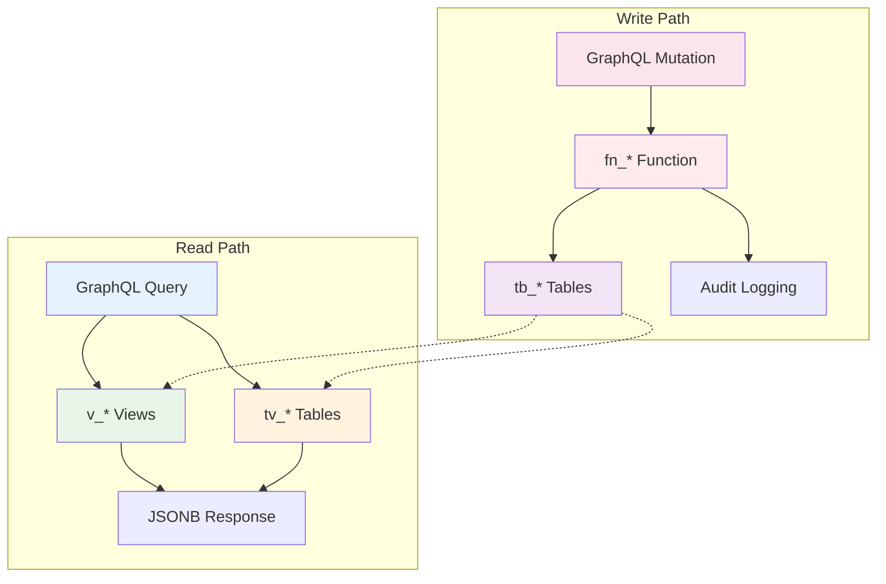

# Database Schema Conventions

## Overview
FraiseQL uses consistent naming conventions to clearly separate different types of database objects and their purposes. This convention system makes the codebase self-documenting and helps developers understand object roles at a glance.

## ASCII Art Diagram

```
┌─────────────────────────────────────────────────────────────┐
│                    DATABASE SCHEMA                          │
├──────────────────┬──────────────────┬──────────────────────┤
│   tb_*           │   v_*            │   tv_*               │
│   Tables         │   Views          │   Table Views        │
│   (Storage)      │   (Read Models)  │   (Denormalized)     │
├──────────────────┼──────────────────┼──────────────────────┤
│ • Normalized     │ • JSONB output   │ • Denormalized       │
│ • ACID writes    │ • Fast reads     │ • Efficient updates  │
│ • Constraints    │ • Denormalized   │ • Incremental refresh│
│ • Primary keys   │ • No updates     │ • Analytics ready    │
└──────────────────┴──────────────────┴──────────────────────┘
                                                          │
                                                          ▼
┌─────────────────────────────────────────────────────────────┐
│                    fn_* FUNCTIONS                           │
├──────────────────┬──────────────────┬──────────────────────┤
│   Business       │   Validation     │   Side Effects       │
│   Logic          │   Rules          │   (Audit, Triggers)  │
└──────────────────┴──────────────────┴──────────────────────┘
```

## Naming Convention Details

### tb_* - Base Tables (Write Storage)
**Purpose**: Normalized data storage for writes
**Characteristics**:
- ACID compliant transactions
- Primary key constraints
- Foreign key relationships
- Triggers for audit/logging
- No direct client access

**Example**:
```sql
CREATE TABLE tb_user (
    id uuid PRIMARY KEY DEFAULT gen_random_uuid(),
    email text UNIQUE NOT NULL,
    name text NOT NULL,
    created_at timestamptz DEFAULT now(),
    updated_at timestamptz DEFAULT now()
);

CREATE TABLE tb_post (
    id uuid PRIMARY KEY DEFAULT gen_random_uuid(),
    title text NOT NULL,
    content text,
    author_id uuid REFERENCES tb_user(id),
    status post_status DEFAULT 'draft',
    created_at timestamptz DEFAULT now(),
    updated_at timestamptz DEFAULT now()
);
```

### v_* - JSONB Views (Read Models)
**Purpose**: Fast, denormalized reads for GraphQL
**Characteristics**:
- Returns JSONB objects ready for GraphQL
- Pre-joined related data
- Optimized for specific query patterns
- Real-time (reflects current table state)

**Example**:
```sql
CREATE VIEW v_post AS
SELECT jsonb_build_object(
    'id', p.id,
    'title', p.title,
    'content', p.content,
    'status', p.status,
    'created_at', p.created_at,
    'author', jsonb_build_object(
        'id', u.id,
        'name', u.name,
        'email', u.email
    ),
    'tags', COALESCE(
        jsonb_agg(
            jsonb_build_object('id', t.id, 'name', t.name)
        ) FILTER (WHERE t.id IS NOT NULL),
        '[]'::jsonb
    )
) as data
FROM tb_post p
JOIN tb_user u ON p.author_id = u.id
LEFT JOIN tb_post_tag pt ON p.id = pt.post_id
LEFT JOIN tb_tag t ON pt.tag_id = t.id
GROUP BY p.id, u.id, u.name, u.email;
```

### tv_* - Table Views (Denormalized)
**Purpose**: Denormalized table views for efficient querying and analytics
**Characteristics**:
- Denormalized data structure optimized for reads
- Can be efficiently updated (one record at a time vs full refresh)
- Better than fully materialized views for incremental updates
- Supports complex joins, aggregations, and computed fields

**Example**:
```sql
-- Denormalized table view for efficient analytics queries
CREATE TABLE tv_post_stats (
    id uuid PRIMARY KEY,
    title text,
    content text,
    author_name text,        -- Denormalized from tb_user
    author_email text,       -- Denormalized from tb_user
    tags text[],             -- Denormalized tag array
    comment_count int,       -- Computed field
    last_comment_at timestamptz,
    created_at timestamptz,
    updated_at timestamptz
);

-- Incremental update function (updates one record)
CREATE FUNCTION fn_update_post_stats(p_post_id uuid) RETURNS void AS $$
BEGIN
    INSERT INTO tv_post_stats (
        id, title, content, author_name, author_email,
        tags, comment_count, last_comment_at, created_at, updated_at
    )
    SELECT
        p.id, p.title, p.content,
        u.name, u.email,
        array_agg(t.name) FILTER (WHERE t.id IS NOT NULL),
        COUNT(c.id),
        MAX(c.created_at),
        p.created_at, p.updated_at
    FROM tb_post p
    JOIN tb_user u ON p.author_id = u.id
    LEFT JOIN tb_post_tag pt ON p.id = pt.post_id
    LEFT JOIN tb_tag t ON pt.tag_id = t.id
    LEFT JOIN tb_comment c ON p.id = c.post_id
    WHERE p.id = p_post_id
    GROUP BY p.id, p.title, p.content, u.name, u.email, p.created_at, p.updated_at
    ON CONFLICT (id) DO UPDATE SET
        title = EXCLUDED.title,
        content = EXCLUDED.content,
        author_name = EXCLUDED.author_name,
        author_email = EXCLUDED.author_email,
        tags = EXCLUDED.tags,
        comment_count = EXCLUDED.comment_count,
        last_comment_at = EXCLUDED.last_comment_at,
        updated_at = EXCLUDED.updated_at;
END;
$$ LANGUAGE plpgsql;
```

### fn_* - Business Logic Functions
**Purpose**: Encapsulate write operations and business rules
**Characteristics**:
- Input validation
- Business rule enforcement
- Transaction management
- Audit logging
- May update multiple tables

**Example**:
```sql
CREATE FUNCTION fn_create_post(
    p_title text,
    p_content text,
    p_author_id uuid,
    p_tags text[] DEFAULT ARRAY[]::text[]
) RETURNS uuid AS $$
DECLARE
    v_post_id uuid;
    v_tag_id uuid;
BEGIN
    -- Input validation
    IF p_title IS NULL OR trim(p_title) = '' THEN
        RAISE EXCEPTION 'Post title cannot be empty';
    END IF;

    IF NOT EXISTS (SELECT 1 FROM tb_user WHERE id = p_author_id) THEN
        RAISE EXCEPTION 'Author does not exist';
    END IF;

    -- Business logic: Create post
    INSERT INTO tb_post (title, content, author_id)
    VALUES (p_title, p_content, p_author_id)
    RETURNING id INTO v_post_id;

    -- Business logic: Add tags
    FOREACH v_tag_name IN ARRAY p_tags LOOP
        -- Create tag if it doesn't exist
        INSERT INTO tb_tag (name)
        VALUES (v_tag_name)
        ON CONFLICT (name) DO NOTHING
        RETURNING id INTO v_tag_id;

        IF v_tag_id IS NULL THEN
            SELECT id INTO v_tag_id FROM tb_tag WHERE name = v_tag_name;
        END IF;

        -- Link tag to post
        INSERT INTO tb_post_tag (post_id, tag_id)
        VALUES (v_post_id, v_tag_id);
    END LOOP;

    -- Audit logging
    INSERT INTO tb_audit (action, entity_type, entity_id, user_id, details)
    VALUES ('create', 'post', v_post_id, p_author_id,
            jsonb_build_object('title', p_title, 'tag_count', array_length(p_tags, 1)));

    RETURN v_post_id;
END;
$$ LANGUAGE plpgsql;
```

## Mermaid Diagram



## Convention Benefits

### Self-Documenting Code
- **tb_user**: "This is a base table for user storage"
- **v_post**: "This is a view for reading post data"
- **tv_stats**: "This is a table view for statistics"
- **fn_create_post**: "This function creates a post"

### Clear Separation of Concerns
- **Writes**: Always go through functions (business logic)
- **Reads**: Use views (fast) or table views (complex)
- **Storage**: Normalized tables with constraints
- **Presentation**: Denormalized JSONB views

### Performance Optimization
- **Reads**: Pre-computed joins in views
- **Writes**: Validation and business logic in functions
- **Analytics**: Expensive computations in table views
- **Real-time**: Views always reflect current state

## Migration Patterns

### From Traditional ORM
```
Traditional: User.find(id) → SQL → ORM → Object
FraiseQL:   v_user WHERE id = ? → JSONB → GraphQL
```

### From REST API
```
REST: POST /api/posts → Controller → SQL Inserts → Response
FraiseQL: mutation createPost → fn_create_post → tb_* updates → JSONB
```

## Common Patterns

### User Management
```sql
-- Storage
CREATE TABLE tb_user (...);

-- Reads
CREATE VIEW v_user AS SELECT jsonb_build_object(...) FROM tb_user;

-- Writes
CREATE FUNCTION fn_create_user(...) RETURNS uuid AS $$ ... $$;
CREATE FUNCTION fn_update_user(...) RETURNS void AS $$ ... $$;
```

### Content with Comments
```sql
-- Storage
CREATE TABLE tb_post (...);
CREATE TABLE tb_comment (...);

-- Reads
CREATE VIEW v_post_with_comments AS
SELECT jsonb_build_object(
    'post', (SELECT jsonb_build_object(...) FROM tb_post WHERE id = p.id),
    'comments', COALESCE(jsonb_agg(...), '[]'::jsonb)
) as data
FROM tb_post p
LEFT JOIN tb_comment c ON p.id = c.post_id
GROUP BY p.id;

-- Writes
CREATE FUNCTION fn_add_comment(...) RETURNS uuid AS $$ ... $$;
```

## Best Practices

### When to Use Each Type

**Use tb_* tables for:**
- Primary data storage
- Data that needs referential integrity
- Data modified by business logic
- Data that needs auditing

**Use v_* views for:**
- GraphQL query responses
- Real-time data requirements
- Simple object relationships
- Performance-critical reads

**Use tv_* tables for:**
- Complex aggregations
- Statistical computations
- Data warehouse scenarios
- Expensive calculations

**Use fn_* functions for:**
- Multi-table operations
- Business rule validation
- Audit trail creation
- Complex write operations

### Naming Guidelines
- Always use full prefixes (tb_, v_, tv_, fn_)
- Use descriptive names after prefix
- Use snake_case consistently
- Keep names concise but clear

### Maintenance
- Document view dependencies
- Version function interfaces
- Monitor view performance
- Refresh table views appropriately
