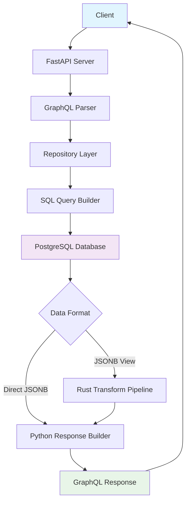

# Request Flow Diagram

## Overview
This diagram shows the complete lifecycle of a GraphQL request through the FraiseQL architecture, from client to database and back.

## ASCII Art Diagram

```
┌─────────────┐     ┌─────────────┐     ┌─────────────┐     ┌─────────────┐
│   Client    │────▶│  FastAPI    │────▶│ Repository  │────▶│ PostgreSQL  │
│             │     │  Server     │     │             │     │  Database   │
│ GraphQL     │     │             │     │ SQL Query   │     │             │
│ Request     │     │ GraphQL     │     │ Builder     │     │ JSONB Views │
│             │     │ Parser      │     │             │     │ Functions   │
└─────────────┘     └─────────────┘     └─────────────┘     └─────────────┘
                                                        │
                                                        ▼
┌─────────────┐     ┌─────────────┐     ┌─────────────┐     ┌─────────────┐
│   Rust      │────▶│   Rust      │────▶│   Python    │────▶│   Client    │
│ Transform   │     │ Pipeline    │     │ Response    │     │             │
│ (Optional)  │     │ (Optional)  │     │ Builder     │     │ GraphQL     │
│             │     │             │     │             │     │ Response     │
└─────────────┘     └─────────────┘     └─────────────┘     └─────────────┘
```

## Detailed Flow with Annotations

### Phase 1: Request Reception
```
Client Request ──▶ FastAPI Server
                      │
                      ▼
                GraphQL Parser
                - Validates syntax
                - Parses query/mutation
                - Extracts variables
```

### Phase 2: Query Resolution
```
Parsed Query ──▶ Repository Layer
                   │
                   ▼
             SQL Query Builder
             - Maps GraphQL to SQL
             - Uses v_* views for queries
             - Uses fn_* functions for mutations
             - Applies filtering/sorting
```

### Phase 3: Database Execution
```
SQL Query ──▶ PostgreSQL Database
                │
                ▼
          Database Processing
          - Executes view/function
          - Returns JSONB data
          - Handles transactions
```

### Phase 4: Response Transformation (Optional)
```
Raw Data ──▶ Rust Transform Pipeline (Optional)
               │
               ▼
         Data Transformation
         - JSONB to GraphQL types
         - Field projection
         - Performance optimization
```

### Phase 5: Response Building
```
Transformed Data ──▶ Python Response Builder
                      │
                      ▼
                GraphQL Response
                - Formats JSON response
                - Includes errors if any
                - Ready for client
```

## Mermaid Diagram



## Key Components Explained

### Client
- Sends GraphQL queries/mutations
- Receives JSON responses
- Can be web app, mobile app, or API client

### FastAPI Server
- HTTP server handling GraphQL requests
- Routes to appropriate resolvers
- Handles authentication/authorization

### Repository Layer
- Abstracts database operations
- Maps GraphQL operations to SQL
- Handles connection pooling

### PostgreSQL Database
- Stores data in relational tables (tb_*)
- Serves data through JSONB views (v_*)
- Executes business logic functions (fn_*)

### Rust Transform Pipeline (Optional)
- High-performance data transformation
- JSONB to GraphQL type conversion
- Field-level projections and filtering

### Response Builder
- Formats final GraphQL response
- Handles error formatting
- Applies GraphQL spec compliance

## Example Flow: Get User Query

```python
# GraphQL Query
query GetUser($id: UUID!) {
  user(id: $id) {
    id
    name
    email
  }
}
```

**Flow:**
1. **Client** → FastAPI receives HTTP POST with GraphQL query
2. **FastAPI** → Parses query, validates against schema
3. **Repository** → Builds SQL: `SELECT * FROM v_user WHERE id = $1`
4. **PostgreSQL** → Executes view, returns JSONB data
5. **Response Builder** → Formats as GraphQL JSON response
6. **Client** ← Receives formatted user data

## Performance Characteristics

- **Read Queries**: Direct JSONB view execution (fastest)
- **Write Mutations**: Function calls with transaction handling
- **Complex Queries**: May use Rust pipeline for optimization
- **Cached Queries**: APQ bypasses some parsing steps

## Error Handling Flow

```
Error Occurs ──▶ Exception Caught
                  │
                  ▼
            Error Formatter
            - Converts to GraphQL error format
            - Includes stack traces (dev mode)
            - Returns partial results if possible
```

## Monitoring Points

- Request start/end times
- Database query execution time
- Rust pipeline processing time
- Response size metrics
- Error rates by component
