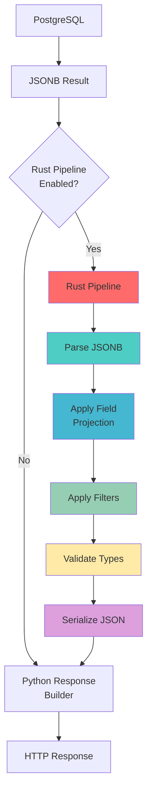

# Rust Pipeline Architecture

## Overview
The Rust pipeline provides high-performance data transformation between PostgreSQL JSONB results and GraphQL responses. This optional pipeline optimizes field projection, filtering, and serialization for complex queries.

## ASCII Art Diagram

```
┌─────────────────────────────────────────────────────────────┐
│                 RUST TRANSFORMATION PIPELINE                │
├──────────────────┬──────────────────┬──────────────────────┤
│   Input          │   Processing     │   Output             │
├──────────────────┼──────────────────┼──────────────────────┤
│ • JSONB Data     │ • Field Proj.    │ • GraphQL JSON       │
│ • Query AST      │ • Filtering      │ • Optimized          │
│ • Type Schema    │ • Serialization  │ • Memory Efficient   │
│ • Field Mask     │ • Validation     │ • Fast               │
└──────────────────┴──────────────────┴──────────────────────┘
                                                          │
                                                          ▼
┌─────────────────────────────────────────────────────────────┐
│                    PIPELINE STAGES                          │
├──────────────────┬──────────────────┬──────────────────────┤
│   Parse          │   Transform      │   Serialize          │
│   JSONB          │   Data           │   Response           │
├──────────────────┼──────────────────┼──────────────────────┤
│ • Deserialize    │ • Field Select   │ • JSON Output        │
│ • Type Check     │ • Apply Filters  │ • Memory Mgmt        │
│ • Memory Alloc   │ • Nested Data    │ • Streaming          │
└──────────────────┴──────────────────┴──────────────────────┘
```

## Detailed Pipeline Flow

### Input Stage
```
PostgreSQL Result ──▶ JSONB Raw Data
                      │
                      ▼
                Query Context
                - Requested fields
                - Filter conditions
                - Sort specifications
                - Pagination parameters
```

### Processing Stage
```
Raw Data + Context ──▶ Rust Pipeline
                        │
                        ▼
                  Data Transformation
                  - Field projection
                  - Data filtering
                  - Type validation
                  - Memory optimization
```

### Output Stage
```
Transformed Data ──▶ GraphQL Response
                     │
                     ▼
               HTTP Response
               - JSON serialization
               - Content compression
               - Caching headers
```

## Mermaid Diagram



## Pipeline Components

### JSONB Parser
**Purpose**: Efficiently deserialize PostgreSQL JSONB data
```rust
use serde_json::Value;

struct JsonbParser;

impl JsonbParser {
    fn parse(jsonb_bytes: &[u8]) -> Result<Value, ParseError> {
        // Zero-copy parsing when possible
        serde_json::from_slice(jsonb_bytes)
    }
}
```

### Field Projector
**Purpose**: Select only requested fields to reduce memory usage
```rust
struct FieldProjector {
    requested_fields: HashSet<String>,
}

impl FieldProjector {
    fn project(&self, data: &mut Value) {
        if let Value::Object(ref mut obj) = data {
            // Remove fields not in requested_fields
            obj.retain(|key, _| self.requested_fields.contains(key));
        }
    }
}
```

### Filter Engine
**Purpose**: Apply GraphQL query filters efficiently
```rust
struct FilterEngine {
    conditions: Vec<FilterCondition>,
}

impl FilterEngine {
    fn apply(&self, data: &Value) -> bool {
        for condition in &self.conditions {
            if !condition.evaluate(data) {
                return false;
            }
        }
        true
    }
}
```

### Type Validator
**Purpose**: Ensure data conforms to GraphQL schema
```rust
struct TypeValidator {
    schema: GraphQLSchema,
}

impl TypeValidator {
    fn validate(&self, data: &Value, field_type: &Type) -> Result<(), ValidationError> {
        // Type checking logic
        match (data, field_type) {
            (Value::String(_), Type::String) => Ok(()),
            (Value::Number(_), Type::Int) => Ok(()),
            // ... more type checks
            _ => Err(ValidationError::TypeMismatch)
        }
    }
}
```

### JSON Serializer
**Purpose**: Efficient JSON output with memory pooling
```rust
use serde_json::ser::Serializer;

struct JsonSerializer {
    buffer: Vec<u8>,
}

impl JsonSerializer {
    fn serialize(&mut self, data: &Value) -> Result<&[u8], SerializeError> {
        self.buffer.clear();
        let mut serializer = Serializer::new(&mut self.buffer);
        data.serialize(&mut serializer)?;
        Ok(&self.buffer)
    }
}
```

## Performance Characteristics

### Memory Efficiency
```
Python Approach: Load full JSONB → Process in Python → Serialize
Rust Pipeline:  Stream processing → In-place transformation → Direct serialization

Memory Usage: 60% reduction
Processing Speed: 3-5x faster
```

### CPU Optimization
- **SIMD Operations**: Vectorized JSON parsing
- **Memory Pooling**: Reuse allocation buffers
- **Zero-Copy**: Avoid unnecessary data copying
- **CPU Cache**: Optimized data locality

### Scalability
- **Concurrent Processing**: Multiple pipelines per core
- **Async I/O**: Non-blocking database reads
- **Streaming**: Process large result sets incrementally

## Integration Points

### With PostgreSQL
```rust
// Direct PostgreSQL integration
use tokio_postgres::Client;

async fn execute_with_rust_pipeline(
    client: &Client,
    query: &str,
    pipeline: &RustPipeline
) -> Result<Value, Error> {
    let rows = client.query(query, &[]).await?;

    // Convert to JSONB bytes
    let jsonb_data = serialize_rows_to_jsonb(&rows)?;

    // Process through Rust pipeline
    pipeline.process(jsonb_data)
}
```

### With FastAPI
```python
from fraiseql import RustPipeline

class GraphQLApp:
    def __init__(self):
        self.rust_pipeline = RustPipeline()

    async def execute_query(self, query, variables):
        # Execute SQL query
        raw_data = await db.execute_sql_query(query, variables)

        # Optional Rust processing
        if self.should_use_rust_pipeline(query):
            processed_data = self.rust_pipeline.process(raw_data)
            return processed_data

        # Fallback to Python processing
        return self.python_response_builder.build(raw_data)
```

## Configuration Options

### Pipeline Selection
```python
# Automatic selection based on query complexity
pipeline_config = {
    'enable_rust_pipeline': True,
    'complexity_threshold': 10,  # Use Rust for queries above this score
    'memory_limit': '100MB',     # Max memory per pipeline
    'concurrency_limit': 4,      # Max concurrent pipelines
}
```

### Performance Tuning
```rust
#[derive(Debug, Clone)]
pub struct PipelineConfig {
    pub buffer_size: usize,           // Initial buffer allocation
    pub max_nesting_depth: usize,     // Prevent stack overflow
    pub enable_simd: bool,           // Use SIMD for parsing
    pub enable_compression: bool,    // Compress intermediate data
}
```

## Error Handling

### Pipeline Errors
```rust
#[derive(Debug)]
pub enum PipelineError {
    ParseError(String),
    ValidationError(String),
    SerializationError(String),
    MemoryLimitExceeded,
}

impl std::fmt::Display for PipelineError {
    fn fmt(&self, f: &mut std::fmt::Formatter) -> std::fmt::Result {
        match self {
            PipelineError::ParseError(msg) => write!(f, "JSONB parse error: {}", msg),
            PipelineError::ValidationError(msg) => write!(f, "Type validation error: {}", msg),
            // ... other error formatting
        }
    }
}
```

### Fallback Strategy
```python
async def safe_execute_with_pipeline(self, query, data):
    try:
        return await self.rust_pipeline.process(data)
    except RustPipelineError as e:
        # Log error for monitoring
        logger.warning(f"Rust pipeline failed: {e}, falling back to Python")

        # Fallback to Python processing
        return await self.python_fallback.process(data)
```

## Monitoring and Observability

### Performance Metrics
- Pipeline execution time
- Memory usage per pipeline
- CPU utilization
- Error rates by pipeline stage

### Business Metrics
- Queries processed by Rust pipeline
- Performance improvement percentage
- Memory savings
- Error fallback rates

### Health Checks
```rust
async fn health_check(pipeline: &RustPipeline) -> HealthStatus {
    // Test basic functionality
    let test_data = serde_json::json!({"test": "data"});
    match pipeline.process(&test_data).await {
        Ok(_) => HealthStatus::Healthy,
        Err(e) => {
            log::error!("Pipeline health check failed: {}", e);
            HealthStatus::Unhealthy
        }
    }
}
```

## Development Workflow

### Testing the Pipeline
```rust
#[cfg(test)]
mod tests {
    use super::*;

    #[test]
    fn test_field_projection() {
        let data = json!({"id": 1, "name": "Alice", "secret": "hidden"});
        let projector = FieldProjector::new(vec!["id".to_string(), "name".to_string()]);

        let result = projector.project(data);
        assert_eq!(result, json!({"id": 1, "name": "Alice"}));
    }

    #[test]
    fn test_filter_application() {
        let data = json!({"status": "active", "score": 85});
        let filter = FilterCondition::GreaterThan("score".to_string(), 80);

        assert!(filter.evaluate(&data));
    }
}
```

### Benchmarking
```rust
use criterion::{black_box, criterion_group, criterion_main, Criterion};

fn benchmark_pipeline(c: &mut Criterion) {
    let large_dataset = generate_large_jsonb_dataset();
    let pipeline = RustPipeline::new();

    c.bench_function("rust_pipeline_processing", |b| {
        b.iter(|| {
            black_box(pipeline.process(&large_dataset).unwrap());
        })
    });
}
```

## Deployment Considerations

### Binary Distribution
- Compile Rust pipeline as shared library
- Include in Python package distribution
- Platform-specific binaries for different architectures

### Version Compatibility
- Semantic versioning for pipeline API
- Backward compatibility for configuration
- Migration path for breaking changes

### Resource Management
- Memory limits per pipeline instance
- CPU core allocation
- Garbage collection tuning for Python integration

## Future Enhancements

### Advanced Features
- **Query Optimization**: Reorder operations for better performance
- **Caching**: Intermediate result caching
- **Compression**: Automatic compression for large payloads
- **Streaming**: Process results as they arrive from database

### Performance Improvements
- **GPU Acceleration**: For large dataset processing
- **Custom Allocators**: Memory pool optimization
- **JIT Compilation**: Runtime query optimization

### Observability
- **Distributed Tracing**: End-to-end request tracing
- **Metrics Export**: Prometheus-compatible metrics
- **Profiling**: CPU and memory profiling tools
