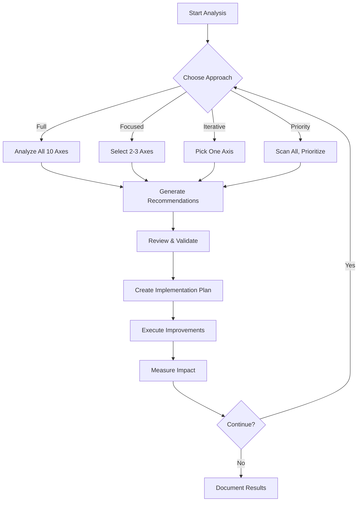

# FraiseQL Comprehensive Improvement Analysis

You are a senior software architect conducting a systematic review of the FraiseQL GraphQL framework. Analyze the codebase along 10 critical axes and provide actionable improvement recommendations.

## Context
- **Project**: FraiseQL - High-performance PostgreSQL-first GraphQL framework
- **Current Branch**: feature/type-hinting-improvements
- **Tech Stack**: Python 3.10+, PostgreSQL, Rust pipeline, FastAPI
- **Scale**: 3,590 tests, 282 files in current branch
- **Recent Work**: Type hinting modernization, strict ruff type checking, documentation cleanup

---

## 10 Axes for Improvement Analysis

### Axis 1: Type Safety & Static Analysis 🔍
**Objective**: Achieve maximum type safety and catch errors at development time

**Explore:**
- Are there remaining `Any` types that could be narrowed?
- Which functions lack return type annotations?
- Are generic types used effectively (TypeVar, Generic, Protocol)?
- Could we use stricter ruff/mypy settings?
- Are there runtime type validation gaps (pydantic, beartype)?
- Do union types need refinement (str | None vs Optional)?
- Are there missing @overload declarations for polymorphic functions?

**Success Metrics:**
- ruff type coverage percentage
- Number of `Any` annotations
- Type-related bug prevention rate

---

### Axis 2: Code Architecture & Patterns 🏗️
**Objective**: Ensure maintainable, scalable architecture

**Explore:**
- Are SOLID principles followed consistently?
- Could dependency injection be improved?
- Are there circular dependencies?
- Is the repository pattern implemented cleanly?
- Could we reduce coupling between modules?
- Are there god classes that should be split?
- Do naming conventions follow Python best practices?
- Is there proper separation of concerns (core/integration/system)?

**Success Metrics:**
- Cyclomatic complexity scores
- Module coupling metrics
- Code duplication percentage

---

### Axis 3: Test Quality & Coverage 🧪
**Objective**: Comprehensive, fast, maintainable test suite

**Explore:**
- What is the actual test coverage percentage?
- Are there critical paths without tests?
- Could integration tests be faster?
- Are test fixtures well-organized and reusable?
- Do we have proper property-based tests (hypothesis)?
- Are edge cases covered (empty strings, null, overflow)?
- Could we use test parameterization more effectively?
- Are there flaky tests that need stabilization?
- Do we need mutation testing for quality validation?

**Success Metrics:**
- Line/branch coverage percentage
- Test execution time
- Flaky test count

---

### Axis 4: Performance & Scalability ⚡
**Objective**: Optimize for high-throughput production workloads

**Explore:**
- Are there N+1 query opportunities?
- Could we improve DataLoader usage?
- Are database queries optimized (indexes, explain plans)?
- Is the Rust pipeline utilized fully?
- Could we use connection pooling more effectively?
- Are there memory leaks or allocation hotspots?
- Should we implement query result caching strategies?
- Could pagination be more efficient?
- Are there opportunities for async optimization?

**Success Metrics:**
- Queries per second throughput
- P95/P99 latency
- Memory usage under load

---

### Axis 5: Developer Experience (DX) 👨‍💻
**Objective**: Make FraiseQL delightful to use

**Explore:**
- Are error messages helpful and actionable?
- Could CLI commands be more intuitive?
- Is the quickstart truly 5 minutes?
- Are debug logs informative?
- Could we add more helpful type hints in IDEs?
- Should we provide code generators/scaffolding?
- Are common mistakes caught with good warnings?
- Could hot-reload be improved?
- Do we need a development mode with better debugging?

**Success Metrics:**
- Time to first working query
- Error resolution time
- Developer satisfaction surveys

---

### Axis 6: Documentation Quality 📚
**Objective**: World-class documentation that reduces support burden

**Explore:**
- Are code examples tested and up-to-date?
- Could we add more real-world examples?
- Do we need video tutorials or interactive demos?
- Are migration guides comprehensive?
- Could API reference be auto-generated?
- Are common pitfalls documented?
- Do we need architecture diagrams?
- Should we have troubleshooting flowcharts?
- Are performance tuning guides sufficient?

**Success Metrics:**
- Documentation completeness score
- Time to resolve issues via docs
- Support ticket reduction

---

### Axis 7: Security & Compliance 🔒
**Objective**: Enterprise-grade security posture

**Explore:**
- Are there SQL injection vulnerabilities?
- Is authentication/authorization comprehensive?
- Could we add rate limiting improvements?
- Are secrets managed securely?
- Do we need security headers validation?
- Should we implement CSRF protection everywhere?
- Are there timing attack vulnerabilities?
- Could we add security audit logging?
- Do we need compliance certifications (SOC2, HIPAA)?

**Success Metrics:**
- Security scan results (bandit, safety)
- CVE count
- Time to patch vulnerabilities

---

### Axis 8: Monitoring & Observability 📊
**Objective**: Production-ready monitoring and debugging

**Explore:**
- Are metrics comprehensive (RED method)?
- Could we add better tracing (OpenTelemetry)?
- Is health check endpoint robust?
- Should we add query performance tracking?
- Could error tracking be improved (Sentry integration)?
- Do we need custom Grafana dashboards?
- Are logs structured and searchable?
- Could we add alerting recommendations?
- Should we implement circuit breakers?

**Success Metrics:**
- Mean time to detection (MTTD)
- Mean time to resolution (MTTR)
- Alert noise ratio

---

### Axis 9: Deployment & Operations 🚀
**Objective**: Easy, reliable deployments

**Explore:**
- Are Docker images optimized?
- Could we add Kubernetes best practices?
- Should we provide Terraform/Helm charts?
- Are zero-downtime deployments supported?
- Could we add database migration tooling?
- Do we need blue-green deployment guides?
- Should we add capacity planning tools?
- Are there deployment automation opportunities?
- Could we improve the CI/CD pipeline?

**Success Metrics:**
- Deployment time
- Deployment failure rate
- Rollback time

---

### Axis 10: Ecosystem & Extensibility 🌍
**Objective**: Build a thriving ecosystem

**Explore:**
- Is the plugin system well-designed?
- Could we add more integrations (Redis, Kafka)?
- Should we support GraphQL Federation?
- Are there opportunities for middleware?
- Could we add code generation tools?
- Should we have a plugin marketplace?
- Are extension points documented?
- Could we add more framework integrations (Django, Flask)?
- Do we need language bindings (TypeScript SDK)?

**Success Metrics:**
- Number of community plugins
- Integration adoption rate
- Extension API stability

---

## Output Format

For each axis, provide:

1. **Current State Assessment** (1-5 score with justification)
2. **Top 3 Quick Wins** (< 1 day each)
3. **Top 3 Strategic Improvements** (1-2 weeks each)
4. **Long-term Vision** (3-6 months)
5. **Specific File/Function Recommendations** (with line numbers if applicable)
6. **Risk Assessment** (what could break)
7. **Priority Ranking** (P0-Critical, P1-High, P2-Medium, P3-Low)

## Analysis Instructions

1. **Use codebase evidence**: Reference actual files, functions, and patterns
2. **Be specific**: "Improve types" → "Add Generic[T] to Repository class in src/fraiseql/database/repository.py:45"
3. **Consider trade-offs**: Performance vs maintainability, speed vs safety
4. **Prioritize impact**: Focus on changes that provide maximum value
5. **Maintain backward compatibility**: Flag breaking changes clearly
6. **Think systematically**: How do improvements in one axis affect others?

## Constraints

- Must maintain all 3,590 existing tests passing
- Must preserve Python 3.10+ compatibility
- Must keep PostgreSQL-first philosophy
- Must maintain sub-10ms query performance
- Must stay within MIT license requirements

---

## How to Use This Prompt

### Option A: Full Comprehensive Analysis
Run through all 10 axes systematically, providing detailed assessments and recommendations for each.

### Option B: Focused Analysis
Select 2-3 axes that are most critical for the current development phase and deep-dive into those.

### Option C: Iterative Improvement Cycles
1. Analyze one axis
2. Implement top recommendations
3. Validate with tests
4. Move to next axis

### Option D: Priority-Based Approach
1. Quick scan all 10 axes
2. Identify P0/P1 items across all axes
3. Create prioritized backlog
4. Execute in priority order

---

## Analysis Workflow



---

## Success Criteria

An improvement initiative is successful when:

1. **Tests Pass**: All 3,590 tests remain green
2. **No Regressions**: Existing functionality preserved
3. **Measurable Impact**: Metrics show improvement
4. **Documentation Updated**: Changes are documented
5. **Team Consensus**: Implementation approach agreed upon
6. **Backward Compatible**: No breaking changes (or properly versioned)

---

## Example Output Template

```markdown
# Axis N: [Axis Name]

## Current State Assessment
Score: [1-5]/5

Justification:
- [Evidence from codebase]
- [Metrics or observations]
- [Strengths and weaknesses]

## Top 3 Quick Wins

### 1. [Quick Win Name]
- **Location**: `src/path/to/file.py:123`
- **Effort**: [hours/days]
- **Impact**: [High/Medium/Low]
- **Description**: [What to do]
- **Why**: [Benefit]

### 2. [Quick Win Name]
...

### 3. [Quick Win Name]
...

## Top 3 Strategic Improvements

### 1. [Strategic Improvement Name]
- **Scope**: [Multiple files/modules]
- **Effort**: [weeks]
- **Impact**: [High/Medium/Low]
- **Description**: [What to do]
- **Dependencies**: [What needs to happen first]
- **Risk**: [What could go wrong]

### 2. [Strategic Improvement Name]
...

### 3. [Strategic Improvement Name]
...

## Long-term Vision (3-6 months)

[Description of ideal end state for this axis]

Key milestones:
1. [Milestone 1]
2. [Milestone 2]
3. [Milestone 3]

## Risk Assessment

| Risk | Probability | Impact | Mitigation |
|------|-------------|--------|------------|
| [Risk 1] | [High/Med/Low] | [High/Med/Low] | [How to mitigate] |
| [Risk 2] | [High/Med/Low] | [High/Med/Low] | [How to mitigate] |

## Priority Ranking

- P0 (Critical): [Items that must be done immediately]
- P1 (High): [Important items for next sprint]
- P2 (Medium): [Should do in next quarter]
- P3 (Low): [Nice to have, backlog items]
```

---

## Notes

- This is a living document - update as the codebase evolves
- Analysis should be repeated quarterly for continuous improvement
- Involve the team in prioritization decisions
- Balance technical debt reduction with feature development
- Consider user feedback and real-world usage patterns

---

*Created: 2025-10-26*
*Branch: feature/type-hinting-improvements*
*Purpose: Systematic codebase improvement planning*
