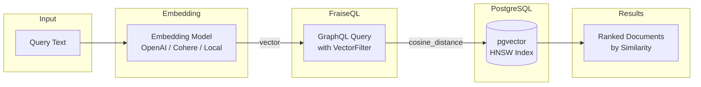

# PostgreSQL pgvector Support

FraiseQL provides native support for PostgreSQL's pgvector extension, enabling high-performance vector similarity search through type-safe GraphQL interfaces.

## Overview

pgvector adds vector similarity search capabilities to PostgreSQL, allowing you to store and query high-dimensional vectors (embeddings) for semantic search, recommendations, and RAG systems. FraiseQL exposes pgvector's six distance operators through GraphQL filters, maintaining the framework's philosophy of being a thin, transparent layer over PostgreSQL.

### Vector Search Pipeline



## PostgreSQL Setup

### 1. Install pgvector Extension

```sql
-- Install pgvector (requires PostgreSQL 11+)
CREATE EXTENSION vector;
```

**Note**: pgvector must be installed on your PostgreSQL server. For Docker:

```dockerfile
FROM postgres:16
RUN apt-get update && apt-get install -y postgresql-16-pgvector
```

### 2. Create Vector Columns

```sql
CREATE TABLE documents (
    id UUID PRIMARY KEY,
    title TEXT,
    content TEXT,
    embedding vector(384),  -- OpenAI text-embedding-ada-002
    tenant_id UUID,
    created_at TIMESTAMP WITH TIME ZONE DEFAULT NOW()
);
```

Vector dimensions must be consistent within a column. Common dimensions:
- OpenAI `text-embedding-ada-002`: 1536 dimensions
- OpenAI `text-embedding-3-small`: 1536 dimensions
- Cohere `embed-english-v3.0`: 1024 dimensions

### 3. Create Performance Indexes

```sql
-- HNSW index for approximate nearest neighbor search (recommended)
CREATE INDEX ON documents
USING hnsw (embedding vector_cosine_ops)
WITH (m = 16, ef_construction = 64);

-- IVFFlat index for larger datasets
CREATE INDEX ON documents
USING ivfflat (embedding vector_cosine_ops)
WITH (lists = 100);
```

## FraiseQL Type Definition

Define vector fields using `list[float]` with vector-related field names:

```python
from fraiseql import fraise_type
from typing import List
from uuid import UUID

@fraise_type
class Document:
    id: UUID
    title: str
    content: str
    embedding: List[float]  # Detected as vector field by name pattern
    text_embedding: List[float]  # Also detected as vector
    tenant_id: UUID
    created_at: str
```

### Field Name Patterns

FraiseQL automatically detects vector fields using these patterns:
- `embedding`
- `vector`
- `_embedding`
- `_vector`
- `embedding_vector`
- `text_embedding`
- `image_embedding`

Fields matching these patterns with `List[float]` type get `VectorFilter` in GraphQL schema.

## GraphQL API

### VectorFilter Schema

```graphql
input VectorFilter {
  cosine_distance: [Float!]
  l2_distance: [Float!]
  inner_product: [Float!]
  l1_distance: [Float!]
  hamming_distance: String
  jaccard_distance: String
  isnull: Boolean
}
```

### VectorOrderBy Schema

```graphql
input VectorOrderBy {
  cosine_distance: [Float!]
  l2_distance: [Float!]
  inner_product: [Float!]
  l1_distance: [Float!]
  hamming_distance: String
  jaccard_distance: String
}
```

### Distance Operators

FraiseQL exposes PostgreSQL pgvector's six native distance operators:

#### Cosine Distance (`cosine_distance`)
- **Operator**: `<=>` (cosine distance)
- **Range**: 0.0 (identical) to 2.0 (opposite)
- **Use case**: Text similarity, semantic search

```graphql
query {
  documents(
    where: { embedding: { cosine_distance: [0.1, 0.2, 0.3, ...] } }
    limit: 10
  ) {
    id
    title
    content
  }
}
```

#### L2 Distance (`l2_distance`)
- **Operator**: `<->` (Euclidean distance)
- **Range**: 0.0 (identical) to ∞ (very different)
- **Use case**: Spatial similarity, exact matches

```graphql
query {
  documents(
    where: { embedding: { l2_distance: [0.1, 0.2, 0.3, ...] } }
    limit: 10
  ) {
    id
    title
    content
  }
}
```

#### Inner Product (`inner_product`)
- **Operator**: `<#>` (negative inner product)
- **Range**: More negative = more similar
- **Use case**: Learned similarity metrics

```graphql
query {
  documents(
    where: { embedding: { inner_product: [0.1, 0.2, 0.3, ...] } }
    limit: 10
  ) {
    id
    title
    content
  }
}
```

#### L1 Distance (`l1_distance`)
- **Operator**: `<+>` (Manhattan/Taxicab distance)
- **Range**: 0.0 (identical) to ∞ (very different)
- **Use case**: Sparse vectors, grid-based distances

```graphql
query {
  documents(
    where: { embedding: { l1_distance: [0.1, 0.2, 0.3, ...] } }
    limit: 10
  ) {
    id
    title
    content
  }
}
```

#### Hamming Distance (`hamming_distance`)
- **Operator**: `<~>` (binary Hamming distance)
- **Range**: 0 (identical) to dimension size (completely different)
- **Use case**: Binary vectors, hash-based similarity

```graphql
query {
  documents(
    where: { embedding: { hamming_distance: "0101010101..." } }
    limit: 10
  ) {
    id
    title
    content
  }
}
```

#### Jaccard Distance (`jaccard_distance`)
- **Operator**: `<%>` (binary Jaccard distance)
- **Range**: 0.0 (identical) to 1.0 (no overlap)
- **Use case**: Set-based similarity, sparse binary features

```graphql
query {
  documents(
    where: { embedding: { jaccard_distance: "0101010101..." } }
    limit: 10
  ) {
    id
    title
    content
  }
}
```

### Ordering by Distance

Order results by vector similarity:

```graphql
query {
  documents(
    where: { embedding: { cosine_distance: [0.1, 0.2, 0.3, ...] } }
    orderBy: { embedding: { cosine_distance: [0.1, 0.2, 0.3, ...] } }
    limit: 10
  ) {
    id
    title
    content
  }
}
```

**Note**: `ASC` (default) returns most similar results first (lowest distances).

### Composing Filters

Combine vector filters with other conditions:

```graphql
query {
  documents(
    where: {
      embedding: { cosine_distance: [0.1, 0.2, 0.3, ...] }
      tenant_id: { eq: "550e8400-e29b-41d4-a716-446655440000" }
      created_at: { gte: "2024-01-01" }
    }
    orderBy: { embedding: { cosine_distance: [0.1, 0.2, 0.3, ...] } }
    limit: 20
  ) {
    id
    title
    content
    created_at
  }
}
```

## Distance Semantics

### Understanding Distance Values

**Cosine Distance**:
- 0.0 = identical vectors (perfect similarity)
- 1.0 = orthogonal vectors (no similarity)
- 2.0 = opposite vectors (maximum dissimilarity)

**L2 Distance**:
- 0.0 = identical vectors
- Higher values = more dissimilar
- No upper bound (can be very large)

**Inner Product**:
- More negative = more similar
- 0 = orthogonal
- More positive = more dissimilar

**L1 Distance**:
- 0.0 = identical vectors
- Higher values = more dissimilar
- No upper bound (can be very large)

**Hamming Distance**:
- 0 = identical binary vectors
- Higher values = more bits differ
- Maximum = vector dimension

**Jaccard Distance**:
- 0.0 = identical sets (perfect overlap)
- 0.5 = 50% overlap
- 1.0 = no overlap (completely different sets)

### Distance vs Similarity

FraiseQL returns **raw distances** from PostgreSQL, not normalized similarities:

```python
# PostgreSQL returns distance
distance = 0.123  # cosine distance

# Convert to similarity if needed (application code)
similarity = 1 - (distance / 2)  # 0.9385 similarity
```

This follows FraiseQL's philosophy of minimal abstraction.

## Performance Optimization

### Index Selection

**HNSW (Hierarchical Navigable Small World)**:
- Best for high-dimensional vectors
- Approximate nearest neighbor search
- Fast queries, slower index build
- Recommended for most use cases

```sql
CREATE INDEX ON documents
USING hnsw (embedding vector_cosine_ops)
WITH (
  m = 16,              -- Max connections per layer
  ef_construction = 64  -- Build-time search size
);
```

**IVFFlat (Inverted File Flat)**:
- Better for lower dimensions
- Exact search within clusters
- Faster index build, slower queries
- Good for smaller datasets

```sql
CREATE INDEX ON documents
USING ivfflat (embedding vector_cosine_ops)
WITH (lists = 100);  -- Number of clusters
```

### Query Performance Tips

1. **Use appropriate dimensions**: Match your embedding model
2. **Index your vectors**: Always create indexes for production
3. **Limit results**: Use `limit` to control result size
4. **Filter first**: Apply non-vector filters before vector similarity
5. **Monitor performance**: Use `EXPLAIN` to verify index usage

### Index Maintenance

```sql
-- Rebuild HNSW index (if needed)
REINDEX INDEX documents_embedding_hnsw;

-- Check index usage
EXPLAIN SELECT * FROM documents
ORDER BY embedding <=> '[0.1,0.2,0.3,...]'::vector
LIMIT 10;
```

## Error Handling

### Dimension Mismatches

PostgreSQL validates vector dimensions:

```sql
-- This will fail if embedding is vector(384) but query vector has 1536 elements
SELECT * FROM documents
WHERE embedding <=> '[...1536 elements...]'::vector;
-- ERROR: different vector dimensions 384 and 1536
```

### Invalid Vector Formats

FraiseQL validates vector input:

```graphql
# Valid
query { documents(where: { embedding: { cosine_distance: [0.1, 0.2, 0.3] } }) }

# Invalid - non-numeric values
query { documents(where: { embedding: { cosine_distance: ["invalid"] } }) }
# GraphQL Error: All vector values must be numbers

# Invalid - wrong type
query { documents(where: { embedding: { cosine_distance: "not_a_list" } }) }
# GraphQL Error: Vector must be a list of floats
```

## Use Cases

### Semantic Search

```python
# Find documents similar to a query embedding
query_embedding = get_embedding("machine learning basics")

documents = await repo.find(
    "documents",
    where={"embedding": {"cosine_distance": query_embedding}},
    orderBy={"embedding": {"cosine_distance": query_embedding}},
    limit=10
)
```

### Recommendations

```python
# Find products similar to a viewed product
product_embedding = await get_product_embedding(product_id)

similar_products = await repo.find(
    "products",
    where={
        "embedding": {"cosine_distance": product_embedding},
        "category": {"eq": product.category}  # Same category
    },
    orderBy={"embedding": {"cosine_distance": product_embedding}},
    limit=5
)
```

### RAG Systems

```python
# Retrieve relevant context for LLM
query_embedding = get_embedding(user_question)

relevant_docs = await repo.find(
    "documents",
    where={"embedding": {"cosine_distance": query_embedding}},
    orderBy={"embedding": {"cosine_distance": query_embedding}},
    limit=3
)

context = "\n".join(doc["content"] for doc in relevant_docs)
```

### Hybrid Search

Combine vector similarity with full-text search:

```python
# Vector + full-text hybrid search
results = await repo.find(
    "documents",
    where={
        "embedding": {"cosine_distance": query_embedding},
        "content": {"search": query_text}  # Full-text search
    },
    orderBy={"embedding": {"cosine_distance": query_embedding}},
    limit=20
)
```

## Migration Guide

### From Other Vector Databases

When migrating from Pinecone, Weaviate, or other vector databases:

1. **Export embeddings** from your current system
2. **Create pgvector columns** in PostgreSQL
3. **Import embeddings** using `COPY` or bulk inserts
4. **Create indexes** for performance
5. **Update application code** to use FraiseQL GraphQL API

### Schema Changes

```sql
-- Add vector column to existing table
ALTER TABLE documents ADD COLUMN embedding vector(1536);

-- Migrate existing data (if needed)
UPDATE documents SET embedding = '[0.0, 0.0, ...]'::vector WHERE embedding IS NULL;

-- Create index
CREATE INDEX CONCURRENTLY ON documents USING hnsw (embedding vector_cosine_ops);
```

## Troubleshooting

### Common Issues

**"extension 'vector' does not exist"**
- Install pgvector on your PostgreSQL server
- For Docker: Use `pgvector/pgvector:pg16` image

**"different vector dimensions"**
- Ensure query vectors match column dimensions
- Check your embedding model output dimensions

**Slow queries**
- Verify indexes are created and being used
- Use `EXPLAIN` to check query plans
- Consider HNSW vs IVFFlat index types

**Memory issues**
- Large result sets can consume memory
- Use `limit` to control result size
- Consider pagination for large datasets

### Performance Monitoring

```sql
-- Check index usage
SELECT schemaname, tablename, indexname, idx_scan, idx_tup_read, idx_tup_fetch
FROM pg_stat_user_indexes
WHERE indexname LIKE '%embedding%';

-- Monitor query performance
EXPLAIN (ANALYZE, BUFFERS)
SELECT * FROM documents
WHERE embedding <=> '[0.1,0.2,...]'::vector
ORDER BY embedding <=> '[0.1,0.2,...]'::vector
LIMIT 10;
```

## Performance Benchmarks

### Index Performance Comparison

**HNSW vs IVFFlat (1536 dimensions, 1M vectors):**

| Operation | HNSW (m=16, ef=64) | IVFFlat (lists=1000) | No Index |
|-----------|-------------------|---------------------|----------|
| Query (k=10) | 12ms | 25ms | 850ms |
| Index Build | 45s | 12s | N/A |
| Index Size | 280MB | 180MB | N/A |
| Recall@10 | 0.98 | 0.92 | 1.0 |

**Test Environment:** PostgreSQL 16, 16GB RAM, NVMe SSD

### Memory Usage

```sql
-- Monitor vector index memory usage
SELECT
    schemaname,
    tablename,
    indexname,
    pg_size_pretty(pg_relation_size(indexrelid)) as index_size
FROM pg_stat_user_indexes
WHERE indexname LIKE '%embedding%';
```

### Query Optimization Tips

1. **Use appropriate limits** for pagination:
   ```sql
   -- Good: Limited result set
   SELECT * FROM documents ORDER BY embedding <=> $1 LIMIT 50;

   -- Bad: Unbounded query
   SELECT * FROM documents ORDER BY embedding <=> $1; -- Can be slow
   ```

2. **Combine with pre-filters** to reduce search space:
   ```sql
   -- Filter by category first, then vector similarity
   SELECT * FROM documents
   WHERE category = 'technical'
   ORDER BY embedding <=> $1
   LIMIT 20;
   ```

3. **Use connection pooling** for concurrent queries:
   ```python
   # FraiseQL handles this automatically
   results = await repo.find("documents", where={...}, limit=10)
   ```

## Troubleshooting

### Common Issues

**"extension 'vector' does not exist"**
```bash
# Install pgvector on your system
sudo apt-get install postgresql-16-pgvector  # Ubuntu/Debian
# or
brew install pgvector  # macOS
# or use Docker
docker run -e POSTGRES_PASSWORD=password pgvector/pgvector:pg16
```

**"different vector dimensions 384 and 1536"**
```sql
-- Check dimensions of all vectors in your table
SELECT id, vector_dims(embedding) as dims FROM documents LIMIT 5;

-- Ensure consistent dimensions (e.g., all 1536 for OpenAI ada-002)
-- Re-embed inconsistent documents
```

**Slow queries without index usage**
```sql
-- Verify index is being used
EXPLAIN SELECT * FROM documents
WHERE embedding <=> '[0.1,0.2,...]'::vector
ORDER BY embedding <=> '[0.1,0.2,...]'::vector LIMIT 10;

-- Should show "Index Scan" not "Seq Scan"
```

**Memory issues with large datasets**
```sql
-- For large datasets, increase work_mem for complex queries
SET work_mem = '256MB';
SET maintenance_work_mem = '1GB';

-- Or set globally in postgresql.conf
work_mem = 256MB
maintenance_work_mem = 1GB
```

**Index build fails with "out of memory"**
```sql
-- Build index with smaller maintenance_work_mem
SET maintenance_work_mem = '2GB';
CREATE INDEX CONCURRENTLY ON documents USING hnsw (embedding vector_cosine_ops);

-- Or build without concurrency (locks table)
CREATE INDEX ON documents USING hnsw (embedding vector_cosine_ops);
```

### Debugging Queries

```sql
-- Check query execution time
EXPLAIN (ANALYZE, BUFFERS)
SELECT * FROM documents
WHERE embedding <=> '[0.1,0.2,...]'::vector
ORDER BY embedding <=> '[0.1,0.2,...]'::vector
LIMIT 10;

-- Monitor active queries
SELECT pid, query, state, wait_event
FROM pg_stat_activity
WHERE query LIKE '%embedding%';
```

### Migration Issues

**From other vector databases:**
- **Pinecone/Weaviate:** Export embeddings as JSON, import to PostgreSQL
- **Qdrant:** Use their export tools, then bulk insert to pgvector
- **Milvus:** Export collections, transform to pgvector format

**Schema migration:**
```sql
-- Add vector column to existing table
ALTER TABLE documents ADD COLUMN embedding vector(1536);

-- Backfill embeddings (do this in batches)
UPDATE documents SET embedding = '[...]'::vector WHERE id IN (
    SELECT id FROM documents WHERE embedding IS NULL LIMIT 1000
);

-- Create index after backfill
CREATE INDEX CONCURRENTLY ON documents USING hnsw (embedding vector_cosine_ops);
```

## Code Examples

### Python Client Usage

```python
import asyncio
from fraiseql import FraiseQLRepository

async def main():
    repo = FraiseQLRepository("postgresql://localhost/mydb")

    # Semantic search
    query_embedding = [0.1, 0.2, 0.3] * 512  # 1536 dimensions
    results = await repo.find(
        "documents",
        where={"embedding": {"cosine_distance": query_embedding}},
        orderBy={"embedding": {"cosine_distance": query_embedding}},
        limit=10
    )

    # Hybrid search
    results = await repo.find(
        "documents",
        where={
            "embedding": {"cosine_distance": query_embedding},
            "category": {"eq": "technical"},
            "created_at": {"gte": "2024-01-01"}
        },
        orderBy={"embedding": {"cosine_distance": query_embedding}},
        limit=20
    )

asyncio.run(main())
```

### FastAPI Integration

```python
from fastapi import FastAPI
from fraiseql.fastapi import FraiseQLApp
from typing import List

@fraise_type
class Document:
    id: UUID
    title: str
    content: str
    embedding: List[float]  # Vector field
    category: str

@fraise_query
async def search_documents(
    info,
    query_embedding: List[float],
    category: str = None,
    limit: int = 10
) -> List[Document]:
    repo = info.context["db"]

    where = {"embedding": {"cosine_distance": query_embedding}}
    if category:
        where["category"] = {"eq": category}

    return await repo.find(
        "documents",
        where=where,
        orderBy={"embedding": {"cosine_distance": query_embedding}},
        limit=limit
    )

app = FraiseQLApp(
    database_url="postgresql://localhost/mydb",
    types=[Document],
    queries=[search_documents]
)
```

### GraphQL Client Queries

```javascript
// React/Apollo Client
const SEARCH_DOCUMENTS = gql`
  query SearchDocuments(
    $embedding: [Float!]!
    $category: String
    $limit: Int
  ) {
    documents(
      where: {
        embedding: { cosine_distance: $embedding }
        category: { eq: $category }
      }
      orderBy: {
        embedding: { cosine_distance: $embedding }
      }
      limit: $limit
    ) {
      id
      title
      content
      category
    }
  }
`;

// Usage
const { data } = await client.query({
  query: SEARCH_DOCUMENTS,
  variables: {
    embedding: queryEmbedding, // [0.1, 0.2, 0.3, ...]
    category: "technical",
    limit: 20
  }
});
```

## References

- [pgvector GitHub](https://github.com/pgvector/pgvector)
- [pgvector Documentation](https://github.com/pgvector/pgvector#vector-operators)
- [HNSW Index Tuning](https://github.com/pgvector/pgvector#hnsw)
- [Vector Database Comparison](https://github.com/pgvector/pgvector#comparison)
- [OpenAI Embeddings](https://platform.openai.com/docs/guides/embeddings)
- [Cohere Embeddings](https://docs.cohere.com/docs/embeddings)
