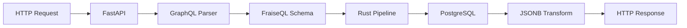

# FraiseQL Documentation Improvements - Post ID Migration

**Date**: 2025-12-30
**Status**: Planning
**Context**: Following successful ID type migration
**Priority**: High (Axis 6: Documentation Quality)

---

## Executive Summary

Based on the comprehensive improvement analysis framework and recent ID migration, here are the top documentation improvements to implement.

---

## Category 1: Auto-Documentation from Docstrings ⭐ USER REQUEST

**Priority**: P1 - High
**Effort**: 2-3 days
**Impact**: Significant DX improvement

### Current State

Examples use inline `description` parameters:

```python
@fraiseql.type
class User:
    id: ID
    name: str = fraise_field(description="User's full name")
    email: str = fraise_field(description="User's email address")
```

### Proposed State

Use docstrings for auto-documentation:

```python
@fraiseql.type
class User:
    """A user in the system."""

    id: ID
    name: str
    """User's full name."""

    email: str
    """User's email address."""
```

### Implementation Plan

**Phase 1: Add docstring support to schema builders** (1 day)
- [ ] Update `src/fraiseql/core/graphql_type.py` to extract field docstrings
- [ ] Modify field processing to use docstrings as descriptions
- [ ] Fallback to `description` parameter for backward compatibility
- [ ] Add tests for docstring extraction

**Phase 2: Update documentation examples** (1 day)
- [ ] Update all docs to show docstring pattern
- [ ] Keep `description` parameter as "legacy but supported"
- [ ] Add migration guide

**Phase 3: Update CLI templates** (0.5 days)
- [ ] Update `fraiseql init` templates to use docstrings
- [ ] Update `fraiseql generate` templates to use docstrings

**Files to modify**:
- `src/fraiseql/core/graphql_type.py` - Field docstring extraction
- `src/fraiseql/cli/commands/init.py` - Template updates
- `src/fraiseql/cli/commands/generate.py` - Template updates
- `docs/` - ~50 files with examples

---

## Category 2: Code Example Testing

**Priority**: P0 - Critical
**Effort**: 1-2 weeks
**Impact**: Prevents documentation drift

### Current State

Code examples in docs are not automatically tested:
- Examples may become outdated
- Breaking changes don't update docs
- Users copy broken code

### Proposed State

All code examples are tested:

```markdown
<!-- docs/quickstart.md -->

```python
# test: auto
from fraiseql.types import ID

@fraiseql.type
class User:
    """A user."""
    id: ID
    name: str
```

### Implementation Plan

**Option A: pytest-markdown**
```bash
pip install pytest-markdown
pytest --markdown docs/
```

**Option B: doctest**
```python
# In conftest.py
def pytest_collect_file(parent, path):
    if path.ext == ".md":
        return MarkdownFile.from_parent(parent, fspath=path)
```

**Option C: Custom script**
```bash
# scripts/test_docs.py
# Extract code blocks, run them, verify output
```

**Recommended**: Option B (doctest) - most Pythonic

**Files to create**:
- `scripts/test_docs_examples.py` - Test runner
- `tests/docs/conftest.py` - pytest integration
- `.github/workflows/docs-tests.yml` - CI integration

---

## Category 3: Architecture Diagrams

**Priority**: P1 - High
**Effort**: 3-4 days
**Impact**: Better understanding of system design

### Missing Diagrams

1. **Request Flow Diagram**
   ```
   HTTP Request → FastAPI → GraphQL Parser → FraiseQL Schema →
   Rust Pipeline → PostgreSQL → JSONB Transform → Response
   ```

2. **Type System Diagram**
   ```
   Python Types → ScalarMarker → GraphQL Scalars → PostgreSQL Types
   ```

3. **Trinity Pattern Diagram**
   ```
   pk_user (int, internal) → id (ID, public) → identifier (str, slug)
   ```

4. **CQRS Architecture Diagram**
   ```
   Query Schema → Views → Read-optimized queries
   Mutation Schema → Functions → Write operations
   ```

### Implementation

Use **Mermaid** diagrams (GitHub native):

```markdown
## Request Flow


```

**Files to create**:
- `docs/architecture/request-flow.md`
- `docs/architecture/type-system.md`
- `docs/architecture/trinity-pattern.md`
- `docs/architecture/cqrs-design.md`

---

## Category 4: Interactive Examples

**Priority**: P2 - Medium
**Effort**: 1 week
**Impact**: Better onboarding

### Current State

Static code examples only.

### Proposed State

**Option A: Embedded CodeSandbox/Replit**

```markdown
<iframe src="https://codesandbox.io/embed/fraiseql-quickstart" />
```

**Option B: fraiseql playground command**

```bash
fraiseql playground
# Launches interactive REPL with examples
```

**Recommended**: Option B (more controlled, offline)

**Files to create**:
- `src/fraiseql/cli/commands/playground.py`
- `src/fraiseql/playground/` - REPL implementation
- `src/fraiseql/playground/examples/` - Pre-loaded examples

---

## Category 5: Migration Guides

**Priority**: P1 - High (especially post-ID migration)
**Effort**: 2 days
**Impact**: Eases version upgrades

### Missing Guides

1. **UUID → ID Migration Guide** ✅ Partially done
   - Expand `docs/core/id-type.md` with more examples
   - Add "Common Pitfalls" section
   - Add SQL migration examples

2. **Python 3.9 → 3.10+ Migration Guide**
   - Type annotation updates (`Optional` → `|`)
   - New syntax patterns
   - Deprecated imports

3. **Version Upgrade Guides**
   - v1.8 → v1.9
   - v1.9 → v1.10
   - Breaking changes per version

### Implementation

**Template**:
```markdown
# Migrating from UUID to ID

## Quick Migration

1. Update imports
2. Update type annotations
3. No database changes needed

## Detailed Steps

### Step 1: Update Imports
Before:
```python
from uuid import UUID
```

After:
```python
from fraiseql.types import ID
```

### Step 2: Update Type Annotations
Before:
```python
id: UUID
```

After:
```python
id: ID
```

### Common Pitfalls

**Pitfall 1**: Using `uuid.uuid4()` in code
Solution: Continue using `uuid.uuid4()` - ID is for type annotations only

## FAQ

Q: Do I need to change my database?
A: No, ID maps to UUID in PostgreSQL.
```

**Files to create**:
- `docs/migration/uuid-to-id.md`
- `docs/migration/python39-to-310.md`
- `docs/migration/version-upgrades.md`

---

## Category 6: Troubleshooting Flowcharts

**Priority**: P1 - High
**Effort**: 2 days
**Impact**: Reduces support burden

### Common Issues

1. **"Query returns empty"**
   ```mermaid
   flowchart TD
       A[Query returns empty] --> B{Is SQL view correct?}
       B -->|No| C[Check CREATE VIEW statement]
       B -->|Yes| D{Is type registered?}
       D -->|No| E[Add @fraiseql.type decorator]
       D -->|Yes| F{Is resolver correct?}
   ```

2. **"Type not found in schema"**
3. **"Database connection fails"**
4. **"GraphQL validation error"**

### Implementation

**Files to create**:
- `docs/troubleshooting/query-debugging.md`
- `docs/troubleshooting/schema-issues.md`
- `docs/troubleshooting/database-connections.md`
- `docs/troubleshooting/common-errors.md`

---

## Category 7: Performance Tuning Guide

**Priority**: P2 - Medium
**Effort**: 3-4 days
**Impact**: Production readiness

### Content

1. **Database Optimization**
   - Index strategies
   - Query performance tuning
   - Connection pooling setup

2. **Rust Pipeline Optimization**
   - When to use Rust transform
   - Benchmarking tips

3. **Caching Strategies**
   - Query result caching
   - DataLoader patterns
   - Redis integration

4. **Profiling & Monitoring**
   - Performance profiling tools
   - Query analysis
   - Bottleneck identification

**Files to create**:
- `docs/performance/database-optimization.md`
- `docs/performance/rust-pipeline.md`
- `docs/performance/caching.md`
- `docs/performance/profiling.md`

---

## Category 8: Real-World Examples

**Priority**: P2 - Medium
**Effort**: 1 week
**Impact**: Better understanding of production use

### Proposed Examples

1. **E-commerce API** (complete example)
   - Products, Orders, Users
   - Authentication & Authorization
   - Shopping cart logic
   - Payment integration patterns

2. **Blog Platform** (already partially exists)
   - Expand with comments, tags, categories
   - Add authentication
   - Show pagination patterns

3. **Multi-tenant SaaS**
   - Organization-scoped queries
   - Row-level security
   - Tenant isolation

4. **Real-time Dashboard**
   - Subscriptions
   - Live data updates
   - WebSocket integration

**Files to create**:
- `examples/ecommerce/` - Complete working example
- `examples/blog-advanced/` - Enhanced blog
- `examples/multi-tenant/` - SaaS pattern
- `examples/real-time/` - Subscriptions

---

## Category 9: API Reference Auto-Generation

**Priority**: P2 - Medium
**Effort**: 3-5 days
**Impact**: Always up-to-date API docs

### Current State

Manual API documentation in markdown.

### Proposed State

Auto-generated from docstrings using **Sphinx** or **mkdocstrings**.

### Implementation

**Option A: Sphinx**
```bash
pip install sphinx sphinx-autodoc-typehints
sphinx-apidoc -o docs/api src/fraiseql
```

**Option B: mkdocstrings**
```yaml
# mkdocs.yml
plugins:
  - mkdocstrings:
      handlers:
        python:
          options:
            show_source: true
```

**Recommended**: Option B (mkdocstrings) - better integration with mkdocs

**Files to create**:
- `mkdocs.yml` - Documentation config
- `docs/api/` - Auto-generated API reference

---

## Category 10: Video Tutorials

**Priority**: P3 - Low
**Effort**: 2-3 weeks
**Impact**: Onboarding improvement

### Proposed Videos

1. **5-Minute Quickstart** (screencast)
2. **Building Your First API** (15 min)
3. **Advanced Patterns Deep Dive** (30 min series)
4. **Debugging Tips & Tricks** (20 min)

**Platform**: YouTube + embedded in docs

---

## Implementation Priority

### Phase 1: Essential (Next Sprint)
1. ✅ **ID Migration** - DONE
2. 🔄 **Docstring Auto-Documentation** - USER REQUEST (2-3 days)
3. 📊 **Architecture Diagrams** (3-4 days)
4. 📖 **Migration Guides** (2 days)

### Phase 2: Important (Following Sprint)
5. ✅ **Code Example Testing** (1-2 weeks)
6. 🔍 **Troubleshooting Flowcharts** (2 days)
7. ⚡ **Performance Tuning Guide** (3-4 days)

### Phase 3: Nice to Have (Future)
8. 🌍 **Real-World Examples** (1 week)
9. 📚 **API Reference Auto-Generation** (3-5 days)
10. 🎥 **Video Tutorials** (2-3 weeks)

---

## Success Metrics

- **Documentation Coverage**: 100% of public API documented
- **Example Test Coverage**: 100% of code examples tested
- **Time to First Query**: < 5 minutes (quickstart)
- **Support Ticket Reduction**: 30% reduction in doc-related questions
- **User Satisfaction**: Track via GitHub issues/discussions

---

## Next Steps

**Immediate actions**:
1. Get approval for docstring auto-documentation approach
2. Create GitHub issues for each category
3. Assign priorities and timeline
4. Start with Phase 1 items

**Questions for user**:
- Which improvements are highest priority for you?
- Any other documentation pain points?
- Timeline constraints for these improvements?
