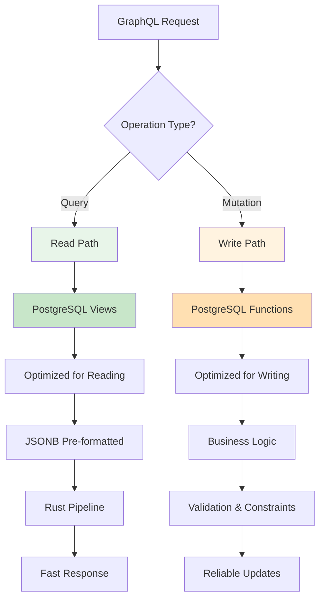
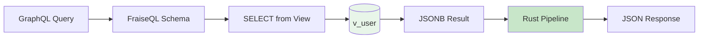
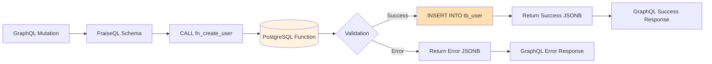
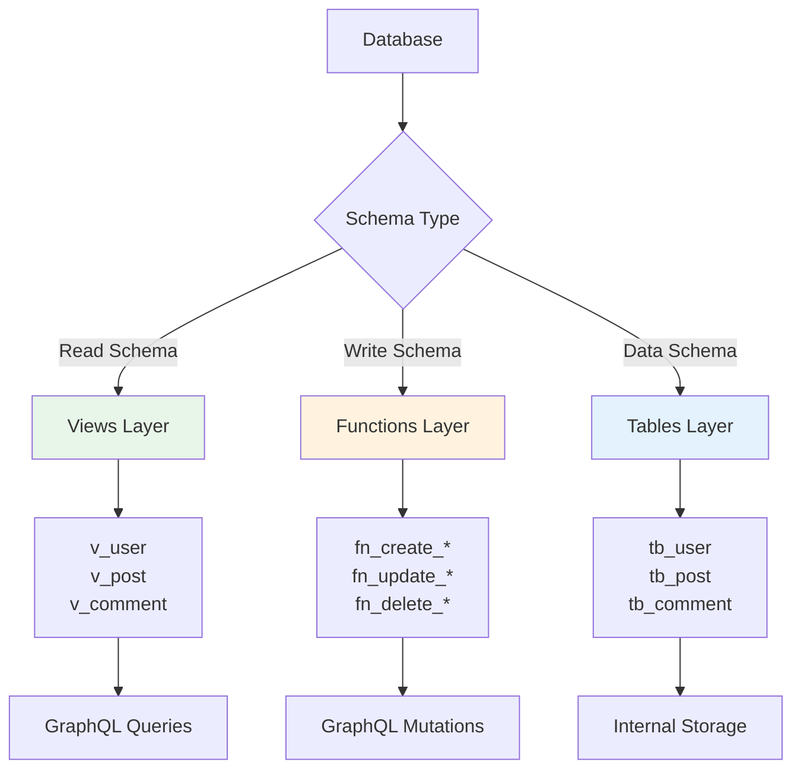
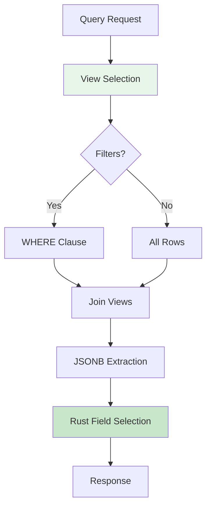
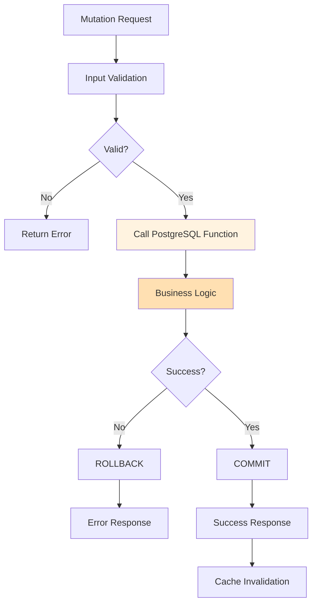
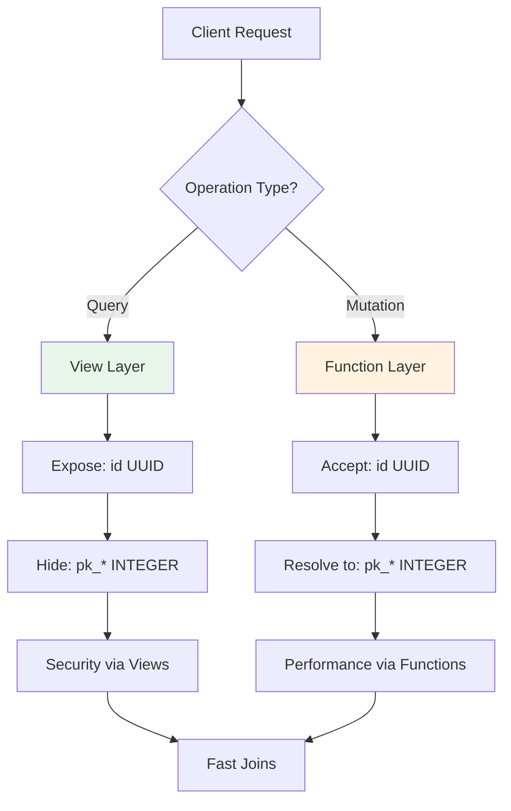
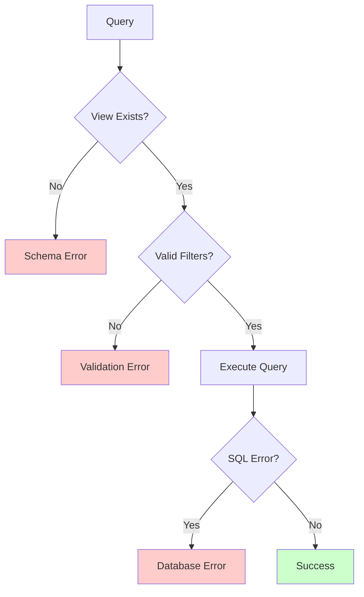
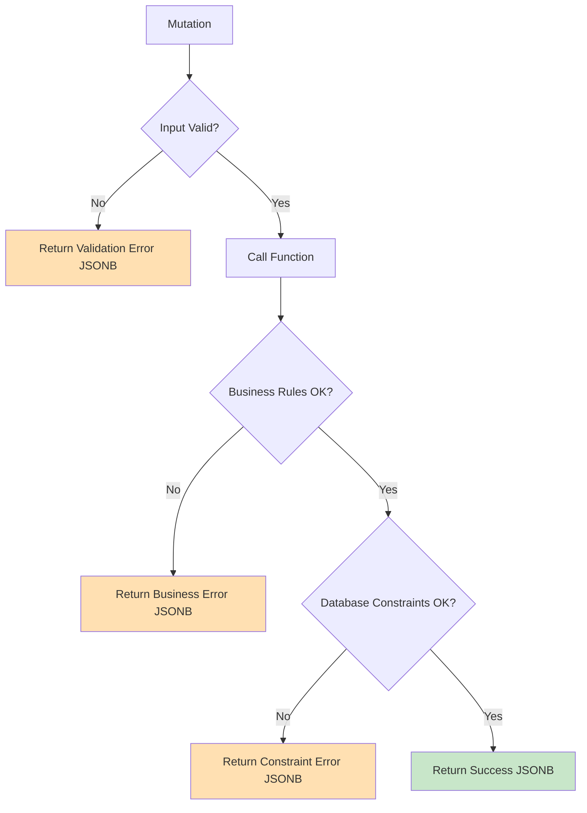

# CQRS Design Architecture

**Last Updated**: 2025-12-30
**Status**: Complete
**Audience**: Backend developers, database designers

---

## Overview

FraiseQL implements the **CQRS (Command Query Responsibility Segregation)** pattern, separating read operations (queries) from write operations (mutations) for optimal performance and maintainability.

---

## CQRS Pattern in FraiseQL



**Key Principle**: Different data structures for reading vs writing leads to better performance and clearer code.

---

## Query Path (Read Operations)

### View-Based Queries



**PostgreSQL View Example**:
```sql
-- Read-optimized view
CREATE VIEW v_user AS
SELECT
    id,  -- Public UUID
    jsonb_build_object(
        'id', id,
        'name', name,
        'email', email,
        'createdAt', created_at
    ) AS data
FROM tb_user;
```

**GraphQL Type**:
```python
from fraiseql.types import ID

@fraiseql.type(sql_source="v_user", jsonb_column="data")
class User:
    """A user in the system.

    Fields:
        id: Unique user identifier
        name: User's full name
        email: User's email address
        created_at: When the user was created
    """
    id: ID
    name: str
    email: str
    created_at: datetime
```

**Benefits of View-Based Queries**:
- ✅ **Pre-formatted data** - JSONB already in response format
- ✅ **Rust pipeline** - Zero Python serialization overhead
- ✅ **Denormalized reads** - Fast joins via Trinity Pattern (`pk_*`)
- ✅ **Field selection** - Only requested fields extracted
- ✅ **Security** - Views expose only public `id` (UUID), hide `pk_*`

---

## Mutation Path (Write Operations)

### Function-Based Mutations



**PostgreSQL Function Example**:
```sql
-- Write-optimized function
CREATE OR REPLACE FUNCTION fn_create_user(
    p_name TEXT,
    p_email TEXT
) RETURNS JSONB AS $$
DECLARE
    v_user_id UUID;
BEGIN
    -- Validation
    IF p_email IS NULL OR p_email = '' THEN
        RETURN jsonb_build_object(
            'success', false,
            'error', 'Email is required'
        );
    END IF;

    -- Check uniqueness
    IF EXISTS (SELECT 1 FROM tb_user WHERE email = p_email) THEN
        RETURN jsonb_build_object(
            'success', false,
            'error', 'Email already exists'
        );
    END IF;

    -- Insert
    INSERT INTO tb_user (name, email)
    VALUES (p_name, p_email)
    RETURNING id INTO v_user_id;

    -- Success response
    RETURN jsonb_build_object(
        'success', true,
        'userId', v_user_id
    );
END;
$$ LANGUAGE plpgsql;
```

**GraphQL Mutation**:
```python
@fraiseql.mutation
async def create_user(
    info,
    name: str,
    email: str
) -> CreateUserResult:
    """Create a new user.

    Args:
        name: User's full name
        email: User's email address

    Returns:
        CreateUserResult with success status and user ID or error message
    """
    result = await info.context.db.execute(
        "SELECT fn_create_user($1, $2)",
        name,
        email
    )
    return CreateUserResult.from_jsonb(result)
```

**Benefits of Function-Based Mutations**:
- ✅ **Business logic in database** - Consistent validation rules
- ✅ **Transactional integrity** - ACID guarantees
- ✅ **Security** - Functions control what can be modified
- ✅ **Audit logging** - All changes go through known entry points
- ✅ **Performance** - No round-trips for validation queries

---

## Schema Separation



**Three-Layer Pattern**:

| Layer | Prefix | Purpose | Exposed To |
|-------|--------|---------|------------|
| **Tables** | `tb_*` | Data storage | Internal only |
| **Views** | `v_*` | Read-optimized queries | GraphQL queries |
| **Functions** | `fn_*` | Write operations | GraphQL mutations |

**Example Structure**:
```sql
-- Layer 1: Data storage (internal)
CREATE TABLE tb_user (
    pk_user INTEGER PRIMARY KEY,
    id UUID UNIQUE NOT NULL DEFAULT gen_random_uuid(),
    identifier TEXT UNIQUE,
    name TEXT NOT NULL,
    email TEXT UNIQUE NOT NULL,
    created_at TIMESTAMP DEFAULT NOW()
);

-- Layer 2: Read-optimized view (exposed to queries)
CREATE VIEW v_user AS
SELECT
    id,  -- Public UUID only
    jsonb_build_object(
        'id', id,
        'name', name,
        'email', email,
        'identifier', identifier,
        'createdAt', created_at
    ) AS data
FROM tb_user;

-- Layer 3: Write functions (exposed to mutations)
CREATE FUNCTION fn_create_user(...) RETURNS JSONB AS $$...$$;
CREATE FUNCTION fn_update_user(...) RETURNS JSONB AS $$...$$;
CREATE FUNCTION fn_delete_user(...) RETURNS JSONB AS $$...$$;
```

---

## Query vs Mutation Characteristics

### Queries (Read Path)



**Characteristics**:
- 📖 **Read-only** - No data modification
- ⚡ **Performance-focused** - Denormalized views, JSONB pre-formatting
- 🔄 **Cacheable** - Same query always returns same result
- 🔒 **Secure by default** - Views expose only allowed fields
- 🚀 **Rust pipeline** - Zero Python serialization

**Example**:
```graphql
# Query (read)
query {
  users(where: { email: { _eq: "john@example.com" } }) {
    id
    name
    email
  }
}
```

---

### Mutations (Write Path)



**Characteristics**:
- ✏️ **Write operations** - Modify data
- 🔒 **Validated** - Business rules enforced
- 🔄 **Transactional** - ACID guarantees
- 🚫 **Not cacheable** - Side effects
- 📝 **Audit trail** - All changes logged

**Example**:
```graphql
# Mutation (write)
mutation {
  createUser(name: "John Doe", email: "john@example.com") {
    success
    userId
    error
  }
}
```

---

## Integration with Trinity Pattern

CQRS and Trinity Pattern work together:



**Views (Read)**:
- Expose only public `id` (UUID)
- Hide internal `pk_*` (INTEGER)
- Use fast `pk_*` joins internally

**Functions (Write)**:
- Accept public `id` (UUID) as input
- Resolve to `pk_*` (INTEGER) internally
- Perform fast operations using `pk_*`

**Example**:
```sql
-- View exposes UUID
CREATE VIEW v_comment AS
SELECT
    c.id,  -- Public UUID
    jsonb_build_object(
        'id', c.id,
        'userId', u.id,  -- Public UUID relationship
        'postId', p.id,  -- Public UUID relationship
        'content', c.content
    ) AS data
FROM tb_comment c
JOIN tb_user u ON u.pk_user = c.pk_user      -- Fast integer join
JOIN tb_post p ON p.pk_post = c.pk_post      -- Fast integer join
;

-- Function accepts UUID, uses pk_* internally
CREATE FUNCTION fn_create_comment(
    p_user_id UUID,      -- Public UUID
    p_post_id UUID,      -- Public UUID
    p_content TEXT
) RETURNS JSONB AS $$
DECLARE
    v_pk_user INTEGER;
    v_pk_post INTEGER;
BEGIN
    -- Resolve UUID → pk_* (once)
    SELECT pk_user INTO v_pk_user FROM tb_user WHERE id = p_user_id;
    SELECT pk_post INTO v_pk_post FROM tb_post WHERE id = p_post_id;

    -- Use fast integer FK
    INSERT INTO tb_comment (pk_user, pk_post, content)
    VALUES (v_pk_user, v_pk_post, p_content);

    RETURN jsonb_build_object('success', true);
END;
$$ LANGUAGE plpgsql;
```

---

## Error Handling in CQRS

### Query Errors (Read Path)



**Query errors are rare**:
- Schema validation catches issues early
- Views are read-only (no data integrity issues)
- Filters validated before SQL execution

---

### Mutation Errors (Write Path)



**Mutation error handling is explicit**:
```sql
CREATE FUNCTION fn_create_user(
    p_name TEXT,
    p_email TEXT
) RETURNS JSONB AS $$
BEGIN
    -- Validation error
    IF p_email IS NULL THEN
        RETURN jsonb_build_object(
            'success', false,
            'error', 'Email is required',
            'code', 'VALIDATION_ERROR'
        );
    END IF;

    -- Business rule error
    IF EXISTS (SELECT 1 FROM tb_user WHERE email = p_email) THEN
        RETURN jsonb_build_object(
            'success', false,
            'error', 'Email already exists',
            'code', 'DUPLICATE_EMAIL'
        );
    END IF;

    -- Success
    INSERT INTO tb_user (name, email) VALUES (p_name, p_email);
    RETURN jsonb_build_object('success', true);

EXCEPTION
    WHEN OTHERS THEN
        -- Database error
        RETURN jsonb_build_object(
            'success', false,
            'error', SQLERRM,
            'code', 'DATABASE_ERROR'
        );
END;
$$ LANGUAGE plpgsql;
```

---

## Performance Benefits

### Query Performance

| Aspect | Traditional ORM | FraiseQL CQRS |
|--------|-----------------|---------------|
| **Serialization** | Python objects → JSON | JSONB → Rust → JSON |
| **Joins** | ORM N+1 queries | Denormalized views |
| **Field Selection** | Full objects loaded | Only requested fields |
| **Overhead** | 25-60ms | 0.1-1ms |

**Speedup**: **25-60x faster** than traditional ORM approaches

---

### Mutation Performance

| Aspect | Traditional ORM | FraiseQL CQRS |
|--------|-----------------|---------------|
| **Round-trips** | Multiple queries | Single function call |
| **Validation** | Application layer | Database layer |
| **Transactions** | Manual management | Automatic in function |
| **Audit** | Application code | Database triggers |

**Benefits**:
- ✅ Fewer network round-trips
- ✅ Consistent validation rules
- ✅ Guaranteed transactional integrity
- ✅ Centralized audit logging

---

## Best Practices

### ✅ DO

1. **Use views for all queries**
   ```sql
   CREATE VIEW v_user AS ...  -- ✅ Read-optimized
   ```

2. **Use functions for all mutations**
   ```sql
   CREATE FUNCTION fn_create_user(...) RETURNS JSONB ...  -- ✅ Write-controlled
   ```

3. **Return JSONB from functions**
   ```sql
   RETURN jsonb_build_object('success', true, 'userId', v_id);  -- ✅ Structured
   ```

4. **Expose only public `id` in views**
   ```sql
   SELECT id, data FROM v_user;  -- ✅ UUID only
   ```

5. **Use `pk_*` internally for joins**
   ```sql
   JOIN tb_post p ON p.pk_post = c.pk_post  -- ✅ Fast
   ```

---

### ❌ DON'T

1. **Don't query tables directly**
   ```python
   SELECT * FROM tb_user  -- ❌ Use v_user instead
   ```

2. **Don't write INSERT/UPDATE in application code**
   ```python
   await db.execute("INSERT INTO tb_user ...")  -- ❌ Use fn_create_user()
   ```

3. **Don't expose `pk_*` in views**
   ```sql
   SELECT pk_user, id FROM v_user  -- ❌ Internal only
   ```

4. **Don't use UUID for foreign keys**
   ```sql
   user_id UUID REFERENCES tb_user(id)  -- ❌ Slow, use pk_user
   ```

5. **Don't skip validation in functions**
   ```sql
   INSERT INTO tb_user VALUES (...)  -- ❌ Validate first
   ```

---

## Naming Conventions

FraiseQL uses consistent naming for CQRS components:

| Component | Prefix | Example | Purpose |
|-----------|--------|---------|---------|
| **Tables** | `tb_` | `tb_user` | Data storage |
| **Views** | `v_` | `v_user` | Read operations |
| **Create Functions** | `fn_create_` | `fn_create_user` | Insert new records |
| **Update Functions** | `fn_update_` | `fn_update_user` | Modify existing records |
| **Delete Functions** | `fn_delete_` | `fn_delete_user` | Remove records |
| **Custom Functions** | `fn_` | `fn_promote_user` | Business operations |

**Consistency ensures**:
- Clear intent (table vs view vs function)
- Easy to find related components
- Obvious what each component does

---

## Related Documentation

- [Request Flow](request-flow.md) - How queries and mutations are executed
- [Trinity Pattern](trinity-pattern.md) - Three-identifier database design
- [Type System](type-system.md) - Type mapping across layers
- [Database Patterns](../advanced/database-patterns.md) - More CQRS examples

---

## Summary

FraiseQL's CQRS design provides:

✅ **Clear Separation** - Queries use views, mutations use functions
✅ **Performance** - Read-optimized views with Rust pipeline
✅ **Security** - Views expose only allowed fields, functions control writes
✅ **Reliability** - Business logic in database with ACID guarantees
✅ **Maintainability** - Consistent patterns and naming conventions
✅ **Integration** - Works seamlessly with Trinity Pattern for optimal performance

**Golden Rule**: Never query tables directly or write data without functions.
