# Request Flow Architecture

**Last Updated**: 2025-12-30
**Status**: Complete
**Audience**: Developers wanting to understand FraiseQL's execution pipeline

---

## Overview

FraiseQL processes GraphQL requests through an optimized pipeline that leverages PostgreSQL's native JSONB format and a Rust-based transformation layer for maximum performance.

---

## High-Level Request Flow


**Key Insight**: PostgreSQL returns data already in JSONB format. The Rust pipeline performs field selection and transformation **without Python serialization overhead**.

---

## Detailed Request Pipeline

### Step 1: HTTP Request → FastAPI


**What happens:**
- FastAPI receives the HTTP request
- APQ (Automatic Persisted Queries) checks cache for known queries
- Standard queries are parsed directly
- All paths lead to GraphQL parsing

**Files involved:**
- `src/fraiseql/fastapi/routes.py` - HTTP endpoint
- `src/fraiseql/middleware/apq.py` - APQ handling

---

### Step 2: GraphQL Parsing & Validation


**What happens:**
- GraphQL query is parsed into an Abstract Syntax Tree (AST)
- Validated against the generated schema
- Complexity analysis prevents DoS attacks
- Operation details extracted for execution

**Files involved:**
- `graphql-core` library - Parsing and validation
- `src/fraiseql/gql/complexity.py` - Complexity analysis
- `src/fraiseql/gql/schema_builder.py` - Schema definition

---

### Step 3: Query Execution (Read Path)


**The Rust Advantage:**

| Approach | Steps | Performance |
|----------|-------|-------------|
| **Traditional** | PostgreSQL → Rows → ORM → Python Objects → GraphQL Serialize → JSON | ~10-50ms overhead |
| **FraiseQL** | PostgreSQL → JSONB → Rust Transform → JSON | ~0.1-1ms overhead |

**What happens:**
- Root field resolver is called
- SQL query is generated from GraphQL selection
- PostgreSQL view returns data in JSONB format
- Rust pipeline selects requested fields and transforms to JSON
- **Zero Python serialization** for optimal performance

**Files involved:**
- `src/fraiseql/core/rust_pipeline.py` - Rust integration
- `fraiseql_rs/src/lib.rs` - Rust transformation code
- `src/fraiseql/db.py` - Database query execution
- `src/fraiseql/sql/where_generator.py` - SQL WHERE clause generation

---

### Step 4: Mutation Execution (Write Path)


**CQRS Pattern:**
- **Queries** read from optimized views
- **Mutations** call PostgreSQL functions
- Clear separation of read/write concerns

**What happens:**
- Mutation input is validated against input types
- PostgreSQL function is called (CQRS pattern)
- Function returns success/error as JSONB
- Cascade detection checks for related data changes
- Related caches are invalidated automatically

**Files involved:**
- `src/fraiseql/mutations/mutation_decorator.py` - Mutation decorator
- `src/fraiseql/mutations/sql_generator.py` - SQL function calls
- `src/fraiseql/mutations/cascade_detection.py` - Cache invalidation
- Database functions - `fn_create_*`, `fn_update_*`, etc.

---

### Step 5: Response Formation


**GraphQL Response Format:**
```json
{
  "data": {
    "user": {
      "id": "550e8400-e29b-41d4-a716-446655440000",
      "name": "John Doe",
      "email": "john@example.com"
    }
  },
  "errors": null,
  "extensions": {
    "complexity": 15,
    "queryHash": "abc123..."
  }
}
```

**What happens:**
- Execution results are formatted as GraphQL response
- Field selection is applied (only requested fields)
- Nested types are resolved recursively
- Extensions added (complexity score, tracing, etc.)
- Final JSON sent over HTTP

---

## Performance Characteristics

### Traditional GraphQL Framework


**Bottlenecks:**
- ❌ ORM deserialization (10-20ms per query)
- ❌ Python object creation (5-10ms)
- ❌ GraphQL serialization (10-30ms)

**Total overhead**: ~25-60ms per request

---

### FraiseQL Pipeline


**Advantages:**
- ✅ JSONB from PostgreSQL (native format)
- ✅ Rust field selection (compiled performance)
- ✅ Zero Python serialization

**Total overhead**: ~0.1-1ms per request

**Speedup**: **25-60x faster** than traditional approaches

---

## Monitoring Points

Key metrics to monitor in production:

```mermaid
flowchart TD
    A[Request] --> B[🔍 HTTP Latency]
    B --> C[🔍 GraphQL Parse Time]
    C --> D[🔍 Schema Validation Time]
    D --> E[🔍 Complexity Score]
    E --> F{Query or Mutation?}
    F -->|Query| G[🔍 SQL Execution Time]
    F -->|Mutation| H[🔍 Function Execution Time]
    G --> I[🔍 Rust Transform Time]
    H --> I
    I --> J[🔍 Total Response Time]
```



**Monitoring files:**
- `src/fraiseql/monitoring/metrics/` - Prometheus metrics
- `src/fraiseql/tracing/opentelemetry.py` - OpenTelemetry integration
- `src/fraiseql/analysis/query_analyzer.py` - Query analysis

---

## Caching Layers

FraiseQL implements multi-level caching:


**Cache Levels:**

1. **APQ Cache** - Query string hashing
2. **Schema Cache** - Type and field metadata
3. **Result Cache** - Query result caching (optional)
4. **DataLoader Cache** - Batch/cache repeated queries

**Files involved:**
- `src/fraiseql/middleware/apq.py` - APQ caching
- `src/fraiseql/cache/view_metadata.py` - Schema caching
- `src/fraiseql/optimization/decorators.py` - DataLoader

---

## Error Handling Flow


**Error Response Format:**
```json
{
  "data": null,
  "errors": [
    {
      "message": "Field 'email' is required",
      "locations": [{"line": 2, "column": 3}],
      "path": ["createUser"],
      "extensions": {
        "code": "VALIDATION_ERROR",
        "field": "email"
      }
    }
  ]
}
```

---

## Connection Pooling

PostgreSQL connections are managed efficiently:


**Pool Configuration:**
- Min connections: 2
- Max connections: 10 (configurable)
- Timeout: 30 seconds
- Recycle: 3600 seconds (1 hour)

**Files involved:**
- `src/fraiseql/db.py` - Connection pool setup
- `src/fraiseql/fastapi/config.py` - Pool configuration

---

## Related Documentation

- [Type System Architecture](type-system.md) - How Python types map to GraphQL
- [Trinity Pattern](trinity-pattern.md) - Database identifier pattern
- [CQRS Design](cqrs-design.md) - Query/Mutation separation
- [Performance Guide](../performance/rust-pipeline.md) - Optimization techniques

---

## Summary

FraiseQL's request flow is optimized for:

✅ **Performance** - Rust pipeline eliminates Python serialization
✅ **Scalability** - Connection pooling and multi-level caching
✅ **Security** - Complexity analysis and validation
✅ **Observability** - Comprehensive monitoring and tracing
✅ **CQRS** - Clear separation of reads and writes

The exclusive Rust pipeline is the key differentiator, delivering **25-60x performance improvement** over traditional GraphQL frameworks.
