# Trinity Pattern Architecture

**Last Updated**: 2025-12-30
**Status**: Complete
**Audience**: Database designers, backend developers

---

## Overview

The **Trinity Pattern** is FraiseQL's database identifier strategy that uses **three complementary identifiers** for each entity, optimizing for different use cases: performance, stability, and usability.

---

## The Trinity: Three Identifiers

```mermaid
graph TD
    A[Trinity Identifiers] --> B[pk_* : INTEGER]
    A --> C[id : UUID]
    A --> D[identifier : TEXT]

    B --> E[Internal Joins<br/>⚡ Fast]
    C --> F[Public API<br/>🔒 Stable]
    D --> G[Human-Readable<br/>👤 UX]

    style B fill:#e1f5ff
    style C fill:#fff3e0
    style D fill:#f3e5f5
```



---

## Trinity Components

### 1. Primary Key (`pk_*`) - Performance

**Type**: `INTEGER GENERATED BY DEFAULT AS IDENTITY`

```sql
CREATE TABLE tb_user (
    pk_user INTEGER GENERATED BY DEFAULT AS IDENTITY PRIMARY KEY,
    -- Fast for PostgreSQL internal operations
    ...
);
```

**Purpose:**
- ⚡ **Fastest joins** - PostgreSQL optimizes integer joins
- 💾 **Smallest footprint** - 4 bytes vs 16 bytes (UUID)
- 🔗 **Foreign keys** - All table relationships use `pk_*`

**Use Case:** Internal database operations, foreign key relationships

**Example:**
```sql
-- Foreign key using pk_user
CREATE TABLE tb_order (
    pk_order INTEGER PRIMARY KEY,
    pk_user INTEGER REFERENCES tb_user(pk_user)  -- Fast join!
);
```

---

### 2. Public ID (`id`) - Stability

**Type**: `UUID (ID in GraphQL)`

```sql
CREATE TABLE tb_user (
    pk_user INTEGER PRIMARY KEY,
    id UUID UNIQUE NOT NULL DEFAULT gen_random_uuid(),
    -- Stable identifier for external API
    ...
);
```

**Purpose:**
- 🔒 **Stable API** - Never changes, safe to expose
- 🌍 **Globally unique** - No collisions across databases
- 🚫 **Non-sequential** - Prevents enumeration attacks
- 📊 **Distributed systems** - Works across replicas

**Use Case:** GraphQL API, external integrations, public references

**Example:**
```graphql
# GraphQL uses UUID-based ID
query {
  user(id: "550e8400-e29b-41d4-a716-446655440000") {
    name
    email
  }
}
```

---

### 3. Identifier (`identifier`) - Usability

**Type**: `TEXT UNIQUE` (optional, nullable)

```sql
CREATE TABLE tb_user (
    pk_user INTEGER PRIMARY KEY,
    id UUID UNIQUE NOT NULL,
    identifier TEXT UNIQUE,  -- Human-readable slug
    ...
);
```

**Purpose:**
- 👤 **Human-readable** - Easy to remember and type
- 🔗 **SEO-friendly URLs** - `/users/john-doe` instead of `/users/550e8400...`
- 🎯 **User experience** - Natural identifiers

**Use Case:** URLs, user-facing references, marketing materials

**Example:**
```
# URL using identifier
https://api.example.com/users/john-doe

# URL using UUID (harder to use)
https://api.example.com/users/550e8400-e29b-41d4-a716-446655440000
```

---

## Trinity Pattern in Action

### Database Schema Example

```sql
-- Complete Trinity implementation
CREATE TABLE tb_user (
    -- Trinity Identifiers
    pk_user INTEGER GENERATED BY DEFAULT AS IDENTITY PRIMARY KEY,
    id UUID UNIQUE NOT NULL DEFAULT gen_random_uuid(),
    identifier TEXT UNIQUE,  -- e.g., "john-doe"

    -- Data fields
    email TEXT UNIQUE NOT NULL,
    name TEXT NOT NULL,
    created_at TIMESTAMP DEFAULT NOW()
);

-- Related table using pk_user for performance
CREATE TABLE tb_post (
    pk_post INTEGER GENERATED BY DEFAULT AS IDENTITY PRIMARY KEY,
    id UUID UNIQUE NOT NULL DEFAULT gen_random_uuid(),
    identifier TEXT UNIQUE,  -- e.g., "my-first-post"

    -- Foreign key uses pk_user (fast joins!)
    pk_user INTEGER REFERENCES tb_user(pk_user),

    title TEXT NOT NULL,
    content TEXT
);
```

---

## Identifier Selection Flow


**Resolution Strategy:**

1. **Client provides identifier** → Look up `pk_*` first
2. **Client provides UUID** → Look up `pk_*` first
3. **Internal queries** → Use `pk_*` directly

---

## GraphQL View Pattern

FraiseQL views expose only the public `id` (UUID):

```sql
-- View for GraphQL (JSONB pattern)
CREATE VIEW v_user AS
SELECT
    id,  -- Public UUID exposed to GraphQL
    jsonb_build_object(
        'id', id,  -- UUID in GraphQL response
        'name', name,
        'email', email,
        'identifier', identifier,  -- Slug also available
        'createdAt', created_at
    ) AS data
FROM tb_user;
```

**GraphQL Type:**
```python
from fraiseql.types import ID

@fraiseql.type(sql_source="v_user", jsonb_column="data")
class User:
    """A user in the system.

    Fields:
        id: Unique user identifier (UUID)
        name: User's full name
        email: User's email address
        identifier: Human-readable slug
        created_at: When the user was created
    """
    id: ID  # Maps to UUID, exposed as GraphQL ID scalar
    name: str
    email: str
    identifier: str | None
    created_at: datetime
```

---

## Foreign Key Relationships

### Internal Joins (Fast)

```sql
-- Use pk_* for foreign keys
CREATE TABLE tb_comment (
    pk_comment INTEGER PRIMARY KEY,
    pk_post INTEGER REFERENCES tb_post(pk_post),  -- ⚡ Fast
    pk_user INTEGER REFERENCES tb_user(pk_user),  -- ⚡ Fast
    content TEXT
);

-- View exposes UUID relationships
CREATE VIEW v_comment AS
SELECT
    c.id,
    jsonb_build_object(
        'id', c.id,
        'userId', u.id,  -- UUID relationship
        'postId', p.id,  -- UUID relationship
        'content', c.content
    ) AS data
FROM tb_comment c
JOIN tb_user u ON u.pk_user = c.pk_user  -- Fast integer join
JOIN tb_post p ON p.pk_post = c.pk_post  -- Fast integer join
;
```

**Key Insight:**
- Database uses `pk_*` for performance
- GraphQL exposes `id` (UUID) for stability
- Best of both worlds!

---

## Benefits of Trinity Pattern

### Performance Comparison

| Operation | UUID FK | Integer FK | Improvement |
|-----------|---------|------------|-------------|
| Join 1M rows | ~350ms | ~45ms | **7.7x faster** |
| Index size | 48 MB | 8 MB | **6x smaller** |
| Insert speed | ~12ms | ~2ms | **6x faster** |

### Storage Comparison

| Field Type | Size | Rows | Total Size |
|------------|------|------|------------|
| `pk_user INTEGER` | 4 bytes | 1M | 4 MB |
| `id UUID` | 16 bytes | 1M | 16 MB |
| `identifier TEXT` | ~20 bytes | 1M | 20 MB |

**Total**: 40 MB for 1M rows with full Trinity

---

## Migration from UUID-only

If you're migrating from UUID-only identifiers:


**Migration SQL:**
```sql
-- Step 1: Add primary key column
ALTER TABLE tb_user ADD COLUMN pk_user INTEGER GENERATED BY DEFAULT AS IDENTITY;

-- Step 2: Make it primary key (may need to recreate table)
ALTER TABLE tb_user ADD PRIMARY KEY (pk_user);

-- Step 3: Add identifier column (optional)
ALTER TABLE tb_user ADD COLUMN identifier TEXT UNIQUE;

-- Step 4: Update foreign keys in related tables
ALTER TABLE tb_order ADD COLUMN pk_user INTEGER;
UPDATE tb_order SET pk_user = (
    SELECT pk_user FROM tb_user WHERE tb_user.id = tb_order.user_id
);
ALTER TABLE tb_order ADD FOREIGN KEY (pk_user) REFERENCES tb_user(pk_user);
```

---

## When to Use Each Identifier

```mermaid
flowchart TD
    A[Which Identifier?] --> B{Use Case}

    B -->|Database Joins| C[pk_* INTEGER]
    B -->|GraphQL API| D[id UUID]
    B -->|Public URLs| E[identifier TEXT]
    B -->|Internal Logic| C

    C --> F[Fast ⚡]
    D --> G[Stable 🔒]
    E --> H[Readable 👤]
```



### Decision Matrix

| Scenario | Use | Why |
|----------|-----|-----|
| Foreign key constraints | `pk_*` | Fastest joins, smallest indexes |
| GraphQL query parameters | `id` (UUID) | Stable, secure, non-sequential |
| Public URLs | `identifier` | Human-readable, SEO-friendly |
| Database views/joins | `pk_*` | Performance-optimized |
| External API responses | `id` (UUID) | Globally unique, stable |
| User-facing references | `identifier` | Easy to remember/type |

---

## Common Patterns

### Pattern 1: Required Identifier

Some entities always need slugs (blogs, products):

```sql
CREATE TABLE tb_blog_post (
    pk_post INTEGER PRIMARY KEY,
    id UUID UNIQUE NOT NULL DEFAULT gen_random_uuid(),
    identifier TEXT UNIQUE NOT NULL,  -- Required for URLs
    title TEXT NOT NULL,
    slug_generated_from TEXT GENERATED ALWAYS AS (lower(regexp_replace(title, '[^a-zA-Z0-9]+', '-', 'g'))) STORED
);
```

### Pattern 2: Optional Identifier

Some entities don't need slugs (internal records):

```sql
CREATE TABLE tb_audit_log (
    pk_log INTEGER PRIMARY KEY,
    id UUID UNIQUE NOT NULL DEFAULT gen_random_uuid(),
    -- No identifier needed (internal only)
    action TEXT,
    created_at TIMESTAMP DEFAULT NOW()
);
```

### Pattern 3: Composite Identifier

Hierarchical entities (team members):

```sql
CREATE TABLE tb_team_member (
    pk_member INTEGER PRIMARY KEY,
    id UUID UNIQUE NOT NULL DEFAULT gen_random_uuid(),
    identifier TEXT UNIQUE,  -- e.g., "acme-corp/john-doe"
    pk_team INTEGER REFERENCES tb_team(pk_team),
    username TEXT NOT NULL
);
```

---

## Index Strategy

```sql
-- Primary key index (automatic)
CREATE INDEX ON tb_user (pk_user);  -- Automatic with PRIMARY KEY

-- UUID index for API lookups
CREATE UNIQUE INDEX ON tb_user (id);  -- Needed for GraphQL queries

-- Identifier index for slug lookups
CREATE UNIQUE INDEX ON tb_user (identifier) WHERE identifier IS NOT NULL;

-- Composite indexes for common queries
CREATE INDEX ON tb_comment (pk_post, pk_user);  -- Fast multi-column joins
```

---

## Best Practices

### ✅ DO

1. **Always use `pk_*` for foreign keys**
   ```sql
   pk_user INTEGER REFERENCES tb_user(pk_user)  -- ✅
   ```

2. **Expose `id` (UUID) in GraphQL**
   ```python
   id: ID  # ✅ GraphQL ID scalar
   ```

3. **Make `identifier` nullable if not always needed**
   ```sql
   identifier TEXT UNIQUE  -- ✅ NULL for internal records
   ```

4. **Use meaningful identifier slugs**
   ```sql
   identifier = 'john-doe-engineering'  -- ✅ Context + uniqueness
   ```

### ❌ DON'T

1. **Don't use UUID for foreign keys**
   ```sql
   user_id UUID REFERENCES tb_user(id)  -- ❌ Slow!
   ```

2. **Don't expose `pk_*` in GraphQL**
   ```python
   pk_user: int  -- ❌ Internal only!
   ```

3. **Don't use sequential integers as public IDs**
   ```python
   id: int  -- ❌ Enumeration attack risk!
   ```

4. **Don't forget indexes on `id` and `identifier`**
   ```sql
   -- ❌ Missing indexes = slow lookups!
   ```

---

## Related Documentation

- [Request Flow](request-flow.md) - How queries resolve identifiers
- [CQRS Design](cqrs-design.md) - Views expose UUID, tables use pk_*
- [Database Patterns](../advanced/database-patterns.md) - More Trinity examples

---

## Summary

The Trinity Pattern provides:

✅ **Performance** - Integer primary keys for fast joins
✅ **Stability** - UUID IDs for public API
✅ **Usability** - Text identifiers for human-friendly URLs
✅ **Security** - Non-sequential UUIDs prevent enumeration
✅ **Flexibility** - Choose the right identifier for each use case

**Golden Rule**: Use `pk_*` internally, expose `id` publicly, add `identifier` when needed for UX.
