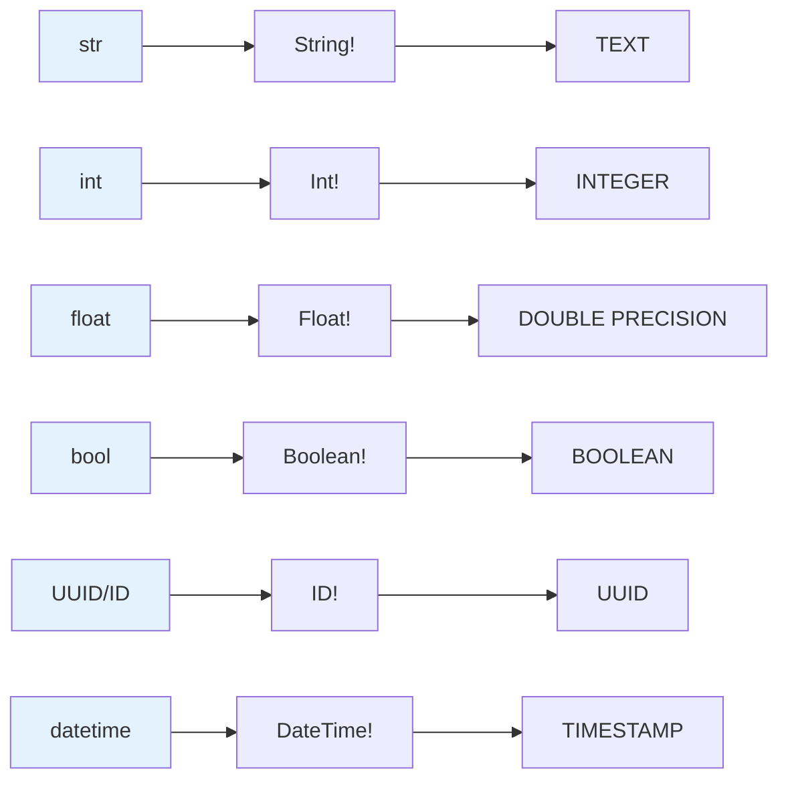
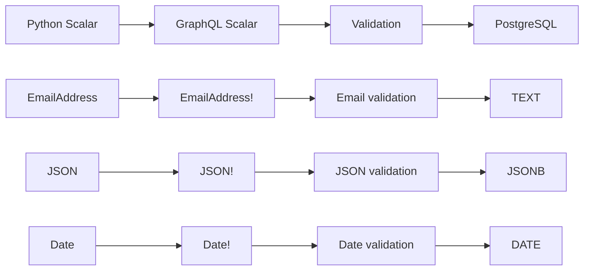
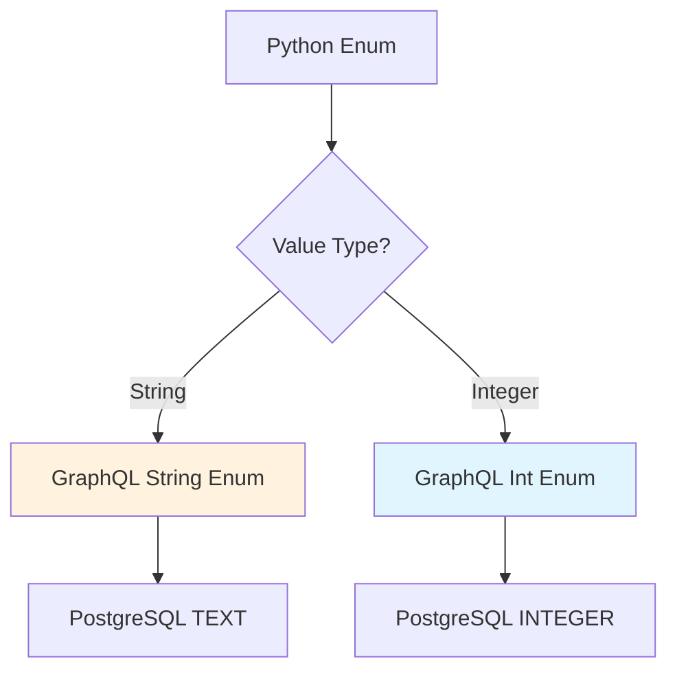
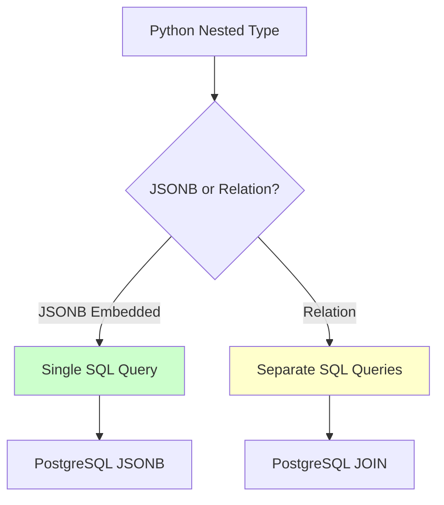
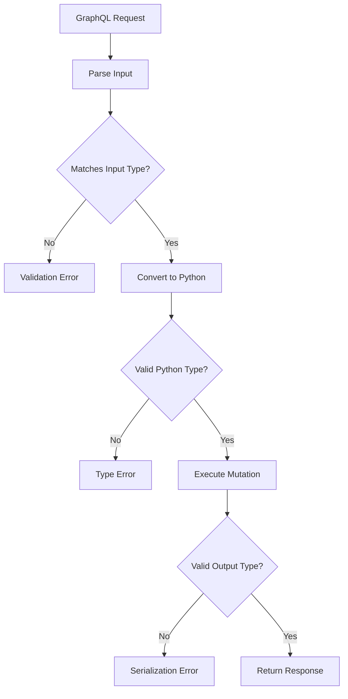

# Type System Architecture

**Last Updated**: 2025-12-30
**Status**: Complete
**Audience**: Developers understanding FraiseQL's type mapping

---

## Overview

FraiseQL provides **automatic type mapping** between Python, GraphQL, and PostgreSQL, with runtime type introspection for validation and schema generation.

---

## Three-Layer Type System

```mermaid
flowchart TD
    A[Python Types] -->|@fraiseql.type| B[FraiseQL Schema]
    B -->|GraphQL Schema| C[GraphQL Types]
    B -->|SQL Queries| D[PostgreSQL Types]

    C -->|Query| E[Client]
    D -->|Data| F[(Database)]

    style A fill:#e3f2fd
    style B fill:#fff3e0
    style C fill:#f3e5f5
    style D fill:#e8f5e9
```

---

## Type Mapping Flow

### Python → GraphQL → PostgreSQL



---

## Complete Type Mapping Table

| Python Type | GraphQL Type | PostgreSQL Type | Notes |
|-------------|--------------|-----------------|-------|
| `str` | `String!` | `TEXT` | Non-nullable string |
| `str \| None` | `String` | `TEXT` | Nullable string |
| `int` | `Int!` | `INTEGER` | 32-bit signed integer |
| `float` | `Float!` | `DOUBLE PRECISION` | 64-bit float |
| `bool` | `Boolean!` | `BOOLEAN` | True/False |
| `ID` | `ID!` | `UUID` | GraphQL ID scalar (UUID) |
| `UUID` | `ID!` | `UUID` | Legacy, use `ID` instead |
| `datetime` | `DateTime!` | `TIMESTAMP` | ISO 8601 format |
| `date` | `Date!` | `DATE` | YYYY-MM-DD |
| `Decimal` | `Float!` | `NUMERIC` | High precision |
| `list[T]` | `[T!]!` | `ARRAY` | Non-null list of non-null items |
| `list[T] \| None` | `[T!]` | `ARRAY` | Nullable list |
| `list[T \| None]` | `[T]!` | `ARRAY` | List with nullable items |
| `Enum` | `EnumType` | `TEXT` or `INTEGER` | Enum values |
| `CustomType` | `CustomType` | `JSONB` | Nested objects |

---

## Nullability Handling

```mermaid
flowchart TD
    A[Python Type Hint] --> B{Has | None?}
    B -->|No| C[GraphQL Non-Null]
    B -->|Yes| D[GraphQL Nullable]

    C --> E[String!]
    D --> F[String]

    E --> G[PostgreSQL NOT NULL]
    F --> H[PostgreSQL NULL]

    style C fill:#ccffcc
    style D fill:#ffffcc
```

**Examples:**

```python
# Non-nullable
name: str  # → String! → TEXT NOT NULL

# Nullable
email: str | None  # → String → TEXT

# With default
role: str = "user"  # → String! (has default)
```

---

## List Type Variations

```mermaid
flowchart TD
    A[Python List Types] --> B[list of T]
    B --> C[list[str]]
    B --> D[list[str] | None]
    B --> E[list[str | None]]
    B --> F[list[str | None] | None]

    C --> G["[String!]! <br/> Non-null list of non-null strings"]
    D --> H["[String!] <br/> Nullable list of non-null strings"]
    E --> I["[String]! <br/> Non-null list of nullable strings"]
    F --> J["[String] <br/> Nullable list of nullable strings"]
```

**Examples:**

| Python | GraphQL | Meaning |
|--------|---------|---------|
| `list[str]` | `[String!]!` | Required list, required items |
| `list[str] \| None` | `[String!]` | Optional list, required items |
| `list[str \| None]` | `[String]!` | Required list, optional items |
| `list[str \| None] \| None` | `[String]` | Everything optional |

---

## Custom Scalar Types

FraiseQL provides custom GraphQL scalars:



**Available Scalars:**

```python
from fraiseql.types import (
    ID,           # UUID-based identifier
    EmailAddress, # Validated email
    JSON,         # Arbitrary JSON data
    Date,         # Date without time
)

@fraiseql.type
class User:
    id: ID
    email: EmailAddress  # Auto-validated
    settings: JSON       # JSONB column
    birth_date: Date     # No timezone
```

---

## Enum Type Mapping



**String Enum:**
```python
from enum import Enum

@fraiseql.enum
class UserRole(Enum):
    ADMIN = "ADMIN"
    USER = "USER"
    GUEST = "GUEST"
```

**GraphQL:**
```graphql
enum UserRole {
  ADMIN
  USER
  GUEST
}
```

**PostgreSQL:**
```sql
-- Stored as TEXT
role TEXT CHECK (role IN ('ADMIN', 'USER', 'GUEST'))
```

**Integer Enum:**
```python
@fraiseql.enum
class Priority(Enum):
    LOW = 1
    MEDIUM = 2
    HIGH = 3
```

---

## Nested Object Types



**Embedded (JSONB):**
```python
@fraiseql.type
class Address:
    street: str
    city: str
    zip_code: str

@fraiseql.type(sql_source="v_user")
class User:
    id: ID
    name: str
    address: Address  # Embedded in JSONB
```

**SQL View:**
```sql
CREATE VIEW v_user AS
SELECT
    id,
    jsonb_build_object(
        'id', id,
        'name', name,
        'address', jsonb_build_object(
            'street', street,
            'city', city,
            'zipCode', zip_code
        )
    ) AS data
FROM tb_user;
```

**Relational (Separate Query):**
```python
@fraiseql.type(sql_source="v_department", resolve_nested=True)
class Department:
    id: ID
    name: str

@fraiseql.type(sql_source="v_employee")
class Employee:
    id: ID
    name: str
    department_id: ID
    department: Department  # Resolved via separate query
```

---

## Type Introspection at Runtime

FraiseQL introspects Python type hints at runtime:

```mermaid
flowchart TD
    A[@fraiseql.type Decorator] --> B[collect_annotations]
    B --> C[get_type_hints]
    C --> D{Extract Metadata}
    D --> E[Field Name]
    D --> F[Field Type]
    D --> G[Nullability]
    D --> H[Default Value]

    E --> I[Build GraphQL Schema]
    F --> I
    G --> I
    H --> I

    I --> J[GraphQL ObjectType]
```

**Code:**
```python
# User writes this
@fraiseql.type
class User:
    name: str
    email: str | None = None

# FraiseQL generates this internally
GraphQLObjectType(
    "User",
    fields={
        "name": GraphQLField(GraphQLNonNull(GraphQLString)),
        "email": GraphQLField(GraphQLString),
    }
)
```

---

## Input vs Output Types

```mermaid
flowchart LR
    A[@fraiseql.type] --> B[Output Type]
    C[@fraiseql.input] --> D[Input Type]

    B --> E[For Queries]
    D --> F[For Mutations]

    style B fill:#e8f5e9
    style D fill:#fff3e0
```

**Output Type (Query Results):**
```python
@fraiseql.type
class User:
    """Query result type."""
    id: ID
    name: str
    created_at: datetime  # Read-only field
```

**Input Type (Mutation Args):**
```python
@fraiseql.input
class CreateUserInput:
    """Mutation input type."""
    name: str
    email: str
    # No id or created_at (server-generated)
```

---

## Type Validation Flow



**Validation Points:**
1. **GraphQL Schema Validation** - Input matches GraphQL type
2. **Python Type Conversion** - GraphQL values → Python objects
3. **Database Constraints** - PostgreSQL validates on INSERT/UPDATE
4. **Output Serialization** - Python objects → GraphQL response

---

## Special PostgreSQL Types

FraiseQL supports advanced PostgreSQL types:

```python
from fraiseql.types.postgres import (
    JSONB,      # JSON with indexing
    INET,       # IP addresses
    MACADDR,    # MAC addresses
    LTREE,      # Hierarchical labels
    DATERANGE,  # Date ranges
    Vector,     # pgvector for embeddings
)

@fraiseql.type(sql_source="v_device")
class Device:
    id: ID
    ip_address: INET
    mac_address: MACADDR
    config: JSONB
    path: LTREE
    warranty: DATERANGE
```

---

## Related Documentation

- [Request Flow](request-flow.md) - How types flow through the pipeline
- [Types and Schema](../core/types-and-schema.md) - User guide for defining types
- [Field Documentation](../core/types-and-schema.md#field-documentation) - Documenting type fields

---

## Summary

FraiseQL's type system provides:

✅ **Automatic Mapping** - Python → GraphQL → PostgreSQL
✅ **Type Safety** - Runtime validation at every layer
✅ **Null Safety** - Explicit nullable vs non-nullable
✅ **Custom Scalars** - EmailAddress, JSON, Date, etc.
✅ **Nested Types** - JSONB embedded or relational
✅ **Enum Support** - String and integer enums
✅ **Advanced Types** - PostgreSQL-specific types

**Key Principle**: Write Python types once, get GraphQL schema and PostgreSQL validation automatically.
