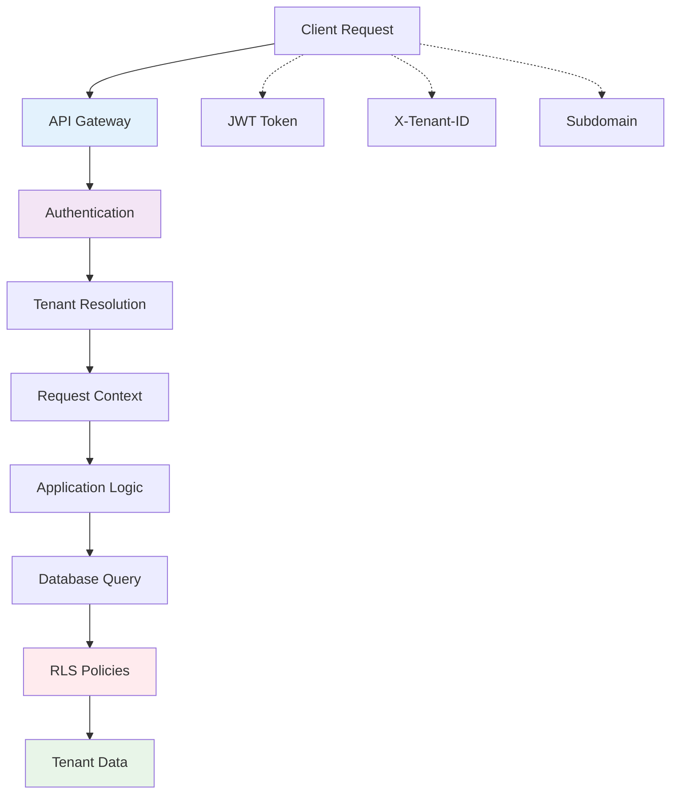

# Multi-Tenant Data Isolation

## Overview
FraiseQL implements comprehensive tenant isolation to ensure data security and performance in multi-tenant applications. This diagram shows how tenant context flows through the entire request lifecycle.

## ASCII Art Diagram

```
┌─────────────────────────────────────────────────────────────┐
│                    TENANT ISOLATION                         │
├──────────────────┬──────────────────┬──────────────────────┤
│   Request        │   Database       │   Application        │
│   Context        │   Row Level      │   Logic              │
├──────────────────┼──────────────────┼──────────────────────┤
│ • JWT Token      │ • RLS Policies   │ • Tenant Context     │
│ • Header         │ • Tenant ID      │ • Scoped Queries     │
│ • Subdomain      │ • Automatic      │ • Business Rules     │
│ • API Key        │ • Filtering      │ • Audit Logging      │
└──────────────────┴──────────────────┴──────────────────────┘
                                                          │
                                                          ▼
┌─────────────────────────────────────────────────────────────┐
│                    ISOLATION LAYERS                         │
├──────────────────┬──────────────────┬──────────────────────┤
│   Network        │   Database       │   Application        │
│   Level          │   Level          │   Level              │
├──────────────────┼──────────────────┼──────────────────────┤
│ • API Gateway    │ • Row Level      │ • Code Isolation     │
│ • Load Balancer  │ • Security       │ • Context Passing    │
│ • CDN            │ • (RLS)          │ • Validation         │
└──────────────────┴──────────────────┴──────────────────────┘
```

## Detailed Isolation Flow

### Authentication & Tenant Identification
```
Client Request ──▶ Authentication Middleware
                      │
                      ▼
                Tenant Extraction
                - JWT token parsing
                - Header inspection (X-Tenant-ID)
                - Subdomain analysis
                - API key validation
```

### Context Propagation
```
Tenant ID ──▶ Request Context
               │
               ▼
         Database Connection
         - Connection tagging
         - Session variables
         - RLS policy activation
```

### Database-Level Isolation
```
Query Execution ──▶ Row Level Security (RLS)
                     │
                     ▼
               Automatic Filtering
               - Tenant-scoped views
               - Function parameters
               - Join restrictions
```

## Mermaid Diagram



## Isolation Mechanisms

### Network-Level Isolation
**API Gateway Configuration:**
```nginx
# Route by subdomain
server {
    server_name *.myapp.com;
    location / {
        proxy_set_header X-Tenant-ID $subdomain;
        proxy_pass http://app-server;
    }
}

# Route by header
location /api/ {
    if ($http_x_tenant_id = "") {
        return 400 "Missing tenant ID";
    }
    proxy_pass http://app-server;
}
```

### Application-Level Isolation
**Context Management:**
```python
from contextvars import ContextVar

tenant_context: ContextVar[str] = ContextVar('tenant_id')

class TenantMiddleware:
    async def __call__(self, request, call_next):
        # Extract tenant from various sources
        tenant_id = (
            request.headers.get('X-Tenant-ID') or
            request.url.hostname.split('.')[0] or
            jwt_decode(request.headers.get('Authorization', '')).get('tenant_id')
        )

        if not tenant_id:
            raise HTTPException(400, "No tenant identified")

        # Set context for entire request
        token = tenant_context.set(tenant_id)
        try:
            response = await call_next(request)
            return response
        finally:
            tenant_context.reset(token)
```

### Database-Level Isolation
**Row Level Security (RLS):**
```sql
-- Enable RLS on all tenant tables
ALTER TABLE tb_user ENABLE ROW LEVEL SECURITY;
ALTER TABLE tb_post ENABLE ROW LEVEL SECURITY;

-- Create tenant isolation policy
CREATE POLICY tenant_isolation ON tb_user
    USING (tenant_id = current_setting('app.tenant_id')::uuid);

CREATE POLICY tenant_isolation ON tb_post
    USING (tenant_id = current_setting('app.tenant_id')::uuid);

-- Set session variable in connection
-- (Done by application before each query)
SET app.tenant_id = '550e8400-e29b-41d4-a716-446655440000';
```

**Tenant-Scoped Views:**
```sql
-- Views automatically inherit RLS
CREATE VIEW v_user AS
SELECT id, email, name, created_at
FROM tb_user
WHERE tenant_id = current_setting('app.tenant_id')::uuid;

-- Functions include tenant validation
CREATE FUNCTION fn_create_user(
    p_email text,
    p_name text
) RETURNS uuid AS $$
DECLARE
    v_tenant_id uuid := current_setting('app.tenant_id')::uuid;
    v_user_id uuid;
BEGIN
    INSERT INTO tb_user (email, name, tenant_id)
    VALUES (p_email, p_name, v_tenant_id)
    RETURNING id INTO v_user_id;

    RETURN v_user_id;
END;
$$ LANGUAGE plpgsql SECURITY DEFINER;
```

## Security Layers

### Defense in Depth
```
┌─────────────────────────────────────┐
│ 1. Network Isolation (API Gateway)  │
├─────────────────────────────────────┤
│ 2. Authentication (JWT/API Keys)    │
├─────────────────────────────────────┤
│ 3. Application Context (Middleware) │
├─────────────────────────────────────┤
│ 4. Database RLS (Policies)          │
├─────────────────────────────────────┤
│ 5. Query Scoping (Views/Functions)  │
└─────────────────────────────────────┘
```

### Threat Mitigation

**Data Leakage Prevention:**
- RLS prevents cross-tenant queries
- Context validation on all operations
- Audit logging of tenant access

**Performance Isolation:**
- Per-tenant connection pooling
- Resource quota enforcement
- Query execution limits

**Operational Security:**
- Tenant-specific encryption keys
- Isolated backup/restore
- Separate monitoring per tenant

## Implementation Patterns

### Tenant Context in GraphQL
```python
import fraiseql

@fraiseql.query
async def users(self, info) -> list[User]:
    tenant_id = tenant_context.get()
    return await db.execute(
        "SELECT * FROM v_user WHERE tenant_id = $1",
        [tenant_id]
    )

@fraiseql.mutation
async def create_user(self, info, input: CreateUserInput) -> User:
    tenant_id = tenant_context.get()
    user_id = await db.execute_scalar(
        "SELECT fn_create_user($1, $2, $3)",
        [input.email, input.name, tenant_id]
    )
    return await self.user(info, id=user_id)
```

### Database Schema Design
```sql
-- All tables include tenant_id
CREATE TABLE tb_tenant (
    id uuid PRIMARY KEY DEFAULT gen_random_uuid(),
    name text NOT NULL,
    created_at timestamptz DEFAULT now()
);

CREATE TABLE tb_user (
    id uuid PRIMARY KEY DEFAULT gen_random_uuid(),
    tenant_id uuid NOT NULL REFERENCES tb_tenant(id),
    email text NOT NULL,
    name text NOT NULL,
    created_at timestamptz DEFAULT now(),

    UNIQUE(tenant_id, email)  -- Email unique per tenant
);

-- RLS policies
ALTER TABLE tb_user ENABLE ROW LEVEL SECURITY;
CREATE POLICY tenant_isolation ON tb_user
    USING (tenant_id::text = current_setting('app.tenant_id'));
```

## Monitoring & Observability

### Tenant-Specific Metrics
- Query performance per tenant
- Resource usage tracking
- Error rates by tenant
- Data volume metrics

### Security Monitoring
- Failed authentication attempts
- RLS policy violations
- Unusual query patterns
- Data access anomalies

### Audit Logging
```sql
CREATE TABLE tb_audit (
    id uuid PRIMARY KEY DEFAULT gen_random_uuid(),
    tenant_id uuid NOT NULL,
    user_id uuid,
    action text NOT NULL,
    entity_type text NOT NULL,
    entity_id uuid,
    details jsonb,
    timestamp timestamptz DEFAULT now()
);

-- Automatic audit triggers
CREATE OR REPLACE FUNCTION fn_audit_trigger() RETURNS trigger AS $$
BEGIN
    INSERT INTO tb_audit (tenant_id, user_id, action, entity_type, entity_id, details)
    VALUES (
        current_setting('app.tenant_id')::uuid,
        current_setting('app.user_id')::uuid,
        TG_OP,
        TG_TABLE_NAME,
        COALESCE(NEW.id, OLD.id),
        jsonb_build_object('operation', TG_OP, 'table', TG_TABLE_NAME)
    );
    RETURN COALESCE(NEW, OLD);
END;
$$ LANGUAGE plpgsql;

CREATE TRIGGER audit_tb_user
    AFTER INSERT OR UPDATE OR DELETE ON tb_user
    FOR EACH ROW EXECUTE FUNCTION fn_audit_trigger();
```

## Performance Considerations

### Connection Management
- Connection pooling per tenant
- Prepared statements caching
- Query result caching (tenant-scoped)

### Resource Allocation
- CPU/memory limits per tenant
- Database connection quotas
- Rate limiting by tenant

### Scaling Strategies
- Horizontal scaling by tenant
- Read replicas with tenant affinity
- CDN with tenant-specific caching

## Migration Strategies

### From Single-Tenant
1. Add `tenant_id` columns to existing tables
2. Create RLS policies
3. Update application code for context passing
4. Migrate existing data with default tenant
5. Enable tenant isolation

### From Shared Schema
1. Implement tenant context middleware
2. Add tenant_id to all queries
3. Create tenant-scoped views
4. Update functions with tenant parameters
5. Enable RLS policies

### From Separate Databases
1. Implement tenant routing logic
2. Create unified API layer
3. Standardize schema across tenants
4. Implement cross-tenant features if needed
5. Maintain database separation for compliance
