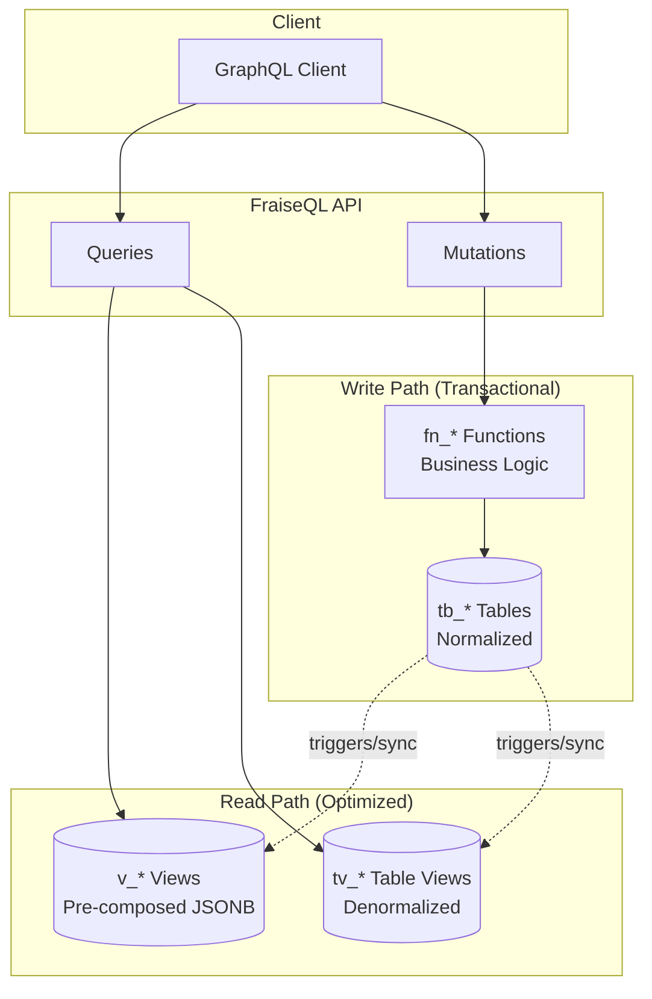

# Concepts & Glossary

Key concepts and terminology in FraiseQL.

## Core Concepts

### CQRS (Command Query Responsibility Segregation)

Separating read and write operations for optimal performance:



- **Commands (Writes)**: Mutations that modify data
- **Queries (Reads)**: Queries that fetch data from optimized views

**Benefits**:
- Optimized read paths with PostgreSQL views
- ACID transactions for writes

**See Also**:
- [CQRS Implementation](../../examples/complete_cqrs_blog/) - Complete CQRS blog example
- [Enterprise Patterns](../../examples/blog_api/) - Production CQRS with audit trails
- Independent scaling of reads and writes

### JSONB View Pattern

FraiseQL's core pattern for GraphQL types - database views return pre-composed JSONB:

**Data Flow:**
```
┌─────────────────┐      ┌──────────────────┐      ┌─────────────────┐
│  tb_user        │  →   │   v_user         │  →   │  GraphQL        │
│ (base table)    │      │  (JSONB view)    │      │  Response       │
│                 │      │                  │      │                 │
│ pk_user: 1      │      │ SELECT           │      │ {               │
│ id: uuid-123    │      │ jsonb_build_     │      │   "id": "uuid"  │
│ identifier:     │      │   object(        │      │   "identifier": │
│   "alice"       │      │    'id', id,     │      │     "alice"     │
│ name: "Alice"   │      │    'identifier', │      │   "name": "..." │
│ email: a@b.com  │      │     identifier,  │      │ }               │
│                 │      │    'name', name  │      │                 │
└─────────────────┘      └──────────────────┘      └─────────────────┘
```

**SQL Example (with Trinity Identifiers):**
```sql
-- Base table with trinity identifiers
CREATE TABLE tb_user (
    pk_user INT GENERATED BY DEFAULT AS IDENTITY PRIMARY KEY,  -- Internal
    id UUID DEFAULT gen_random_uuid() UNIQUE NOT NULL,         -- Public API
    identifier TEXT UNIQUE NOT NULL,                            -- Human-readable
    name TEXT NOT NULL,
    email TEXT UNIQUE NOT NULL
);

-- JSONB view exposes only public identifiers
CREATE VIEW v_user AS
SELECT
    id,  -- Direct column for efficient WHERE filtering (WHERE id = $1)
    jsonb_build_object(
        'id', id,                    -- Public UUID (exposed in GraphQL)
        'identifier', identifier,    -- Human-readable slug (exposed in GraphQL)
        'name', name,
        'email', email
        -- Note: pk_user NOT in view (internal only)
    ) as data
FROM tb_user;
```

**Python Type Definition:**
```python
import fraiseql
import fraiseql
from fraiseql.types import ID

@fraiseql.type(sql_source="v_user")
class User:
    """User with trinity identifiers."""
    id: ID              # Public API identifier (stable, secure)
    identifier: str       # Human-readable slug (SEO-friendly)
    name: str
    email: str
    # Note: pk_user is NOT exposed in GraphQL type
```

**Why This Pattern?**
- ✅ **PostgreSQL composes JSONB** - One query, no N+1 problems
- ✅ **Rust transforms efficiently** - Compiled performance for field selection
- ✅ **Explicit field control** - Only fields in JSONB are accessible
- ✅ **Security by design** - Can't accidentally expose hidden columns
- ✅ **Trinity identifiers** - Three ID types for different purposes (see below)

### Trinity Identifiers

FraiseQL's pattern of using three identifier types per entity for optimal performance and usability:

**The Three Identifiers:**

```sql
CREATE TABLE tb_post (
    -- 1. pk_* - Internal primary key (NEVER exposed to GraphQL)
    pk_post INT GENERATED BY DEFAULT AS IDENTITY PRIMARY KEY,

    -- 2. id - Public API identifier (ALWAYS exposed, stable)
    id UUID DEFAULT gen_random_uuid() UNIQUE NOT NULL,

    -- 3. identifier - Human-readable slug (OPTIONAL, for SEO)
    identifier TEXT UNIQUE,

    -- Other fields
    title TEXT NOT NULL,
    content TEXT
);
```

**Purpose of Each Identifier:**

| Identifier Type | Purpose | Example | Exposed in API? | Use Case |
|----------------|---------|---------|-----------------|----------|
| **pk_post** | Fast integer joins in PostgreSQL | `1234` | ❌ Never | Database performance (JOINs, indexes) |
| **id** | Stable public API identifier | `550e8400-e29b-41d4-a716-446655440000` | ✅ Always | GraphQL queries, external integrations |
| **identifier** | Human-readable SEO slug | `"my-first-post"` | ✅ Optional | URLs, user-facing references |

**Why Three Identifiers?**

1. **Performance (pk_*):**
   - Integer primary keys are faster for JOINs than UUIDs
   - Smaller indexes, better cache locality
   - Sequential IDs optimize B-tree performance
   - **Never exposed** to prevent enumeration attacks

2. **Stability (id):**
   - UUIDs don't reveal database size or creation order
   - Can be generated client-side (distributed systems)
   - Stable even if slug changes
   - Safe for public APIs

3. **Usability (identifier):**
   - SEO-friendly URLs: `/posts/my-first-post` vs `/posts/550e8400...`
   - Human-readable references
   - Can change without breaking API (id stays stable)
   - Optional (not all entities need slugs)

**View column pattern:**

```sql
-- Leaf view (nothing references it) - only needs id for filtering
CREATE VIEW v_user AS
SELECT
    id,  -- For WHERE id = $1 filtering
    jsonb_build_object(
        'id', id,
        'name', name
    ) as data
FROM tb_user;

-- Referenced view - needs id AND pk_* for parent views to JOIN
CREATE VIEW v_post AS
SELECT
    id,       -- For WHERE id = $1 filtering
    pk_post,  -- For parent views to JOIN
    jsonb_build_object(
        'id', id,
        'identifier', identifier,
        'title', title,
        'content', content
    ) as data
FROM tb_post;

-- Parent view composing nested data using pk_post
CREATE VIEW v_user_with_posts AS
SELECT
    id,  -- For WHERE id = $1 filtering
    jsonb_build_object(
        'id', u.id,
        'name', u.name,
        'posts', (
            SELECT jsonb_agg(p.data)
            FROM v_post p
            JOIN tb_post tp ON tp.pk_post = p.pk_post
            WHERE tp.user_id = tb_user.pk_user
        )
    ) as data
FROM tb_user u;
```

**Rule:**
- **Always include `id`** (public identifier) for WHERE filtering
- **Include `pk_*`** only if other views need to JOIN to this view
- **Never include `pk_*` in JSONB** (internal only)

```python
import fraiseql
import fraiseql
from fraiseql.types import ID

@fraiseql.type(sql_source="v_post")
class Post:
    id: ID          # Public API - stable forever
    identifier: str   # Human-readable - can change
    title: str
    content: str
    # pk_post NOT exposed - internal only
```

**Querying by Different Identifiers:**

```graphql
# Query by public UUID
query {
  post(id: "550e8400-e29b-41d4-a716-446655440000") {
    title
  }
}

# Query by human-readable identifier
query {
  post(identifier: "my-first-post") {
    title
  }
}

# pk_post is NEVER queryable from GraphQL (security)
```

**Best Practices:**

✅ **Always use trinity pattern** for entities with public APIs
✅ **Never expose pk_*** in GraphQL types (security risk)
✅ **Use id for API contracts** (stable, never changes)
✅ **Use identifier for URLs** (human-friendly, can update)
✅ **Index all three** for query performance:
```sql
CREATE INDEX idx_post_pk ON tb_post(pk_post);        -- Primary key (automatic)
CREATE UNIQUE INDEX idx_post_id ON tb_post(id);      -- API lookups
CREATE UNIQUE INDEX idx_post_identifier ON tb_post(identifier);  -- URL lookups
```

### Projection Tables (tv_*)

**Pattern:** Manually-synced tables that cache pre-composed JSONB for instant GraphQL queries.

Projection tables (`tv_*`) are regular tables (NOT views!) that store materialized JSONB data:

**When to use:**
- Read-heavy workloads (10:1+ read:write ratio)
- Large datasets (>100k rows) where view JOINs are too slow
- GraphQL APIs needing sub-millisecond response times
- Acceptable write complexity for massive read performance gains

**Architecture (3-layer CQRS):**

```sql
-- Layer 1: Base tables (normalized, for writes)
CREATE TABLE tb_user (
    pk_user INT PRIMARY KEY,
    id UUID UNIQUE NOT NULL,
    name TEXT,
    email TEXT
);

CREATE TABLE tb_post (
    pk_post INT PRIMARY KEY,
    user_id INT REFERENCES tb_user(pk_user),
    title TEXT,
    content TEXT
);

-- Layer 2: Views (compose JSONB from base tables)
CREATE VIEW v_user AS
SELECT
    u.id,
    jsonb_build_object(
        'id', u.id,
        'name', u.name,
        'posts', (
            SELECT jsonb_agg(jsonb_build_object('id', p.id, 'title', p.title))
            FROM tb_post p
            WHERE p.user_id = u.pk_user
        )
    ) AS data
FROM tb_user u;

-- Layer 3: Projection tables (cache JSONB for fast reads)
CREATE TABLE tv_user (
    id UUID PRIMARY KEY,
    data JSONB NOT NULL,  -- Regular column (NOT GENERATED!)
    updated_at TIMESTAMPTZ DEFAULT NOW()
);

-- Sync function: copies v_user → tv_user
CREATE FUNCTION fn_sync_tv_user(p_id UUID) RETURNS VOID AS $$
BEGIN
    INSERT INTO tv_user (id, data)
    SELECT id, data FROM v_user WHERE id = p_id
    ON CONFLICT (id) DO UPDATE SET
        data = EXCLUDED.data,
        updated_at = NOW();
END;
$$ LANGUAGE plpgsql;

-- Mutation explicitly calls sync (CRITICAL!)
CREATE FUNCTION fn_create_user(p_name TEXT, p_email TEXT)
RETURNS JSONB AS $$
DECLARE v_user_id UUID;
BEGIN
    INSERT INTO tb_user (name, email)
    VALUES (p_name, p_email)
    RETURNING id INTO v_user_id;

    -- Explicitly sync to projection table
    PERFORM fn_sync_tv_user(v_user_id);

    RETURN (SELECT data FROM tv_user WHERE id = v_user_id);
END;
$$ LANGUAGE plpgsql;
```

**⚠️ CRITICAL: Explicit Sync Required**

Projection tables do **NOT** auto-update. Every mutation must call sync functions:

```sql
-- ✅ CORRECT
CREATE FUNCTION fn_update_user(...) RETURNS JSONB AS $$
BEGIN
    UPDATE tb_user SET name = p_name WHERE id = p_id;
    PERFORM fn_sync_tv_user(p_id);  -- Must call!
    RETURN (SELECT data FROM tv_user WHERE id = p_id);
END;
$$;

-- ❌ WRONG - Missing sync!
CREATE FUNCTION fn_update_user_broken(...) RETURNS JSONB AS $$
BEGIN
    UPDATE tb_user SET name = p_name WHERE id = p_id;
    -- tv_user will have stale data!
    RETURN (SELECT data FROM tv_user WHERE id = p_id);
END;
$$;
```

**Benefits:**
- ✅ **100-200x faster reads** - 0.05-0.5ms (vs 5-10ms for views)
- ✅ **Embedded relations** - Nested data pre-composed
- ✅ **Works with Rust pipeline** - JSONB → Rust → HTTP
- ✅ **No N+1 queries** - Everything in one lookup

**Trade-offs:**
- ❌ **Write complexity** - Mutations must call sync functions
- ❌ **Storage overhead** - Duplicates data (1.5-2x)
- ❌ **Manual sync** - Developer must remember
- ⚠️ **Not for high-write tables** - Sync overhead

**Python mapping:**
```python
import fraiseql
from fraiseql.types import ID

@fraiseql.type(sql_source="tv_user", jsonb_column="data")
class User:
    id: ID
    name: str
    posts: list[Post]  # Pre-composed!
```

**Common misconception:**
```sql
-- ❌ WRONG - PostgreSQL can't do this!
CREATE TABLE tv_user (
    id UUID PRIMARY KEY,
    data JSONB GENERATED ALWAYS AS (
        SELECT ... FROM tb_user ...  -- Can't reference other tables!
    ) STORED
);
```

**Where GENERATED ALWAYS works:**
```sql
-- ✅ Same-row scalar extraction (for indexing)
CREATE TABLE tb_user (
    data JSONB,
    email TEXT GENERATED ALWAYS AS (lower(data->>'email')) STORED
);
```

See [Projection Tables Example](../../examples/hybrid_tables/)

## GraphQL Concepts

### Auto-Documentation

FraiseQL automatically extracts field descriptions from your Python code for GraphQL schema documentation.

**Supported sources (priority order):**

1. **Inline comments** (highest priority)
2. **Annotated types** with string metadata
3. **Docstring Fields sections** (lowest priority)

**Example:**
```python
import fraiseql
import fraiseql
from typing import Annotated
from fraiseql.types import ID

@fraiseql.type(sql_source="v_user")
class User:
    """User account model.

    Fields:
        created_at: Account creation timestamp
    """
    id: ID  # Public API identifier (inline comment - highest priority)
    identifier: str  # Human-readable username
    name: Annotated[str, "User's full name"]  # Annotated type
    email: str
    created_at: datetime  # Uses docstring description
```

**Generated GraphQL schema:**
```graphql
type User {
  "Public API identifier"
  id: ID!

  "Human-readable username"
  identifier: String!

  "User's full name"
  name: String!

  email: String!

  "Account creation timestamp"
  createdAt: DateTime!
}
```

**Auto-applied to:**
- ✅ Type fields (visible in Apollo Studio)
- ✅ Where clause filter operators (`eq`, `gt`, `contains`, etc.)
- ✅ Input type fields
- ✅ Mutation parameters
- ✅ Specialized type operators (network, LTree, coordinates)

**Benefits:**
- No separate documentation files to maintain
- Descriptions live next to type definitions
- AI tools (Claude, Copilot) can see context
- Apollo Studio shows helpful field hints

### Type

Define your data models with trinity identifiers:

```python
import fraiseql
import fraiseql
from fraiseql.types import ID

@fraiseql.type(sql_source="v_user")
class User:
    """User type with trinity identifiers."""
    id: ID          # Public API identifier (always exposed)
    identifier: str   # Human-readable slug (SEO-friendly)
    name: str
    email: str
    # pk_user is NOT exposed (internal only)
```

**Without trinity pattern (simpler entities):**
```python
import fraiseql
import fraiseql

@fraiseql.type(sql_source="v_note")
class Note:
    """Simple note without slug."""
    id: int           # Can use simple int if no public API needed
    title: str
    content: str
```

### Query

Read operations:

```python
import fraiseql

async def get_users(info) -> list[User]:
    """Get all users."""
    db = info.context["db"]
    return await db.find(User)
```

### Mutation

Write operations (two patterns supported):

**Simple pattern (function-based):**
```python
import fraiseql
import fraiseql

@fraiseql.mutation
async def create_user(info, input: CreateUserInput) -> User:
    """Simple mutation that returns the type directly."""
    db = info.context["db"]
    # Call PostgreSQL function with business logic
    result = await db.execute_function("fn_create_user", {
        "name": input.name,
        "email": input.email
    })
    return await db.find_one("v_user", id=result["id"])
```

**Class-based pattern (with success/failure):**
```python
import fraiseql
import fraiseql

@fraiseql.mutation
class CreateUser:
    """Create a new user with explicit success/failure handling."""
    input: CreateUserInput
    success: CreateUserSuccess
    failure: ValidationError

    async def resolve(self, info):
        db = info.context["db"]
        # Call PostgreSQL function - all business logic in database
        result = await db.execute_function("fn_create_user", {
            "name": self.input.name,
            "email": self.input.email
        })

        # PostgreSQL function returns success/error indicator with user ID
        if result["success"]:
            user = await db.find_one("v_user", id=result["user_id"])
            return CreateUserSuccess(
                user=user,
                message=result.get("message", "User created")
            )
        return ValidationError(
            message=result["error"],
            code=result.get("code", "VALIDATION_ERROR")
        )
```

**Corresponding PostgreSQL function:**
```sql
CREATE OR REPLACE FUNCTION fn_create_user(
    p_name TEXT,
    p_email TEXT
) RETURNS JSONB AS $$
DECLARE
    v_user_id UUID;
BEGIN
    -- Validation: Check email format using regex
    -- Pattern: local-part@domain.tld (basic RFC 5322 compliance)
    IF p_email !~ '^[A-Za-z0-9._%+-]+@[A-Za-z0-9.-]+\.[A-Z|a-z]{2,}$' THEN
        RETURN jsonb_build_object(
            'success', false,
            'error', 'Invalid email format',
            'code', 'INVALID_EMAIL'
        );
    END IF;

    -- Insert user
    INSERT INTO tb_user (name, email)
    VALUES (p_name, p_email)
    RETURNING id INTO v_user_id;

    -- Audit log
    INSERT INTO audit_log (action, details)
    VALUES ('user_created', jsonb_build_object('user_id', v_user_id));

    -- Return success with user data
    RETURN jsonb_build_object(
        'success', true,
        'user', jsonb_build_object(
            'id', v_user_id,
            'name', p_name,
            'email', p_email
        ),
        'message', 'User created successfully'
    );
END;
$$ LANGUAGE plpgsql;
```

### Where Input Types

FraiseQL automatically generates strongly-typed `WhereInput` types for filtering with field-specific operators.

**Basic operators (all types):**
- `eq` / `neq` - Equality checks
- `in` / `nin` - List membership (NOT IN)
- `isnull` - Null checks (true = IS NULL, false = IS NOT NULL)

**Numeric operators (Int, Float, Decimal):**
- `gt` / `gte` - Greater than (or equal)
- `lt` / `lte` - Less than (or equal)

**String operators:**
- `contains` - Substring search (case-sensitive)
- `startswith` - Prefix match
- `endswith` - Suffix match

**Date/DateTime operators:**
- All numeric operators (`gt`, `gte`, `lt`, `lte`)
- `in` / `nin` for specific dates
- `isnull` for optional date fields

**Example - basic filtering:**
```graphql
query {
  users(where: {
    status: { eq: "active" }
    age: { gte: 18 }
    email: { endswith: "@company.com" }
    deletedAt: { isnull: true }
  }) {
    name
    email
  }
}
```

**Specialized Type Operators:**

**1. Coordinates (Geographic Filtering)**
```graphql
query {
  stores(where: {
    location: {
      distance_within: {
        center: [37.7749, -122.4194]  # San Francisco
        radius: 5000  # meters
      }
    }
  }) {
    name
    address
    location
  }
}
```

**2. Network Addresses (IP/CIDR Filtering)**
```graphql
query {
  servers(where: {
    ipAddress: {
      inSubnet: "192.168.1.0/24"    # CIDR subnet matching
      isPrivate: true                # RFC 1918 private addresses
      isIPv4: true                   # IPv4 vs IPv6
    }
  }) {
    hostname
    ipAddress
  }
}

query {
  publicServers(where: {
    ipAddress: {
      inRange: { from: "10.0.0.1", to: "10.0.0.254" }
      isPublic: true
      NOT: { isLoopback: true }
    }
  }) {
    hostname
  }
}
```

**Network classification operators:**
- `inSubnet` - IP within CIDR range
- `inRange` - IP between from/to addresses
- `isPrivate` / `isPublic` - RFC 1918 detection
- `isIPv4` / `isIPv6` - IP version
- `isLoopback` - 127.0.0.1 or ::1
- `isMulticast` - Multicast addresses
- `isBroadcast` - 255.255.255.255
- `isLinkLocal` - 169.254.0.0/16 or fe80::/10
- `isDocumentation` - RFC 3849/5737 ranges
- `isReserved` - Reserved/unspecified (0.0.0.0, ::)
- `isCarrierGrade` - CGN range (100.64.0.0/10)
- `isSiteLocal` - Site-local IPv6 (deprecated)
- `isUniqueLocal` - Unique local IPv6 (fc00::/7)
- `isGlobalUnicast` - Global unicast addresses

**3. LTree (Hierarchical Paths)**
```graphql
query {
  categories(where: {
    path: {
      ancestor_of: "Electronics.Computers.Laptops"  # All ancestor categories
      nlevel_gte: 2                                  # At least 2 levels deep
    }
  }) {
    name
    path
  }
}

query {
  subcategories(where: {
    path: {
      descendant_of: "Electronics"       # All subcategories
      matches_lquery: "Electronics.*"    # Pattern matching
    }
  }) {
    name
  }
}
```

**LTree hierarchical operators:**
- `ancestor_of` - Path is ancestor of target
- `descendant_of` - Path is descendant of target
- `matches_lquery` - Pattern match with wildcards
- `matches_ltxtquery` - Text search (AND/OR/NOT)
- `nlevel_eq` / `nlevel_gt` / `nlevel_gte` / `nlevel_lt` / `nlevel_lte` - Path depth filtering

**Logical Operators (All WhereInput Types)**

Combine filters with AND, OR, NOT for complex queries:

```graphql
query {
  users(where: {
    AND: [
      { status: { eq: "active" } }
      { OR: [
          { role: { eq: "admin" } }
          { AND: [
              { role: { eq: "editor" } }
              { verified: { eq: true } }
            ]
          }
        ]
      }
    ]
  }) {
    name
    role
  }
}
```

**Nested array filtering:**
```graphql
query {
  users(where: {
    posts: {  # Filter parent by nested array properties
      AND: [
        { status: { eq: "published" } }
        { views: { gte: 1000 } }
      ]
    }
  }) {
    name
    posts {
      title
      views
    }
  }
}
```

**How it works:**
1. FraiseQL inspects your type fields
2. Generates appropriate filter class per field type
3. Creates `TypeWhereInput` with logical operators
4. Converts GraphQL input to SQL WHERE clauses
5. PostgreSQL executes with proper type casting

**Example generated type:**
```python
import fraiseql
from fraiseql.types import ID

# Your type definition
@fraiseql.type(sql_source="v_server")
class Server:
    id: ID
    hostname: str
    ip_address: NetworkAddress  # Special type
    port: int
    location: Coordinate        # Special type

# FraiseQL auto-generates:
class ServerWhereInput:
    id: UUIDFilter | None
    hostname: StringFilter | None
    ip_address: NetworkAddressFilter | None  # Rich operators!
    port: IntFilter | None
    location: CoordinateFilter | None         # Distance queries!
    AND: list[ServerWhereInput] | None
    OR: list[ServerWhereInput] | None
    NOT: ServerWhereInput | None
```

**Benefits:**
- ✅ **Type-safe filtering** - No runtime query errors
- ✅ **Field-specific operators** - `contains` for strings, `gt` for numbers
- ✅ **Specialized types** - Network, geographic, hierarchical queries
- ✅ **Logical operators** - Complex AND/OR/NOT combinations
- ✅ **Apollo autocomplete** - All operators visible in IDE
- ✅ **SQL injection safe** - Parameterized queries always

### Connection

Relay-style cursor-based pagination (built-in):

```python
import fraiseql
from fraiseql import connection
from fraiseql.types.generic import Connection

@connection(
    node_type=User,
    default_page_size=20,
    max_page_size=100
)
async def users(info, first: int | None = None, after: str | None = None) -> Connection[User]:
    """Get paginated users - pagination handled automatically."""
    # Framework calls db.paginate() automatically
    # Returns Connection with nodes, pageInfo, totalCount
```

**Configuration options:**
- `node_type`: The type being paginated (required)
- `view_name`: Database view (defaults to `v_<function_name>`)
- `default_page_size`: Default results per page (default: 20)
- `max_page_size`: Maximum allowed page size (default: 100)
- `cursor_field`: Field for cursor (default: "id")
- `include_total_count`: Include total count (default: True)

**Returned Connection type includes:**
- `nodes`: List of items (User[])
- `pageInfo`: Pagination info (hasNextPage, hasPreviousPage, startCursor, endCursor)
- `totalCount`: Total number of items (optional)

## Database Concepts

### View

Read-optimized database views that compose JSONB for GraphQL:

**Simple view (without trinity pattern):**
```sql
CREATE VIEW v_note AS
SELECT
    id,
    jsonb_build_object(
        'id', id,
        'title', title,
        'content', content,
        'created_at', created_at
    ) as data
FROM tb_note
WHERE deleted_at IS NULL;
```

**View with trinity identifiers:**
```sql
CREATE VIEW v_user AS
SELECT
    id,  -- For WHERE id = $1 filtering
    jsonb_build_object(
        'id', id,                    -- Public UUID
        'identifier', identifier,    -- Human-readable slug
        'name', name,
        'email', email,
        'created_at', created_at
    ) as data
FROM tb_user
WHERE deleted_at IS NULL;
```

**View that will be referenced by others (includes pk_*):**
```sql
CREATE VIEW v_post AS
SELECT
    id,       -- For WHERE id = $1 filtering
    pk_post,  -- For parent views to JOIN
    jsonb_build_object(
        'id', id,
        'title', title,
        'content', content
    ) as data
FROM tb_post;
```

**Key points:**
- **Always include `id`** as direct column for efficient WHERE filtering
- **Include `pk_*`** only if other views need to JOIN/reference this view
- **Never include `pk_*` in JSONB** data column (internal only)
- `data` column contains complete GraphQL response
- Only fields in JSONB are exposed to GraphQL

### Materialized View

Pre-computed aggregations:

```sql
CREATE MATERIALIZED VIEW user_stats AS
SELECT
    user_id,
    COUNT(*) as post_count,
    MAX(created_at) as last_post_at
FROM posts
GROUP BY user_id;
```

### Index

Performance optimization:

```sql
CREATE INDEX idx_users_email ON users(email);
```

## Performance Concepts

### Query Complexity

Limiting query depth and breadth:

```python
from fraiseql import ComplexityConfig

config = ComplexityConfig(
    max_complexity=1000,
    max_depth=10
)
```

### APQ (Automatic Persisted Queries)

Cache GraphQL queries by SHA-256 hash to reduce bandwidth and improve performance.

**How it works:**

1. **First request:** Client sends full query + SHA-256 hash
2. **Server:** Stores query in cache, returns result
3. **Subsequent requests:** Client sends only hash
4. **Server:** Retrieves query from cache, executes, returns result

**Benefits:**
- ✅ **Bandwidth reduction** - 90%+ for large queries (send 64-char hash vs full query)
- ✅ **Faster uploads** - Especially on mobile networks
- ✅ **Query optimization** - Server can optimize cached queries
- ✅ **Works with Rust pipeline** - PostgreSQL → JSONB → Rust → HTTP (no slowdown)

**See Also**:
- [APQ Multi-tenant Example](../../examples/apq_multi_tenant/) - APQ with tenant isolation

**Configuration:**

**Memory backend (single instance):**
```python
from fraiseql import FraiseQLConfig

config = FraiseQLConfig(
    apq_storage_backend="memory",  # Default - LRU cache
    apq_cache_size=1000             # Max cached queries
)
```

**PostgreSQL backend (multi-instance):**
```python
config = FraiseQLConfig(
    apq_storage_backend="postgresql",
    apq_storage_schema="apq_cache",     # Schema for cache table
    apq_cache_ttl=3600                   # TTL in seconds (optional)
)

# Creates table:
# CREATE TABLE apq_cache.persisted_queries (
#     query_hash TEXT PRIMARY KEY,
#     query_text TEXT NOT NULL,
#     created_at TIMESTAMPTZ DEFAULT NOW(),
#     last_used TIMESTAMPTZ DEFAULT NOW()
# );
```

**Client usage (Apollo Client):**

```typescript
import { ApolloClient, InMemoryCache, HttpLink } from '@apollo/client';
import { createPersistedQueryLink } from '@apollo/client/link/persisted-queries';
import { sha256 } from 'crypto-hash';

const link = createPersistedQueryLink({ sha256 }).concat(
  new HttpLink({ uri: 'http://localhost:8000/graphql' })
);

const client = new ApolloClient({
  cache: new InMemoryCache(),
  link,
});

// First query: sends full query + hash
// Subsequent queries: sends only hash
const { data } = await client.query({
  query: GET_USERS,
  // Apollo automatically handles APQ protocol
});
```

**Server logs:**
```
[APQ] Cache miss - storing query hash: 5d41402abc4b2a76b9719d911017c592
[APQ] Cache hit - executing query from hash: 5d41402abc4b2a76b9719d911017c592
```

**When to use:**
- Large, complex queries (>1KB)
- Mobile applications (limited bandwidth)
- Multi-instance deployments (use PostgreSQL backend)
- Production APIs with repeated queries

**Storage backend comparison:**

| Feature | Memory Backend | PostgreSQL Backend |
|---------|---------------|-------------------|
| **Multi-instance** | ❌ No | ✅ Yes (shared cache) |
| **Persistence** | ❌ Lost on restart | ✅ Survives restarts |
| **Performance** | ✅ Fastest | ⚠️ Network overhead |
| **Setup** | ✅ Zero config | ⚠️ Requires migration |
| **Use case** | Single instance | Multi-instance/production |

**Monitoring:**

```python
from fraiseql.monitoring import apq_metrics

# Check APQ cache statistics
stats = await apq_metrics.get_stats()
print(f"Cache hits: {stats.hits}")
print(f"Cache misses: {stats.misses}")
print(f"Hit rate: {stats.hit_rate:.2%}")
print(f"Cached queries: {stats.total_queries}")
```

**See also:**
- [Multi-tenant APQ Setup](../../examples/apq_multi_tenant/)

### Rust JSON Pipeline

FraiseQL's exclusive architecture: PostgreSQL → Rust → HTTP

**Traditional frameworks:**
```
PostgreSQL → Rows → ORM → Python objects → JSON serialize → Response
            ╰────────── Python overhead ──────────╯
```

**FraiseQL:**
```
PostgreSQL → JSONB → Rust transform → HTTP Response
            ╰────── 7-10x faster ──────╯
```

**Why Rust?**
- **Compiled performance** - No Python serialization overhead
- **7-10x faster JSON processing** - Rust handles field selection
- **Zero-copy path** - Direct bytes to HTTP response
- **No GIL contention** - Parallel request processing

**Architectural advantage:**
- PostgreSQL composes JSONB once (no N+1 queries)
- Rust selects only requested fields (respects GraphQL query)
- No Python in the hot path (compiled speed for every request)

## Security Concepts

### Explicit Field Exposure (Security by Architecture)

FraiseQL prevents accidental data leaks through explicit JSONB view contracts:

**The ORM security problem:**
```python
# Traditional ORM - ALL columns loaded
class User(Base):
    id = Column(Integer)
    email = Column(String)
    password_hash = Column(String)  # Oops! Sensitive!
    api_key = Column(String)        # Oops! Sensitive!

# Easy to forget excluding fields
# One mistake = data leak
```

**FraiseQL's explicit whitelisting:**
```sql
-- Only safe fields in JSONB view
CREATE VIEW v_user AS
SELECT
    pk_user,
    jsonb_build_object(
        'id', id,
        'email', email
        -- password_hash CANNOT be queried
        -- api_key CANNOT be queried
        -- Impossible to accidentally expose!
    ) as data
FROM tb_user;
```

**Security benefits:**
- ✅ **Whitelist-only** - Only fields in JSONB are accessible
- ✅ **Database-enforced** - PostgreSQL is the security boundary
- ✅ **Two-layer protection** - SQL view + Python type
- ✅ **No accidental exposure** - Can't query fields not in view
- ✅ **Trinity protection** - pk_* never exposed (prevents enumeration)

### Recursion Depth Protection

Views define maximum nesting depth structurally:

```sql
-- View defines max depth (no circular references possible)
CREATE VIEW v_user AS
SELECT
    pk_user,
    jsonb_build_object(
        'id', id,
        'posts', (
            SELECT jsonb_agg(jsonb_build_object(
                'id', p.id,
                'title', p.title
                -- NO 'author' field here
                -- Recursion IMPOSSIBLE
            ))
            FROM tb_post p
            WHERE p.user_id = tb_user.id
            LIMIT 100  -- Array size limit
        )
    ) as data
FROM tb_user;
```

**Protection:**
- ✅ **Fixed depth** - Attackers can't exceed view definition
- ✅ **No middleware needed** - GraphQL schema validates automatically
- ✅ **Array size limits** - LIMIT clauses prevent huge responses
- ✅ **One query** - No N+1 bomb attacks possible

### Field-Level Authorization

Control access at the field level:

```python
import fraiseql
from fraiseql import field, authorized

@field
@authorized(roles=["admin"])
def sensitive_field(user: User, info) -> str:
    """Only admins can access this field."""
    return user.sensitive_data
```

### Rate Limiting

Prevent abuse:

```python
from fraiseql.auth import RateLimitConfig

rate_limit = RateLimitConfig(
    requests_per_minute=100
)
```

### Introspection Control

Disable schema introspection in production:

```python
config = FraiseQLConfig(
    introspection_enabled=False
)
```

## Related

- [Core Documentation](README.md)
- [Examples](../../examples/)
- [API Reference](../reference/quick-reference.md)
