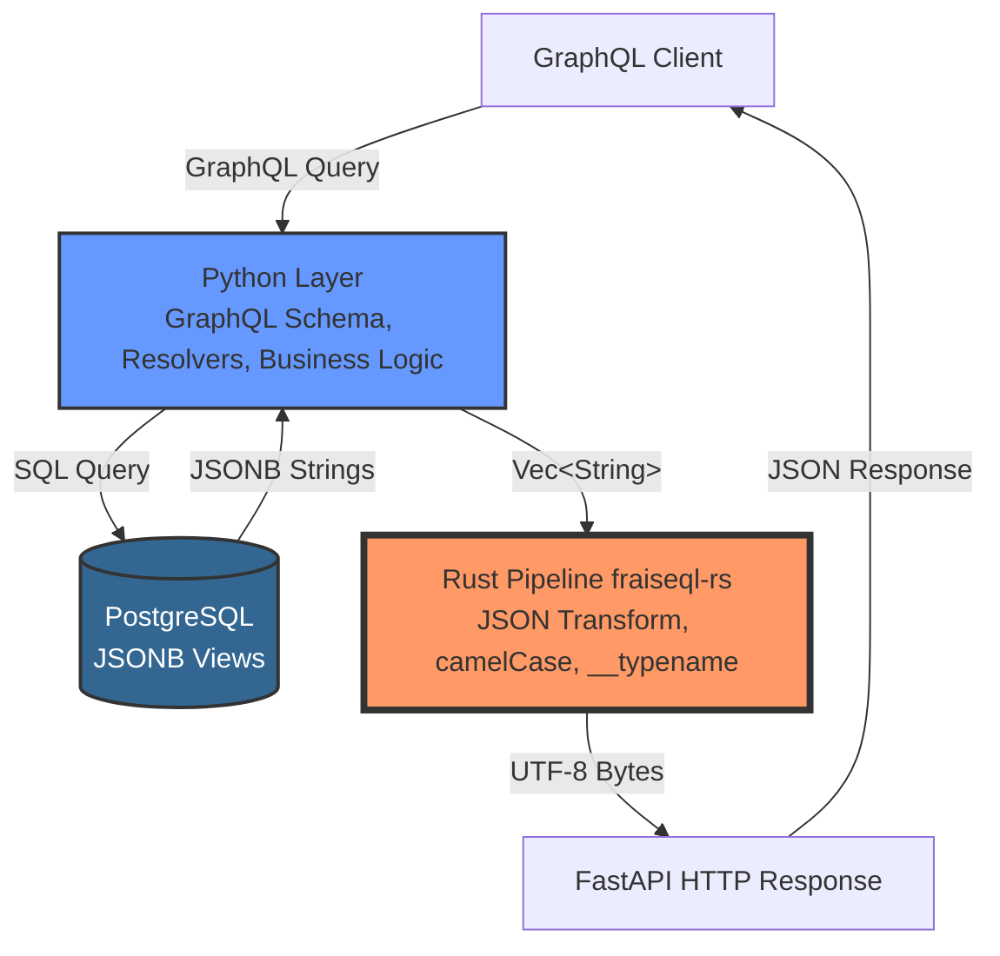

# Python ↔ Rust Integration

This guide explains how FraiseQL's Python code integrates with the Rust pipeline.

## Overview

FraiseQL's architecture separates responsibilities: Python handles GraphQL schema, resolvers, and PostgreSQL queries, while an **exclusive Rust pipeline** handles all JSON transformation, field projection, and HTTP response generation. Every query flows through the Rust pipeline—there is no fallback or mode detection.

## Competitive Advantage: Exclusive Architecture

**Other frameworks can't do this—they're locked into ORM serialization.** Traditional GraphQL frameworks serialize ORM objects to JSON in Python, creating unavoidable performance bottlenecks. FraiseQL's exclusive Rust pipeline bypasses Python entirely for JSON processing, delivering **7-10x faster** response times.

This architecture is unique to FraiseQL. No other GraphQL framework combines:
- PostgreSQL-native JSONB views
- Zero Python serialization overhead
- Rust-powered JSON transformation
- Direct UTF-8 byte output to HTTP



## Request Flow Diagram

```mermaid
sequenceDiagram
    participant Client
    participant FastAPI
    participant Python as Python Resolver
    participant PostgreSQL
    participant Rust as fraiseql_rs

    Client->>FastAPI: POST /graphql<br/>{query: "{ users { id firstName } }"}
    FastAPI->>Python: Execute GraphQL query
    Python->>PostgreSQL: SELECT data FROM v_user
    PostgreSQL->>Python: [<br/> '{"id": "...", "first_name": "Alice"}',<br/> '{"id": "...", "first_name": "Bob"}'<br/>]
    Python->>Rust: build_graphql_response(<br/> json_strings=Vec&lt;String&gt;,<br/> field_name="users",<br/> type_name="User"<br/>)
    Rust->>Rust: Concatenate JSON array
    Rust->>Rust: Transform snake_case → camelCase
    Rust->>Rust: Inject __typename="User"
    Rust->>Python: Vec&lt;u8&gt; (UTF-8 bytes)
    Python->>FastAPI: RustResponseBytes
    FastAPI->>Client: HTTP 200 OK<br/>{"data": {"users": [...]}}
```

## The Boundary

### What Python Does:
- Define GraphQL types and queries
- Execute PostgreSQL queries
- Collect JSONB strings from database
- Call Rust pipeline with JSON strings

### What Rust Does:
- Concatenate JSON array
- Transform JSONB to GraphQL JSON
- Convert field names to camelCase
- Inject __typename
- Return UTF-8 bytes directly for HTTP

## Code Example

### Python Side:
```python
import fraiseql
from fraiseql.types import ID

# 1. Define GraphQL type
@fraiseql.type(sql_source="v_user")
class User:
    id: ID
    first_name: str  # Python uses snake_case
    created_at: datetime

# 2. Define query resolver
@fraiseql.query
async def users(info) -> list[User]:
    db = info.context["db"]

    # 3. Execute PostgreSQL query (returns JSONB)
    # Rust pipeline handles transformation automatically
    return await repo.find("v_user")
```

### Under the Hood:
```python
# In FraiseQLRepository.find():
async def find(self, source: str):
    # 1. Execute PostgreSQL query
    rows = await conn.fetch(f"SELECT data FROM {source}")

    # 2. Extract JSONB strings
    json_strings = [row["data"] for row in rows]

    # 3. Call Rust pipeline
    import fraiseql_rs

    response_bytes = fraiseql_rs.build_graphql_response(
        json_strings=json_strings,
        field_name="users",
        type_name="User",
        field_paths=None,
    )

    # 4. Return RustResponseBytes (FastAPI sends as HTTP response)
    return RustResponseBytes(response_bytes)
```

### Rust Side (fraiseql_rs crate):
```rust
#[pyfunction]
pub fn build_graphql_response(
    json_strings: Vec<String>,
    field_name: String,
    type_name: Option<String>,
    field_paths: Option<Vec<Vec<String>>>,
) -> PyResult<Vec<u8>> {
    // 1. Concatenate JSON strings
    let array = format!("[{}]", json_strings.join(","));

    // 2. Wrap in GraphQL response
    let response = format!(
        r#"{{"data":{{"{}":{}}}}}"#,
        field_name, array
    );

    // 3. Transform to camelCase + inject __typename
    let transformed = transform_json(&response, type_name);

    // 4. Return UTF-8 bytes
    Ok(transformed.into_bytes())
}
```

## Performance Benefits

By delegating to Rust:
- **7-10x faster** JSON transformation
- **Zero Python overhead** for string operations
- **Direct UTF-8 bytes** to HTTP (no Python serialization)

## Type Safety

The Python/Rust boundary is type-safe via PyO3:
- Python `list[str]` → Rust `Vec<String>`
- Python `str | None` → Rust `Option<String>`
- Rust `Vec<u8>` → Python `bytes`

## Debugging

### Enable Rust Logs:
```bash
RUST_LOG=fraiseql_rs=debug python app.py
```

### Inspect Rust Output:
```python
from fraiseql.core.rust_pipeline import RustResponseBytes
import json

result = await repo.find("v_user")
if isinstance(result, RustResponseBytes):
    # Convert bytes to string for inspection
    json_str = result.bytes.decode('utf-8')
    print(json_str)  # See what Rust produced

    # Parse to verify structure
    data = json.loads(json_str)
    print(json.dumps(data, indent=2))
```

## Contributing to Rust Code

The Rust code lives in `fraiseql_rs/` directory:

```
fraiseql_rs/
├── Cargo.toml           # Rust dependencies
├── src/
│   ├── lib.rs          # Main entry point
│   ├── transform.rs    # CamelCase transformation
│   ├── typename.rs     # __typename injection
│   └── response.rs     # GraphQL response building
└── tests/              # Rust tests
```

See [Contributing Guide](../../CONTRIBUTING.md) for Rust development setup.
