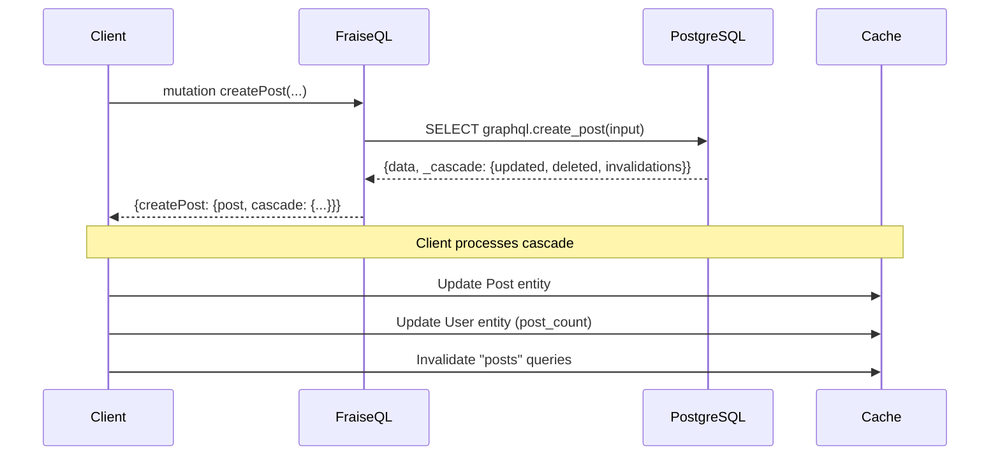

# GraphQL Cascade

**Navigation**: [← Mutation Result Reference](mutation-result-reference.md) • [Mutation SQL Requirements](../guides/mutation-sql-requirements.md) • [Queries & Mutations →](../core/queries-and-mutations.md)

> **Deep Dive**: For best practices, patterns, and recommendations, see the
> [CASCADE Best Practices Guide](../guides/cascade-best-practices.md).

GraphQL Cascade is an open-source specification for automatic cache invalidation in GraphQL APIs. FraiseQL implements the [GraphQL Cascade specification](https://github.com/graphql-cascade/graphql-cascade) to enable automatic cache updates when mutations modify data. Rather than requiring clients to manually refetch information, mutations return cascade information that clients use to automatically keep their caches synchronized.

## Overview

Cascade works by having PostgreSQL functions return not just the mutation result, but also metadata about what changed. This metadata includes:

- **Updated entities**: Objects that were created, updated, or modified
- **Deleted entities**: IDs of objects that were deleted
- **Invalidations**: Query cache invalidation hints
- **Metadata**: Timestamps and operation counts

**Note**: Cascade is fully integrated with both legacy and v2 mutation formats. For v2 format, use the built-in SQL helper functions for easier cascade construction.

## GraphQL Cascade Compliance Levels

FraiseQL implements the [official GraphQL Cascade specification](https://github.com/graphql-cascade/graphql-cascade) (v1.1) with support for multiple compliance levels:

### **Cascade Basic** ✅
Core entity tracking for cache synchronization:
- Entity tracking (created, updated, deleted)
- Basic invalidation strategies
- Standard response format

### **Cascade Standard** ✅
Enhanced features for production applications:
- Cascade depth control and relationship traversal
- Transaction metadata and timestamps
- Structured error handling
- Advanced invalidation strategies

### **Cascade Complete** (Partial)
Advanced features for sophisticated applications:
- Optimistic updates and concurrent mutation handling
- Real-time subscriptions with cascade invalidation
- Conflict resolution strategies
- Performance optimizations

> **Note**: FraiseQL currently implements **Cascade Basic** and **Cascade Standard** compliance levels. Cascade Complete features (subscriptions, conflict resolution) are planned for future releases.

### How It Works



## Quick Start

For detailed information on SQL function return formats, see [Mutation Result Reference](mutation-result-reference.md) and [Mutation SQL Requirements](../guides/mutation-sql-requirements.md).

## PostgreSQL Function Pattern

To enable cascade for a mutation, include cascade data in your return value. For v2 format, cascade data goes in the `cascade` field of `mutation_response`. For legacy format, use the `_cascade` field:

### Legacy Format (v1.4)

```sql
CREATE OR REPLACE FUNCTION graphql.create_post(input jsonb)
RETURNS jsonb AS $$
DECLARE
    v_post_id uuid;
    v_author_id uuid;
BEGIN
    -- Create post
    INSERT INTO tb_post (title, content, author_id)
    VALUES (input->>'title', input->>'content', (input->>'author_id')::uuid)
    RETURNING id INTO v_post_id;

    v_author_id := (input->>'author_id')::uuid;

    -- Update author stats
    UPDATE tb_user SET post_count = post_count + 1 WHERE id = v_author_id;

    -- Return with cascade metadata
    RETURN jsonb_build_object(
        'success', true,
        'data', jsonb_build_object('id', v_post_id, 'message', 'Post created'),
        '_cascade', jsonb_build_object(
            'updated', jsonb_build_array(
                -- The created post (must use __typename, not type_name)
                jsonb_build_object(
                    '__typename', 'Post',
                    'id', v_post_id,
                    'operation', 'CREATED',
                    'entity', (SELECT data FROM v_post WHERE id = v_post_id)
                ),
                -- The updated author
                jsonb_build_object(
                    '__typename', 'User',
                    'id', v_author_id,
                    'operation', 'UPDATED',
                    'entity', (SELECT data FROM v_user WHERE id = v_author_id)
                )
            ),
            'deleted', '[]'::jsonb,
            'invalidations', jsonb_build_array(
                jsonb_build_object(
                    'query_name', 'posts',
                    'strategy', 'INVALIDATE',
                    'scope', 'PREFIX'
                )
            ),
            'metadata', jsonb_build_object(
                'timestamp', now(),
                'affected_count', 2,
                'depth', 1,
                'transaction_id', txid_current()::text
            )
        )
    );
END;
$$ LANGUAGE plpgsql;
```

### V2 Format (v1.7+)

```sql
CREATE OR REPLACE FUNCTION graphql.create_post(input jsonb)
RETURNS mutation_response AS $$
DECLARE
    v_post_id uuid;
    v_author_id uuid;
    v_post_data jsonb;
    v_author_data jsonb;
    v_cascade_data jsonb;
BEGIN
    -- Create post
    v_post_id := gen_random_uuid();
    INSERT INTO posts (id, title, content, author_id, created_at)
    VALUES (v_post_id, input->>'title', input->>'content', (input->>'author_id')::uuid, now());

    v_author_id := (input->>'author_id')::uuid;

    -- Update author stats
    UPDATE users SET post_count = post_count + 1 WHERE id = v_author_id;

    -- Fetch complete entity data
    SELECT jsonb_build_object('id', id, 'title', title, 'content', content, 'author_id', author_id, 'created_at', created_at)
    INTO v_post_data FROM posts WHERE id = v_post_id;

    SELECT jsonb_build_object('id', id, 'name', name, 'email', email, 'post_count', post_count)
    INTO v_author_data FROM users WHERE id = v_author_id;

    -- Build cascade using helper functions
    v_cascade_data := cascade_merge(
        cascade_entity_created('Post', v_post_id, v_post_data),
        cascade_entity_update('User', v_author_id, v_author_data)
    );

    -- Add invalidations
    v_cascade_data := cascade_merge(
        v_cascade_data,
        cascade_invalidate_cache(ARRAY['posts', 'user_posts'], 'INVALIDATE')
    );

    -- Add metadata
    v_cascade_data := cascade_merge(
        v_cascade_data,
        cascade_metadata(2, 1, NULL)
    );

    RETURN mutation_created(
        'Post created successfully',
        v_post_data,
        'Post',
        v_cascade_data
    );
END;
$$ LANGUAGE plpgsql;
```

## FraiseQL Mutation Decorator

Enable cascade for a mutation by adding `enable_cascade=True` to the `@mutation` decorator:

```python
@mutation(enable_cascade=True)
class CreatePost:
    input: CreatePostInput
    success: CreatePostSuccess
    error: CreatePostError
```

## Cascade Structure

The cascade object (from `cascade` field in v2 format or `_cascade` in legacy format) contains the following fields. Examples below show **PostgreSQL output format** (snake_case); FraiseQL automatically converts to camelCase for GraphQL clients.

### `updated` (Array)
Array of entities that were created or updated:

```json
{
  "__typename": "Post",       // MUST use __typename (not type_name)
  "id": "uuid",
  "operation": "CREATED" | "UPDATED",
  "entity": { /* full entity data */ }
}
```

**Note**: Unlike regular query data, CASCADE entities require explicit `__typename` in SQL. Rust cannot auto-inject because CASCADE is opaque JSONB without schema context.

#### Why CASCADE is Different from Queries

**For regular GraphQL queries:**
- PostgreSQL returns plain JSONB (no `__typename` in database)
- Rust automatically injects `__typename` using the schema registry
- Rust knows the type of each field from the GraphQL schema

**For CASCADE data:**
- PostgreSQL must include `__typename` in the JSONB
- Rust cannot auto-inject because CASCADE is a generic JSONB structure
- Rust doesn't know what types are inside `updated`/`deleted` arrays
- You must explicitly include `__typename` for each entity

Think of it this way:
- **Query data**: Rust knows the schema → auto-injects `__typename`
- **CASCADE data**: Rust doesn't know what's inside → you provide `__typename`

### `deleted` (Array)
Array of entity IDs that were deleted:

```json
[
  {
    "__typename": "Post",     // MUST use __typename (not type_name)
    "id": "uuid",
    "deleted_at": "2025-11-25T10:30:00Z"  // Optional timestamp
  }
]
```

### `invalidations` (Array)
Query cache invalidation hints:

```json
{
  "query_name": "posts",      // In SQL: snake_case (Rust converts to queryName)
  "strategy": "INVALIDATE" | "REFETCH",
  "scope": "PREFIX" | "EXACT" | "ALL"
}
```

### `metadata` (Object)
Operation metadata:

```json
{
  "timestamp": "2025-11-25T10:30:00Z",
  "transaction_id": "optional-uuid",
  "depth": 1,
  "affected_count": 2
}
```

> **Note**: Use snake_case in PostgreSQL (`affected_count`, `transaction_id`). FraiseQL's Rust layer automatically converts to camelCase (`affectedCount`, `transactionId`) in GraphQL responses.

## GraphQL Response

Cascade data appears in the mutation response as a `cascade` field:

```json
{
  "data": {
    "createPost": {
      "post": { "id": "...", "title": "..." },
      "message": "Post created",
      "cascade": {
        "updated": [
          {
            "__typename": "Post",
            "id": "...",
            "operation": "CREATED",
            "entity": { "id": "...", "title": "...", ... }
          },
          {
            "__typename": "User",
            "id": "...",
            "operation": "UPDATED",
            "entity": { "id": "...", "name": "...", "post_count": 6 }
          }
        ],
        "deleted": [],
        "invalidations": [
          { "queryName": "posts", "strategy": "INVALIDATE", "scope": "PREFIX" }
        ],
        "metadata": {
          "timestamp": "2025-11-11T10:30:00Z",
          "affectedCount": 2,
          "depth": 1,
          "transactionId": "123456789"
        }
      }
    }
  }
}
```

## Client Integration

### Apollo Client

```typescript
const result = await client.mutate({ mutation: CREATE_POST, variables: input });
const cascade = result.data.createPost.cascade;

if (cascade) {
  // Apply entity updates to cache
  for (const update of cascade.updated) {
    client.cache.writeFragment({
      id: client.cache.identify({ __typename: update.__typename, id: update.id }),
      fragment: gql`fragment _ on ${update.__typename} { id }`,
      data: update.entity
    });
  }

  // Apply invalidations
  for (const hint of cascade.invalidations) {
    if (hint.strategy === 'INVALIDATE') {
      client.cache.evict({ fieldName: hint.queryName });
    }
  }

  // Handle deletions
  for (const deleted of cascade.deleted) {
    client.cache.evict({
      id: client.cache.identify({ __typename: deleted.__typename, id: deleted.id })
    });
  }
}
```

### Relay

```javascript
commitMutation(environment, {
  mutation: CREATE_POST,
  variables: input,
  onCompleted: (response) => {
    const cascade = response.createPost.cascade;
    if (cascade) {
      // Update store with cascade data
      cascade.updated.forEach(update => {
        environment.getStore().publish({
          __typename: update.__typename,
          id: update.id
        }, update.entity);
      });
    }
  }
});
```

## Helper Functions

PostgreSQL helper functions (available in v1.7+) simplify cascade construction:

### Entity Operations

```sql
-- Entity created
SELECT cascade_entity_created('Post', post_id, post_data);

-- Entity updated
SELECT cascade_entity_update('User', user_id, user_data);

-- Entity deleted
SELECT cascade_entity_deleted('Comment', comment_id);

-- Count field updated
SELECT cascade_count_update('Organization', org_id, 'user_count', 5, 6);
```

### Cache Operations

```sql
-- Cache invalidation
SELECT cascade_invalidate_cache(ARRAY['posts', 'user_posts'], 'INVALIDATE');

-- Cache metadata
SELECT cascade_metadata(2, 1, NULL);
```

### Utilities

```sql
-- Merge multiple cascade objects
SELECT cascade_merge(cascade1, cascade2);

-- Check if cascade contains specific entity type
SELECT cascade_has_entity_type(cascade_data, 'User');
```

See [Migration: Add mutation_response](../../migrations/trinity/005_add_mutation_response.sql) for complete function definitions.

## Best Practices

### PostgreSQL Functions

1. **Use v2 format for new implementations**: Leverage helper functions for consistent cascade construction
2. **Include all side effects**: Any data modified by the mutation should be included in cascade
3. **Use appropriate operations**: `CREATED` for inserts, `UPDATED` for updates, `DELETED` for deletes
4. **Use `__typename` for entity types**: CASCADE entities need explicit `__typename` (unlike queries where Rust auto-injects)
5. **Use snake_case for other fields**: `query_name`, `affected_count`, etc. (Rust converts to camelCase)
6. **Provide full entities**: Include complete entity data for cache updates
7. **Add invalidations**: Include query invalidation hints for list views

### Client Integration

1. **Apply updates first**: Update cache with new data before invalidations
2. **Handle all operations**: Support CREATE, UPDATE, and DELETE operations
3. **Respect invalidations**: Clear or refetch invalidated queries
4. **Error handling**: Gracefully handle missing cascade data

### Performance

1. **Minimal cascade data**: Only include necessary entities and invalidations
2. **Efficient queries**: Use indexed views for entity data retrieval
3. **Batch operations**: Group multiple cache operations when possible

## Migration

Mutations without cascade work unchanged. Add `enable_cascade=True` and cascade return data incrementally.

**For v2 format**: Use the `cascade` field in `mutation_response` return type.
**For legacy format**: Use the `_cascade` field in JSONB return value.

Both formats support the same cascade structure and client integration patterns.

## Examples

See `examples/cascade/` for complete working examples including:
- PostgreSQL functions with cascade
- FraiseQL mutations
- Client-side cache updates
- Testing patterns

## Next Steps

- [Mutation Result Reference](mutation-result-reference.md) - Complete format specifications
- [CASCADE Best Practices](../guides/cascade-best-practices.md) - Tuning, monitoring, advanced patterns
- [Migrating to Cascade](../guides/migrating-to-cascade.md) - Adoption guide
- [Cascade Best Practices](../guides/cascade-best-practices.md) - Production recommendations
