```mermaid
flowchart TD
    A[Writing a mutation?] -->|Yes| B{Need explicit error types?}

    B -->|No, exceptions OK| C[✅ Use function-based<br/>Returns type directly]
    B -->|Yes, structured errors| D[✅ Use class-based<br/>With success/failure]

    C --> E[Simpler code<br/>Throw exceptions for errors]
    D --> F[GraphQL union types<br/>Explicit error handling]

    style C fill:#90EE90
    style D fill:#87CEEB
```

# FraiseQL Decision Matrices & Comparison Tables

**Last Updated:** 2025-12-30

Quick visual guides to help you make the right architectural decisions for your FraiseQL application.

---

## Database Methods Comparison

### find() vs find_one() vs find_required()

**Choose the right method based on your use case:**

| Method | Returns | Raises on Not Found? | Use When | Example |
|--------|---------|---------------------|----------|---------|
| **`find()`** | `list[T]` | ❌ No (empty list) | Multiple results expected | `users = await db.find(User, where={"status": "active"})` |
| **`find_one()`** | `T \| None` | ❌ No (returns None) | Result is optional | `user = await db.find_one(User, id=user_id)` |
| **`find_required()`** | `T` | ✅ Yes (ValueError) | Result must exist | `user = await db.find_required(User, id=user_id)` |

**Decision tree:**

```mermaid
flowchart TD
    A[Need to query database?] -->|Yes| B{How many results?}
    A -->|No| Z[Don't query]

    B -->|Multiple/List| C[Use find<br/>Returns list[T]]
    B -->|Single| D{Is result optional?}

    D -->|Yes, can be None| E[Use find_one<br/>Returns T | None]
    D -->|No, must exist| F[Use find_required<br/>Raises if not found]

    style C fill:#90EE90
    style E fill:#87CEEB
    style F fill:#FFB6C1
```

**Code examples:**

```python
# find() - Get multiple results
users = await db.find(User, where={"status": "active"})
if not users:
    print("No active users")  # Empty list, not None
for user in users:
    print(user.name)

# find_one() - Optional single result
user = await db.find_one(User, id="some-uuid")
if user is None:
    print("User not found")  # Handle None
else:
    print(user.name)

# find_required() - Required single result
try:
    user = await db.find_required(User, id="some-uuid")
    print(user.name)  # Always has value if we get here
except ValueError:
    print("User not found - exception raised")
```

---

## View Types Decision Matrix

### JSONB View vs Projection Table vs Materialized View

**Choose the right storage strategy based on your performance requirements:**

| Feature | JSONB View (`v_*`) | Projection Table (`tv_*`) | Materialized View |
|---------|-------------------|--------------------------|-------------------|
| **Definition** | `CREATE VIEW` | `CREATE TABLE` | `CREATE MATERIALIZED VIEW` |
| **Storage** | None (virtual) | 1.5-2x data size | 1x data size |
| **Query Speed** | 5-10ms | 0.05-0.5ms | 0.1-1ms |
| **Write Impact** | None | Must call sync function | Must refresh |
| **Auto-Refresh** | ✅ Always current | ❌ Manual sync required | ❌ Manual refresh required |
| **Best For** | Standard queries | Ultra-high read:write (>100:1) | Pre-computed aggregations |
| **Complexity** | Low | High | Medium |
| **FraiseQL Support** | ✅ Full | ✅ Full (with sync functions) | ⚠️ Rare usage |

**Decision flowchart:**

```mermaid
flowchart TD
    A[Need read optimization?] -->|Yes| B{What's your read:write ratio?}
    A -->|No| Z[Use standard JSONB view v_*]

    B -->|Less than 10:1| Z
    B -->|10:1 to 50:1| C{Is 5-10ms query latency acceptable?}
    B -->|More than 50:1| D{Is query complexity high?}

    C -->|Yes| Z
    C -->|No| D

    D -->|Simple queries| E{Can you handle manual sync?}
    D -->|Aggregations only| F[Use materialized view]

    E -->|Yes| G[✅ Use Projection Table tv_*<br/>0.05-0.5ms queries]
    E -->|No| H[Consider caching layer instead]

    style Z fill:#87CEEB
    style G fill:#90EE90
    style F fill:#FFD700
    style H fill:#FFB6C1
```



**When to use each:**

### ✅ JSONB View (`v_*`) - DEFAULT CHOICE

**Use when:**
- Read:write ratio is moderate (< 50:1)
- Query latency of 5-10ms is acceptable
- You want simplicity (no sync logic needed)
- Data must always be current

**Example:**
```sql
CREATE VIEW v_user AS
SELECT
    id,
    jsonb_build_object(
        'id', id,
        'name', name,
        'email', email
    ) as data
FROM tb_user;
```

```python
import fraiseql
from fraiseql.types import ID

@fraiseql.type(sql_source="v_user")
class User:
    id: ID
    name: str
    email: str
```

### ⚡ Projection Table (`tv_*`) - HIGH PERFORMANCE

**Use when:**
- Read:write ratio is very high (> 100:1)
- You need sub-millisecond query latency
- You can implement sync functions in mutations
- Stale data for a few milliseconds is acceptable

**Example:**
```sql
-- Regular table storing cached JSONB
CREATE TABLE tv_user (
    id UUID PRIMARY KEY,
    data JSONB NOT NULL,
    updated_at TIMESTAMPTZ DEFAULT NOW()
);

-- Sync function to update cache
CREATE FUNCTION fn_sync_tv_user(p_id UUID) RETURNS VOID AS $$
BEGIN
    INSERT INTO tv_user (id, data)
    SELECT id, data FROM v_user WHERE id = p_id
    ON CONFLICT (id) DO UPDATE SET
        data = EXCLUDED.data,
        updated_at = NOW();
END;
$$ LANGUAGE plpgsql;

-- Mutation calls sync explicitly
CREATE FUNCTION fn_create_user(...) RETURNS JSONB AS $$
DECLARE v_user_id UUID;
BEGIN
    INSERT INTO tb_user (...) VALUES (...) RETURNING id INTO v_user_id;
    PERFORM fn_sync_tv_user(v_user_id);  -- ✅ Explicit sync!
    RETURN (SELECT data FROM tv_user WHERE id = v_user_id);
END;
$$ LANGUAGE plpgsql;
```

### 📊 Materialized View - AGGREGATIONS

**Use when:**
- Pre-computing expensive aggregations (COUNT, SUM, etc.)
- Batch refresh is acceptable
- Rarely used in FraiseQL (projection tables preferred)

**Example:**
```sql
CREATE MATERIALIZED VIEW user_post_stats AS
SELECT
    user_id,
    COUNT(*) as post_count,
    MAX(created_at) as last_post_at
FROM tb_post
GROUP BY user_id;

-- Refresh on schedule or after bulk operations
REFRESH MATERIALIZED VIEW user_post_stats;
```

**Performance comparison:**

| Scenario | JSONB View | Projection Table | Improvement |
|----------|-----------|------------------|-------------|
| Simple lookup | 5-10ms | 0.05-0.5ms | **100-200x faster** |
| Complex joins | 20-50ms | 0.1-1ms | **200-500x faster** |
| Embedded relations | 10-30ms | 0.05-0.5ms | **200-600x faster** |

---

## Trinity Identifiers Guide

### The Three Identifier Types

**Every entity has three identifiers serving different purposes:**

| Identifier | Type | Purpose | Exposed in GraphQL? | Use Case |
|-----------|------|---------|---------------------|----------|
| **`pk_*`** | `INT` | PostgreSQL JOINs (internal) | ❌ **Never** | Fast integer joins, database performance |
| **`id`** | `UUID` | Public API identifier (stable) | ✅ **Always** | GraphQL queries, external integrations |
| **`identifier`** | `TEXT` | Human-readable slug (SEO) | ✅ **Optional** | URLs, user-facing references |

**SQL schema:**

```sql
CREATE TABLE tb_post (
    -- 1. pk_* - Internal primary key (NEVER exposed)
    pk_post INT GENERATED BY DEFAULT AS IDENTITY PRIMARY KEY,

    -- 2. id - Public API identifier (ALWAYS exposed, stable)
    id UUID DEFAULT gen_random_uuid() UNIQUE NOT NULL,

    -- 3. identifier - Human-readable slug (OPTIONAL, for SEO)
    identifier TEXT UNIQUE,

    -- Other fields
    title TEXT NOT NULL,
    content TEXT,
    user_id INT REFERENCES tb_user(pk_user)  -- ✅ JOINs use pk_*
);
```

**GraphQL type (only public IDs):**

```python
import fraiseql
from fraiseql.types import ID

@fraiseql.type(sql_source="v_post")
class Post:
    id: ID          # ✅ Public API - stable forever
    identifier: str   # ✅ Human-readable - can change
    title: str
    content: str
    # pk_post NOT exposed - internal only
```

**Querying by different identifiers:**

```graphql
# Query by public UUID (most common)
query {
  post(id: "550e8400-e29b-41d4-a716-446655440000") {
    title
  }
}

# Query by human-readable identifier (SEO-friendly URLs)
query {
  post(identifier: "my-first-post") {
    title
  }
}

# pk_post is NEVER queryable from GraphQL (security)
```

**Decision matrix: Which identifier to use?**

| Task | Use `pk_*` | Use `id` | Use `identifier` |
|------|-----------|----------|------------------|
| PostgreSQL JOINs | ✅ Yes | ❌ No | ❌ No |
| Foreign keys in tables | ✅ Yes | ❌ No | ❌ No |
| GraphQL queries | ❌ Never expose | ✅ Primary | ✅ Secondary |
| Public API contracts | ❌ Never expose | ✅ Yes | ✅ Optional |
| SEO-friendly URLs | ❌ Never expose | ⚠️ Works but ugly | ✅ Best |
| Client-side ID generation | ❌ Server-only | ✅ Possible | ⚠️ May conflict |
| Preventing enumeration | ✅ Hide it | ✅ Safe | ✅ Safe |

**Why three identifiers?**

1. **Performance (`pk_*`):**
   - Integer joins are 2-3x faster than UUID joins
   - Smaller indexes (4 bytes vs 16 bytes)
   - Sequential IDs optimize B-tree performance
   - **Never exposed** to prevent enumeration attacks

2. **Stability (`id`):**
   - UUIDs don't reveal database size or creation order
   - Can be generated client-side (distributed systems)
   - Stable even if slug changes
   - Safe for public APIs

3. **Usability (`identifier`):**
   - SEO-friendly URLs: `/posts/my-first-post` vs `/posts/550e8400...`
   - Human-readable references
   - Can change without breaking API (id stays stable)
   - Optional (not all entities need slugs)

**Best practices:**

✅ **DO:**
- Always use `pk_*` for foreign keys in `tb_*` tables
- Always expose `id` in GraphQL types
- Add `identifier` for entities with public URLs
- Index all three for query performance

❌ **DON'T:**
- Expose `pk_*` in GraphQL (security risk)
- Use `id` for foreign keys (slower JOINs)
- Use `identifier` as foreign key (can change)

---

## Mutation Patterns Comparison

### Function-Based vs Class-Based Mutations

**Choose based on your success/error handling needs:**

| Pattern | Best For | Success/Error Handling | Complexity | Example |
|---------|----------|----------------------|------------|---------|
| **Function-Based** | Simple mutations | Returns type directly | Low | `async def create_user(...) -> User` |
| **Class-Based** | Complex mutations | Explicit success/failure types | Medium | `class CreateUser: success: UserCreated; failure: ValidationError` |

**Function-based pattern (simple):**

```python
import fraiseql
from fraiseql import mutation
from fraiseql.types import ID

@mutation
async def create_user(info, name: str, email: str) -> User:
    """Simple mutation - returns User directly."""
    db = info.context["db"]
    result = await db.execute_function("fn_create_user", {
        "name": name,
        "email": email
    })
    return await db.find_one(User, id=result["id"])
```

**Class-based pattern (with success/failure):**

```python
import fraiseql
from fraiseql import mutation

@mutation
class CreateUser:
    """Mutation with explicit success/failure handling."""
    input: CreateUserInput
    success: UserCreated  # Success type
    failure: ValidationError  # Failure type

    async def resolve(self, info):
        db = info.context["db"]
        result = await db.execute_function("fn_create_user", {
            "name": self.input.name,
            "email": self.input.email
        })

        if result["success"]:
            user = await db.find_one(User, id=result["user_id"])
            return UserCreated(
                user=user,
                message=result.get("message", "User created")
            )
        return ValidationError(
            message=result["error"],
            code=result.get("code", "VALIDATION_ERROR")
        )
```

**Decision tree:**



**When to use each:**

### Function-Based (Simple)

✅ **Use when:**
- Mutation rarely fails
- Exceptions are acceptable error handling
- Quick prototyping
- Simple CRUD operations

**Pros:**
- Less boilerplate
- Easier to understand
- Faster to write

**Cons:**
- Errors are GraphQL exceptions (not typed)
- No structured error responses

### Class-Based (Explicit Errors)

✅ **Use when:**
- Mutation has multiple failure modes
- Client needs structured error responses
- Production APIs with robust error handling
- Complex validation logic

**Pros:**
- Typed success/failure responses
- Client can handle errors programmatically
- Better for production APIs

**Cons:**
- More boilerplate
- Requires defining success/failure types

---

## When to Use Dataloader

### Preventing N+1 Queries

**Decision tree:**



```mermaid
flowchart TD
    A[Fetching related data?] -->|Yes| B{Is it a 1:N relationship?}
    A -->|No| Z[Regular field]

    B -->|Yes| C{Is parent type queried in lists?}
    B -->|No| D[Regular field with join]

    C -->|Yes| E{Using JSONB view with embedded data?}
    C -->|No| D

    E -->|Yes| F[✅ Data already embedded<br/>No dataloader needed]
    E -->|No| G[✅ Use @dataloader_field<br/>Prevents N+1]

    style F fill:#90EE90
    style G fill:#87CEEB
    style Z fill:#FFD700
```

**Comparison table:**

| Scenario | Use Dataloader? | Why |
|----------|----------------|-----|
| User → Posts (embedded in JSONB view) | ❌ No | Data already pre-composed in view |
| User → Posts (separate query) | ✅ Yes | Prevents N+1 when fetching multiple users |
| Post → Author (single lookup) | ❌ No | Not a 1:N relationship |
| Post → Comments (paginated) | ✅ Yes | Batches queries for multiple posts |
| Static data (country codes, etc.) | ❌ No | Cache instead |

**Without dataloader (N+1 problem):**

```python
# ❌ BAD: Queries database once per user
import fraiseql
from fraiseql import field
from fraiseql.types import ID

@fraiseql.type(sql_source="v_user")
class User:
    id: ID
    name: str

    @field
    async def posts(self, info) -> list[Post]:
        db = info.context["db"]
        # This runs once PER USER (N+1 problem!)
        return await db.find(Post, where={"user_id": self.id})

# Query:
# query { users { name posts { title } } }
#
# Executes:
# 1. SELECT * FROM v_user (1 query)
# 2. SELECT * FROM v_post WHERE user_id = user1_id (1 query)
# 3. SELECT * FROM v_post WHERE user_id = user2_id (1 query)
# 4. SELECT * FROM v_post WHERE user_id = user3_id (1 query)
# ...
# Total: N+1 queries!
```

**With dataloader (batched):**

```python
# ✅ GOOD: Batches queries
from fraiseql import dataloader_field
from fraiseql.types import ID

@fraiseql.type(sql_source="v_user")
class User:
    id: ID
    name: str

    @dataloader_field
    async def posts(self, info) -> list[Post]:
        db = info.context["db"]
        # Batched! Only 1 query total
        return await db.find(Post, where={"user_id": self.id})

# Query:
# query { users { name posts { title } } }
#
# Executes:
# 1. SELECT * FROM v_user (1 query)
# 2. SELECT * FROM v_post WHERE user_id IN (user1, user2, user3, ...) (1 query)
# Total: 2 queries (not N+1!)
```

**Best solution: Embed in JSONB view (no dataloader needed):**

```sql
CREATE VIEW v_user AS
SELECT
    id,
    jsonb_build_object(
        'id', id,
        'name', name,
        'posts', (
            SELECT jsonb_agg(jsonb_build_object('id', p.id, 'title', p.title))
            FROM tb_post p
            WHERE p.user_id = tb_user.pk_user
        )
    ) as data
FROM tb_user;
```

```python
import fraiseql
from fraiseql.types import ID

@fraiseql.type(sql_source="v_user")
class User:
    id: ID
    name: str
    posts: list[Post]  # ✅ Already embedded! No dataloader needed
```

**Performance comparison:**

| Pattern | Queries for 100 Users | Performance |
|---------|----------------------|-------------|
| No dataloader (N+1) | 101 queries | ❌ Slow |
| With dataloader | 2 queries | ✅ Fast |
| Embedded in JSONB view | 1 query | ✅✅ Fastest |

---

## Storage Backend Choices

### APQ Storage: Memory vs PostgreSQL

**For Automatic Persisted Queries (APQ) cache:**

| Feature | Memory Backend | PostgreSQL Backend |
|---------|---------------|-------------------|
| **Multi-instance Support** | ❌ No (each instance has own cache) | ✅ Yes (shared cache) |
| **Persistence** | ❌ Lost on restart | ✅ Survives restarts |
| **Performance** | ✅ Fastest (no network) | ⚠️ Network overhead (~1ms) |
| **Setup Complexity** | ✅ Zero config | ⚠️ Requires migration |
| **Use Case** | Single instance, development | Multi-instance, production |
| **Cache Size** | Limited by RAM | Limited by disk |
| **TTL Support** | ✅ Yes | ✅ Yes |

**Decision tree:**



```mermaid
flowchart TD
    A[Need APQ caching?] -->|Yes| B{Single instance or multiple?}
    A -->|No| Z[Don't use APQ]

    B -->|Single instance| C[✅ Use memory backend<br/>Fastest, zero config]
    B -->|Multiple instances| D{Need shared cache?}

    D -->|Yes| E[✅ Use PostgreSQL backend<br/>Shared across instances]
    D -->|No| C

    style C fill:#90EE90
    style E fill:#87CEEB
```

**Configuration examples:**

**Memory backend (development, single instance):**

```python
from fraiseql import FraiseQLConfig

config = FraiseQLConfig(
    apq_storage_backend="memory",  # Default
    apq_cache_size=1000             # Max cached queries
)
```

**PostgreSQL backend (production, multi-instance):**

```python
config = FraiseQLConfig(
    apq_storage_backend="postgresql",
    apq_storage_schema="apq_cache",
    apq_cache_ttl=3600  # 1 hour TTL
)

# Automatically creates:
# CREATE TABLE apq_cache.persisted_queries (
#     query_hash TEXT PRIMARY KEY,
#     query_text TEXT NOT NULL,
#     created_at TIMESTAMPTZ DEFAULT NOW(),
#     last_used TIMESTAMPTZ DEFAULT NOW()
# );
```

---

## Framework Comparison

### FraiseQL vs Other Python GraphQL Frameworks

**Choose based on your architecture and priorities:**

| Feature | FraiseQL | Strawberry | Graphene | PostGraphile* |
|---------|----------|------------|----------|---------------|
| **Business Logic** | PostgreSQL functions | Python resolvers | Python resolvers | PostgreSQL functions |
| **Type Safety** | ✅ Python types → GraphQL | ✅ Python types | ❌ Manual schema | ✅ Auto-generated |
| **Performance** | ✅✅ Rust pipeline (7-10x) | ⚠️ Standard Python | ⚠️ Standard Python | ⚠️ Node.js |
| **N+1 Prevention** | ✅ JSONB views (automatic) | ⚠️ Manual dataloaders | ⚠️ Manual select_related | ✅ Automatic |
| **Auto-Inference** | ✅ field_name, @success | ❌ Manual | ❌ Manual | ✅ Schema from DB |
| **PostgreSQL Native** | ✅✅ Core philosophy | ❌ ORM-based | ❌ ORM-based | ✅✅ Core philosophy |
| **Learning Curve** | ⚠️ Medium (SQL required) | ✅ Low | ⚠️ Medium | ⚠️ Medium |
| **Migration Effort** | 3-7 days | N/A | 5-10 days | 1-3 days |
| **Language** | Python | Python | Python | JavaScript/TypeScript |

*PostGraphile is JavaScript-based, not Python

**When to choose FraiseQL:**

✅ **Choose FraiseQL if:**
- You have or want PostgreSQL expertise
- Performance is critical (Rust pipeline advantage)
- You prefer business logic in database (CQRS pattern)
- You need type safety + high performance
- Your team is comfortable with SQL

❌ **Consider alternatives if:**
- You need pure Python business logic (Strawberry)
- You have existing Django app (Graphene + Django)
- Your team doesn't know SQL well
- You prefer JavaScript (PostGraphile)

**Migration timeline:**

| From | To FraiseQL | Effort | Key Steps |
|------|------------|--------|-----------|
| **Strawberry** | 3-5 days | Medium | Move resolvers to PostgreSQL functions |
| **Graphene** | 5-10 days | Medium-High | Rewrite schema, move to PostgreSQL |
| **PostGraphile** | 1-3 days | Low | PostgreSQL functions already exist! |
| **REST API** | 7-14 days | High | Design GraphQL schema, write functions |

---

## See Also

- [Core Concepts & Glossary](../core/concepts-glossary.md) - Detailed explanations
- [Terminology Guide](../reference/terminology.md) - Canonical term definitions
- [Quick Reference](../reference/quick-reference.md) - Code patterns
- [Performance Guide](../performance/index.md) - Optimization strategies

---

**Questions?** Open an issue or discussion on GitHub
