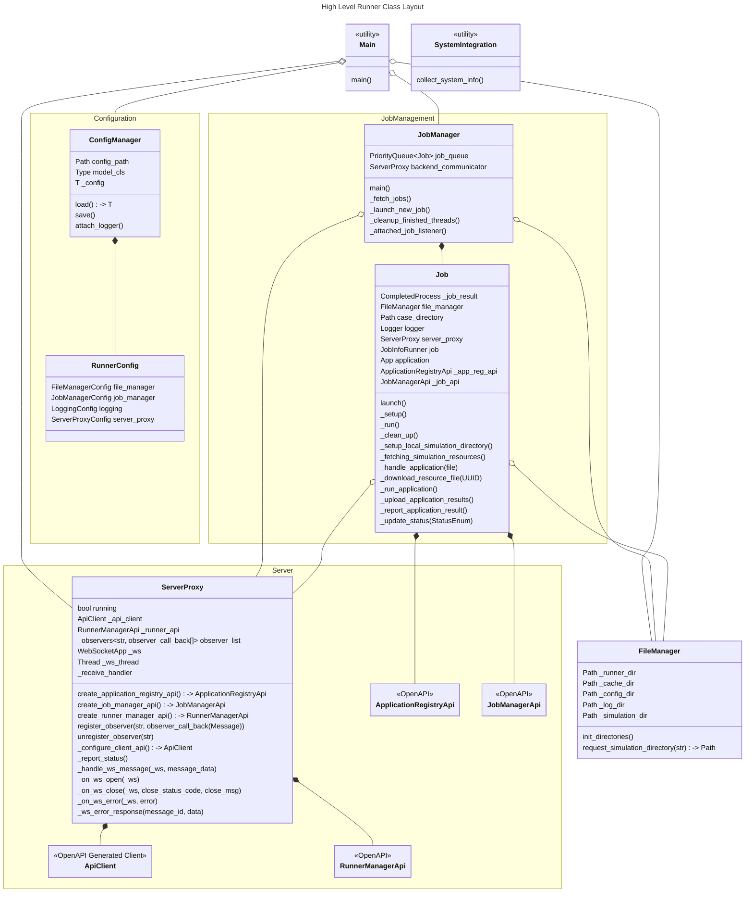

# Runner High Level Design
## Design Requirements

Requirements of the fyn-runner (presently unordered):
1. [x] Portability across OSes.
2. [ ] Must start on startup (at least default behaviour).
3. [x] Must collect data on hardware of systems.
4. [x] Must communicate hardware data to Fyn-api.
5. [x] Must communicate with fyn-api regarding job status (starting, monitoring, completion, etc.)
6. [x] Must communicate/synchronise simulation data with fyn-api (CRUD on local data).
7. [x] Must register with fyn-api - storing secret tokens etc.
8. [x] Must be able to launch simulations.
9. [ ] Must be able to remotely pause and kill simulations.
10. [x] Must organise simulation files.

## Major Components and Responsibility

The above requirements will be met through the use of the following components.

### Job Manager (Co-ordinator)
- Central component which orchestrates everything between other components
- Manages/Maintains job queues, priorities, etc.
- Determines ability to accept new simulations
- Contains configuration management integration

### Job (Observer)
- Launches and runs simulations
- Tracks progress of simulation
- Tracks resources usage (optional extra)
- Can update/terminate running simulations
- Reports outcome

### File Manager
- Manages general working directories of the runner
- Manages simulation i/o (where)
- Synchronisation with cloud and data back-up
- Clean-up of old simulations

### Server Proxy (Factory - Facade - Proxy)
*Note: this class is designated to be refactored/split as it has evolved to be doing too much*
- Creates/builds instances of the HTTP fyn-api client (client automatically generated by OpenAPI)
- Responsible for periodically sending a heartbeat
- Handles web-socket communication
  - Handles authentication/initiation of web-socket communications with server
  - Proxy for (web-socket) communication and data transfer between runner and API (and maybe front end)

### Configuration Manager
- Manages loading and saving of runner configuration
- Provides type-safe configuration access
- Handles configuration validation and defaults

### System Integration
- Collects system relevant specs for analysis resource availability
- Detects hardware changes and updates
- Installation and registration of the runner
- Tools for the user to directly interact with the runner (cmd)
- Automatic updating?

## Requirements Mapping

Briefly, the requirements will be fulfilled by the following components.

| Requirements                                                                                   | Components                                                                                                  |
| ---------------------------------------------------------------------------------------------- | ----------------------------------------------------------------------------------------------------------- |
| 1. Portability across OSes.                                                                    | [System Integration](#system-integration)                                                                   |
| 2. Must start on startup (at least default behaviour).                                         | [System Integration](#system-integration)                                                                   |
| 3. Must collect data on hardware of systems.                                                   | [System Integration](#system-integration)                                                                   |
| 4. Must communicate hardware data to Fyn-api.                                                  | [Server Proxy](#server-proxy-factory---facade---proxy), [System Integration](#system-integration)           |
| 5. Must communicate with fyn-api regarding job status (starting, monitoring, completion, etc.) | [Job Manager](#job-manager-co-ordinator), [Job](#job-observer)                                              |
| 6. Must communicate/synchronise simulation data with fyn-api (CRUD on local data).             | [Server Proxy](#server-proxy-factory---facade---proxy), [File Manager](#file-manager)                       |
| 7. Must register with fyn-api - storing secret tokens etc.                                     | [Server Proxy](#server-proxy-factory---facade---proxy), [Configuration Manager](#configuration-manager)     |
| 8. Must be able to launch simulations.                                                         | [Job Manager](#job-manager-co-ordinator), [Job](#job-observer)                                              |
| 9. Must be able to remotely pause and kill simulations.                                        | [Job](#job-observer), [Server Proxy](#server-proxy-factory---facade---proxy)                                |
| 10. Must organise simulation files.                                                            | [Job](#job-observer), [Server Proxy](#server-proxy-factory---facade---proxy), [File Manager](#file-manager) |

## UML Structure

This section transposes the above into a high-level design concept with a UML class diagram. The runner will be in Python, so `public`/`private` aren't indicated. Utility methods and attributes are indicated with a `_` prefix. ``<<utility>>`` indicates static or non-object-oriented (collection of free functions).

## General Error Handling and Logging Approach:

In general, the runner needs to be 'fault' tolerant and should try to 'keep' running even when errors do occur. Thus, general crashes when errors are encountered are to be minimised. Logging will be added to the program, and is configurable and reportable to the server to help identify bugs and problems. Generally, for levels of messaging, the following hierarchical structure is followed:

- Debugging: Additional information for diagnosing problems.
- Info: General information and progress updates.
- Warning: Some assumptions are being made to proceed, which may lead to further issues.
- Error: A serious problem has occurred but the program will attempt to continue.
- Critical: No way to continue, exit program.

In general, simulations should not be terminated if the runner goes down. At some point in the future we will have a 're-attach' to running simulations. That is to say, a runner going down should not propagate to the simulation.
