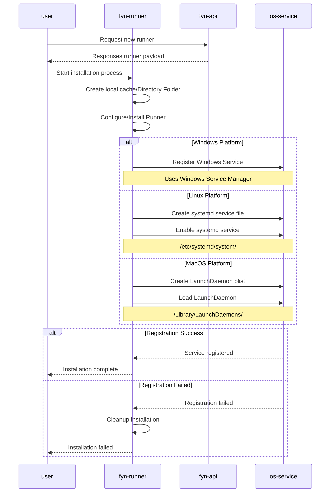
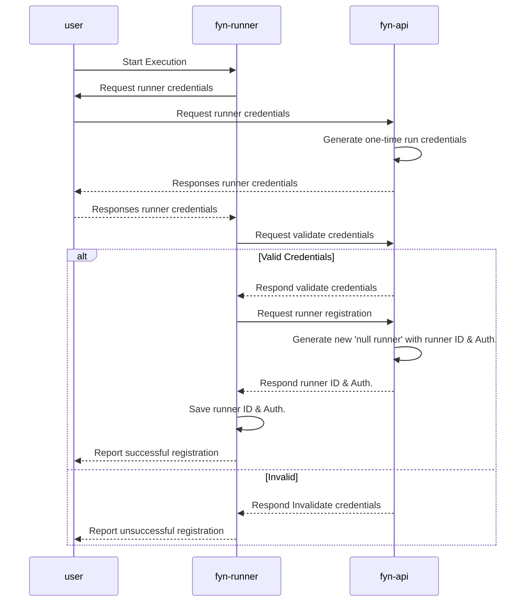
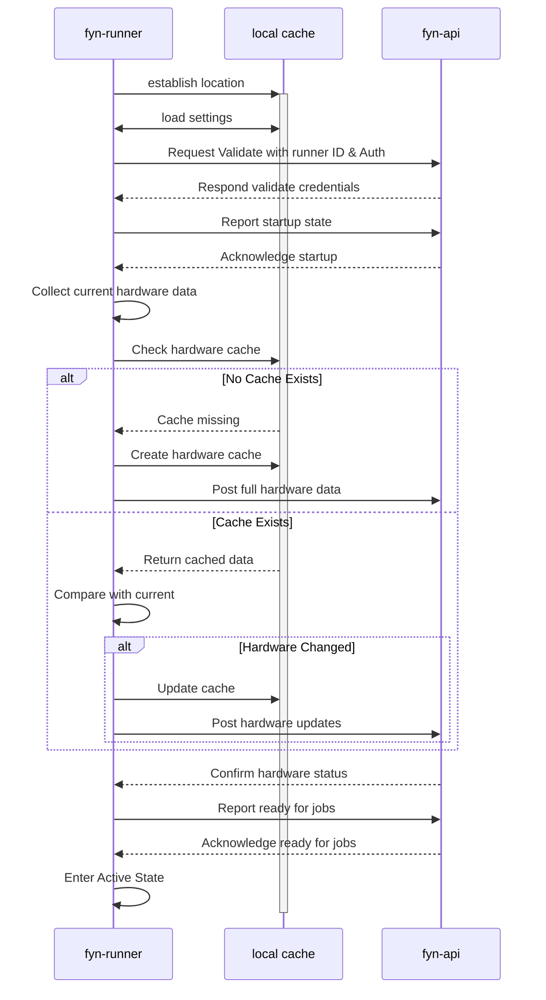
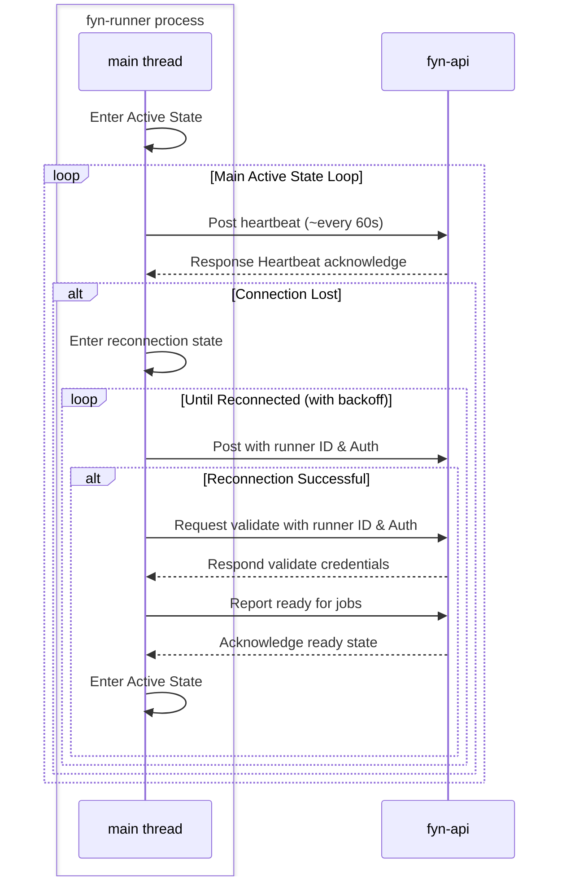
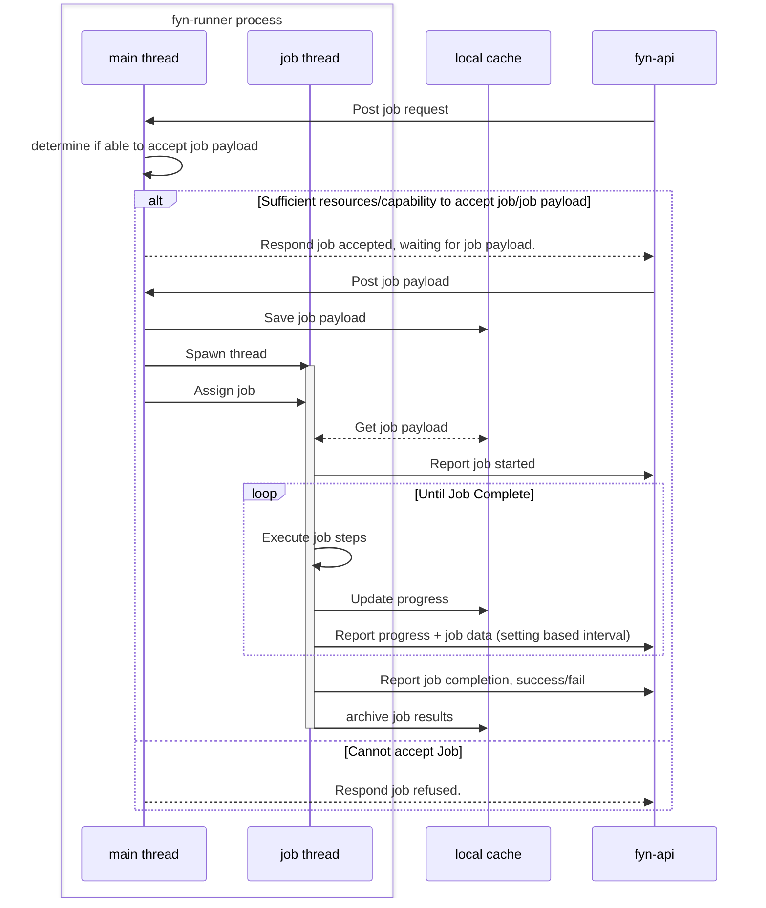
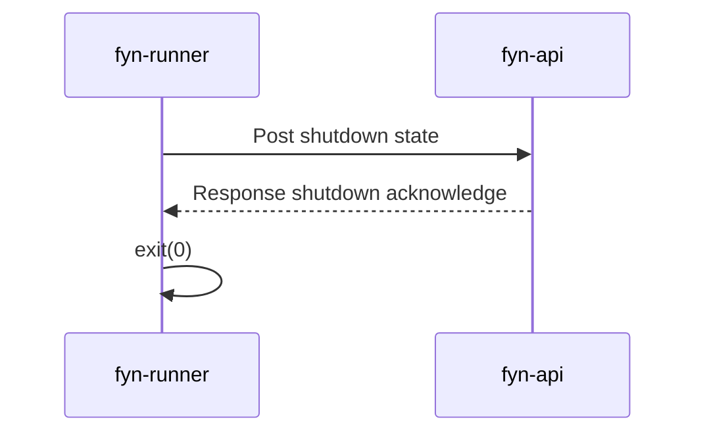

## Installation Process
- need to clean up end.

## Post-Installation Process

## Start up
- connecting to 'running' jobs left for later iteration.

## Active State Connection Events
- Once started we enter the main active state.
- We can accept jobs, and will launch new jobs threads when requested - (see Job events for event details.)
- Use web sockets

## Job Events

- note runtime resource availability must be assessed at boot up for the job (application), failure to meet memory needs (as an example) should result in a crash, which then follows a failed job route.

## Exit and Shutdown

- We don't want to 'terminate jobs' when we exit. If the user shuts down the PC it will be terminated in due course.
- Basically just want to tell the server we have signed off.

## Missing Events

1. Request for runner data/logs
2. Request for simulation data/logs.
