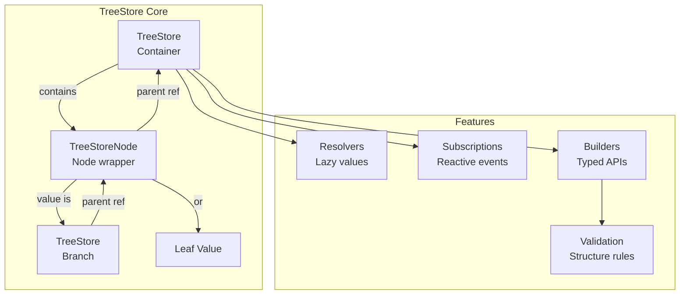
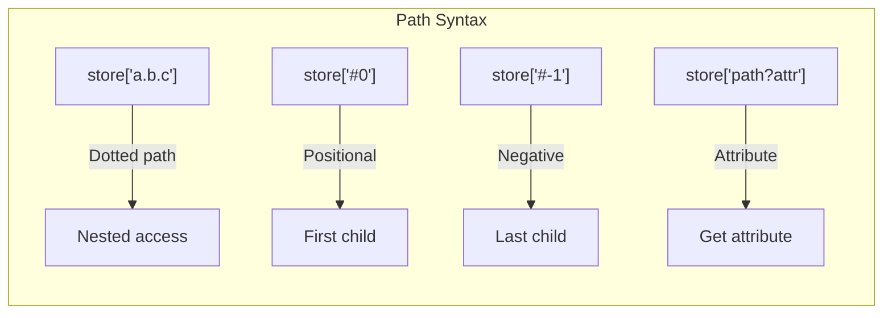
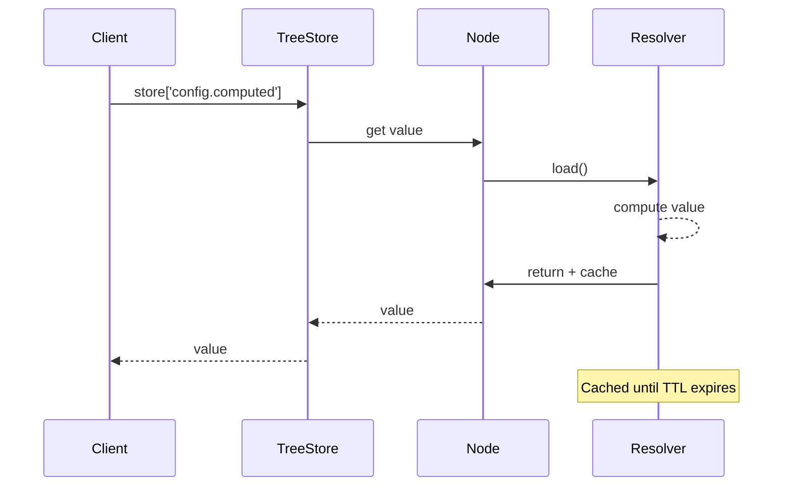
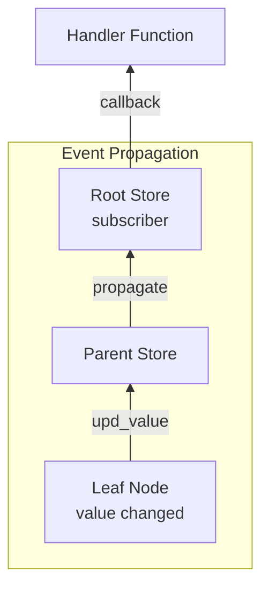
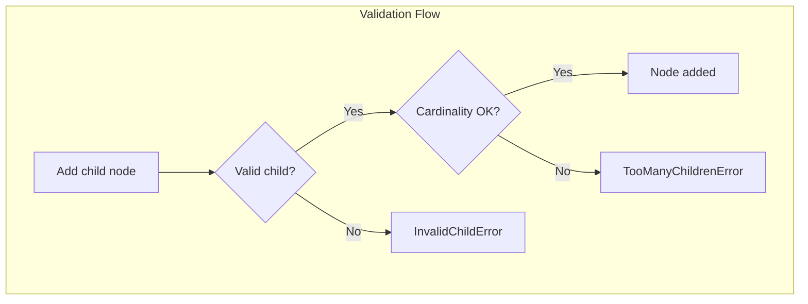
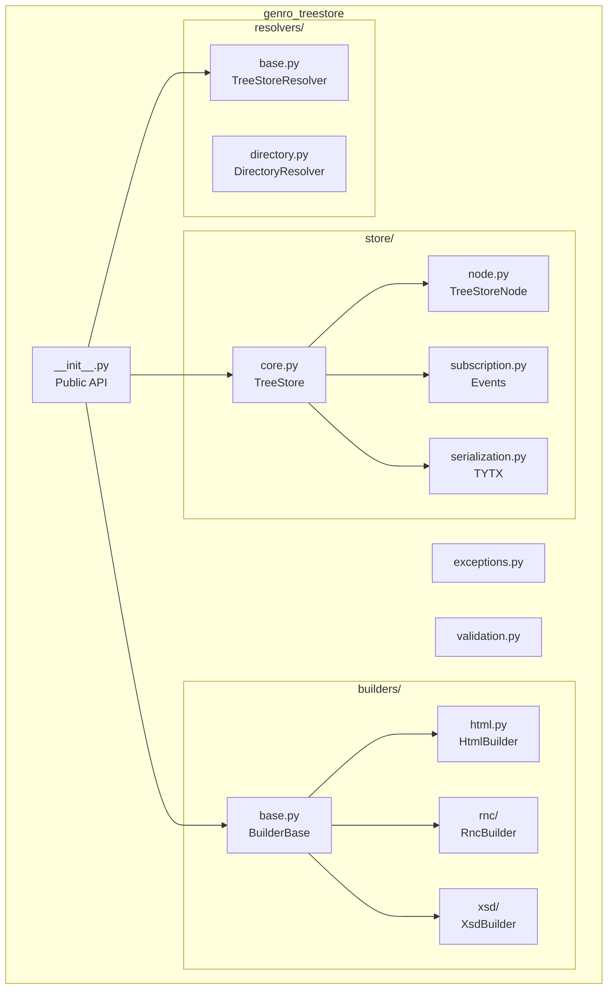

# Genro-TreeStore

[](https://pypi.org/project/genro-treestore/)
[](https://github.com/genropy/genro-treestore/actions/workflows/tests.yml)
[](https://codecov.io/gh/genropy/genro-treestore)
[](https://genro-treestore.readthedocs.io/en/latest/)
[](https://www.python.org/downloads/)
[](https://opensource.org/licenses/Apache-2.0)

**A lightweight hierarchical data structure with builder pattern support for the Genro ecosystem (Genro Kyo).**

TreeStore provides a powerful tree-based container with O(1) path lookup, reactive subscriptions, lazy value resolution, and schema-driven builders for generating validated hierarchical structures like HTML, XML, or custom DSLs.

## Architecture Overview



## Installation

```bash
pip install genro-treestore
```

## Key Features

| Feature | Description |
|---------|-------------|
| **O(1) Lookup** | Direct path-based access via internal index |
| **Builder Pattern** | Fluent APIs with auto-labeling and validation |
| **Reactive Subscriptions** | Event propagation for insert/update/delete |
| **Lazy Resolvers** | Dynamic value computation with TTL caching |
| **Schema Builders** | Generate builders from RNC or XSD schemas |
| **Type-Safe Serialization** | TYTX format preserves Decimal, date, datetime |

## Quick Start

### Basic TreeStore Usage

```python
from genro_treestore import TreeStore

store = TreeStore()

# Create nested structure (auto-creates intermediate nodes)
store.set_item('config.database.host', 'localhost')
store.set_item('config.database.port', 5432)
store.set_item('config.debug', True)

# Access values
print(store['config.database.host'])  # 'localhost'
print(store['config.debug'])          # True

# Iterate over children
for key, value in store['config.database'].items():
    print(f"{key}: {value}")
# host: localhost
# port: 5432
```

### Path Syntax

TreeStore supports a rich path syntax for navigation:



| Syntax | Description | Example |
|--------|-------------|---------|
| `'a.b.c'` | Dotted path | `store['config.database.host']` |
| `'#N'` | Position index | `store['users.#0']` (first child) |
| `'#-N'` | Negative index | `store['users.#-1']` (last child) |
| `'path?attr'` | Attribute access | `store['div?class']` |

### Builder Pattern with HTML

```python
from genro_treestore import TreeStore
from genro_treestore.builders import HtmlBuilder

store = TreeStore(builder=HtmlBuilder())

# Fluent API with auto-labeling
body = store.body()
div = body.div(id='main', class_='container')
div.h1(value='Welcome')
div.p(value='Hello, World!')

ul = div.ul()
ul.li(value='Item 1')
ul.li(value='Item 2')
ul.li(value='Item 3')

# Access by auto-generated labels
print(store['body_0.div_0.h1_0'])  # 'Welcome'
print(store['body_0.div_0?id'])    # 'main'
```

### Dynamic Builders from Schemas

#### From RNC (RELAX NG Compact)

```python
from genro_treestore import TreeStore
from genro_treestore.builders import RncBuilder

builder = RncBuilder.from_rnc('''
    start = document
    document = element doc { section+ }
    section = element section { title, para* }
    title = element title { text }
    para = element para { text }
''')

store = TreeStore(builder=builder)
doc = store.doc()
sec = doc.section()
sec.title(value='Introduction')
sec.para(value='Welcome to TreeStore.')
```

#### From XSD (XML Schema)

```python
from genro_treestore import TreeStore
from genro_treestore.builders import XsdBuilder

# Load XSD schema
xsd_content = open('invoice.xsd').read()
schema = TreeStore.from_xml(xsd_content)
builder = XsdBuilder(schema)

# Build validated structure
store = TreeStore(builder=builder)
invoice = store.Invoice()
invoice.Header().Date(value='2025-01-01')
invoice.Header().Number(value='001')
```

## Resolvers: Lazy Value Computation



```python
from genro_treestore import TreeStore, CallbackResolver

store = TreeStore()
store.set_item('config.base_url', 'https://api.example.com')
store.set_item('config.version', 'v2')

# Dynamic computed value
def get_full_url(node):
    parent = node.parent
    base = parent.get_item('base_url')
    version = parent.get_item('version')
    return f"{base}/{version}"

store.set_item('config.full_url')
store.set_resolver('config.full_url', CallbackResolver(get_full_url))

print(store['config.full_url'])  # 'https://api.example.com/v2'

# With caching (60 seconds TTL)
store.set_resolver('config.full_url',
                   CallbackResolver(get_full_url, cache_time=60))
```

### Built-in Resolvers

| Resolver | Description |
|----------|-------------|
| `CallbackResolver` | Compute value via callback function |
| `DirectoryResolver` | Lazy-load directory contents |
| `TxtDocResolver` | Load text file content |

## Reactive Subscriptions



```python
from genro_treestore import TreeStore

store = TreeStore()

def on_change(node, path, evt, **kw):
    print(f"{evt}: {path} = {node.value}")

# Subscribe to all events
store.subscribe('logger', any=on_change)

store.set_item('users.alice', 'Alice')
# Output: ins: users.alice = Alice

store.set_item('users.alice', 'Alicia')
# Output: upd_value: users.alice = Alicia

store.del_item('users.alice')
# Output: del: users.alice = Alicia

store.unsubscribe('logger', any=True)
```

### Event Types

| Event | Description |
|-------|-------------|
| `ins` | Node inserted |
| `del` | Node deleted |
| `upd_value` | Node value changed |
| `upd_attr` | Node attribute changed |

## Validation with Builders



```python
from genro_treestore.builders import BuilderBase, element, valid_children

class DocBuilder(BuilderBase):
    @element
    @valid_children('section[1:]')  # At least one section required
    def document(self, store, parent, **attrs):
        pass

    @element
    @valid_children(
        'title[1]',      # Exactly one title required
        'para[0:]',      # Zero or more paragraphs
    )
    def section(self, store, parent, **attrs):
        pass

    @element
    def title(self, store, parent, value=None, **attrs):
        pass

    @element
    def para(self, store, parent, value=None, **attrs):
        pass
```

### Cardinality Syntax

| Syntax | Meaning |
|--------|---------|
| `tag` or `tag[:]` | Zero or more (unlimited) |
| `tag[1]` | Exactly one required |
| `tag[0:1]` | Zero or one (optional) |
| `tag[1:]` | One or more required |
| `tag[2:5]` | Between 2 and 5 |

## Serialization (TYTX)

TreeStore supports type-preserving serialization:

```python
from decimal import Decimal
from datetime import date, datetime
from genro_treestore import TreeStore

store = TreeStore()
store.set_item('invoice.amount', Decimal('1234.56'))
store.set_item('invoice.date', date(2025, 1, 15))
store.set_item('invoice.timestamp', datetime.now())
store.set_item('invoice.paid', False)

# Serialize to JSON (types preserved as metadata)
json_data = store.to_tytx()

# Deserialize - types restored exactly
restored = TreeStore.from_tytx(json_data)
assert isinstance(restored['invoice.amount'], Decimal)
assert isinstance(restored['invoice.date'], date)

# Binary format (MessagePack - more compact)
binary_data = store.to_tytx(transport='msgpack')
restored = TreeStore.from_tytx(binary_data, transport='msgpack')
```

## XML Support

```python
from genro_treestore import TreeStore

# Parse XML
xml = '''<html>
    <head><title>Hello</title></head>
    <body><div id="main">Content</div></body>
</html>'''

store = TreeStore.from_xml(xml)
print(store['html_0.body_0.div_0'])      # 'Content'
print(store['html_0.body_0.div_0?id'])   # 'main'

# Generate XML
output = store.to_xml()
```

## Module Structure



## Development

```bash
# Clone repository
git clone https://github.com/genropy/genro-treestore.git
cd genro-treestore

# Install dev dependencies
pip install -e ".[test,dev,docs]"

# Run tests
pytest tests/

# Run tests with coverage
pytest tests/ --cov=src/genro_treestore --cov-report=term-missing

# Lint
ruff check src/

# Format
black src/

# Build docs
cd docs && make html
```

## Documentation

Full documentation is available at [genro-treestore.readthedocs.io](https://genro-treestore.readthedocs.io/).

## License

Apache License 2.0 - See [LICENSE](LICENSE) for details.

Copyright 2025 Softwell S.r.l. - Genropy Team
