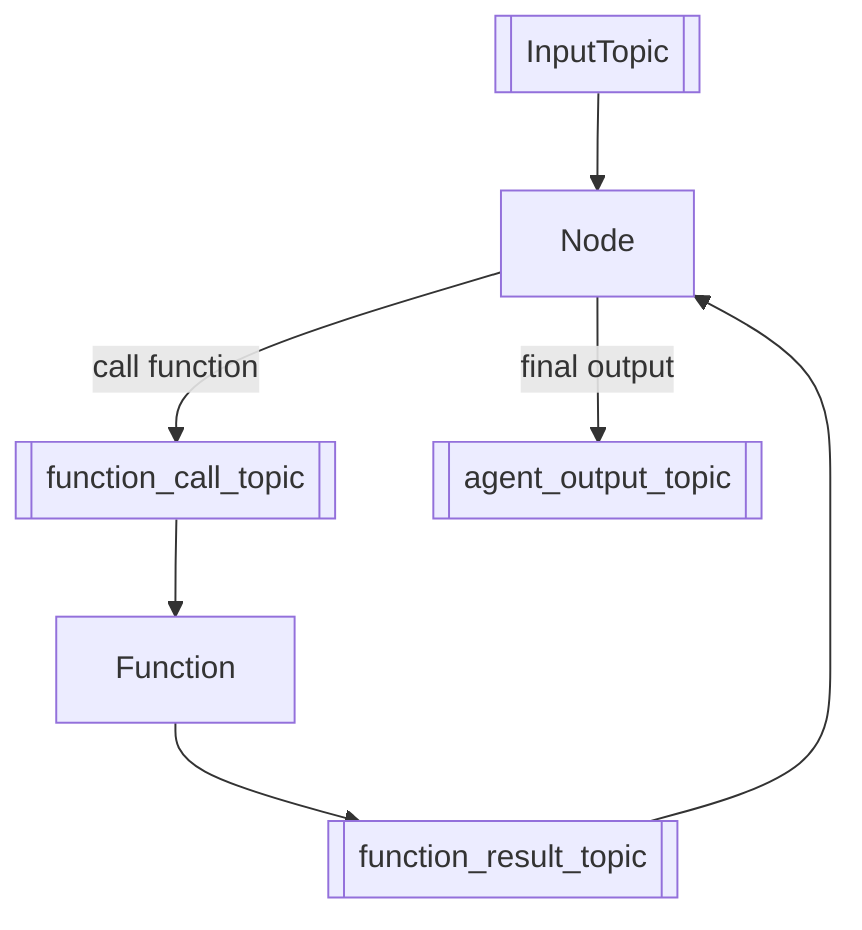

<p align="center">
  <picture>
    <source srcset="/assets/graphite_logo_light.png" media="(prefers-color-scheme: dark)">
    
  </picture>
</p>

## Introduction

Graphite is a flexible, event-driven framework for building AI agents using modular, composable workflows. Graphite helps you easily build AI agents with:

1. **Observability**  
   Complex AI solutions involve multiple steps, data sources, and models. Graphite’s event-driven architecture, logging, and tracing make it possible to pinpoint bottlenecks or errors in real time, ensuring that each component’s behavior is transparent and measurable.

2. **Idempotency**  
   Asynchronous workflows often require retries when partial failures occur or network conditions fluctuate. Graphite’s design emphasizes idempotent operations, preventing pub/sub data duplication or corruption when calls must be repeated.

3. **Auditability**  
   By treating events as the single source of truth, Graphite automatically logs every state change and decision path. This level of detailed recordkeeping is indispensable for users working in regulated sectors or who need full traceability for debugging and compliance.

4. **Restorability**  
   Long-running AI tasks risk substantial rework if they fail mid-invoke. In Graphite, checkpoints and event-based playback enable workflows to resume from the precise point of interruption, minimizing downtime and maximizing resource efficiency ([Example](/tests_integration/react_assistant/react_assistant_recovery_example.py)).

Graphite is based on:

- **Event-driven Architecture**: Components communicate through events, making workflows easy to trace, debug, and extend.
- **Modular Design**: Independently developed components simplify building, testing, and deployment.

Key benefits include:

- Effortless workflow customization for AI agents
- Clear visibility into agent behavior via event sourcing
- Reliable fault recovery and state restoration
- Scalable, stateless architecture
- End-to-end auditability with persistent event tracking
- Enables both online and offline data processing by capturing all events in an event store — users can build memory, knowledge bases, analytics, or fine-tuning pipelines on top of it

Graphite is ideal for building robust and transparent AI agent, seamlessly scaling from proof of concept to enterprise deployment

## Core Components

Graphite is structured into three conceptual layers — *Assistants*, *Nodes*, and *Tools* — coordinated through a lightweight, Pub/Sub *workflow* orchestration mechanism:

- **Assistants**: High-level orchestration layer that manages AI agent workflows and user interactions. Assistants handle the complete lifecycle of requests, from initial input to final response.
- **Nodes**: A node is a discrete component in a graph-based agent system that operates under an event-driven model. Its primary role is to represent its position within a workflow graph, manage event subscriptions, and designate topics for publishing.
- **Tools**:  In our platform, tools represent the invoke components within a workflow. A Tool is essentially a function designed to transform input data into output based on specified rules or logic.
- **Workflow**: Orchestrates interactions among nodes using a Pub/Sub pattern with in-memory message queuing.


Additionally, Graphite offers modules that support essential architectural patterns such as *Event Sourcing*, the *Command Pattern*, and *Pub/Sub* communication, along with multiple layers to manage different communication life cycles:

- **Event**: Core to Graphite’s event-driven architecture. Events represent every state change, stored in a durable event store, serving as the single source of truth for downstream processing, auditing, workflow restoration, and more.
- **Topic**: Implements lightweight FIFO message queuing, essential for Pub/Sub interactions.
- **Command**: Implements the Command pattern, clearly separating request initiators from executors through defined Command objects and handlers. Commands carry all necessary context, allowing nodes to invoke tools independently and cleanly.
- **Decorators**: Automatically capture invoke details (inputs, outputs, and errors) as events without altering core business logic, facilitating auditability and traceability.
- **Invoke Context**: Manages identifiers across message life cycles:
  - `conversation_id`: Manages conversations, which may include multiple invokes.
  - `assistant_request_id`: Tracks requests at the assistant level, facilitating complex multi-node workflows.
  - `invoke_id`: Handles individual user requests, potentially involving multiple assistants in complex scenarios.
  - `user_id`: Identifies individual users, supporting multiple conversations per user.

For more details, visit the Graphite [documentation](https://binome-dev.github.io/graphite/).

## Getting Started

Install Graphite:

```bash
pip install grafi
```

Run a build in ReAct agent:



```python
from grafi.agents.react_agent import create_react_agent

react_agent = create_react_agent()

output = react_agent.run("What is agent framework called Graphite?")

print(output)
```

Output could be:

> Graphite is an open-source framework designed for building domain-specific AI agents using composable workflows. It features an event-driven architecture that allows  developers to create customizable workflows. This framework is particularly focused on constructing AI assistants that can interact within specific domains effectively.
>
> For more detailed information, you can refer to the following resources:
>
> 1. [Introducing Graphite — An Event Driven AI Agent Framework](https://medium.com/binome/introduction-to-graphite-an-event-driven-ai-agent-framework-540478130cd2)
> 2. [Graphite - Framework AI Agent Builder](https://bestaiagents.ai/agent/graphite)

## Why Graphite?

You might ask why we created another agent framework. The short answer is: we see a gap when it comes to solving real-world problems with AI tools. Many generic agents — like a typical ReAct or CoT agent — aren’t enough for mission-critical tasks where mistakes can be costly.

For a typical business problem (e.g., purchasing a property), there’s usually a well-defined procedure — or a workflow — guided by domain expertise. This process might include know your client, searching online, analyzing data, or summarizing findings, all of which can be orchestrated in a controlled manner.

Graphite simplifies constructing these AI powered workflows, much like building with LEGO bricks. It offers businesses a straightforward way to automate complex tasks while integrating seamlessly into existing software development life cycles.

## Contributing

We warmly welcome contributions to enhance and expand our project. Contributions can take many forms, including but not limited to:

### Reporting and Fixing Bugs

- Clearly report issues by providing detailed reproduction steps, expected outcomes, and actual results.
- Participate in investigating, diagnosing, and fixing bugs to enhance the platform's stability.

### Suggesting Improvements and Designs

- Propose enhancements or new design patterns aimed at improving usability, performance, or maintainability.
- Engage actively with the community through discussions and pull requests to collaboratively shape optimal solutions.

### Creating New Assistants and Tools

- Develop new assistants or tools to broaden the functionality and versatility of the platform.
- Adhere to existing interfaces and design patterns to maintain compatibility and consistency.

We greatly appreciate your insights and contributions!

## License

Mozilla Public License Version 2.0
