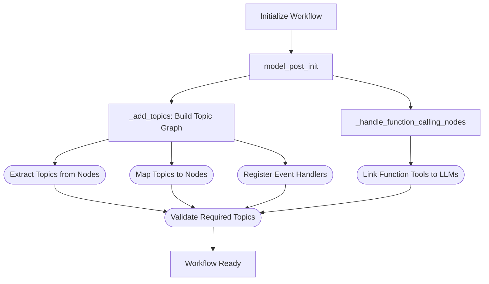

# Event-Driven Workflow

The event-driven workflow serves as the dynamic execution layer of Graphite, orchestrating node execution through a publish/subscribe (pub/sub) model. This architecture structures workflows as interconnected nodes that communicate via event queues (topics), enabling asynchronous, scalable, and flexible processing.

## Fields

The fields of the EventDrivenWorkflow are:

| Field Name          | Type                              | Description                                                                                           |
|---------------------|-----------------------------------|-------------------------------------------------------------------------------------------------------|
| `name`              | `str`                             | Unique identifier for the workflow instance (default: `"EventDrivenWorkflow"`).                       |
| `type`              | `str`                             | The type identifier for the workflow, typically matching the class name (`"EventDrivenWorkflow"`).    |
| `oi_span_type`      | `OpenInferenceSpanKindValues`     | Semantic attribute from OpenInference used for tracing and observability (default: `AGENT`).         |
| `workflow_id`       | `str`                             | Unique identifier for the workflow instance, auto-generated UUID.                                     |
| `nodes`             | `Dict[str, Node]`                 | Collection of all nodes defined within this workflow, keyed by node name.                             |
| `_topics`           | `Dict[str, TopicBase]`            | Private dictionary storing all event topics managed by the workflow.                                  |
| `_topic_nodes`      | `Dict[str, List[str]]`            | Private mapping of topic names to lists of node names subscribed to each topic.                       |
| `_invoke_queue`     | `deque[Node]`                     | Private queue of nodes that are ready to execute, triggered by event availability.                    |
| `_tracker`          | `AsyncNodeTracker`                | Tracks active nodes and workflow idle state for proper async termination.                             |

## Methods

The following table summarizes key methods within the EventDrivenWorkflow class, highlighting their role in managing workflow execution, event handling, and node orchestration:

| Method Name               | Description                                                                                                                                               |
|---------------------------|-----------------------------------------------------------------------------------------------------------------------------------------------------------|
| `model_post_init`         | Model initialization hook that sets up topics and handles function calling nodes after model creation.                                                  |
| `builder`                 | Class method that returns a WorkflowBuilder for fluent workflow construction.                                                                            |
| `_add_topics`             | Sets up topic subscriptions and node-to-topic mappings from node configurations.                                                                         |
| `_add_topic`              | Registers a topic within the workflow and sets default publish event handlers.                                                                           |
| `_handle_function_calling_nodes` | Links function calling nodes with LLM nodes to enable function specification sharing.                                                             |
| `_commit_events`        | Commits processed events to their respective topics, updating consumer offsets.                                                                          |
| `_get_output_events`      | Retrieves and returns consumed events from agent output and in-workflow output topics.                                                                   |
| `invoke`                | Asynchronous workflow execution with streaming support and concurrent node processing.                                                                   |
| `_invoke_node`            | Invokes a single node asynchronously with proper stream handling and error management.                                                                   |
| `init_workflow`         | Asynchronously initializes workflow state, either restoring from stored events or creating new workflow with input data.                                |
| `on_event`                | Event handler that responds to topic publish events, evaluates node readiness, and queues nodes for execution.                                          |
| `to_dict`                 | Serializes the workflow to a dictionary representation including nodes, topics, and topic-node mappings.                                                |

## Workflow Execution Flow

The following diagram illustrates the execution flow of a Node within an event-driven workflow:


## Workflow Initialization

When an EventDrivenWorkflow instance is initialized, the `model_post_init` method performs several critical setup tasks:

1. **Topic Setup** (`_add_topics`): Constructs the workflow graph by analyzing each node's subscription expressions and publish destinations
2. **Function Calling Integration** (`_handle_function_calling_nodes`): Links function-calling nodes with LLM nodes to enable tool recognition

The topic setup process:

- Extracts topics from node subscription expressions using `extract_topics`
- Maps topic names to subscribing node names in `_topic_nodes`
- Registers all topics in the `_topics` dictionary with event handlers
- Validates that required `InputTopic` and `OutputTopic` exist

For function calling capabilities:

- Identifies nodes using `FunctionCallTool`
- Links them with LLM nodes that publish to the same topics
- Enables LLMs to recognize and invoke available function tools



## Node Execution Process

The EventDrivenWorkflow uses asynchronous execution with the `invoke` method, handling node orchestration through async/await patterns.

### Asynchronous Execution (`invoke`)

The asynchronous execution model provides sophisticated event-driven processing with proper coordination:

1. **Workflow Initialization**: Sets up initial state with `init_workflow`
2. **Concurrent Node Processing**: Spawns individual tasks for each node using `_invoke_node`  
3. **Output Listening**: Creates listeners for each output topic to capture results
4. **Event Streaming**: Uses `MergeIdleQueue` to stream events as they become available
5. **Proper Termination**: Coordinates workflow completion using `AsyncNodeTracker`

#### Key Components

- **AsyncNodeTracker**: Manages active node state and idle detection
- **Output Listeners**: Monitor output topics for new events
- **MergeIdleQueue**: Coordinates between event availability and workflow idle state
- **Offset Management**: Commits events immediately to prevent duplicates

### Event-Driven Node Triggering

The pub/sub model governs node execution through the `on_event` handler:

1. **Event Reception**: Receives `PublishToTopicEvent` from topics
2. **Subscriber Identification**: Finds all nodes subscribed to the published topic
3. **Readiness Check**: Evaluates each node's `can_invoke()` criteria
4. **Queue Management**: Adds ready nodes to `_invoke_queue` for execution


## Input Preparation & Execution Logic

Before executing a node, the workflow's `get_node_input` method collects all relevant events from the node's subscribed topics:

1. **Topic Iteration**: Processes each topic in `node._subscribed_topics`
2. **Event Consumption**: Uses `topic.consume(node.name)` to retrieve available events
3. **Event Conversion**: Converts topic events to `ConsumeFromTopicEvent` instances
4. **Input Assembly**: Returns list of consumed events for node execution

### Subscription Logic Support

The system provides flexible subscription expressions through topic expressions that support complex logic:

- **AND Logic**: Node executes when ALL subscription conditions are met
- **OR Logic**: Node executes when ANY subscription condition is met

## Async Flow Architecture

The EventDrivenWorkflow implements a sophisticated async architecture that addresses the challenges of coordinating multiple concurrent nodes while ensuring proper workflow termination and data consistency.

### Workflow Components

The async workflow relies on two key components for coordination and output management:

#### AsyncNodeTracker

The `AsyncNodeTracker` manages workflow state and coordination by tracking active nodes, monitoring processing cycles, and detecting idle states. It provides the foundation for proper workflow termination detection.

#### AsyncOutputQueue

The `AsyncOutputQueue` manages the collection and streaming of output events from multiple topics. It coordinates concurrent listeners and provides a unified async iterator interface for consuming events.

For detailed information about these components, see the [Workflow Components documentation](workflow-components.md).

### Component Integration

The async workflow integrates these components to provide robust event streaming:

```python
# Create output queue with topics and tracker
output_queue = AsyncOutputQueue(output_topics, self.name, self._tracker)
await output_queue.start_listeners()

# Stream events as they arrive
async for event in output_queue:
    yield event.data
```

### Offset Management and Duplicate Prevention

The async workflow implements proper offset management to prevent duplicate data:

```python
async for event in MergeIdleQueue(queue, self._tracker):
    consumed_output_event = ConsumeFromTopicEvent(...)

    # Commit BEFORE yielding to prevent duplicate data
    await self._commit_events(
        consumer_name=self.name, events=[consumed_output_event]
    )

    # Now yield the data after committing
    yield event.data
```

#### Key Principles

- **Immediate Consumption**: Consumed offset advanced on fetch
- **Commit Before Yield**: Prevents duplicate data in output stream
- **Atomic Operations**: Event processing and commitment are coordinated

### Node Lifecycle in Async Mode

Each node runs in its own async task with proper coordination:

```python
async def _invoke_node(self, invoke_context: InvokeContext, node: Node):
    buffer: Dict[str, List[TopicEvent]] = {}

    try:
        while not self._stop_requested:
            # Wait for node to have sufficient data
            await wait_node_invoke(node)

            # Signal node is becoming active
            await self._tracker.enter(node.name)

            try:
                # Process events and publish results
                async for msgs in node.invoke(invoke_context, consumed_events):
                    published_events = await publish_events(...)
                    # Notify downstream nodes immediately
                    for event in published_events:
                        if event.name in self._topic_nodes:
                            topic = self._topics[event.name]
                            async with topic.event_cache._cond:
                                topic.event_cache._cond.notify_all()

                # Commit processed events
                await self._commit_events(...)

            finally:
                # Signal node is no longer active
                await self._tracker.leave(node.name)

    except asyncio.CancelledError:
        logger.info(f"Node {node.name} was cancelled")
        raise
```

#### Node Coordination Features

- **Buffer Management**: Each node maintains its own event buffer
- **Activity Signaling**: Nodes signal when they become active/inactive
- **Immediate Notification**: Downstream nodes notified immediately after publishing
- **Proper Cleanup**: Resources cleaned up on cancellation

### Workflow Termination Logic

The workflow terminates when all conditions are met:

1. **No Active Nodes**: `AsyncNodeTracker` reports idle state
2. **No Pending Data**: Output topics have no unconsumed data
3. **No Progress**: Activity count indicates no new processing cycles

```python
# Check for workflow completion
if tracker.is_idle() and not topic.can_consume(consumer_name):
    current_activity = tracker.get_activity_count()

    # If no new activity since last check, we're done
    if current_activity == last_activity_count:
        break

    last_activity_count = current_activity
```

This multi-layered approach ensures that workflows terminate cleanly without missing data or creating race conditions between upstream completion and downstream activation.
- **Complex Expressions**: Combination of AND/OR operators for advanced logic

**Important Consideration for OR Logic**: When using OR-based subscriptions, nodes are queued as soon as one condition is satisfied. Messages from other subscribed topics in the OR expression may not be available when `get_node_input` executes, potentially causing data inconsistencies. Careful design is recommended when implementing OR-based logic.

### Node Execution Flow


## Restoring Unfinished Workflows

A key advantage of this event-driven architecture is its ability to restore and resume unfinished workflows. When `initial_workflow()` is called, the system:

1. **Event Store Check**: Retrieves stored events for the given `assistant_request_id`
2. **State Restoration**: If events exist, restores workflow topics and state from stored events
3. **Fresh Start**: If no events exist, publishes input to `InputTopic` to begin new workflow
4. **Topic Restoration**: Replays stored `PublishToTopicEvent` and `OutputTopicEvent` to restore topic states
5. **Node Queue Setup**: Evaluates node readiness and populates `_invoke_queue` appropriately

### Benefits of Workflow Restoration

- **Human-in-the-Loop Support**: Workflows can pause while awaiting user input and resume seamlessly
- **Failure Recovery**: Resume from failure points without restarting entire workflows
- **Cost Efficiency**: Prevents unnecessary re-execution of previous steps, reducing LLM call costs
- **State Consistency**: Maintains exact workflow state across interruptions


This restoration mechanism enables robust, fault-tolerant workflows that can handle interruptions gracefully while maintaining consistency and efficiency.
