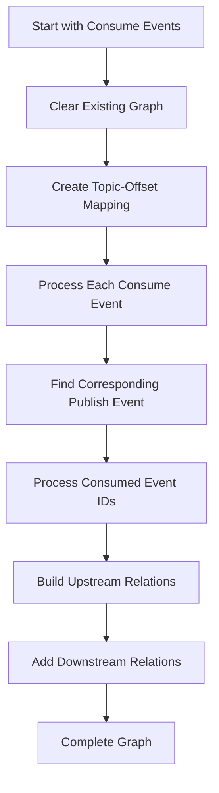
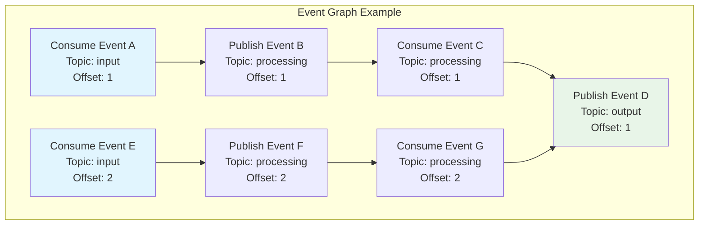
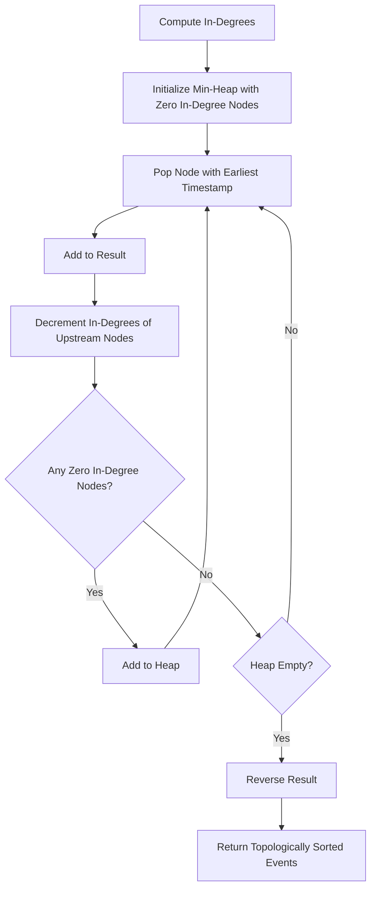
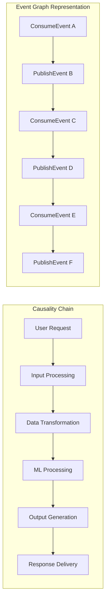

# Event Graph

The Graphite event graph system provides advanced event relationship modeling and topological analysis capabilities for topic-based events. It enables visualization of event dependencies, causal relationships, and proper ordering of events for replay and analysis scenarios.

## Overview

The event graph system is designed to:

- **Model Relationships**: Capture dependencies between topic events
- **Topological Ordering**: Provide chronologically correct event sequences
- **Causal Analysis**: Understand event causality and dependencies
- **Event Replay**: Support proper event ordering for state reconstruction

## Core Components

### EventGraphNode

Represents a single event within the graph structure.

#### Fields

| Field | Type | Description |
|-------|------|-------------|
| `event_id` | `EventId` | Unique identifier for the event |
| `event` | `TopicEvent` | The actual topic event data |
| `upstream_events` | `List[EventId]` | Events that this event depends on |
| `downstream_events` | `List[EventId]` | Events that depend on this event |

#### Methods

| Method | Signature | Description |
|--------|-----------|-------------|
| `to_dict` | `() -> dict[str, Any]` | Serialize node to dictionary |
| `from_dict` | `classmethod (data: dict) -> EventGraphNode` | Deserialize node from dictionary |

### EventGraph

The main graph structure that manages event relationships and provides analysis capabilities.

#### EventGraph Fields

| Field | Type | Description |
|-------|------|-------------|
| `nodes` | `Dict[EventId, EventGraphNode]` | All nodes in the graph |
| `root_nodes` | `List[EventGraphNode]` | Entry point nodes (no dependencies) |

#### Core Methods

| Method | Signature | Description |
|--------|-----------|-------------|
| `build_graph` | `(consume_events, topic_events) -> None` | Build graph from events |
| `get_root_event_nodes` | `() -> List[EventGraphNode]` | Get all root nodes |
| `get_topology_sorted_events` | `() -> List[EventGraphNode]` | Get topologically sorted events |

## Graph Construction Algorithm

The event graph is built by analyzing the relationships between consume and publish events.

### Algorithm Overview



### Implementation Details

#### Step 1: Topic-Offset Mapping

```python
# Create mapping for efficient lookup
topic_offset_to_publish = {
    f"{event.name}::{event.offset}": event
    for event in topic_events.values()
    if isinstance(event, PublishToTopicEvent)
}
```

#### Step 2: Recursive Relationship Building

```python
def build_node_relations(consume_event: ConsumeFromTopicEvent) -> None:
    if consume_event.event_id in visited:
        return

    visited.add(consume_event.event_id)
    current_node = self._add_event(consume_event)

    # Find corresponding publish event
    publish_key = f"{consume_event.name}::{consume_event.offset}"
    publish_event = topic_offset_to_publish.get(publish_key)

    if publish_event:
        # Process consumed events of the publish event
        for consumed_id in publish_event.consumed_event_ids:
            consumed_event = topic_events.get(consumed_id)
            if isinstance(consumed_event, ConsumeFromTopicEvent):
                child_node = self._add_event(consumed_event)
                current_node.upstream_events.append(child_node.event_id)
                build_node_relations(consumed_event)
```

### Example Graph Structure



## Topological Sorting Algorithm

The system provides topologically sorted events using a modified Kahn's algorithm with timestamp-based ordering.

### Algorithm Visualization



### Topological Sorting Implementation

#### Step 1: In-Degree Calculation

```python
# Compute in-degrees for all nodes
in_degree: Dict[EventId, int] = {}
for node in self.nodes.values():
    in_degree[node.event_id] = 0

for node in self.nodes.values():
    for up_id in node.upstream_events:
        in_degree[up_id] += 1
```

#### Step 2: Timestamp-Based Priority Queue

```python
# Initialize min-heap with timestamp priority
min_heap: List[tuple] = []
for node in self.nodes.values():
    if in_degree[node.event_id] == 0:
        heapq.heappush(
            min_heap,
            (-node.event.timestamp.timestamp(), node.event_id)
        )
```

#### Step 3: Topological Processing

```python
while min_heap:
    ts, ev_id = heapq.heappop(min_heap)
    current_node = self.nodes[ev_id]
    result.append(current_node)

    # Process upstream dependencies
    for up_id in current_node.upstream_events:
        in_degree[up_id] -= 1
        if in_degree[up_id] == 0:
            upstream_node = self.nodes[up_id]
            heapq.heappush(
                min_heap,
                (-upstream_node.event.timestamp.timestamp(), upstream_node.event_id)
            )
```

### Topological Order Example

```mermaid
gantt
    title Event Processing Timeline
    dateFormat X
    axisFormat %s

    section Processing Order
    Event A (t=100) :done, a, 0, 1
    Event E (t=150) :done, e, 1, 2
    Event B (t=200) :done, b, 2, 3
    Event F (t=250) :done, f, 3, 4
    Event C (t=300) :done, c, 4, 5
    Event G (t=350) :done, g, 5, 6
    Event D (t=400) :done, d, 6, 7
```



## Usage Patterns

### Basic Graph Construction

```python
from grafi.common.events.event_graph import EventGraph
from grafi.common.events.topic_events.consume_from_topic_event import ConsumeFromTopicEvent
from grafi.common.events.topic_events.publish_to_topic_event import PublishToTopicEvent

# Create event graph
graph = EventGraph()

# Collect events
consume_events = [...]  # List of ConsumeFromTopicEvent
topic_events = {...}    # Dict mapping event IDs to events

# Build the graph
graph.build_graph(consume_events, topic_events)

# Get topologically sorted events
sorted_events = graph.get_topology_sorted_events()
```

### Event Replay Scenario

```python
def replay_events_in_order(graph: EventGraph):
    """Replay events in proper causal order."""
    sorted_events = graph.get_topology_sorted_events()

    for node in sorted_events:
        event = node.event
        print(f"Replaying event {event.event_id} at {event.timestamp}")
        # Process event...
```

### Dependency Analysis

```python
def analyze_event_dependencies(graph: EventGraph, event_id: str):
    """Analyze dependencies for a specific event."""
    if event_id not in graph.nodes:
        return None

    node = graph.nodes[event_id]

    return {
        "event_id": event_id,
        "upstream_count": len(node.upstream_events),
        "downstream_count": len(node.downstream_events),
        "upstream_events": node.upstream_events,
        "downstream_events": node.downstream_events
    }
```

### Root Event Analysis

```python
def find_root_causes(graph: EventGraph):
    """Find all events that started processing chains."""
    root_nodes = graph.get_root_event_nodes()

    return [
        {
            "event_id": node.event_id,
            "timestamp": node.event.timestamp,
            "name": node.event.name,
            "downstream_count": len(node.downstream_events)
        }
        for node in root_nodes
    ]
```

## Advanced Use Cases

### Event Causality Tracing



### Parallel Processing Analysis

```python
def identify_parallel_opportunities(graph: EventGraph):
    """Identify events that can be processed in parallel."""
    sorted_events = graph.get_topology_sorted_events()
    parallel_groups = []

    current_level = []
    processed_dependencies = set()

    for node in sorted_events:
        # Check if all dependencies are satisfied
        dependencies_satisfied = all(
            dep_id in processed_dependencies
            for dep_id in node.upstream_events
        )

        if dependencies_satisfied:
            current_level.append(node.event_id)
        else:
            if current_level:
                parallel_groups.append(current_level)
                current_level = [node.event_id]

        processed_dependencies.add(node.event_id)

    if current_level:
        parallel_groups.append(current_level)

    return parallel_groups
```

### Event Graph Validation

```python
def validate_event_graph(graph: EventGraph):
    """Validate the integrity of the event graph."""
    issues = []

    # Check for cycles
    sorted_events = graph.get_topology_sorted_events()
    if len(sorted_events) != len(graph.nodes):
        issues.append("Graph contains cycles")

    # Check for orphaned nodes
    referenced_nodes = set()
    for node in graph.nodes.values():
        referenced_nodes.update(node.upstream_events)
        referenced_nodes.update(node.downstream_events)

    orphaned = set(graph.nodes.keys()) - referenced_nodes - {node.event_id for node in graph.root_nodes}
    if orphaned:
        issues.append(f"Orphaned nodes found: {orphaned}")

    # Check for consistency
    for node in graph.nodes.values():
        for upstream_id in node.upstream_events:
            if upstream_id not in graph.nodes:
                issues.append(f"Node {node.event_id} references non-existent upstream {upstream_id}")

    return issues
```

## Serialization and Persistence

### Graph Serialization

```python
# Serialize graph to dictionary
graph_dict = graph.to_dict()

# Save to JSON
import json
with open("event_graph.json", "w") as f:
    json.dump(graph_dict, f, indent=2)

# Load from JSON
with open("event_graph.json", "r") as f:
    graph_data = json.load(f)

# Reconstruct graph
graph = EventGraph.from_dict(graph_data)
```

### Integration with Event Store

```python
def save_graph_to_event_store(graph: EventGraph, event_store: EventStore):
    """Save event graph analysis as a special event."""
    from grafi.common.events.topic_events.topic_event import TopicEvent

    graph_event = TopicEvent(
        name="event_graph_analysis",
        offset=0,
        data=graph.to_dict()
    )

    event_store.record_event(graph_event)
```

## Performance Considerations

### Time Complexity

| Operation | Time Complexity | Description |
|-----------|----------------|-------------|
| Graph Construction | O(V + E) | V = events, E = relationships |
| Topological Sort | O(V log V + E) | Heap operations + edge processing |
| Root Node Finding | O(V) | Linear scan of all nodes |
| Dependency Lookup | O(1) | Direct dictionary access |

### Memory Optimization

```python
def optimize_graph_memory(graph: EventGraph):
    """Optimize graph memory usage for large datasets."""
    # Remove unnecessary downstream references if only upstream needed
    for node in graph.nodes.values():
        if not_needed_downstream():
            node.downstream_events.clear()

    # Implement node pooling for frequent operations
    # Consider lazy loading for large graphs
```

### Scaling Strategies

1. **Chunked Processing**: Process large event sets in chunks
2. **Lazy Loading**: Load only required portions of the graph
3. **Caching**: Cache topological sort results
4. **Parallel Construction**: Build sub-graphs in parallel

## Best Practices

### Graph Construction

1. **Event Validation**: Validate events before adding to graph
2. **Cycle Detection**: Check for cycles during construction
3. **Memory Management**: Monitor memory usage for large graphs
4. **Error Handling**: Handle malformed event relationships gracefully

### Analysis Operations

1. **Batch Processing**: Process multiple analyses together
2. **Result Caching**: Cache expensive analysis results
3. **Incremental Updates**: Support incremental graph updates
4. **Parallel Analysis**: Use parallel processing for independent analyses

### Integration Patterns

1. **Event Store Integration**: Persist graphs for historical analysis
2. **Monitoring Integration**: Use graphs for real-time monitoring
3. **Debugging Support**: Leverage graphs for debugging event flows
4. **Performance Analysis**: Use graphs to identify bottlenecks

## Troubleshooting

### Common Issues

1. **Cycle Detection**: Use topological sort to detect cycles
2. **Missing Dependencies**: Validate all referenced events exist
3. **Memory Issues**: Monitor graph size and optimize accordingly
4. **Performance Problems**: Profile and optimize hot paths

### Debugging Tools

```python
def debug_graph_structure(graph: EventGraph):
    """Print detailed graph structure for debugging."""
    print(f"Graph contains {len(graph.nodes)} nodes")
    print(f"Root nodes: {len(graph.root_nodes)}")

    for node in graph.nodes.values():
        print(f"Node {node.event_id}:")
        print(f"  Upstream: {node.upstream_events}")
        print(f"  Downstream: {node.downstream_events}")
        print(f"  Timestamp: {node.event.timestamp}")
```

The event graph system provides powerful capabilities for understanding and analyzing event relationships in complex topic-based messaging scenarios, enabling proper event ordering, causality analysis, and system debugging.
