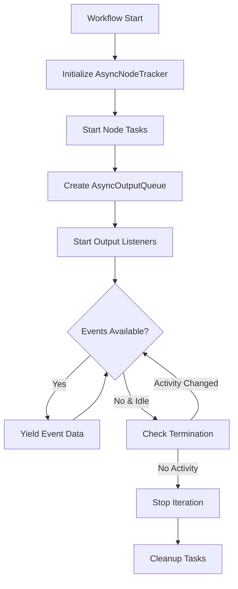

# Workflow Components

This document details the internal components that power the event-driven workflow's asynchronous execution model. These components work together to provide efficient concurrent processing, proper termination detection, and streaming output capabilities.

## AsyncNodeTracker

The `AsyncNodeTracker` is a critical component that manages the state of active nodes in an asynchronous workflow. It provides coordination between concurrent node executions and enables proper workflow termination detection.

### Purpose

The AsyncNodeTracker serves several key purposes:

1. **Activity Tracking**: Monitors which nodes are currently processing events
2. **Idle Detection**: Determines when the entire workflow has no active nodes
3. **Progress Monitoring**: Tracks processing cycles to detect workflow progress
4. **Synchronization**: Provides coordination primitives for concurrent operations

### Architecture

```python
class AsyncNodeTracker:
    def __init__(self) -> None:
        self._active: set[str] = set()  # Currently active nodes
        self._processing_count: Dict[str, int] = defaultdict(int)  # Processing cycles per node
        self._cond = asyncio.Condition()  # Coordination primitive
        self._idle_event = asyncio.Event()  # Signals when workflow is idle
```

### Key Methods

| Method | Description |
|--------|-------------|
| `enter(node_name: str)` | Marks a node as active when it begins processing |
| `leave(node_name: str)` | Marks a node as inactive when it completes processing |
| `is_idle()` | Returns True if no nodes are currently active |
| `wait_idle_event()` | Async wait until the workflow becomes idle |
| `get_activity_count()` | Returns total processing cycles across all nodes |
| `reset()` | Resets the tracker to initial state |

### Usage Example

```python
tracker = AsyncNodeTracker()

# Node entering active state
await tracker.enter("node1")
assert not tracker.is_idle()

# Node completing processing
await tracker.leave("node1")
assert tracker.is_idle()

# Wait for workflow to become idle
await tracker.wait_idle_event()
```

### Workflow Integration

The AsyncNodeTracker integrates with the workflow execution in several ways:

1. **Node Lifecycle**: Each node signals when it enters/leaves active state
2. **Termination Detection**: Output listeners use idle state to determine completion
3. **Progress Monitoring**: Activity count helps detect stalled workflows

```mermaid
graph TD
    A[Node Receives Events] --> B[tracker.enter(node_name)]
    B --> C[Node Processing]
    C --> D[tracker.leave(node_name)]
    D --> E{All Nodes Idle?}
    E -->|Yes| F[Signal Workflow Complete]
    E -->|No| G[Continue Processing]
```

## AsyncOutputQueue

The `AsyncOutputQueue` manages the collection and streaming of output events from multiple topics in an asynchronous workflow. It coordinates between output topic listeners and provides a unified async iterator interface for consuming events.

### Purpose

The AsyncOutputQueue addresses several challenges:

1. **Multi-Topic Monitoring**: Efficiently monitors multiple output topics concurrently
2. **Stream Coordination**: Provides a single stream from multiple sources
3. **Termination Detection**: Integrates with AsyncNodeTracker for proper completion
4. **Type Safety**: Provides proper type hints for async iteration

### Architecture

```python
class AsyncOutputQueue:
    def __init__(
        self,
        output_topics: List[TopicBase],
        consumer_name: str,
        tracker: AsyncNodeTracker,
    ):
        self.output_topics = output_topics
        self.consumer_name = consumer_name
        self.tracker = tracker
        self.queue: asyncio.Queue[TopicEvent] = asyncio.Queue()
        self.listener_tasks: List[asyncio.Task] = []
```

### Key Features

| Feature | Description |
|---------|-------------|
| **Async Iteration** | Implements `__aiter__` and `__anext__` for async for loop support |
| **Concurrent Listeners** | Spawns separate listener tasks for each output topic |
| **Idle Detection** | Monitors workflow idle state to determine when to stop iteration |
| **Graceful Shutdown** | Provides methods to cleanly stop all listener tasks |

### Usage Example

```python
# Create output queue with topics and tracker
output_queue = AsyncOutputQueue(output_topics, "consumer_name", tracker)

# Start listening to all topics
await output_queue.start_listeners()

try:
    # Consume events as they arrive
    async for event in output_queue:
        # Process event
        yield event.data
finally:
    # Clean shutdown
    await output_queue.stop_listeners()
```

### Output Listener Logic

Each output topic gets its own listener that implements sophisticated termination logic:

```python
async def _output_listener(self, topic: TopicBase):
    last_activity_count = 0

    while True:
        # Wait for either new data or idle state
        topic_task = asyncio.create_task(topic.consume(self.consumer_name))
        idle_event_waiter = asyncio.create_task(self.tracker.wait_idle_event())

        done, pending = await asyncio.wait(
            {topic_task, idle_event_waiter},
            return_when=asyncio.FIRST_COMPLETED,
        )

        # Process new events
        if topic_task in done:
            output_events = topic_task.result()
            for event in output_events:
                await self.queue.put(event)

        # Check for completion
        if idle_event_waiter in done and self.tracker.is_idle():
            current_activity = self.tracker.get_activity_count()

            # No new activity and no data = done
            if current_activity == last_activity_count and not topic.can_consume(self.consumer_name):
                break

            last_activity_count = current_activity
```

### Iteration and Termination

The AsyncOutputQueue implements async iteration with proper idle detection:

```python
async def __anext__(self) -> TopicEvent:
    while True:
        queue_task = asyncio.create_task(self.queue.get())
        idle_task = asyncio.create_task(self.tracker._idle_event.wait())

        done, pending = await asyncio.wait(
            {queue_task, idle_task},
            return_when=asyncio.FIRST_COMPLETED,
        )

        # Data available - return it
        if queue_task in done:
            idle_task.cancel()
            return queue_task.result()

        # Workflow idle - check if we should stop
        queue_task.cancel()
        await asyncio.sleep(0)  # Allow downstream activation

        if self.tracker.is_idle() and self.queue.empty():
            raise StopAsyncIteration
```

## Integration with EventDrivenWorkflow

These components work together in the EventDrivenWorkflow's async execution:

```python
async def invoke(self, input_data: PublishToTopicEvent) -> AsyncGenerator[ConsumeFromTopicEvent, None]:
    # Initialize workflow
    await self.init_workflow(invoke_context, input)

    # Start node processing tasks
    node_processing_tasks = [
        asyncio.create_task(self._invoke_node(invoke_context, node))
        for node in self.nodes.values()
    ]

    # Create output queue for streaming results
    output_topics = [t for t in self._topics.values()
                     if t.type in (AGENT_OUTPUT_TOPIC_TYPE, IN_WORKFLOW_OUTPUT_TOPIC_TYPE)]

    output_queue = AsyncOutputQueue(output_topics, self.name, self._tracker)
    await output_queue.start_listeners()

    try:
        # Stream results as they arrive
        async for event in output_queue:
            yield event.data
    finally:
        await output_queue.stop_listeners()
```

### Coordination Flow



## Benefits

The combination of AsyncNodeTracker and AsyncOutputQueue provides:

1. **Efficient Concurrency**: Multiple nodes and topics processed in parallel
2. **Proper Termination**: Detects when workflow is truly complete
3. **Stream Processing**: Events streamed as available, not batched
4. **Resource Management**: Clean startup and shutdown of async tasks
5. **Type Safety**: Full type hints for better IDE support and error detection

## Best Practices

When working with these components:

1. **Always Clean Up**: Use try/finally blocks to ensure listener tasks are stopped
2. **Monitor Activity**: Use activity counts to detect stalled workflows
3. **Handle Cancellation**: Nodes should handle CancelledError gracefully
4. **Coordinate Properly**: Ensure nodes signal enter/leave at appropriate times
5. **Test Thoroughly**: These components handle complex async coordination

These workflow components form the foundation of Graphite's robust asynchronous execution model, enabling scalable and reliable event-driven processing.