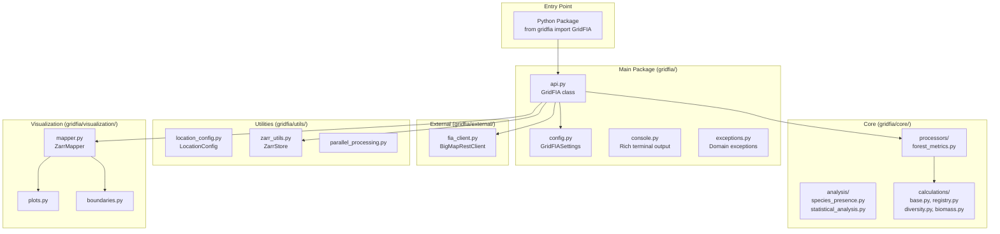
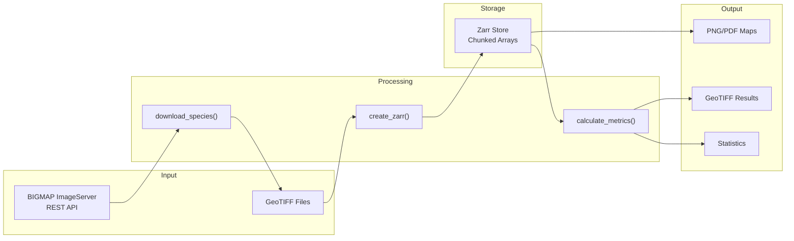
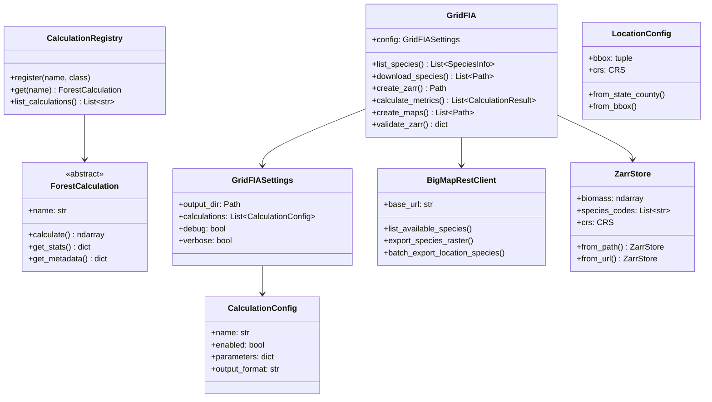

# Architecture Overview

GridFIA is a Python API for forest biomass and species diversity analysis using USDA Forest Service BIGMAP data. This document describes the system architecture and component relationships.

## Design Principles

- **API-First**: Single clean Python interface via the `GridFIA` class
- **Modularity**: Clear separation between data access, processing, and visualization
- **Extensibility**: Plugin-based calculation framework with registry pattern
- **Performance**: Chunked Zarr arrays for memory-efficient processing of large datasets
- **Configuration-driven**: Pydantic v2 models for type-safe settings management

## Package Structure



## Core Components

### GridFIA API (`api.py`)

The main entry point providing all user-facing functionality:

```python
from gridfia import GridFIA

api = GridFIA()

# Core methods
api.list_species()           # Query BIGMAP species catalog
api.download_species()       # Download biomass rasters
api.create_zarr()           # Convert GeoTIFFs to Zarr
api.calculate_metrics()     # Run forest calculations
api.create_maps()           # Generate visualizations
api.validate_zarr()         # Validate Zarr stores
api.get_location_config()   # Configure geographic extents
api.list_calculations()     # List available metrics

# Cloud/sample methods
api.list_sample_datasets()  # List pre-hosted samples
api.download_sample()       # Download sample data
api.load_from_cloud()       # Load from cloud URL
```

### Configuration (`config.py`)

Pydantic v2 models for type-safe configuration:

```python
from gridfia.config import GridFIASettings, CalculationConfig

settings = GridFIASettings(
    output_dir=Path("results"),
    calculations=[
        CalculationConfig(name="species_richness", enabled=True),
        CalculationConfig(name="shannon_diversity", enabled=True),
    ]
)

api = GridFIA(config=settings)
```

### Calculation Registry (`core/calculations/`)

Plugin-based framework for forest metrics:

```python
from gridfia.core.calculations import registry

# List available calculations
available = registry.list_calculations()

# Get calculation class
calc_class = registry.get("shannon_diversity")

# Register custom calculation
registry.register("custom_metric", CustomCalculation)
```

**Built-in Calculations:**

| Category | Calculations |
|----------|--------------|
| Diversity | `species_richness`, `shannon_diversity`, `simpson_diversity`, `evenness` |
| Biomass | `total_biomass`, `biomass_threshold`, `total_biomass_comparison` |
| Species | `dominant_species`, `species_proportion`, `species_presence` |

### REST Client (`external/fia_client.py`)

Interface to USDA Forest Service BIGMAP ImageServer:

```python
from gridfia.external.fia_client import BigMapRestClient

client = BigMapRestClient()
species = client.list_available_species()
client.export_species_raster(
    species_code="0131",
    bbox=bbox,
    output_path="loblolly.tif"
)
```

**Features:**

- Automatic retry with exponential backoff
- Rate limiting to respect service limits
- Progress tracking for downloads
- Chunked downloads for large areas

### Zarr Utilities (`utils/zarr_utils.py`)

Cloud-optimized array storage:

```python
from gridfia.utils.zarr_utils import ZarrStore

# Open existing store
store = ZarrStore.from_path("forest.zarr")

# Access data
biomass = store.biomass  # numpy array
species = store.species_codes  # list of codes
crs = store.crs  # coordinate reference system
```

### Location Configuration (`utils/location_config.py`)

Geographic extent management:

```python
from gridfia.utils.location_config import LocationConfig

# From state/county names
config = LocationConfig.from_state_county("North Carolina", "Wake")

# From bounding box
config = LocationConfig.from_bbox(
    bbox=(-79.5, 35.5, -78.5, 36.5),
    crs="EPSG:4326"
)

# Access properties
print(config.bbox)       # Bounding box
print(config.crs)        # Coordinate reference system
print(config.state_fips) # State FIPS code
```

### Visualization (`visualization/`)

Publication-ready map generation:

```python
from gridfia.visualization.mapper import ZarrMapper

mapper = ZarrMapper(zarr_path="forest.zarr")
fig = mapper.create_diversity_map(
    calculation="shannon_diversity",
    title="Forest Diversity",
    cmap="viridis"
)
fig.savefig("diversity_map.png", dpi=300)
```

## Data Flow



## Class Hierarchy



## Dependencies

GridFIA uses modern Python scientific computing libraries:

| Category | Packages |
|----------|----------|
| **Scientific Computing** | numpy, pandas, xarray, scipy |
| **Geospatial** | rasterio, geopandas, pyproj |
| **Storage** | zarr (v3) |
| **Visualization** | matplotlib |
| **Configuration** | pydantic (v2), pydantic-settings |
| **HTTP Client** | requests |
| **Terminal UI** | rich |

## Extension Points

### Adding New Calculations

1. Create a class inheriting from `ForestCalculation`:

```python
from gridfia.core.calculations.base import ForestCalculation

class CustomMetric(ForestCalculation):
    name = "custom_metric"
    description = "My custom forest metric"
    units = "custom_units"

    def calculate(self, biomass: np.ndarray) -> np.ndarray:
        # Implementation
        return result

    def get_stats(self, result: np.ndarray) -> dict:
        return {"mean": result.mean(), "max": result.max()}
```

2. Register with the calculation registry:

```python
from gridfia.core.calculations import registry

registry.register("custom_metric", CustomMetric)
```

3. Use via the API:

```python
api = GridFIA()
results = api.calculate_metrics(
    zarr_path="data.zarr",
    calculations=["custom_metric"]
)
```

### Adding New Data Sources

Extend `BigMapRestClient` or create new client classes in `external/` for additional data sources.

### Custom Visualizations

Add new visualization methods to `visualization/mapper.py` or create new visualization modules.

## Performance Considerations

### Memory Management

- **Chunked Processing**: Zarr arrays are processed in chunks (default: 1000x1000 pixels)
- **Lazy Loading**: Data loaded on-demand using xarray
- **Configurable Chunk Size**: Adjust based on available memory

### Storage Optimization

- **LZ4 Compression**: Fast compression/decompression (default)
- **Zarr v3 Format**: Cloud-optimized, supports streaming
- **Metadata Indexing**: Quick species lookup without loading data

### Parallel Processing

- **Vectorized Operations**: NumPy for array computations
- **Thread Pool**: I/O-bound operations (downloads)
- **Configurable Workers**: Based on system capabilities
