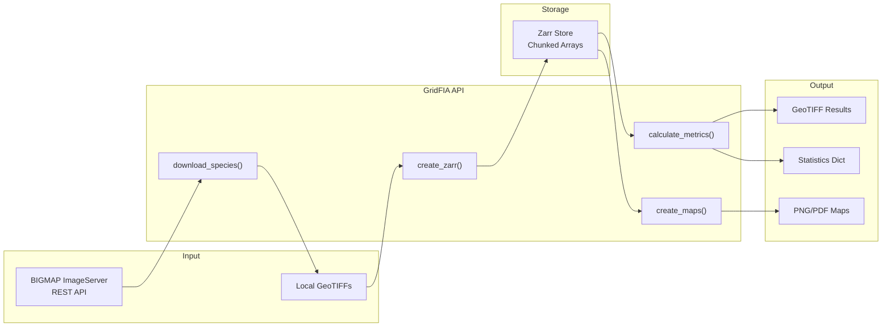

# System Design

This document provides detailed technical specifications for the GridFIA system architecture, explaining the design decisions, implementation patterns, and technical considerations.

## Design Philosophy

GridFIA is built on several core design principles:

### 1. **API-First Architecture**
- Single entry point through the `GridFIA` class
- No CLI - all functionality exposed via Python API
- Clean, discoverable interface for interactive and scripted use
- Designed for Jupyter notebooks and programmatic workflows

### 2. **Scientific Computing Standards**
- Accuracy and reproducibility in all calculations
- Established scientific computing libraries (NumPy, SciPy, Xarray)
- Metadata preservation throughout processing
- Support for peer review and validation

### 3. **Scalability by Design**
- Handle datasets from county-level to state-wide analyses
- Memory-efficient processing using chunked Zarr arrays
- Lazy evaluation with Xarray for large datasets
- Configurable parallelization for different environments

### 4. **Extensibility**
- Plugin-based calculation framework with registry pattern
- Clear separation between data access, processing, and visualization
- Type-safe configuration with Pydantic v2

## Core Components

### GridFIA API (`api.py`)

The main entry point providing all user-facing functionality:

```python
from gridfia import GridFIA

api = GridFIA()

# Core workflow methods
api.list_species()           # Query BIGMAP species catalog
api.download_species()       # Download biomass rasters from BIGMAP
api.create_zarr()           # Convert GeoTIFFs to Zarr format
api.calculate_metrics()     # Run forest calculations
api.create_maps()           # Generate visualizations
api.validate_zarr()         # Validate Zarr store integrity

# Configuration methods
api.get_location_config()   # Configure geographic extents
api.list_calculations()     # List available metrics

# Cloud/sample data methods
api.list_sample_datasets()  # List pre-hosted sample datasets
api.download_sample()       # Download sample data for testing
api.load_from_cloud()       # Load Zarr from cloud URL
```

**Design Decisions:**
- All methods are instance methods on a single class
- Configuration passed at instantiation, methods accept operation-specific parameters
- Rich return types (dataclasses, Pydantic models) for structured results
- Progress tracking integrated via Rich library

### Configuration System (`config.py`)

Pydantic v2 models for type-safe, validated settings:

```python
from gridfia.config import GridFIASettings, CalculationConfig
from pathlib import Path

class GridFIASettings(BaseSettings):
    """
    Hierarchical configuration with:
    - Environment variable support (GRIDFIA_*)
    - Type validation and conversion
    - Nested configuration objects
    """

    # Application settings
    debug: bool = False
    verbose: bool = False

    # Path configuration
    output_dir: Path = Path("output")

    # Calculation configuration
    calculations: list[CalculationConfig] = Field(default_factory=list)

    model_config = SettingsConfigDict(
        env_prefix="GRIDFIA_",
        env_nested_delimiter="__"
    )


class CalculationConfig(BaseModel):
    """Configuration for individual calculations."""
    name: str
    enabled: bool = True
    parameters: dict = Field(default_factory=dict)
    output_format: Literal["geotiff", "netcdf", "zarr"] = "geotiff"
```

**Key Features:**
- **Environment Awareness**: Loads settings from `GRIDFIA_*` environment variables
- **Validation**: Type checking ensures configuration integrity
- **YAML Support**: Load configurations from YAML files in `cfg/` directory
- **Hierarchical Structure**: Nested models for different functional areas

### Calculation Registry (`core/calculations/`)

Plugin-based framework for forest metrics using the registry pattern:

```python
from gridfia.core.calculations.base import ForestCalculation
from gridfia.core.calculations.registry import registry

class ForestCalculation(ABC):
    """Abstract base class for all calculations."""
    name: str
    description: str
    units: str

    @abstractmethod
    def calculate(self, biomass: np.ndarray) -> np.ndarray:
        """Perform the calculation on biomass data."""
        pass

    @abstractmethod
    def get_stats(self, result: np.ndarray) -> dict:
        """Generate statistics from calculation result."""
        pass

    def get_metadata(self) -> dict:
        """Return calculation metadata."""
        return {
            "name": self.name,
            "description": self.description,
            "units": self.units
        }


# Registry pattern for extensibility
class CalculationRegistry:
    """Registry for calculation plugins."""

    _calculations: dict[str, Type[ForestCalculation]] = {}

    @classmethod
    def register(cls, name: str):
        """Decorator to register calculations."""
        def decorator(calc_class):
            cls._calculations[name] = calc_class
            return calc_class
        return decorator

    @classmethod
    def get(cls, name: str) -> Type[ForestCalculation]:
        """Retrieve a calculation class by name."""
        return cls._calculations[name]

    @classmethod
    def list_calculations(cls) -> list[str]:
        """List all registered calculations."""
        return list(cls._calculations.keys())
```

**Built-in Calculations:**

| Category | Calculation | Description |
|----------|-------------|-------------|
| **Diversity** | `species_richness` | Count of species per pixel |
| **Diversity** | `shannon_diversity` | Shannon-Wiener index (H') |
| **Diversity** | `simpson_diversity` | Simpson's diversity (1-D) |
| **Diversity** | `evenness` | Pielou's evenness (J) |
| **Biomass** | `total_biomass` | Sum across all species |
| **Biomass** | `biomass_threshold` | Binary mask above threshold |
| **Species** | `dominant_species` | Most abundant species per pixel |
| **Species** | `species_proportion` | Relative abundance |
| **Species** | `species_presence` | Binary presence/absence |

### BigMap REST Client (`external/fia_client.py`)

Interface to USDA Forest Service BIGMAP ImageServer:

```python
from gridfia.external.fia_client import BigMapRestClient

class BigMapRestClient:
    """
    Production-ready REST client for BIGMAP data with:
    - Automatic retry with exponential backoff
    - Rate limiting to respect service limits
    - Progress tracking for downloads
    - Chunked downloads for large areas
    """

    BASE_URL = "https://apps.fs.usda.gov/arcx/rest/services/RDW_Biomass"

    def __init__(self):
        self.session = self._create_session()

    def _create_session(self) -> requests.Session:
        """Create session with retry strategy."""
        session = requests.Session()

        retry_strategy = Retry(
            total=3,
            backoff_factor=1.0,
            status_forcelist=[429, 500, 502, 503, 504]
        )

        adapter = HTTPAdapter(max_retries=retry_strategy)
        session.mount("https://", adapter)

        return session

    def list_available_species(self) -> list[SpeciesInfo]:
        """Query available species from BIGMAP catalog."""
        pass

    def export_species_raster(
        self,
        species_code: str,
        bbox: tuple[float, float, float, float],
        output_path: Path,
        progress_callback: Callable | None = None
    ) -> Path:
        """Download species biomass raster for bounding box."""
        pass

    def batch_export_location_species(
        self,
        location_config: LocationConfig,
        species_codes: list[str],
        output_dir: Path
    ) -> list[Path]:
        """Download multiple species for a location."""
        pass
```

**Features:**
- Automatic retry with exponential backoff for transient failures
- Rate limiting to respect USDA service limits
- Progress tracking via Rich progress bars
- Chunked downloads for large geographic areas
- Geographic subsetting by state, county, or custom bounding box

### Zarr Utilities (`utils/zarr_utils.py`)

Cloud-optimized array storage using Zarr v3:

```python
from gridfia.utils.zarr_utils import ZarrStore

class ZarrStore:
    """
    Wrapper for Zarr array access with:
    - Consistent interface for local and cloud storage
    - Metadata management
    - Coordinate reference system handling
    """

    def __init__(self, zarr_group: zarr.Group):
        self._group = zarr_group

    @classmethod
    def from_path(cls, path: Path | str) -> "ZarrStore":
        """Open Zarr store from local path."""
        group = zarr.open_group(path, mode="r")
        return cls(group)

    @classmethod
    def from_url(cls, url: str) -> "ZarrStore":
        """Open Zarr store from cloud URL."""
        store = zarr.storage.RemoteStore(url)
        group = zarr.open_group(store, mode="r")
        return cls(group)

    @property
    def biomass(self) -> np.ndarray:
        """Access biomass array (species, y, x)."""
        return self._group["biomass"][:]

    @property
    def species_codes(self) -> list[str]:
        """List of species codes in store."""
        return list(self._group.attrs["species_codes"])

    @property
    def crs(self) -> CRS:
        """Coordinate reference system."""
        return CRS.from_string(self._group.attrs["crs"])

    @property
    def transform(self) -> Affine:
        """Affine transform for georeferencing."""
        return Affine(*self._group.attrs["transform"])
```

**Zarr Configuration:**

```python
zarr_config = {
    'chunks': (1, 1000, 1000),    # Species, Height, Width
    'compressor': 'lz4',          # Fast compression/decompression
    'dtype': 'float32',           # Sufficient precision for biomass
}
```

**Benefits:**
- **Chunked Storage**: Memory-efficient processing of large arrays
- **LZ4 Compression**: Fast compression with good ratios
- **Cloud-Ready**: Zarr v3 supports streaming from cloud storage
- **Expandable**: Add species layers without rebuilding dataset
- **Rich Metadata**: Embedded CRS, transform, and species information

### Location Configuration (`utils/location_config.py`)

Geographic extent management for any US location:

```python
from gridfia.utils.location_config import LocationConfig

class LocationConfig:
    """
    Geographic configuration with:
    - Automatic boundary detection from census data
    - State Plane CRS detection
    - Bounding box calculations
    """

    bbox: tuple[float, float, float, float]  # xmin, ymin, xmax, ymax
    crs: CRS
    state_fips: str | None
    county_fips: str | None

    @classmethod
    def from_state_county(
        cls,
        state: str,
        county: str | None = None
    ) -> "LocationConfig":
        """Create config from state/county names."""
        # Fetches boundaries from Census TIGER data
        pass

    @classmethod
    def from_bbox(
        cls,
        bbox: tuple[float, float, float, float],
        crs: str = "EPSG:4326"
    ) -> "LocationConfig":
        """Create config from bounding box coordinates."""
        pass

    def to_native_crs(self) -> "LocationConfig":
        """Transform to appropriate State Plane CRS."""
        pass
```

**Supported Location Types:**
- State-level (e.g., "North Carolina")
- County-level (e.g., "North Carolina", "Wake")
- Custom bounding box with any CRS
- Multi-county regions

### Visualization (`visualization/`)

Publication-ready map generation:

```python
from gridfia.visualization.mapper import ZarrMapper

class ZarrMapper:
    """
    Publication-quality visualization with:
    - Consistent styling
    - Cartographic elements (scale bar, north arrow)
    - Multiple output formats
    """

    def __init__(self, zarr_path: Path | str):
        self.store = ZarrStore.from_path(zarr_path)

    def create_diversity_map(
        self,
        calculation: str,
        title: str | None = None,
        cmap: str = "viridis",
        figsize: tuple[int, int] = (10, 10),
        dpi: int = 300
    ) -> Figure:
        """Create diversity visualization."""
        pass

    def create_biomass_map(
        self,
        species_code: str | None = None,
        cmap: str = "Greens",
        **kwargs
    ) -> Figure:
        """Create biomass visualization."""
        pass

    def create_comparison_map(
        self,
        calculations: list[str],
        layout: tuple[int, int] = (2, 2),
        **kwargs
    ) -> Figure:
        """Create multi-panel comparison."""
        pass
```

**Visualization Features:**
- Matplotlib-based for compatibility
- Colorblind-friendly default palettes
- Automatic colorbar scaling
- County/state boundary overlays
- Export to PNG, PDF, SVG

## Data Flow



## Performance Optimization

### Memory Management

**Chunked Processing:**
```python
# Zarr arrays are processed chunk-by-chunk
# Default chunk size: (1, 1000, 1000) - one species layer at a time
zarr_path = api.create_zarr(
    input_dir="downloads/",
    output_path="data.zarr",
    chunk_size=(1, 500, 500)  # Smaller chunks for limited memory
)
```

**Lazy Evaluation:**
```python
# Xarray provides lazy loading
import xarray as xr

dataset = xr.open_zarr("data.zarr")
# Data not loaded until accessed
mean_biomass = dataset["biomass"].mean(dim="species")  # Lazy
result = mean_biomass.compute()  # Triggers computation
```

### Computational Optimization

**Vectorized Operations:**
```python
# All calculations use NumPy vectorization
# Example: Shannon diversity calculation
def shannon_diversity(biomass: np.ndarray) -> np.ndarray:
    """Vectorized Shannon index calculation."""
    # Sum across species axis
    total = np.sum(biomass, axis=0)

    # Calculate proportions (with safe division)
    with np.errstate(divide='ignore', invalid='ignore'):
        proportions = biomass / total
        proportions = np.nan_to_num(proportions, 0)

    # Shannon formula: -sum(p * ln(p))
    with np.errstate(divide='ignore', invalid='ignore'):
        log_p = np.log(proportions)
        log_p = np.nan_to_num(log_p, 0)

    return -np.sum(proportions * log_p, axis=0)
```

**Parallel Downloads:**
```python
# BigMapRestClient uses thread pool for concurrent downloads
from concurrent.futures import ThreadPoolExecutor

def batch_download(species_codes, output_dir):
    with ThreadPoolExecutor(max_workers=4) as executor:
        futures = [
            executor.submit(download_species, code, output_dir)
            for code in species_codes
        ]
        return [f.result() for f in futures]
```

### Storage Optimization

| Strategy | Implementation | Benefit |
|----------|----------------|---------|
| **LZ4 Compression** | Default Zarr compressor | Fast read/write |
| **Chunking** | (1, 1000, 1000) default | Memory-efficient access |
| **Float32** | Sufficient for biomass | 50% storage vs float64 |
| **Metadata Indexing** | Species codes in attrs | Fast lookup |

## Security Considerations

### Input Validation

```python
def validate_raster_input(file_path: Path) -> None:
    """Validate raster file before processing."""
    if not file_path.exists():
        raise FileNotFoundError(f"File not found: {file_path}")

    if not file_path.suffix.lower() in ['.tif', '.tiff']:
        raise ValueError(f"Expected GeoTIFF, got: {file_path.suffix}")

    with rasterio.open(file_path) as src:
        if src.crs is None:
            raise ValueError("Raster missing coordinate reference system")

        if src.count != 1:
            raise ValueError(f"Expected single band, got {src.count}")
```

### Safe API Usage

```python
class BigMapRestClient:
    """REST client with security measures."""

    ALLOWED_HOSTS = ["apps.fs.usda.gov"]

    def _validate_url(self, url: str) -> None:
        """Ensure URL is from allowed USDA host."""
        parsed = urlparse(url)
        if parsed.hostname not in self.ALLOWED_HOSTS:
            raise SecurityError(f"Untrusted host: {parsed.hostname}")

    def request(self, url: str, params: dict) -> Response:
        self._validate_url(url)
        return self.session.get(url, params=params, timeout=30)
```

## Testing Strategy

### Unit Tests

```python
import pytest
from gridfia.core.calculations import registry

class TestCalculations:
    """Test calculation implementations."""

    @pytest.fixture
    def sample_biomass(self):
        """Create sample biomass data."""
        # 5 species, 100x100 pixels
        return np.random.rand(5, 100, 100).astype(np.float32)

    def test_species_richness(self, sample_biomass):
        """Test richness calculation."""
        calc = registry.get("species_richness")()
        result = calc.calculate(sample_biomass)

        assert result.shape == (100, 100)
        assert result.max() <= 5
        assert result.min() >= 0

    def test_shannon_diversity_range(self, sample_biomass):
        """Test Shannon index is in valid range."""
        calc = registry.get("shannon_diversity")()
        result = calc.calculate(sample_biomass)

        # Shannon should be >= 0
        assert result.min() >= 0
        # Max for 5 species is ln(5) ≈ 1.61
        assert result.max() <= np.log(5) + 0.01
```

### Integration Tests

```python
class TestWorkflow:
    """Test complete workflows."""

    def test_full_pipeline(self, tmp_path):
        """Test download -> zarr -> calculate workflow."""
        api = GridFIA()

        # Create sample data
        zarr_path = create_test_zarr(tmp_path / "test.zarr")

        # Run calculations
        results = api.calculate_metrics(
            zarr_path,
            calculations=["species_richness", "shannon_diversity"]
        )

        assert len(results) == 2
        for result in results:
            assert result.output_path.exists()
            assert result.stats is not None
```

## Extension Points

### Adding Custom Calculations

1. Create a class inheriting from `ForestCalculation`:

```python
from gridfia.core.calculations.base import ForestCalculation
from gridfia.core.calculations.registry import registry

@registry.register("custom_metric")
class CustomMetric(ForestCalculation):
    name = "custom_metric"
    description = "My custom forest metric"
    units = "custom_units"

    def calculate(self, biomass: np.ndarray) -> np.ndarray:
        # Implementation
        return result

    def get_stats(self, result: np.ndarray) -> dict:
        return {"mean": float(result.mean())}
```

2. Use via the API:

```python
api = GridFIA()
results = api.calculate_metrics(
    "data.zarr",
    calculations=["custom_metric"]
)
```

### Adding Data Sources

Extend `BigMapRestClient` or create new clients in `external/` for additional data sources following the same patterns for retry, rate limiting, and progress tracking.

### Custom Visualizations

Add new methods to `ZarrMapper` or create specialized visualization modules in `visualization/` directory.
