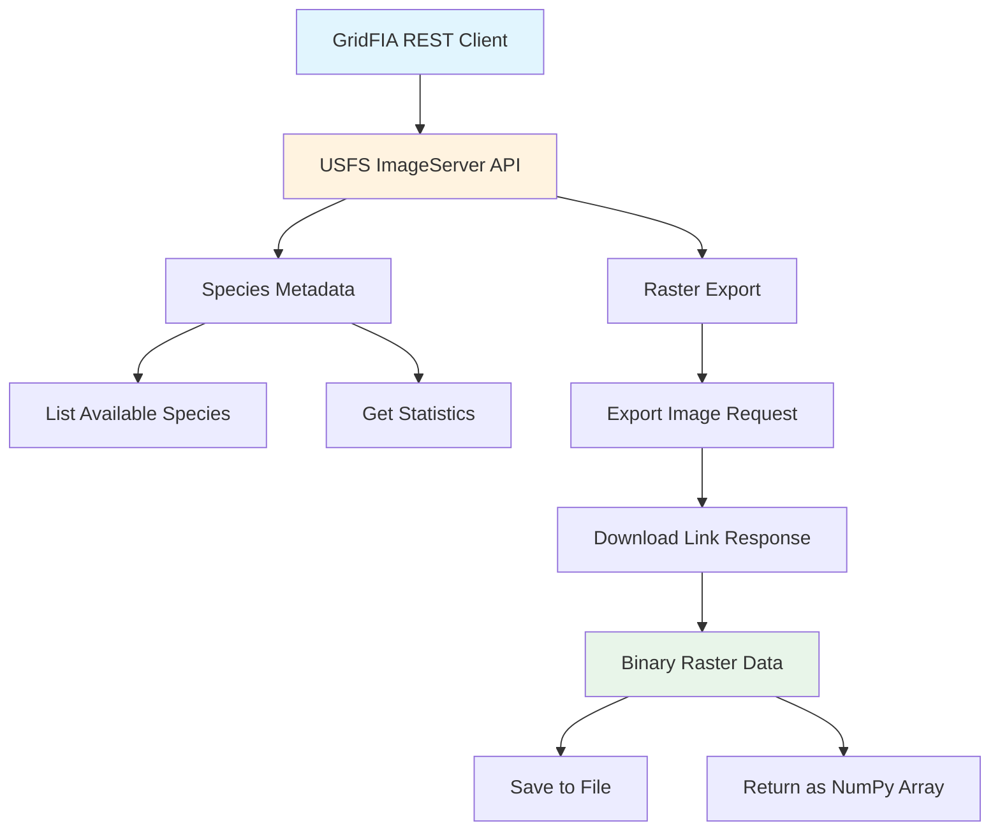

# REST API Download

The GridFIA REST API client provides robust access to the USFS FIA BIGMAP 2018 Tree Species Aboveground Biomass ImageServer, enabling programmatic download of forest species data for analysis.

## Overview

The REST API client (`gridfia.external.BigMapRestClient`) implements a production-ready interface to the BIGMAP ImageServer with:

- **Automatic retry logic** with exponential backoff
- **Rate limiting** to respect server constraints
- **Memory-efficient** data handling
- **Progress tracking** for long-running operations
- **Comprehensive error handling**

## Architecture



## Installation

The REST client is included with the GridFIA package:

```bash
pip install gridfia
```

## Basic Usage

### Initialize the Client

```python
from gridfia.external import BigMapRestClient

# Create client with default settings
client = BigMapRestClient()

# Or customize retry and rate limiting
client = BigMapRestClient(
    max_retries=5,
    backoff_factor=2.0,
    timeout=60,
    rate_limit_delay=1.0
)
```

### List Available Species

```python
# Get all available species
species_list = client.list_available_species()

for species in species_list[:5]:
    print(f"Code: {species['code']}, Name: {species['name']}")
```

Output:
```
Code: 131, Name: LOBLOLLY_PINE
Code: 318, Name: LONGLEAF_PINE
Code: 111, Name: SHORTLEAF_PINE
Code: 110, Name: SLASH_PINE
Code: 316, Name: RED_MAPLE
```

### Download Species Raster

```python
# Define area of interest (Web Mercator coordinates)
nc_bbox = (-9200000, 4000000, -8400000, 4400000)

# Download to file
client.export_species_raster(
    species_code="131",  # Loblolly Pine
    bbox=nc_bbox,
    output_path="loblolly_pine.tif",
    pixel_size=30.0
)

# Or get as numpy array
raster_data = client.export_species_raster(
    species_code="131",
    bbox=nc_bbox,
    output_path=None,  # Returns numpy array
    pixel_size=30.0
)
```

## Advanced Features

### Batch Download Multiple Species

```python
# Download all pine species for North Carolina
pine_species = ["131", "318", "111", "110"]  # Loblolly, Longleaf, Shortleaf, Slash

results = client.batch_export_nc_species(
    species_codes=pine_species,
    output_dir="./pine_species",
    pixel_size=30.0
)

# Results include download status and file paths
for species_code, result in results.items():
    print(f"{species_code}: {result['status']} - {result.get('output_path', 'N/A')}")
```

### Get Species Statistics

```python
# Get biomass statistics for a species
stats = client.get_species_statistics("131")  # Loblolly Pine

print(f"Min biomass: {stats['min']:.2f} Mg/ha")
print(f"Max biomass: {stats['max']:.2f} Mg/ha")
print(f"Mean biomass: {stats['mean']:.2f} Mg/ha")
print(f"Std deviation: {stats['stddev']:.2f} Mg/ha")
```

### Query Specific Location

```python
# Get biomass value at specific coordinates (Web Mercator)
x, y = -8800000, 4200000
value = client.identify_pixel_value("131", x, y)
print(f"Loblolly Pine biomass at ({x}, {y}): {value} Mg/ha")
```

## Error Handling

The client implements comprehensive error handling:

```python
try:
    raster_data = client.export_species_raster(
        species_code="999",  # Invalid code
        bbox=nc_bbox
    )
except ValueError as e:
    print(f"Invalid species: {e}")
except requests.exceptions.RequestException as e:
    print(f"Network error: {e}")
except Exception as e:
    print(f"Unexpected error: {e}")
```

## Rate Limiting and Retries

The client automatically handles rate limiting:

1. **Proactive delays**: Waits between requests to avoid hitting limits
2. **Reactive handling**: Respects `Retry-After` headers from server
3. **Exponential backoff**: Increases delay between retry attempts

```python
# Server returns 429 (Too Many Requests)
# Client automatically waits and retries
# You'll see: "Rate limited by server. Waiting 60s..."
```

## Performance Optimization

### Memory-Efficient Processing

For large downloads, process data in chunks:

```python
# Download directly to disk to avoid memory issues
client.export_species_raster(
    species_code="131",
    bbox=large_bbox,
    output_path="large_raster.tif"  # Streams to disk
)

# Then process in chunks
import rasterio
with rasterio.open("large_raster.tif") as src:
    for window in src.block_windows():
        data = src.read(window=window)
        # Process chunk
```

### Parallel Downloads

For multiple species, use concurrent downloads:

```python
import asyncio
from concurrent.futures import ThreadPoolExecutor

def download_species(species_code):
    return client.export_species_raster(
        species_code=species_code,
        bbox=nc_bbox,
        output_path=f"{species_code}.tif"
    )

# Download 4 species concurrently
with ThreadPoolExecutor(max_workers=4) as executor:
    species_codes = ["131", "318", "111", "110"]
    futures = [executor.submit(download_species, code) for code in species_codes]
    results = [f.result() for f in futures]
```

## Integration with Zarr Pipeline

The REST client integrates seamlessly with the Zarr construction pipeline:

```python
from gridfia.external import BigMapRestClient
from gridfia.utils import append_species_to_zarr

client = BigMapRestClient()

# Download species data
raster_data = client.export_species_raster(
    species_code="131",
    bbox=nc_bbox,
    output_path="temp_species.tif"
)

# Add to zarr
append_species_to_zarr(
    zarr_path="nc_biomass.zarr",
    species_raster_path="temp_species.tif",
    species_code=131,
    species_name="Loblolly Pine"
)
```

## API Reference

### BigMapRestClient

```python
class BigMapRestClient:
    def __init__(
        self,
        max_retries: int = 3,
        backoff_factor: float = 1.0,
        timeout: int = 30,
        rate_limit_delay: float = 0.5
    ):
        """
        Initialize REST client.
        
        Args:
            max_retries: Maximum retry attempts for failed requests
            backoff_factor: Multiplier for exponential backoff
            timeout: Request timeout in seconds
            rate_limit_delay: Delay between requests in seconds
        """
```

### Key Methods

#### list_available_species()
```python
def list_available_species() -> List[Dict[str, str]]:
    """
    Get list of all available species.
    
    Returns:
        List of dicts with 'code' and 'name' keys
    """
```

#### export_species_raster()
```python
def export_species_raster(
    species_code: str,
    bbox: Tuple[float, float, float, float],
    output_path: Optional[str] = None,
    pixel_size: float = 30.0,
    format: str = "tiff"
) -> Optional[np.ndarray]:
    """
    Download species raster for given bounding box.
    
    Args:
        species_code: Species code (e.g., "131")
        bbox: Bounding box (xmin, ymin, xmax, ymax) in Web Mercator
        output_path: Save to file if provided, else return array
        pixel_size: Pixel size in meters
        format: Output format (tiff, png, jpg)
        
    Returns:
        NumPy array if output_path is None, else None
    """
```

## Troubleshooting

### Common Issues

1. **Connection Timeouts**
   - Increase timeout: `BigMapRestClient(timeout=120)`
   - Check network connectivity
   - Verify firewall settings

2. **Rate Limiting**
   - Increase delay: `BigMapRestClient(rate_limit_delay=2.0)`
   - Implement batching with pauses
   - Consider caching responses

3. **Memory Errors**
   - Download to disk instead of memory
   - Process in smaller spatial chunks
   - Use lower resolution (`pixel_size=60.0`)

4. **Invalid Species Codes**
   - Use `list_available_species()` to verify codes
   - Check for typos in species codes
   - Ensure codes are strings, not integers

### Debug Mode

Enable detailed logging:

```python
import logging
logging.basicConfig(level=logging.DEBUG)

# Now client operations will show detailed logs
client = BigMapRestClient()
```

## Best Practices

1. **Always handle errors** - Network requests can fail
2. **Respect rate limits** - Don't overwhelm the server
3. **Use appropriate pixel sizes** - 30m for detailed analysis, 60m+ for overviews
4. **Cache when possible** - Avoid redundant downloads
5. **Monitor memory usage** - Large rasters can exceed available RAM
6. **Validate coordinates** - Ensure bbox is in Web Mercator (EPSG:3857)

## See Also

- [Zarr Construction](zarr-construction.md) - Building efficient storage containers
- [GridFIA API Reference](../api/gridfia.md) - Main API class documentation
- [Configuration](../api/config.md) - Configuration options