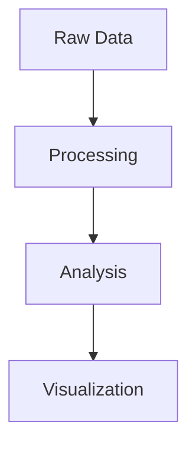

# GridFIA Documentation

This directory contains the documentation source files for the GridFIA project, built with [MkDocs](https://www.mkdocs.org/) and the [Material theme](https://squidfunk.github.io/mkdocs-material/).

## Building the Documentation

### Prerequisites

Install the documentation dependencies:

```bash
# From the project root
pip install -r requirements-docs.txt
```

### Local Development

To serve the documentation locally with live reload:

```bash
# From the project root
mkdocs serve
```

The documentation will be available at `http://localhost:8000` and will automatically reload when you make changes to the source files.

### Building Static Site

To build the static documentation site:

```bash
# From the project root
mkdocs build
```

The built site will be available in the `site/` directory.

## Documentation Structure

```
docs/
├── index.md                    # Homepage
├── architecture/               # System architecture documentation
│   ├── overview.md            # Architecture overview with diagrams
│   ├── system-design.md       # Detailed technical design
│   ├── data-pipeline.md       # Data processing pipeline
│   └── api-reference.md       # API architecture reference
├── getting-started/           # Installation and setup guides
│   ├── installation.md        # Installation instructions
│   ├── quickstart.md         # Quick start tutorial
│   └── configuration.md      # Configuration guide
├── user-guide/               # Comprehensive user documentation
│   ├── cli.md               # Command-line interface guide
│   ├── python-api.md        # Python API usage
│   ├── data-processing.md   # Data processing workflows
│   ├── analysis.md          # Analysis methods
│   └── visualization.md     # Visualization capabilities
├── tutorials/               # Step-by-step tutorials
│   ├── bigmap-analysis.md   # BIGMAP species analysis tutorial
│   └── ndvi-analysis.md     # NDVI temporal analysis tutorial
├── reference/               # Technical reference documentation
│   ├── cli-reference.md     # Complete CLI command reference
│   ├── api.md              # Python API reference
│   └── configuration.md    # Configuration options reference
├── development/            # Developer documentation
│   ├── contributing.md     # Contribution guidelines
│   ├── setup.md           # Development environment setup
│   └── testing.md         # Testing procedures
├── stylesheets/           # Custom CSS styles
│   └── extra.css         # Additional styling for diagrams and components
└── README.md             # This file
```

## Writing Documentation

### Markdown Guidelines

- Use clear, descriptive headings with proper hierarchy
- Include code examples with syntax highlighting
- Add admonitions (notes, tips, warnings) for important information
- Use tables for structured data presentation
- Include diagrams using Mermaid syntax for architectural documentation

### Code Examples

Use syntax highlighting for code blocks:

````markdown
```python
import gridfia
from gridfia.core import analyze_species_presence

# Analyze species presence
result = analyze_species_presence("data/species.zarr")
print(f"Analysis complete: {result.species_count} species found")
```
````

### Diagrams

Use Mermaid for creating diagrams:

````markdown

````

### Admonitions

Use admonitions to highlight important information:

```markdown
!!! note "Important"
    This is an important note that users should pay attention to.

!!! tip "Pro Tip"
    This tip will help users work more efficiently.

!!! warning "Caution"
    This warns users about potential issues.
```

### Cross-References

Link between documentation sections:

```markdown
See the [Installation Guide](../getting-started/installation.md) for setup instructions.

For more details, check the [API Reference](../reference/api.md#analyze-species-presence).
```

## Contributing to Documentation

### Adding New Pages

1. Create a new Markdown file in the appropriate directory
2. Add the page to the navigation in `mkdocs.yml`
3. Update cross-references as needed
4. Test locally with `mkdocs serve`

### Updating Architecture Diagrams

The architecture diagrams are created using Mermaid syntax and are embedded directly in the Markdown files. To update diagrams:

1. Edit the Mermaid code in the relevant `.md` file
2. Test the diagram syntax at [Mermaid Live Editor](https://mermaid.live/)
3. Verify the diagram renders correctly in the local documentation server

### Style Guidelines

- Use sentence case for headings
- Keep line length under 100 characters
- Use consistent terminology throughout
- Include examples for all features
- Write from the user's perspective

### Review Process

1. Test documentation locally before submitting
2. Check all links and references work correctly
3. Ensure code examples run without errors
4. Verify diagrams display properly
5. Submit pull request with clear description of changes

## Deployment

The documentation is automatically deployed when changes are pushed to the main branch. The deployment process:

1. GitHub Actions builds the documentation using `mkdocs build`
2. The built site is deployed to GitHub Pages or the configured hosting platform
3. The live documentation is available at the configured URL

## Troubleshooting

### Common Issues

**Mermaid diagrams not rendering:**
- Check diagram syntax at [Mermaid Live Editor](https://mermaid.live/)
- Ensure proper indentation and quotes around text labels
- Verify the `mkdocs-mermaid2-plugin` is installed

**Broken internal links:**
- Use relative paths from the current file location
- Include the `.md` extension for Markdown files
- Test all links using `mkdocs serve`

**Plugin errors:**
- Ensure all required plugins are installed via `requirements-docs.txt`
- Check plugin configuration in `mkdocs.yml`
- Review plugin documentation for compatibility

### Getting Help

If you encounter issues with the documentation:

1. Check the [MkDocs documentation](https://www.mkdocs.org/)
2. Review the [Material theme documentation](https://squidfunk.github.io/mkdocs-material/)
3. Search existing issues in the project repository
4. Create a new issue with details about the problem

---

For questions about documentation structure or content, please open an issue or discussion in the main repository. 